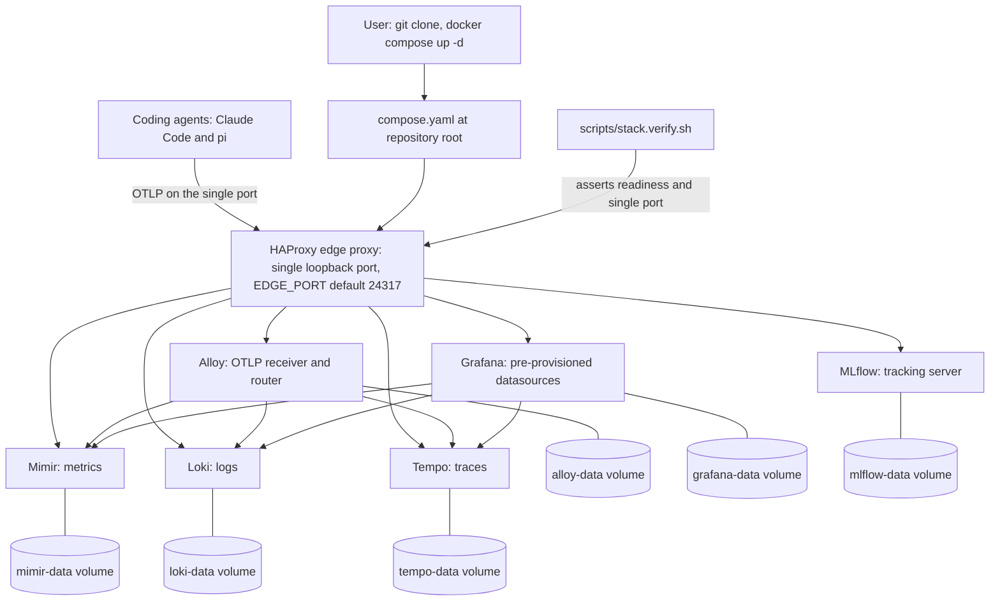

<!-- Purpose: front page of the repository. It tells a first-time user what the
     project is, how to start and verify the stack, where each part lives, how
     to reach every service, how git provenance is labelled, and how the project
     treats their data.
     @agents-index: Repository front page: what the stack is, how to start, verify, reach, and tear it down, and how it treats telemetry content. -->

# Local Coding-Agent Observability Stack

This project is a local-first observability stack for coding agents. Coding
agents such as Claude Code and pi emit OpenTelemetry metrics, log events, and
traces. This telemetry answers what an agent did, what it cost, how long it
took, which tools it called, and what it was asked. This repository collects
that telemetry and stores it on your machine.

You clone the repository and run one command. You then have a working telemetry
plane: Grafana for dashboards, Loki for logs, Mimir for metrics, Tempo for
traces, an Alloy collector, and an MLflow tracking server. Every service runs in
a container on your machine. One HAProxy edge proxy publishes a single loopback
port. No telemetry leaves the machine.

## Architecture

Every service runs on an internal network. Only the HAProxy edge proxy publishes
a host port. Agents send OpenTelemetry data to that port. HAProxy routes each
signal to Alloy. Alloy sends metrics to Mimir, logs to Loki, and traces to
Tempo. Grafana reads all three stores. Each store writes to a named volume.



## Prerequisites

Docker is the only prerequisite. You need Docker with the Docker Compose v2
plugin, which you invoke as `docker compose`. The legacy `docker-compose` v1
script does not work. The compose file uses the Compose Specification, including
a top-level project `name` and long-form `depends_on` conditions, which the v2
plugin provides and v1 does not. The stack is verified with Docker Compose v2.

Check your version:

```bash
docker compose version
```

The first start pulls roughly 1 GB of images and builds one thin MLflow image.
You need network access on the first run only.

The edge proxy publishes port `24317` on `127.0.0.1` by default. If another
program on your machine already uses that port, the stack fails to start. Set a
free port in one place. Copy the template and change one value:

```bash
cp .env.example .env
```

Edit `.env` and set `EDGE_PORT` to a free port. The stack reads that value on the
next start. No other file changes. The stack also starts with no `.env` at all,
because `EDGE_PORT` defaults to `24317`.

## Start

Start the whole stack from the repository root with one command:

```bash
docker compose up -d
```

This starts every service, builds the MLflow image on the first run, and needs
no prior step. The default port needs no `.env` file.

To start the stack and wait until every service answers, use the wrapper script
instead. It blocks until the stack is ready, so a script or an agent can depend
on a ready stack:

```bash
./scripts/stack.up.sh
```

Run `./scripts/stack.up.sh -h` for its usage.

## Verify

Confirm the stack is healthy from the outside with one command:

```bash
./scripts/stack.verify.sh
```

The script asserts that exactly one host port is published and bound to
loopback, that every readiness endpoint answers, that the three Grafana
datasources report healthy, and that no image tag floats. It exits non-zero on
the first failure and names the fix. Run `./scripts/stack.verify.sh -h` for its
usage.

## Checks

`make ci` is the single command that checks the repository:

```bash
make ci
```

It runs these checks in order: a self-test, compose file validation, HAProxy
configuration validation in the pinned image on the compose network, a shell
lint over every script, and every verification script. It exits non-zero if any
check fails. On every run the self-test proves a failing check exits non-zero,
so a check can never report confidence it has not earned. A check that needs a
running stack is skipped with a named report when the stack is down, and a skip
is never reported as a pass. The HAProxy check resolves backend names on the
compose network, so it is skipped until you start the stack once. Run `make
help` to list the individual targets.

## Repository layout

| Path | Holds |
|------|-------|
| `compose.yaml` | The whole stack. Run `docker compose up -d` from here. |
| `.env.example` | The template for `.env`. Documents every variable and its default. |
| `Makefile` | `make ci`, the single check entry point. |
| `LICENSE` | The Apache-2.0 license. |
| `stack/alloy/` | Alloy collector configuration. |
| `stack/grafana/` | Grafana datasource provisioning. |
| `stack/haproxy/` | The edge-proxy routing configuration. |
| `stack/loki/` | Loki log-store configuration. |
| `stack/mimir/` | Mimir metric-store configuration. |
| `stack/tempo/` | Tempo trace-store configuration. |
| `stack/mlflow/` | The thin MLflow image build. |
| `agents/pi-otel.env` | The opt-in OpenTelemetry content flags for agents. |
| `agents/direnvrc` | The optional git-provenance direnv helper. |
| `scripts/stack.up.sh` | Start the stack and wait until it is ready. |
| `scripts/stack.verify.sh` | Verify the running stack from the outside. |
| `docs/cr/` | The governance record for this repository. |

## Service access

Every service is reached through the single published port. The examples below
use the default port `24317` on `127.0.0.1`. If you set `EDGE_PORT`, use your
port instead.

| Service | Purpose | Reached at |
|---------|---------|------------|
| Grafana | Dashboards and UI. Log in with `admin` / `admin`. | `http://localhost:24317/` |
| Alloy | Collector UI and health. | `http://localhost:24317/alloy/` |
| OTLP HTTP | Ingest logs, metrics, and traces. | `http://localhost:24317/v1/logs`, `/v1/metrics`, `/v1/traces` |
| OTLP gRPC | Ingest over prior-knowledge h2c. | `localhost:24317` |
| Loki | Log store query API. Readiness at `/loki/ready`. | `http://localhost:24317/loki/...` |
| Mimir | Metric store, Prometheus-compatible API. Readiness at `/prometheus/ready`. | `http://localhost:24317/prometheus/...` |
| Tempo | Trace store. Readiness at `/tempo/ready`. | `http://localhost:24317/tempo/...` |
| MLflow | Experiment tracking UI and REST. | `http://localhost:24317/mlflow/` |

## Git provenance labels

Git provenance labels tell you which repository, branch, and working directory
produced a piece of telemetry. There are four labels: `git.org`, `git.repo`,
`git.branch`, and `git.path`. They let you select one agent's telemetry from one
repository out of everything the stack has stored.

Two mechanisms set these labels on the agent side:

1. Claude Code reads them from the environment. The `agents/direnvrc` helper
   provides a `use pi_otel` function. Called from a repository's `.envrc`, it
   stamps `OTEL_RESOURCE_ATTRIBUTES` with the four values, derived from the
   repository at the working directory.
2. The pi OpenTelemetry extension derives the four values itself, from the
   repository of the directory where you launch pi. It needs no stamp.

Claude Code's settings `env` block outranks the process environment. If a Claude
Code settings file already pins `OTEL_RESOURCE_ATTRIBUTES` or the OTLP endpoint,
a shell export does not change the value Claude Code uses. This matters when you
run more than one stack, or when telemetry is already configured for another
endpoint. To redirect Claude Code without editing the settings file, pass the
value with the command-line `--settings` override. The command line outranks the
settings file.

Each store promotes these resource attributes to a queryable label. The dot in
each attribute name becomes an underscore in Loki and Mimir:

* Loki promotes them to stream index labels. Select a stream with
  `{git_repo="agent-observability"}`.
* Mimir promotes them onto every metric series as `git_org`, `git_repo`,
  `git_branch`, and `git_path`.
* Tempo keeps them as span resource attributes. Filter traces in TraceQL with
  `{ resource.git.repo = "agent-observability" }`.

## Privacy

Read this section before you run the stack.

Content logging is enabled by default for this stack's posture. The
`agents/pi-otel.env` file turns on every content flag. This is a deliberate
choice for a local stack, so that a log line carries the content rather than a
bare event name. As a result, your agent prompts, the assistant responses, and
the tool input and output are stored in plaintext in local volumes.

No data leaves the machine. Every service binds to the internal network. Only
the edge proxy publishes a port, and it binds to `127.0.0.1` only. That loopback
binding is the load-bearing privacy control of the whole project. Do not change
it to a routable address. If you do, anyone on that network can read your prompt
and tool content.

To redact a field, set its flag to `0` in `agents/pi-otel.env`, or remove the
line. Each edit redacts one field:

| Edit in `agents/pi-otel.env` | Redacts |
|------------------------------|---------|
| `OTEL_LOG_USER_PROMPTS=0` | Your prompts to the agent. |
| `OTEL_LOG_ASSISTANT_RESPONSES=0` | The assistant responses. |
| `OTEL_LOG_TOOL_DETAILS=0` | The tool names and arguments. |
| `OTEL_LOG_TOOL_CONTENT=0` | The tool input and output content. |
| `OTEL_LOG_RAW_API_BODIES=0` | The raw API request and response bodies. |

The flags govern what an agent sends. Change them, then restart the agent. Data
already stored in the volumes is unchanged. To discard stored data, tear the
stack down with `docker compose down -v`.

## Persistence

Each store writes to a named volume: `loki-data`, `mimir-data`, `tempo-data`,
`alloy-data`, `grafana-data`, and `mlflow-data`. These volumes hold your
telemetry, your Grafana state, and your MLflow experiments. The data survives a
stop and a start. After `docker compose down` followed by `docker compose up -d`,
every previously stored sample is still queryable and Grafana keeps its
datasources.

## Teardown

Two commands stop the stack, and they differ by what they do to your data:

```bash
docker compose down
```

`docker compose down` stops and removes the containers and the network. It keeps
the named volumes. Your telemetry, Grafana state, and MLflow experiments survive.
The next `docker compose up -d` returns to the same data.

```bash
docker compose down -v
```

`docker compose down -v` also removes the named volumes. This deletes all stored
telemetry, all Grafana state, and all MLflow experiments. The next start begins
empty. Use this only when you want to discard the stored data.

## Rollback

To return to a known-good state, use the steps below in order.

Stop the stack and keep the data:

```bash
docker compose down
```

Stop the stack and discard the data, when the stored data is the problem:

```bash
docker compose down -v
```

To undo a configuration change, return the working tree to a known-good commit
with git, then recreate the containers so they read the reverted configuration:

```bash
git checkout <known-good-commit> -- .
docker compose up -d --force-recreate
```

Every image tag is pinned in `compose.yaml`, so a rollback pulls the same
versions and reproduces the same stack. After a rollback, confirm the result:

```bash
./scripts/stack.verify.sh
```

The stack is back to a known-good state when the verification script exits 0 and
reports every assertion as passed.
