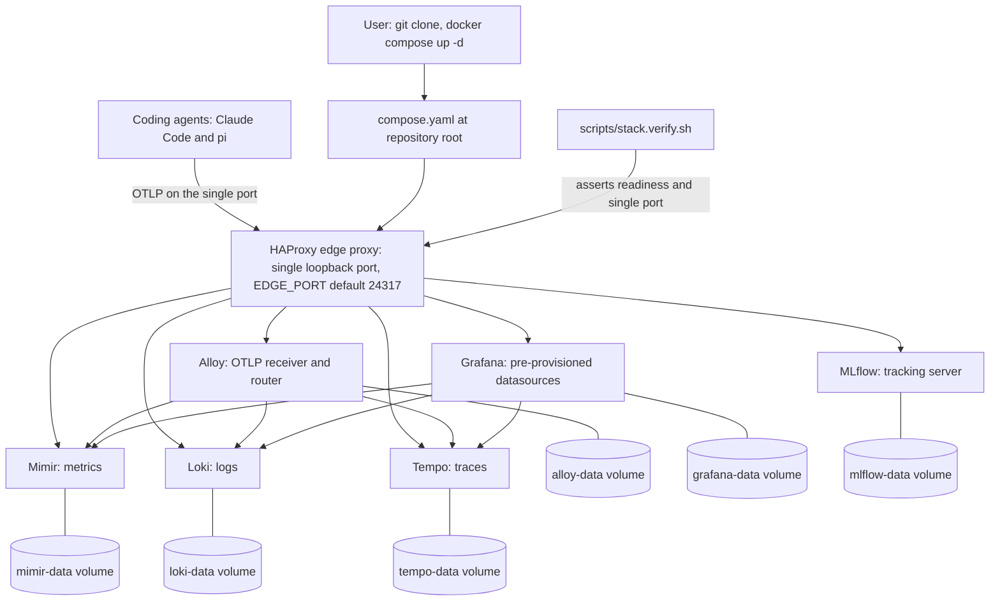

<!-- Purpose: front page of the repository. It tells a first-time user what the
     project is, how to start and verify the stack, where each part lives, how
     to reach every service, how git provenance is labelled, and how the project
     treats their data.
     @agents-index: Repository front page: what the stack is, how to start, verify, reach, and tear it down, and how it treats telemetry content. -->

# Local Coding-Agent Observability Stack

This project is a local-first observability stack for coding agents. Coding
agents such as Claude Code and pi emit OpenTelemetry metrics, log events, and
traces. This telemetry answers what an agent did, what it cost, how long it
took, which tools it called, and what it was asked. This repository collects
that telemetry and stores it on your machine.

You clone the repository and run one command. You then have a working telemetry
plane: Grafana for dashboards, Loki for logs, Mimir for metrics, Tempo for
traces, an Alloy collector, and an MLflow tracking server. Every service runs in
a container on your machine. One HAProxy edge proxy publishes a single loopback
port. No telemetry leaves the machine.

## Architecture

Every service runs on an internal network. Only the HAProxy edge proxy publishes
a host port. Agents send OpenTelemetry data to that port. HAProxy routes each
signal to Alloy. Alloy sends metrics to Mimir, logs to Loki, and traces to
Tempo. Grafana reads all three stores. Each store writes to a named volume.



## Prerequisites

Docker is the only prerequisite. You need Docker with the Docker Compose v2
plugin, which you invoke as `docker compose`. The legacy `docker-compose` v1
script does not work. The compose file uses the Compose Specification, including
a top-level project `name` and long-form `depends_on` conditions, which the v2
plugin provides and v1 does not. The stack is verified with Docker Compose v2.

Check your version:

```bash
docker compose version
```

The first start pulls roughly 1 GB of images and builds one thin MLflow image.
You need network access on the first run only.

The edge proxy publishes port `24317` on `127.0.0.1` by default. If another
program on your machine already uses that port, the stack fails to start. Set a
free port in one place. Copy the template and change one value:

```bash
cp .env.example .env
```

Edit `.env` and set `EDGE_PORT` to a free port. The stack reads that value on the
next start. No other file changes. The stack also starts with no `.env` at all,
because `EDGE_PORT` defaults to `24317`.

## Start

Start the whole stack from the repository root with one command:

```bash
docker compose up -d
```

This starts every service, builds the MLflow image on the first run, and needs
no prior step. The default port needs no `.env` file.

To start the stack and wait until every service answers, use the wrapper script
instead. It blocks until the stack is ready, so a script or an agent can depend
on a ready stack:

```bash
./scripts/stack.up.sh
```

Run `./scripts/stack.up.sh -h` for its usage.

## Verify

Confirm the stack is healthy from the outside with one command:

```bash
./scripts/stack.verify.sh
```

The script asserts that exactly one host port is published and bound to
loopback, that every readiness endpoint answers, that the three Grafana
datasources report healthy, and that no image tag floats. It exits non-zero on
the first failure and names the fix. Run `./scripts/stack.verify.sh -h` for its
usage.

## Dashboard

The stack ships one provisioned dashboard, **Coding Agent Observability**, with
the stable identifier `agent-observability`. It appears in Grafana automatically
on start, with no import step. Open it directly through the single published
port:

```
http://localhost:24317/d/agent-observability
```

If you set `EDGE_PORT`, use your port instead of `24317`.

The dashboard covers all three signals for both Claude Code and pi: cost, token,
session, and active-time stats from Mimir; the readable conversation and tool log
stream from Loki; and the agent trace list from Tempo. Template variables narrow
every panel by agent, git repository, branch, and model. No panel groups by or
displays a user identity label, so the dashboard is safe to share as a
screenshot.

The dashboard is provisioned read-only from `stack/grafana/dashboards/agent-observability.json`,
so the committed file is the source of truth. Grafana refuses to save an edit in
place; use "Save as" to keep a variant of your own.

To prove the dashboard loads and that every panel executes against its
datasource, run its verification script:

```bash
./scripts/dashboard.verify.sh
```

It asserts the dashboard is present and read-only, that every panel returns data
where its metric family has samples or an explicit empty result where it does
not, that no identity label appears, that counters aggregate correctly, and that
the variables and panel documentation are complete. It exits non-zero on the
first failure and names the fix. Run `./scripts/dashboard.verify.sh -h` for its
usage.

## pi telemetry extension

The stack renders pi's signals, but pi emits none on its own. The
`@desek/pi-opentelemetry` package is the pi extension that exports pi's metrics,
log events, and traces over OTLP, at parity with Claude Code's built-in
telemetry. It lives in this repository at `packages/pi-opentelemetry/` and is
published to npm. Its own [README](packages/pi-opentelemetry/README.md) is the
full reference for every configuration variable and every emitted signal.

Install it one of two ways:

- **As a user, from the registry** (one command, no clone):

  ```bash
  pi install npm:@desek/pi-opentelemetry
  ```

- **As a contributor developing the extension**, from a local checkout of this
  repository, so your edits load without a publish:

  ```bash
  pi install ./packages/pi-opentelemetry
  ```

The package defaults its OTLP endpoint to the OpenTelemetry standard
`http://localhost:4317`, not this stack's single edge port. Point it at the edge
port to export into this stack, then drive one turn:

```bash
export PI_OTEL_ENABLE=1
export OTEL_EXPORTER_OTLP_ENDPOINT=http://localhost:24317   # use your EDGE_PORT if set
pi -p "Print the word telemetry and nothing else."
```

`agents/pi-otel.env` is the shared, non-secret set of opt-in content flags this
repository provides for agents. It is the same flag set the package documents;
sourcing it turns on the content-logging fields the extension leaves off by
default. The package's own defaults win when a flag is unset, so installing the
extension without sourcing that file exports structural telemetry only, no
prompt or response text.

## MLflow conversation tracing

MLflow reads a whole agent session back as a conversation. The Grafana side of
this stack answers aggregate questions well. MLflow answers the one question the
log queries answer badly: what happened in a single session, turn by turn. A
session becomes a trace. Each turn and each tool call becomes a span that carries
its input and its output. The MLflow user interface renders the trace as a
conversation with token counts, costs, and latencies attached.

### Address and experiments

MLflow is reached through the single published port under the `/mlflow` path
prefix. With the default port the tracking address is:

```
http://localhost:24317/mlflow/
```

If you set `EDGE_PORT`, use your port instead of `24317`.

The stack provisions two experiments the moment MLflow reports healthy, so you do
not create them. The `claude-code` experiment holds Claude Code conversations.
The `pi` experiment is reserved for pi. Open either one in the MLflow user
interface, or list both through the REST API:

```bash
curl -s "http://localhost:${EDGE_PORT:-24317}/mlflow/api/2.0/mlflow/experiments/search" \
  -H 'Content-Type: application/json' -d '{"max_results":100}' | jq -r '.experiments[].name'
```

A non-agent MLflow client, for example the Python `mlflow` client, uses the same
address as its tracking URI. Set it before you run the client:

```bash
export MLFLOW_TRACKING_URI=http://localhost:24317/mlflow
```

### Enable Claude Code conversation tracing

Conversation tracing is off until you turn it on. Starting the stack never turns
it on. One script turns it on:

```bash
./scripts/mlflow.autolog.claude.sh
```

The script names the file it changes and states what gets stored, then asks you
to confirm before it writes anything. It needs an MLflow client at version 3.14
or later, because only that release ships the plugin runtime that produces the
traces. It resolves a client for you, so you do not install Python first when a
client runner is present. It refuses a client below 3.14 and names the version it
found. Run `./scripts/mlflow.autolog.claude.sh -h` for its options, including the
non-interactive `--yes` flag and the `-d DIR` flag.

After you enable tracing, run one Claude Code turn. The trace appears in the
`claude-code` experiment. To prove the tracking server end to end with no Python
install, run `./scripts/mlflow.verify.sh`. To prove that a real turn produced a
conversation trace, run `./scripts/mlflow.tracing.verify.sh --drive`.

### What tracing stores, and how to remove it

Read this part before you enable tracing.

Conversation tracing stores the whole conversation. Every prompt, every response,
and every tool input and output goes into the trace. That is the purpose of the
feature, and it is why the controls below matter.

The data stays on your machine. The tracking server writes it to the
`mlflow-data` named volume. No conversation data leaves the machine. Tracing is
off until you enable it with the command above.

To turn tracing off, run the same script with the disable flag:

```bash
./scripts/mlflow.autolog.claude.sh --disable
```

Disabling stops new traces. It does not remove the conversations already stored.
A user who enables tracing, changes their mind, and disables it still has every
earlier conversation on the volume. To delete every conversation already stored
in the `claude-code` experiment, which is experiment identifier `1`, call the
tracking server:

```bash
curl -s "http://localhost:${EDGE_PORT:-24317}/mlflow/api/3.0/mlflow/traces/delete-traces" \
  -H 'Content-Type: application/json' \
  -d '{"experiment_id":"1","max_timestamp_millis":9999999999999,"max_traces":1000000}'
```

The response reports how many traces it deleted. To discard all MLflow data
together with the rest of the stored telemetry, tear the stack down with `docker
compose down -v`, which removes every named volume.

### pi conversation tracing is not provided

pi has no conversation-tracing integration in this stack. No supported
integration exists at the pi command-line level, and building one means changing
the pi extension's signal contract, which this project freezes for its first
release. The `pi` experiment exists as a reserved place, and nothing writes
traces to it.

pi conversation content is available another way. The `@desek/pi-opentelemetry`
extension exports pi's prompts, responses, and tool content as readable log lines
into Loki, which the dashboard's conversation stream renders. See the pi
telemetry extension section above.

### Troubleshooting

* **The enable script refuses the client.** It found an MLflow client below
  version 3.14. The plugin runtime that produces the traces exists only from
  3.14. Upgrade the client, or point the script at a newer one, then run the
  enable step again.
* **No client resolves.** The script names every way to provide one. Install an
  MLflow client on your path, or install a Python tool runner such as `uv`, then
  run the enable step again.
* **Tracing is enabled but no trace appears.** The plugin runtime writes a trace
  only when a turn ends. Complete one Claude Code turn, then run
  `./scripts/mlflow.tracing.verify.sh` to assert that the trace carries the user
  turn and the assistant turn.

## Checks

`make ci` is the single command that checks the repository:

```bash
make ci
```

It runs these checks in order: a self-test, compose file validation, HAProxy
configuration validation in the pinned image on the compose network, a shell
lint over every script, and every verification script. It exits non-zero if any
check fails. On every run the self-test proves a failing check exits non-zero,
so a check can never report confidence it has not earned. A check that needs a
running stack is skipped with a named report when the stack is down, and a skip
is never reported as a pass. The HAProxy check resolves backend names on the
compose network, so it is skipped until you start the stack once. Run `make
help` to list the individual targets.

## Repository layout

| Path | Holds |
|------|-------|
| `compose.yaml` | The whole stack. Run `docker compose up -d` from here. |
| `.env.example` | The template for `.env`. Documents every variable and its default. |
| `AGENTS.md` | The example agent instruction file. `CLAUDE.md` is a symbolic link to it. |
| `.mcp.json` | The example MCP client configuration. No credential to paste. |
| `Makefile` | `make ci`, the single check entry point. |
| `LICENSE` | The Apache-2.0 license. |
| `stack/alloy/` | Alloy collector configuration. |
| `stack/grafana/` | Grafana datasource and dashboard provisioning, and the committed dashboard JSON. |
| `stack/haproxy/` | The edge-proxy routing configuration. |
| `stack/loki/` | Loki log-store configuration. |
| `stack/mimir/` | Mimir metric-store configuration. |
| `stack/tempo/` | Tempo trace-store configuration. |
| `stack/mlflow/` | The thin MLflow image build. |
| `packages/pi-opentelemetry/` | The `@desek/pi-opentelemetry` pi extension: source, tests, and its published-package manifest. |
| `agents/pi-otel.env` | The opt-in OpenTelemetry content flags for agents. |
| `agents/direnvrc` | The optional git-provenance direnv helper. |
| `scripts/stack.up.sh` | Start the stack and wait until it is ready. |
| `scripts/stack.verify.sh` | Verify the running stack from the outside. |
| `scripts/dashboard.verify.sh` | Verify the provisioned dashboard and that every panel executes. |
| `scripts/mlflow.autolog.claude.sh` | Enable or disable Claude Code conversation tracing against this stack. |
| `scripts/mlflow.verify.sh` | Verify the MLflow tracking server end to end, with no Python dependency. |
| `scripts/mlflow.tracing.verify.sh` | Verify that an agent turn produces a conversation trace. |
| `scripts/deeplink.sh` | Build the four Grafana deep-link kinds, with a self-check that each resolves. |
| `scripts/mcp.verify.sh` | Verify the Grafana MCP server is reachable, read-only, and internal. |
| `scripts/agents-md.verify.sh` | Verify every command and metric name in `AGENTS.md` against the stack. |
| `docs/cr/` | The governance record for this repository. |

## Service access

Every service is reached through the single published port. The examples below
use the default port `24317` on `127.0.0.1`. If you set `EDGE_PORT`, use your
port instead.

| Service | Purpose | Reached at |
|---------|---------|------------|
| Grafana | Dashboards and UI. Log in with `admin` / `admin`. | `http://localhost:24317/` |
| Alloy | Collector UI and health. | `http://localhost:24317/alloy/` |
| OTLP HTTP | Ingest logs, metrics, and traces. | `http://localhost:24317/v1/logs`, `/v1/metrics`, `/v1/traces` |
| OTLP gRPC | Ingest over prior-knowledge h2c. | `localhost:24317` |
| Loki | Log store query API. Readiness at `/loki/ready`. | `http://localhost:24317/loki/...` |
| Mimir | Metric store, Prometheus-compatible API. Readiness at `/prometheus/ready`. | `http://localhost:24317/prometheus/...` |
| Tempo | Trace store. Readiness at `/tempo/ready`. | `http://localhost:24317/tempo/...` |
| MLflow | Experiment tracking UI and REST. | `http://localhost:24317/mlflow/` |

## The agent interface

The stack stores good data and, on its own, gives a coding agent no way to know
it exists. Two files close that gap.

`AGENTS.md` at the repository root teaches an agent the stack in prose: what it
is, how to tell whether it is running, the address of every backend through the
one port, the real metric names, a worked query for Mimir, Loki, Tempo, and
MLflow, how to build a clickable link, and the privacy and ask-first rules.
`CLAUDE.md` is a symbolic link to it, so Claude Code and any AGENTS.md-aware
agent read the same content. Every command in `AGENTS.md` is executable, and
`scripts/agents-md.verify.sh` runs them all and checks every metric name against
the live store, so the file cannot quietly drift.

### Use it in your own project

`AGENTS.md` is written as an example to copy into the repository you actually
work in, because most users want this knowledge where they work rather than
here. Copy the file, then change only the repository name in its example queries
(the `git_repo="agent-observability"` filter) to your own. Every address in it
is derived from `EDGE_PORT`, so nothing else changes when you copy it or move
the stack to another port.

### The MCP server and where to put `.mcp.json`

An MCP-capable agent can query the stack with typed tools instead of shell
commands. The Grafana MCP server runs as one more internal service behind the
same single port, holds the Grafana login itself, and exposes read-only tools.
Because the credential lives in the server, the agent configuration needs no
token: `.mcp.json` at the repository root is copied verbatim.

* **For a single project**, place `.mcp.json` at that project's root. Checked in,
  it is shared with everyone who clones the project.
* **For your whole machine**, add the same `grafana` entry to your agent's
  user-scope MCP configuration, so every project sees the server without a
  per-project file.

Confirm the server is reachable, read-only, and internal:

```bash
./scripts/mcp.verify.sh
```

The default `.mcp.json` routes MCP through the proxy over HTTP. If you prefer not
to route MCP through the proxy, run the server over standard input and output
from your agent configuration instead. That path needs the Grafana login and a
container invocation with access to the stack network, which is the setup step
the HTTP path removes:

```json
{
  "mcpServers": {
    "grafana": {
      "command": "docker",
      "args": [
        "run", "--rm", "-i",
        "--network", "agent-observability_otel",
        "-e", "GRAFANA_URL=http://grafana:3000",
        "-e", "GRAFANA_USERNAME=admin",
        "-e", "GRAFANA_PASSWORD=admin",
        "grafana/mcp-grafana:1.0.0",
        "-t", "stdio", "-disable-write",
        "-enabled-tools", "search,datasource,dashboard,prometheus,loki,navigation"
      ]
    }
  }
}
```

### Enabling writing tools, and what that means

The server runs read-only by default: its `command` in `compose.yaml` passes
`-disable-write`, and its `-enabled-tools` list holds only the read categories
this stack runs (search, datasource, dashboard, prometheus, loki, navigation).
To enable writing tools, remove the `-disable-write` line from the `mcp-grafana`
service in `compose.yaml` and restart the stack.

Understand the consequence before you do. The server authenticates to Grafana
with the stack's administrator credentials. With writing tools enabled, anything
that can reach the loopback port can create, change, or delete dashboards,
folders, and other Grafana objects through the MCP endpoint, as an administrator.
Read-only is the default precisely because it keeps that administrator access
safe. Leave it off unless you specifically need an agent to modify Grafana.

### Deep links

A useful answer about telemetry ends in a link the user can click to open
exactly that view. The link format is version-specific and easy to get subtly
wrong, so it lives in one script rather than in prose. `scripts/deeplink.sh`
builds the four kinds, deriving host and port from `EDGE_PORT`:

```bash
./scripts/deeplink.sh dashboard --var agent=claude-code --from now-24h --to now
./scripts/deeplink.sh metrics 'sum by (type) (last_over_time(claude_code_token_usage_tokens_total[24h]))'
./scripts/deeplink.sh logs '{service_name="claude-code"}'
./scripts/deeplink.sh trace <traceid>
```

Each prints one URL, for example
`http://localhost:24317/d/agent-observability?from=now-24h&to=now&var-agent=claude-code`.
The script records the exact format for each kind and the Grafana version it was
verified against. Its self-check asserts every kind still resolves to its view,
so a Grafana upgrade that changes the format fails a check rather than silently
producing a page that shows the wrong thing:

```bash
./scripts/deeplink.sh --self-check
```

`AGENTS.md` tells the agent to build links with this script rather than by hand.
An MCP-capable agent can instead call the server's `generate_deeplink` tool,
which produces the same format.

## Git provenance labels

Git provenance labels tell you which repository, branch, and working directory
produced a piece of telemetry. There are four labels: `git.org`, `git.repo`,
`git.branch`, and `git.path`. They let you select one agent's telemetry from one
repository out of everything the stack has stored.

Two mechanisms set these labels on the agent side:

1. Claude Code reads them from the environment. The `agents/direnvrc` helper
   provides a `use pi_otel` function. Called from a repository's `.envrc`, it
   stamps `OTEL_RESOURCE_ATTRIBUTES` with the four values, derived from the
   repository at the working directory.
2. The pi OpenTelemetry extension derives the four values itself, from the
   repository of the directory where you launch pi. It needs no stamp.

Claude Code's settings `env` block outranks the process environment. If a Claude
Code settings file already pins `OTEL_RESOURCE_ATTRIBUTES` or the OTLP endpoint,
a shell export does not change the value Claude Code uses. This matters when you
run more than one stack, or when telemetry is already configured for another
endpoint. To redirect Claude Code without editing the settings file, pass the
value with the command-line `--settings` override. The command line outranks the
settings file.

Each store promotes these resource attributes to a queryable label. The dot in
each attribute name becomes an underscore in Loki and Mimir:

* Loki promotes them to stream index labels. Select a stream with
  `{git_repo="agent-observability"}`.
* Mimir promotes them onto every metric series as `git_org`, `git_repo`,
  `git_branch`, and `git_path`.
* Tempo keeps them as span resource attributes. Filter traces in TraceQL with
  `{ resource.git.repo = "agent-observability" }`.

## Privacy

Read this section before you run the stack.

Content logging is enabled by default for this stack's posture. The
`agents/pi-otel.env` file turns on every content flag. This is a deliberate
choice for a local stack, so that a log line carries the content rather than a
bare event name. As a result, your agent prompts, the assistant responses, and
the tool input and output are stored in plaintext in local volumes.

No data leaves the machine. Every service binds to the internal network. Only
the edge proxy publishes a port, and it binds to `127.0.0.1` only. That loopback
binding is the load-bearing privacy control of the whole project. Do not change
it to a routable address. If you do, anyone on that network can read your prompt
and tool content.

To redact a field, set its flag to `0` in `agents/pi-otel.env`, or remove the
line. Each edit redacts one field:

| Edit in `agents/pi-otel.env` | Redacts |
|------------------------------|---------|
| `OTEL_LOG_USER_PROMPTS=0` | Your prompts to the agent. |
| `OTEL_LOG_ASSISTANT_RESPONSES=0` | The assistant responses. |
| `OTEL_LOG_TOOL_DETAILS=0` | The tool names and arguments. |
| `OTEL_LOG_TOOL_CONTENT=0` | The tool input and output content. |
| `OTEL_LOG_RAW_API_BODIES=0` | The raw API request and response bodies. |

The flags govern what an agent sends. Change them, then restart the agent. Data
already stored in the volumes is unchanged. To discard stored data, tear the
stack down with `docker compose down -v`.

## Persistence

Each store writes to a named volume: `loki-data`, `mimir-data`, `tempo-data`,
`alloy-data`, `grafana-data`, and `mlflow-data`. These volumes hold your
telemetry, your Grafana state, and your MLflow experiments. The data survives a
stop and a start. After `docker compose down` followed by `docker compose up -d`,
every previously stored sample is still queryable and Grafana keeps its
datasources.

## Teardown

Two commands stop the stack, and they differ by what they do to your data:

```bash
docker compose down
```

`docker compose down` stops and removes the containers and the network. It keeps
the named volumes. Your telemetry, Grafana state, and MLflow experiments survive.
The next `docker compose up -d` returns to the same data.

```bash
docker compose down -v
```

`docker compose down -v` also removes the named volumes. This deletes all stored
telemetry, all Grafana state, and all MLflow experiments. The next start begins
empty. Use this only when you want to discard the stored data.

## Rollback

To return to a known-good state, use the steps below in order.

Stop the stack and keep the data:

```bash
docker compose down
```

Stop the stack and discard the data, when the stored data is the problem:

```bash
docker compose down -v
```

To undo a configuration change, return the working tree to a known-good commit
with git, then recreate the containers so they read the reverted configuration:

```bash
git checkout <known-good-commit> -- .
docker compose up -d --force-recreate
```

Every image tag is pinned in `compose.yaml`, so a rollback pulls the same
versions and reproduces the same stack. After a rollback, confirm the result:

```bash
./scripts/stack.verify.sh
```

The stack is back to a known-good state when the verification script exits 0 and
reports every assertion as passed.
