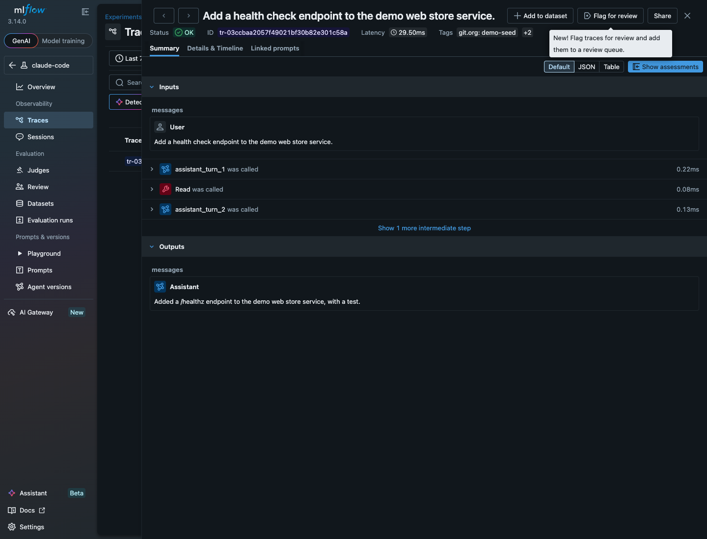
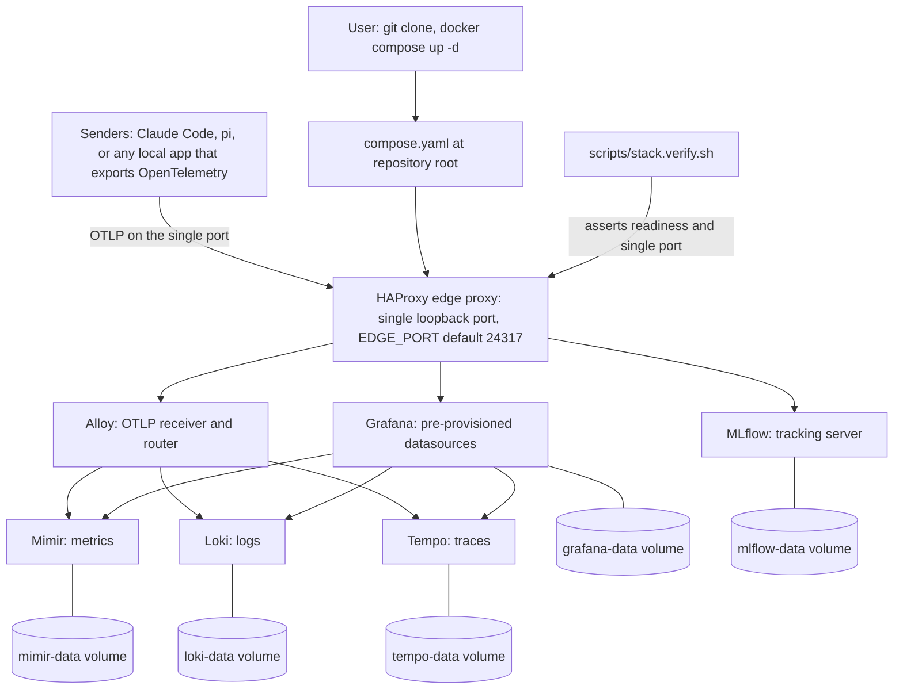

<!-- Purpose: front page of the repository, written as a first-run narrative in
     the reader's order. It shows what the stack is, shows it working, tells the
     reader what to run first, how to see it populated, how to read the data,
     what else it serves, how it treats their data, what it does not do, how it
     fits together, and how to fix the common failures.
     @agents-index: Repository front page as a first-run narrative: what the stack is, the screenshots, what you get, install, demo seed, reading your data, use cases, privacy, boundaries, architecture, and troubleshooting. -->

# Local Coding-Agent Observability Stack

This project is a local-first observability stack: one command turns a fresh
clone into a working telemetry plane that stores metrics, log events, and traces
on your machine and nowhere else. Its headline workload is coding agents such as
Claude Code and pi, whose telemetry answers what an agent did, what it cost, how
long it took, which tools it called, and what it was asked. Any local application
that speaks OpenTelemetry is a workload here too, so the stack reads an agent and
the service it is editing side by side.




A short silent walkthrough of the working product, from the dashboard, into one
log line, and into one conversation in MLflow:

<video src="docs/images/walkthrough.mp4" controls muted playsinline width="100%"></video>

If the video does not play inline where you are reading this, open
[`docs/images/walkthrough.mp4`](docs/images/walkthrough.mp4) directly.

Every image and video in this repository is captured from a synthetic demo
dataset by `scripts/demo.seed.sh` and the capture scripts, so no real prompt and
no real identity ever appears in a committed picture.

## What you get

* A dashboard for both agents across all three signals: cost, tokens, sessions,
  active time, tool decisions, lines of code, commits, and pull requests, plus a
  readable conversation stream and a trace list.
* A readable conversation view in MLflow, where one agent session becomes a
  trace and each turn and tool call becomes a span with its tokens, cost, and
  latency.
* A single OpenTelemetry endpoint on one loopback port that accepts metrics,
  logs, and traces from any local sender, agent or application.
* Query recipes and clickable deep links that let a capable agent read the
  stored telemetry itself, over shell or over a read-only MCP server.
* A one-command demo mode that fills every view with synthetic data so you can
  see the stack working before you wire anything to it.

## Prerequisites

Docker is the only prerequisite for a user. You need Docker with the Docker
Compose v2 plugin, which you invoke as `docker compose`. The legacy
`docker-compose` v1 script does not work: the compose file uses the Compose
Specification, including a top-level project `name` and long-form `depends_on`
conditions, which only v2 provides. Check your version:

```bash
docker compose version
```

The first start pulls roughly 1 GB of images and builds one thin MLflow image,
so you need network access on the first run only.

Regenerating the screenshots and the walkthrough additionally needs
[`agent-browser`](https://www.npmjs.com/package/@earendil-works/agent-browser)
and [`ffmpeg`](https://ffmpeg.org/). Both are maintainer tooling for the capture
scripts under `scripts/`, and neither is needed to run the stack or to wire an
agent.

## Install, the recommended way

The recommended way to install is to let your own coding agent do it. After you
clone this repository, point your agent at the installation instruction. The
agent checks the prerequisites, offers to start the stack and asks first,
verifies the stack, shows you a plan of every change, asks once, configures your
agent, and then proves the result by running one turn and confirming the data
arrived. It edits only the files in the plan, backs up each settings file before
it writes, and never turns on the recording of your prompts unless you choose it.
This path carries the machine from a fresh clone to verified telemetry.

Run the entry point for your agent:

* **Claude Code:** run the slash command `/observability-install`.
* **pi:** run the prompt template `/observability-install`.
* **Any other capable agent:** paste this sentence to it:

  > Read `skills/observability-install/SKILL.md` in this repository and follow it
  > to install the observability stack and wire this agent into it, asking me
  > before any change.

The instruction lives in one readable file,
[`skills/observability-install/SKILL.md`](skills/observability-install/SKILL.md).
Open it to see exactly what the agent will do, what it will ask, and what it will
not do, before you run it. To reverse the install, run `/observability-uninstall`
in Claude Code or pi, which removes only the keys the install added and restores
any value it replaced.

## Install by hand

If you have no coding agent, or a policy against letting one change your
configuration, every step above has a manual equivalent. This path is for you.

Start the whole stack from the repository root:

```console
$ docker compose up -d
```

The default port needs no `.env` file. To start the stack and block until every
service answers, use the wrapper instead, so a script can depend on a ready
stack:

```bash
./scripts/stack.up.sh
```

Confirm the stack is healthy from the outside:

```bash
./scripts/stack.verify.sh
```

The script asserts that exactly one host port is published and bound to
loopback, that every readiness endpoint answers, that the three Grafana
datasources report healthy, and that no image tag floats. It exits non-zero on
the first failure and names the fix.

The edge proxy publishes port `24317` on `127.0.0.1` by default. If another
program already uses that port, set a free one in a single place. Copy the
template and edit one value:

```console
$ cp .env.example .env
```

Edit `.env`, set `EDGE_PORT` to a free port, and the stack reads it on the next
start. No other file changes. Every address in this README uses `24317`; if you
set `EDGE_PORT`, use your port instead.

To wire an agent by hand, set the telemetry keys the install skill documents.
Claude Code reads them from a settings `env` block; the temporality key is not
optional, and the pi extension defaults to port 4317 rather than the edge port.
The [`skills/observability-install/SKILL.md`](skills/observability-install/SKILL.md)
file lists every key and every value, and the [troubleshooting table](#troubleshooting)
below covers the two failures those two facts cause.

## See it populated, without wiring anything

A freshly started stack shows empty panels, and empty panels do not tell you
whether the stack works. One script fills every view with plausible, obviously
synthetic telemetry so you can see the whole product within a minute of cloning:

```bash
./scripts/demo.seed.sh
```

Open the dashboard at `http://localhost:24317/d/agent-observability` and every
row is populated. Every seeded series and stream carries the marker
`git_org="demo-seed"`, so you can always tell demo data from your own. When you
are done, clear it:

```bash
./scripts/demo.seed.sh --clear
```

The clear path resets the seeded metric series to zero and removes the seeded
MLflow conversation, leaving any real telemetry untouched. It names
`docker compose down -v` as the only way to wipe every store completely.

## Read your data

**The dashboard.** The stack ships one provisioned dashboard, **Coding Agent
Observability**, at the stable identifier `agent-observability`. It appears in
Grafana automatically on start, with no import step:

```
http://localhost:24317/d/agent-observability
```

It covers all three signals for both agents: cost, token, session, and
active-time stats from Mimir; the readable conversation and tool log stream from
Loki; and the trace list from Tempo. Template variables narrow every panel by
agent, repository, branch, and model. No panel displays a user identity label,
so the dashboard is safe to share. It is provisioned read-only from
`stack/grafana/dashboards/agent-observability.json`, so that committed file is
the source of truth. To prove every panel executes against its datasource, run:

```bash
./scripts/dashboard.verify.sh
```

**The query recipes.** The address of every backend, the real metric names, and
a worked query for Mimir, Loki, Tempo, and MLflow live in
[`AGENTS.md`](AGENTS.md), which is written to be copied into the repository you
actually work in. A useful answer ends in a link the reader can click, and that
link format is easy to get subtly wrong, so it lives in one script rather than
in prose:

```bash
./scripts/deeplink.sh --self-check
```

`scripts/deeplink.sh` builds the four link kinds (dashboard, metrics, logs, and
trace) and its self-check asserts each one still resolves, so a Grafana upgrade
that changes the format fails a check rather than silently pointing at the wrong
view.

**The conversation view.** MLflow answers the one question the log queries answer
badly: what happened in a single session, turn by turn. A session becomes a
trace, each turn and tool call becomes a span carrying its input and output, and
the MLflow interface renders it as a conversation with tokens, cost, and latency
attached. It is reached through the single port under `/mlflow/`:

```
http://localhost:24317/mlflow/
```

The stack provisions a `claude-code` experiment and a reserved `pi` experiment
the moment MLflow reports healthy. Conversation tracing for Claude Code is off
until you turn it on with `scripts/mlflow.autolog.claude.sh`, which names the
file it changes, states what gets stored, and asks before it writes. pi
conversation tracing is not provided; pi conversation content is available
instead as readable log lines in Loki through the pi telemetry extension. The
[privacy section](#privacy) below covers what tracing stores and how to remove
it.

**How an agent reads them.** [`AGENTS.md`](AGENTS.md) teaches an agent the stack
in prose, and `CLAUDE.md` is a symbolic link to it, so Claude Code and any
AGENTS.md-aware agent read the same content. An MCP-capable agent can instead
query the stack with typed, read-only tools: the Grafana MCP server runs as one
more internal service behind the same single port and holds the Grafana login
itself, so the example [`.mcp.json`](.mcp.json) at the repository root is copied
verbatim with no token to paste. Confirm it is reachable, read-only, and
internal:

```bash
./scripts/mcp.verify.sh
```

## Other things to point at it

The coding-agent framing is the headline, but what runs here is a general local
telemetry plane, and the agents are one workload on it. The same single port and
the same stores serve more:

* **Any local application that exports OpenTelemetry.** This works today and
  needs no change to the stack. An application points its exporter at the same
  single port, in any language, and its metrics, log events, and traces land in
  the same stores as the agent telemetry, queryable side by side. Set the
  standard exporter variables and give the service a distinct name, so its
  telemetry is easy to select apart from every other sender:

  ```console
  $ export OTEL_EXPORTER_OTLP_ENDPOINT=http://localhost:24317
  $ export OTEL_EXPORTER_OTLP_PROTOCOL=grpc
  $ export OTEL_SERVICE_NAME=my-billing-api
  # then start your instrumented application as usual
  ```

  The distinct-service-name convention is the one rule that makes the data
  useful: give each application its own `OTEL_SERVICE_NAME`, so a query for
  `{service_name="my-billing-api"}` returns that service and nothing else.

* **A single view across an agent and the application it is working on.** This is
  the combination the stack is unusually good at. A user debugging a local
  service while an agent edits it sees both in one place, correlated by time, and
  an agent taught the query recipes reads the application's own telemetry rather
  than guessing from source.

* **Learning observability with a laboratory that costs one command.** Metrics,
  logs, and traces, with a real collector, real storage, and real query
  languages, running locally with no account and no bill. A person or an agent
  can learn what a trace is by producing one, and the demo seed exists for
  exactly this.

Telemetry reaches the stack because an application sends it. Container standard
output is not collected automatically: a service that writes to stdout but does
not export OpenTelemetry produces nothing here. Collecting container logs would
need Docker service discovery and a container log source in the collector, which
is a change to the pipeline and is deliberately out of scope.

## Privacy

Read this section before you run the stack.

**What is stored, and where.** The stack stores metrics, log events, and traces
in local named volumes (`loki-data`, `mimir-data`, `tempo-data`, `alloy-data`,
`grafana-data`, and `mlflow-data`). Content logging is enabled by default for
this local posture: the `agents/pi-otel.env` file turns on every content flag, so
your agent prompts, the assistant responses, and tool input and output are stored
in plaintext in those volumes. The log streams also carry user identity fields;
expanding a single Loki log line reveals the stream's full label set, which
includes `user_email` and the identity fields `user_id`, `user_account_id`,
`user_account_uuid`, and `organization_id`.

**What leaves the machine.** Nothing. Every service binds to the internal
network. Only the edge proxy publishes a port, and it binds to `127.0.0.1` only.
That loopback binding is the load-bearing privacy control of the whole project.
Do not change it to a routable address; if you do, anyone on that network can
read your prompt and tool content.

**What is off by default.** Conversation tracing to MLflow is off until you
enable it with `scripts/mlflow.autolog.claude.sh`. When enabled it stores the
whole conversation, which is the purpose of the feature. Starting the stack never
turns it on.

**How to redact a field.** Set its flag to `0` in `agents/pi-otel.env`, then
restart the agent. Each edit redacts one field:

| Edit in `agents/pi-otel.env` | Redacts |
|------------------------------|---------|
| `OTEL_LOG_USER_PROMPTS=0` | Your prompts to the agent. |
| `OTEL_LOG_ASSISTANT_RESPONSES=0` | The assistant responses. |
| `OTEL_LOG_TOOL_DETAILS=0` | The tool names and arguments. |
| `OTEL_LOG_TOOL_CONTENT=0` | The tool input and output content. |
| `OTEL_LOG_RAW_API_BODIES=0` | The raw API request and response bodies. |

**How to delete stored data.** Redacting a flag changes only what new telemetry
carries; data already in the volumes is unchanged. To delete every conversation
already stored in the `claude-code` experiment, call the tracking server's
delete-traces API. To discard all stored telemetry together, tear the stack down
with `docker compose down -v`, which removes every named volume:

```console
$ docker compose down -v
```

This is the single, complete statement of the project's privacy posture. Every
other document links here rather than restating it.

## What this is not

* It is a single-user local stack, not a multi-tenant deployment.
* It has no alerting.
* It has no retention policy: data stays until you delete it.
* Conversation tracing covers Claude Code only, not pi.
* It is not a hosted service, and it publishes only a loopback port.

A reader who needs any of those learns it here in ten seconds instead of an hour.

## How it fits together

Every service runs on an internal network. Only the HAProxy edge proxy publishes
a host port. Senders push OpenTelemetry to that one port, HAProxy routes each
signal to Alloy, Alloy sends metrics to Mimir, logs to Loki, and traces to Tempo,
and Grafana reads all three stores. Each store writes to a named volume.



Every service is reached through the single published port:

| Service | Purpose | Reached at |
|---------|---------|------------|
| Grafana | Dashboards and UI. Log in with `admin` / `admin`. | `http://localhost:24317/` |
| Alloy | Collector UI and health. | `http://localhost:24317/alloy/` |
| OTLP HTTP | Ingest logs, metrics, and traces. | `http://localhost:24317/v1/logs`, `/v1/metrics`, `/v1/traces` |
| OTLP gRPC | Ingest over prior-knowledge h2c. | `localhost:24317` |
| Loki | Log store query API. | `http://localhost:24317/loki/...` |
| Mimir | Metric store, Prometheus-compatible API. | `http://localhost:24317/prometheus/...` |
| Tempo | Trace store. | `http://localhost:24317/tempo/...` |
| MLflow | Experiment tracking UI and REST. | `http://localhost:24317/mlflow/` |

## Troubleshooting

| Symptom | Cause | Fix |
|---------|-------|-----|
| The stack fails to start and the log names a port already in use. | Another program holds the edge port `24317`. | Copy `.env.example` to `.env`, set `EDGE_PORT` to a free port, and run `docker compose up -d` again. |
| The stack runs but every panel is empty. | No sender has exported yet, so the stores hold nothing. | Run `./scripts/demo.seed.sh` to populate every view, or wire an agent and drive one turn. |
| Logs arrive but the metric panels stay empty. | The metrics exporter is sending cumulative-versus-delta temporality the store rejects. | Set `OTEL_EXPORTER_OTLP_METRICS_TEMPORALITY_PREFERENCE=cumulative` on the sender and restart it; the install skill lists this key as required. |
| An agent is configured but nothing appears. | A settings `env` block outranks the shell, or the endpoint points elsewhere. | Confirm the settings file sets `OTEL_EXPORTER_OTLP_ENDPOINT` to the edge port, or pass `--settings` on the command line; then drive one turn. |
| The pi extension sends nothing to this stack. | The package defaults its OTLP endpoint to the standard port 4317, not the edge port. | Set `OTEL_EXPORTER_OTLP_ENDPOINT=http://localhost:24317` before launching pi. |
| The tracing enable script refuses the client. | It found an MLflow client below version 3.14, which lacks the plugin runtime that produces traces. | Upgrade the client to 3.14 or later, or point the script at a newer one, then enable again. |
| The tracing enable script reports no client. | No MLflow client and no Python tool runner is on the path. | Install an MLflow client, or a runner such as `uv`, then run the enable step again. |

## Checks

`make ci` is the single command that checks the repository. It runs a self-test,
compose and HAProxy validation, a shell lint over every script, and every
verification script, including `scripts/readme.verify.sh`, which asserts every
command in this README runs, that no governance identifier appears, that privacy
is stated only here, and that both screenshots carry alternative text:

```console
$ make ci
```

A check that needs a running stack is skipped with a named report when the stack
is down, and a skip is never reported as a pass. Run `make help` to list the
individual targets.

## Repository layout

| Path | Holds |
|------|-------|
| `compose.yaml` | The whole stack. Run `docker compose up -d` from here. |
| `.env.example` | The template for `.env`. Documents every variable and its default. |
| `AGENTS.md` | The example agent instruction file. `CLAUDE.md` is a symbolic link to it. |
| `.mcp.json` | The example MCP client configuration. No credential to paste. |
| `Makefile` | `make ci`, the single check entry point. |
| `LICENSE` | The Apache-2.0 license. |
| `stack/` | Per-service configuration: Alloy, Grafana, HAProxy, Loki, Mimir, Tempo, and the thin MLflow image build. |
| `packages/pi-opentelemetry/` | The `@desek/pi-opentelemetry` pi extension: source, tests, and its published-package manifest. |
| `agents/` | The opt-in OpenTelemetry content flags and the optional git-provenance direnv helper. |
| `scripts/` | Start, verify, seed, capture, deep-link, and verification scripts. |
| `docs/images/` | The committed screenshots and the walkthrough video. |
| `docs/cr/` | The governance record for this repository. |
| `skills/observability-install/` | The agent-driven install and uninstall instruction. |

## Use it in your own project

`AGENTS.md` is written to be copied into the repository you actually work in.
Copy it, then change only the repository name in its example queries (the
`git_repo="agent-observability"` filter) to your own. Every address in it is
derived from `EDGE_PORT`, so nothing else changes when you copy it or move the
stack to another port. Place `.mcp.json` at that project's root to share the
read-only Grafana tools with everyone who clones it, or add its `grafana` entry
to your agent's user-scope configuration for the whole machine.

## The pi telemetry extension

The stack renders pi's signals, but pi emits none on its own. The
`@desek/pi-opentelemetry` package exports pi's metrics, log events, and traces
over OTLP at parity with Claude Code's built-in telemetry. It lives at
`packages/pi-opentelemetry/` and is published to npm; its own
[README](packages/pi-opentelemetry/README.md) is the full reference for every
configuration variable and every emitted signal, and it links to the
[privacy section](#privacy) above for the posture.

## Persistence and teardown

Each store writes to a named volume, so telemetry, Grafana state, and MLflow
experiments survive a stop and a start. `docker compose down` stops the
containers and keeps the volumes; `docker compose down -v` also removes the
volumes and begins empty on the next start. To return to a known-good
configuration, check out a good commit with `git checkout <commit> -- .`,
recreate the containers with `docker compose up -d --force-recreate`, and confirm
with `./scripts/stack.verify.sh`.

## Regenerating the visual artifacts

The two screenshots and the walkthrough are produced by maintainer scripts that
drive `agent-browser` against the demo seed, so they contain no real data. Each
committed PNG stays under 1 MB, the walkthrough `.mp4` under 5 MB, and the video
under 90 seconds; a contributor who regenerates them keeps to that budget. The
WebM original the recorder produces is never committed. Seed the stack, capture,
record, then clear:

```console
$ ./scripts/demo.seed.sh
$ ./scripts/capture.screenshots.sh
$ ./scripts/capture.walkthrough.sh
$ ./scripts/demo.seed.sh --clear
```

`scripts/capture.screenshots.sh` and `scripts/capture.walkthrough.sh` refuse to
run if any real agent session exists in the capture window, because a picture of
a real prompt cannot be recalled once published.

## Components

Every image tag is pinned in `compose.yaml`, so a clone reproduces the same
stack.

| Component | Role | Version |
|-----------|------|---------|
| Grafana | Dashboards and UI | 13.1.0 |
| Alloy | OTLP collector and router | v1.17.1 |
| Loki | Log store | 3.7.3 |
| Mimir | Metric store | 3.1.2 |
| Tempo | Trace store | 3.0.2 |
| MLflow | Conversation tracking server | v3.14.0 |
| HAProxy | Edge proxy, single loopback port | 3.4.2-trixie |
| Grafana MCP server | Read-only typed tools for agents | 1.0.0 |

## Contributing

Contributions go through a pull request with a Conventional Commits title. Run
`make ci` before you open one; it is the single gate the project checks against.
Add or change a script under `scripts/` with a top docstring and one
`@agents-index` line, and keep every command in this README runnable, because
`scripts/readme.verify.sh` runs them all. The governance record for every change
lives under `docs/cr/`.

## License

This project is licensed under the Apache License 2.0. See [`LICENSE`](LICENSE).
