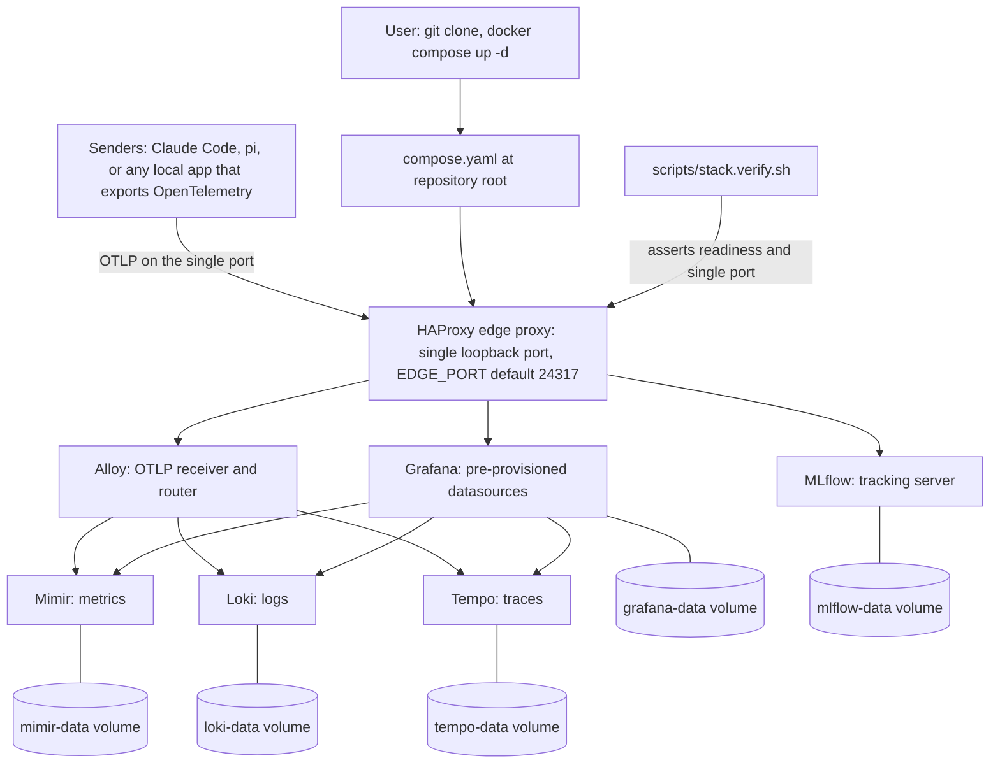

<!-- Purpose: the document that explains the shape of the stack. It shows which
     services run, that only one of them publishes a host port, how each signal
     travels from a sender to its store, where every service is reached, which
     image version is pinned, and what survives a teardown.
     @agents-index: Architecture document: the service diagram, the single-port address table, the pinned component versions, and the persistence and teardown behaviour. -->

# How it fits together

[Back to the front page](../README.md)

Every service runs on an internal network. Only the HAProxy edge proxy publishes
a host port. Senders push OpenTelemetry to that one port, HAProxy routes each
signal to Alloy, Alloy sends metrics to Mimir, logs to Loki, and traces to Tempo,
and Grafana reads all three stores. Each store writes to a named volume.

Every service is reached through the single published port:

| Service | Purpose | Reached at |
|---------|---------|------------|
| Grafana | Dashboards and UI. Log in with `admin` / `admin`. | `http://localhost:24317/` |
| Alloy | Collector UI and health. | `http://localhost:24317/alloy/` |
| OTLP HTTP | Ingest logs, metrics, and traces. | `http://localhost:24317/v1/logs`, `/v1/metrics`, `/v1/traces` |
| OTLP gRPC | Ingest over prior-knowledge h2c. | `localhost:24317` |
| Loki | Log store query API. | `http://localhost:24317/loki/...` |
| Mimir | Metric store, Prometheus-compatible API. | `http://localhost:24317/prometheus/...` |
| Tempo | Trace store. | `http://localhost:24317/tempo/...` |
| MLflow | Experiment tracking UI and REST. | `http://localhost:24317/mlflow/` |

## Components

Every image tag is pinned in `compose.yaml`, so a clone reproduces the same
stack.

| Component | Role | Version |
|-----------|------|---------|
| Grafana | Dashboards and UI | 13.1.0 |
| Alloy | OTLP collector and router | v1.17.1 |
| Loki | Log store | 3.7.3 |
| Mimir | Metric store | 3.1.2 |
| Tempo | Trace store | 3.0.2 |
| MLflow | Conversation tracking server | v3.14.0 |
| HAProxy | Edge proxy, single loopback port | 3.4.2-trixie |
| Grafana MCP server | Read-only typed tools for agents | 1.0.0 |

## Persistence and teardown

Each store writes to a named volume, so telemetry, Grafana state, and MLflow
experiments survive a stop and a start. `docker compose down` stops the
containers and keeps the volumes; `docker compose down -v` also removes the
volumes and begins empty on the next start. To return to a known-good
configuration, check out a good commit with `git checkout <commit> -- .`,
recreate the containers with `docker compose up -d --force-recreate`, and confirm
with `./scripts/stack.verify.sh`.

## Next

* [Read your data](reading-data.md), what the stores answer.
* [Privacy](privacy.md), what those volumes hold.
* [Troubleshooting](troubleshooting.md), when a service does not answer.
