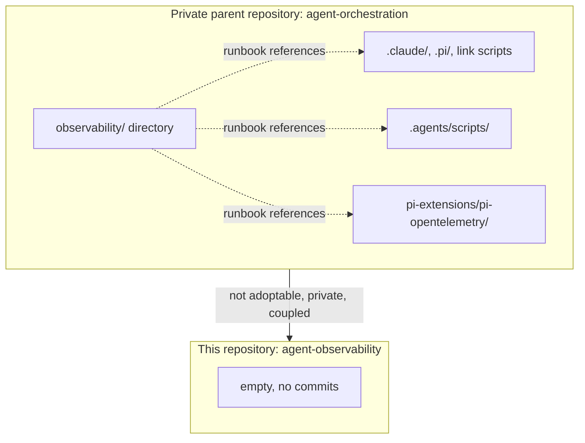
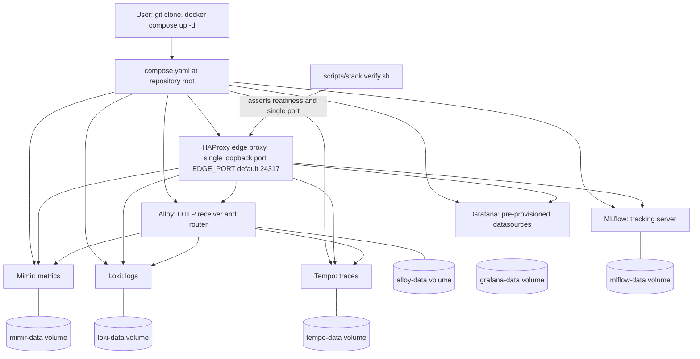
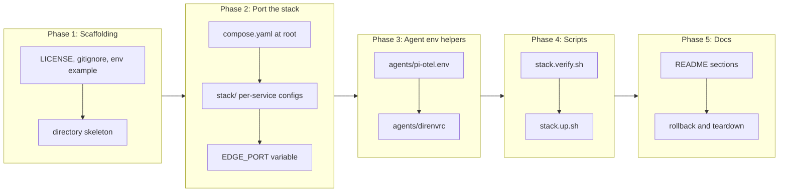

# Standalone Repository Foundation for the Local Coding-Agent Observability Stack

## Change Summary

The local observability stack for coding agents currently lives inside a private, multi-purpose experimentation repository, where it is one directory among global agent configuration, governance tooling, and unrelated experiments. Its configuration files reference that parent repository by path, its runbook refers to files that do not exist outside it, and it cannot be adopted by anyone else. This change makes the present repository the single, public, Apache-2.0 licensed home of that stack.

After this change, a user clones this repository, runs one command, and has a working local telemetry plane: Grafana, Alloy, Loki, Mimir, Tempo, and MLflow, all pre-configured, all persistent, and all reachable through exactly one loopback port. Nothing in the repository refers to a private parent, and every path is relative to this repository root.

## Motivation and Background

Coding agents now emit rich OpenTelemetry data. Claude Code ships built-in metrics, log events, and traces. The pi coding agent gains the same through an extension. The data is valuable: it answers what an agent did, what it cost, how long it took, which tools it called, and what it was asked. Almost nobody collects it, because the setup cost is high. A user must choose a collector, choose three storage backends, write four configuration files, wire the datasources, and discover a set of undocumented environment variables before the first data point lands.

A working, opinionated, local-first stack removes that cost. The stack described here already exists and is proven: it has run continuously for weeks, ingests both Claude Code and pi telemetry, and stores metrics, logs, and traces with git provenance labels. What it lacks is a home from which it can be adopted. This change gives it one.

The local-first property is the point, not an implementation detail. Agent telemetry carries user prompts, assistant responses, and tool input and output. Sending that to a hosted vendor is not acceptable for most users and is a blocker for adoption inside companies. Everything here runs in containers on the user's machine, binds to loopback only, and never sends data anywhere.

## Change Drivers

* The stack is not adoptable: it lives in a private repository and refers to files outside its own directory.
* Setting up agent observability from scratch costs hours; a pre-configured stack reduces that to one command.
* Agent telemetry contains prompt and response content, so a local-only, loopback-bound design is a requirement rather than a preference.
* A public Apache-2.0 repository is a prerequisite for publishing the pi extension package and for accepting contributions.
* The other six change requests in this set (baseline dashboard, pi package, MLflow for agents, agent interface, install path, README) all need a repository root to build on.

## Current State

The stack lives at `observability/` inside a private repository named `agent-orchestration`. It consists of a compose file, per-service configuration for Loki, Mimir, Tempo, Alloy, and HAProxy, a thin MLflow Dockerfile, Grafana datasource provisioning, a direnv library, a pi environment file, and a runbook.

The stack is functionally complete. Six services run on an internal bridge network named `otel`. Only HAProxy publishes a host port, `127.0.0.1:24317`. HAProxy routes by content and path: gRPC content type or the OTLP proto path prefix to Alloy's gRPC receiver, the three OTLP HTTP signal paths to Alloy's HTTP receiver, `/loki/` to Loki, `/prometheus` to Mimir, `/tempo/` to Tempo with the prefix stripped, `/alloy/` to the Alloy user interface, `/mlflow/` to MLflow, and everything else to Grafana at the root. Alloy receives OTLP, rewrites log bodies into readable lines, and fans metrics to Mimir, logs to Loki, and traces to Tempo. It also scrapes HAProxy's and MLflow's Prometheus exporters and receives HAProxy's syslog stream.

What blocks adoption:

* The runbook refers to `pi-extensions/pi-opentelemetry/`, `.claude/settings.json`, `link-pi.sh`, `.agents/scripts/`, and `.agents/explore/`, none of which exist in this repository.
* The runbook documents a rollback procedure against commit hashes in the parent repository's history.
* The direnv library is described as "mastered in this repo" and symlinked by a parent-repository script.
* There is no license, no README aimed at a new user, no `.gitignore`, and no first-run path.
* Grafana starts with three datasources and zero dashboards, so a new user sees an empty Grafana and has to write queries by hand. That gap is closed by CR-0002, not here.

### Current State Diagram



## Proposed Change

Port the stack into this repository as a self-contained, public, Apache-2.0 project, and add the repository scaffolding a first-time user needs.

1. **Repository layout.** `compose.yaml` sits at the repository root so `docker compose up -d` works from a fresh clone with no arguments. Per-service configuration moves under `stack/`, one directory per service, so the root stays readable as the project grows:

   ```
   compose.yaml
   .env.example
   .gitignore
   LICENSE
   README.md
   stack/alloy/config.alloy
   stack/grafana/provisioning/datasources/datasources.yaml
   stack/haproxy/haproxy.cfg
   stack/loki/config.yaml
   stack/mimir/config.yaml
   stack/tempo/config.yaml
   stack/mlflow/Dockerfile
   agents/pi-otel.env
   agents/direnvrc
   scripts/stack.verify.sh
   scripts/stack.up.sh
   docs/cr/
   ```

2. **One-command bring-up.** `docker compose up -d` from the repository root starts every service, builds the thin MLflow image on first run, and needs no prior step, no environment file, and no manual Grafana configuration. The compose file declares the MLflow `build:` context so a first run builds it automatically rather than failing on a missing image. A convenience wrapper `scripts/stack.up.sh` starts the stack and then blocks until every readiness endpoint answers, so a script or an agent can depend on a ready stack rather than sleeping.

3. **Single published port, preserved.** The HAProxy edge proxy remains the only service that publishes a host port, and it stays bound to loopback, `127.0.0.1`, on the `EDGE_PORT` value that defaults to `24317`. Every routing rule ported from the parent is preserved exactly. This is the load-bearing privacy control of the whole project: telemetry that includes prompt and tool content is bound to loopback in one place rather than in seven.

4. **Configurable port with one edit.** The published port is read from a single compose variable, `EDGE_PORT`, defaulting to `24317`, so a user whose machine already uses that port changes one value in `.env` instead of editing several files. `.env.example` documents it, `.env` is gitignored, and the default path requires no `.env` at all.

5. **Decoupling from the parent.** Every reference to a file outside this repository is removed or replaced. The rollback section that names parent-repository commit hashes is replaced by a rollback procedure expressed in this repository's own terms. The direnv library is re-described as this repository's optional git-provenance helper rather than a globally symlinked master. Agent wiring instructions become forward references to CR-0005 (agent interface) and CR-0006 (installation path) rather than references to a private `.claude/settings.json`.

6. **Licensing and provenance.** An Apache-2.0 `LICENSE` file is added at the root. Every ported configuration file keeps its explanatory top comment, including the one-line `@agents-index` synthesis, because those comments are the reason the configuration is readable, but governance identifiers are stripped from them: a public reader must not meet a `CR-0003` marker that points at a document in a private repository.

7. **Verification as a script, not prose.** `scripts/stack.verify.sh` proves the stack from the outside in a single run: it asserts that exactly one host port is published, that all five readiness endpoints answer, that the three Grafana datasources are healthy, and that MLflow answers under its prefix. It exits non-zero on the first failure and prints an actionable message naming the fix. This is what a user runs when something looks wrong, and what CR-0006's installation path calls to confirm success.

8. **Privacy stated once, plainly.** The README states in its own section that content logging is enabled by default, that prompts and responses are therefore stored in plaintext in local volumes, that nothing leaves the machine, and exactly which flags to set to `0` to redact. A user must not discover this from a source comment.

### Proposed State Diagram



## Requirements

### Functional Requirements

1. The repository **MUST** contain `compose.yaml` at its root, so that `docker compose up -d` run from the repository root starts the whole stack with no arguments.
2. The stack **MUST** consist of exactly seven services: `loki`, `mimir`, `tempo`, `alloy`, `grafana`, `haproxy`, and `mlflow`.
3. Exactly one service, `haproxy`, **MUST** publish a host port, and that mapping **MUST** bind to `127.0.0.1` only.
4. The published host port **MUST** be read from a compose variable named `EDGE_PORT` whose default value is `24317`, and the stack **MUST** start correctly when no `.env` file is present.
5. Every image reference **MUST** carry an explicit version tag, and every image reference **MUST NOT** use `latest`.
6. Grafana **MUST** start with the Loki, Mimir, and Tempo datasources already provisioned and reporting healthy, with no manual configuration.
7. The MLflow service **MUST** build from the committed `stack/mlflow/Dockerfile` on first `docker compose up` without a separate build command.
8. All five telemetry and application readiness endpoints (`/loki/ready`, `/prometheus/ready`, `/tempo/ready`, `/alloy/-/healthy`, `/api/health`) and the MLflow health endpoint (`/mlflow/health`) **MUST** answer through the single published port.
9. Named volumes **MUST** persist Loki, Mimir, Tempo, Grafana, Alloy, and MLflow data across `docker compose down` followed by `docker compose up`.
10. The repository **MUST** contain a reusable script `scripts/stack.verify.sh` that asserts the single published port, every readiness endpoint, and every Grafana datasource health state, exits non-zero on any failure, and prints usage with `-h`.
11. The repository **MUST** contain a reusable script `scripts/stack.up.sh` that starts the stack and blocks until every readiness endpoint answers or a stated timeout elapses.
12. The repository **MUST** contain an Apache-2.0 `LICENSE` file at its root.
13. The repository **MUST** contain a `.gitignore` that excludes `.env` and any local build or data artifact.
14. The repository **MUST** contain `.env.example` documenting every supported variable, including `EDGE_PORT`, with its default.
15. Every file in the repository **MUST NOT** reference a path, script, or commit that exists only in the private parent repository.
16. Every file in the repository, outside `docs/cr/`, **MUST NOT** contain a governance identifier of the form `CR-` followed by digits.
17. Every configuration file **MUST** retain a top comment stating its purpose and a one-line `@agents-index` synthesis of that purpose.
18. The README **MUST** contain a privacy section naming the content-logging flags, stating that prompts and responses are stored in plaintext locally, stating that no data leaves the machine, and giving the exact edit that redacts each field.
19. The README **MUST** contain a rollback and teardown section expressed only in this repository's own terms, covering `docker compose down` and `docker compose down -v` with their differing data outcomes.
20. The Alloy configuration **MUST** retain the readable-log-line transform for both the `claude_code.*` and the `pi.*` event families, so that a log line in Grafana carries content rather than a bare event name.
21. The Loki, Mimir, and Tempo configurations **MUST** retain promotion of the four git provenance attributes (`git.org`, `git.repo`, `git.branch`, `git.path`) to queryable labels.
22. HAProxy **MUST** retain its self-telemetry: the internal Prometheus exporter scraped by Alloy into Mimir, and the syslog stream forwarded by Alloy into Loki.
23. The repository **MUST** contain a `Makefile` at its root providing a single `ci` target that runs every check the project defines and exits non-zero if any of them fails.
24. The `ci` target **MUST** run at least: compose file validation, HAProxy configuration validation inside the pinned image, a shell lint over every script, and every verification script the repository provides.
25. The `Makefile` **MUST** provide the individual targets the `ci` target composes, so a contributor can run one check without running all of them.
26. The `ci` target **MUST** be runnable on a machine where the stack is not running, by skipping the checks that need a running stack and reporting which ones were skipped rather than failing or silently passing.
27. The README **MUST** name `make ci` as the single command that checks the repository.

### Non-Functional Requirements

1. The stack **MUST** run entirely on the local machine and **MUST NOT** require any hosted account, remote database, or remote object store.
2. The stack **MUST NOT** transmit telemetry to any endpoint outside the local machine.
3. A first-time user following the manual path **MUST** reach a running, verified stack with no more than two commands: one to start it and one to verify it. This path is the documented alternative rather than the recommended one, and the two scripts it uses are the same scripts the recommended agent-driven path calls, so neither path can drift from the other.
4. The stack **MUST** start on a machine with Docker installed and no other prerequisite, and the README **MUST** state the minimum Docker Compose version relied upon.
5. Configuration **MUST** be reproducible: an identical clone on another machine **MUST** produce an identical stack, because every version is pinned.
6. Every reusable script **MUST** be executable, single-purpose, self-describing with a top docstring, and **MUST** print usage when invoked without required arguments.

## Affected Components

* `compose.yaml`, new at the repository root.
* `stack/` configuration for Alloy, Grafana, HAProxy, Loki, Mimir, Tempo, and MLflow.
* `agents/pi-otel.env` and `agents/direnvrc`, ported and re-scoped to this repository.
* `scripts/stack.up.sh` and `scripts/stack.verify.sh`, new.
* `README.md`, `LICENSE`, `.gitignore`, `.env.example`, `Makefile`, new at the repository root.
* `docs/cr/`, the governance record for this repository.

## Scope Boundaries

### In Scope

* Porting the seven-service stack and every per-service configuration file into this repository.
* Repository scaffolding: license, ignore file, environment example, README covering start, verify, privacy, persistence, and teardown.
* The `EDGE_PORT` single-variable port override.
* The two reusable scripts that start and verify the stack.
* Removing every reference to the private parent repository and every governance identifier outside `docs/cr/`.

### Out of Scope ("Here, But Not Further")

* The baseline Grafana dashboard and its provisioning. That is CR-0002; this change ports the datasource provisioning only.
* The pi OpenTelemetry extension and its package. That is CR-0003.
* MLflow configuration aimed specifically at coding-agent conversation tracking. That is CR-0004; this change ports the MLflow service as it stands.
* `AGENTS.md`, `.mcp.json`, and the Grafana MCP server. That is CR-0005.
* The agent-driven installation path (slash command or skill). That is CR-0006.
* Screenshots and the finished user-facing README narrative. That is CR-0007; this change delivers a working README, not the finished one.
* Any change to the routing behaviour, the storage backends, or the retention policy of the stack. This is a port, not a redesign.
* Native HAProxy OpenTelemetry tracing, which needs a custom HAProxy build and stays deferred.
* Multi-user, multi-tenant, or remote deployment of the stack.

## Alternative Approaches Considered

* **Keep the stack in the parent repository and publish a copy.** Rejected: two copies drift, and the copy would still be the second-class one. A single public home is the whole point.
* **Use a git submodule pointing at the parent.** Rejected: the parent is private, so a submodule blocks every external user at clone time.
* **Ship a single-container all-in-one image (the Grafana OTel-LGTM image).** Rejected: it is convenient but opaque. The user cannot see or change the per-service configuration, the readable-log-line transform, or the label promotion, all of which are what makes this stack useful rather than merely running.
* **Publish a Helm chart or Kubernetes manifests instead of Compose.** Rejected for now: the target is a developer machine, and Compose is the lowest-friction runtime there. A chart can follow later without invalidating this work.
* **Keep the seven per-service host ports instead of the edge proxy.** Rejected: each published port is an independent privacy surface. One door is one control.

## Impact Assessment

### User Impact

A new user clones a repository and runs one command to get a working telemetry plane, instead of assembling one. The user must have Docker installed, must accept that roughly 1 GB of images is pulled on first run, and must understand that content logging is on by default. Existing users of the parent repository are unaffected until they migrate; the parent copy is not deleted by this change.

### Technical Impact

No behavioural change to the stack itself. The port becomes variable, which is new. Paths change, so every internal reference must be updated together: a half-ported state in which the compose file points at `stack/` but a config still refers to the old location fails at container start rather than silently. The MLflow build context moves, so the first run on a machine that already has the parent stack running will conflict on the published port until one of the two is stopped; the README must say so.

### Business Impact

Cost is engineering time only. The benefit is that six further change requests become implementable, and that the project can be published, cited, and contributed to. Apache-2.0 matches the licenses of Alloy, Loki, Mimir, Tempo, and MLflow, so the license choice introduces no incompatibility.

## Implementation Approach

### Phase 1: Repository scaffolding

Create `LICENSE` (Apache-2.0), `.gitignore`, `.env.example`, and the directory skeleton (`stack/`, `agents/`, `scripts/`, `docs/cr/`). Add a README skeleton with the section headings this change requires, so later phases fill sections rather than inventing structure.

Create the root `Makefile` with a `ci` target and the individual targets it composes. `ci` is the project's single check entry point: it validates the compose file, validates the HAProxy configuration inside the pinned image, lints every script, and runs every verification script the repository provides. Checks that need a running stack are skipped with a named report when the stack is down, so `ci` is honest on a machine that has not started it rather than failing or passing silently. Later change requests add their verification scripts to the same target rather than inventing a second entry point.

### Phase 2: Port the stack

Copy `compose.yaml` to the repository root and rewrite every bind-mount path to `./stack/<service>/...`. Copy each per-service configuration file into `stack/`. Copy the MLflow Dockerfile into `stack/mlflow/`. Introduce `EDGE_PORT` with its default in the compose port mapping. Strip governance identifiers from every ported comment while keeping the explanation the comment carries. Confirm the stack starts, all seven services run, and only one host port is published.

### Phase 3: Port the agent environment helpers

Copy `pi-otel.env` and `direnvrc` into `agents/`, rewriting their docstrings so they describe this repository rather than a private parent, and so they no longer claim to be symlinked by a script that does not exist here.

### Phase 4: Verification scripts

Write `scripts/stack.verify.sh` and `scripts/stack.up.sh` to the repository's script contract: top docstring with purpose, usage, and parameters; `@agents-index` line; usage on `-h`; non-zero exit on failure; and an error message that names the failure, the fix, and what to check afterwards.

### Phase 5: README and rollback

Fill the README: what the project is, prerequisites, start, verify, what is where, access table for every service through the single port, git provenance labels, privacy, persistence, teardown, and rollback. State the minimum Docker Compose version. State the port-conflict remedy in terms of `EDGE_PORT`.

### Implementation Flow



## Test Strategy

The deliverable is configuration and shell scripts, so the test layer is executable verification against a real running stack rather than unit tests. Every assertion below runs against the stack the change itself starts.

### Tests to Add

| Test File | Test Name | Description | Inputs | Expected Output |
|-----------|-----------|-------------|--------|-----------------|
| `scripts/stack.verify.sh` | `assert_single_published_port` | Asserts exactly one service publishes a host port and that it binds 127.0.0.1 | `docker compose ps --format` output | Exit 0; one line naming `haproxy` |
| `scripts/stack.verify.sh` | `assert_backend_readiness` | Asserts Loki, Mimir, Tempo, Alloy, Grafana, and MLflow answer readiness through the single port | Six HTTP GETs on `EDGE_PORT` | Exit 0; each returns its ready or healthy body |
| `scripts/stack.verify.sh` | `assert_datasources_healthy` | Asserts the three Grafana datasources exist and their health checks pass | Grafana datasource API | Exit 0; three healthy datasources |
| `scripts/stack.verify.sh` | `assert_no_parent_references` | Greps the working tree for references to parent-only paths and for governance identifiers outside `docs/cr/` | Repository tree | Exit 0; zero matches |
| `scripts/stack.verify.sh` | `assert_pinned_images` | Asserts no image reference in `compose.yaml` uses `latest` | `compose.yaml` | Exit 0; zero matches |
| `scripts/stack.up.sh` | `wait_for_ready` | Starts the stack and blocks until readiness or timeout | Optional timeout argument | Exit 0 within timeout; non-zero with a named failing endpoint otherwise |

### Tests to Modify

Not applicable. The repository has no existing tests.

### Tests to Remove

Not applicable. The repository has no existing tests.

## Acceptance Criteria

### AC-1: One command starts the whole stack from a fresh clone (covers FR1, FR2, FR7, NFR3)

```gherkin
Given a machine with Docker installed and a fresh clone of this repository
  And no .env file present
When the user runs "docker compose up -d" from the repository root
Then all seven services reach the running state
  And the mlflow image is built from stack/mlflow/Dockerfile without a separate build command
```

### AC-2: Exactly one host port is published, bound to loopback (covers FR3, NFR2)

```gherkin
Given the stack is running
When the user runs "docker compose ps --format '{{.Service}} {{.Publishers}}'"
Then only the haproxy service shows a published port
  And that port is bound to 127.0.0.1
```

### AC-3: The published port is changed by one edit (covers FR4)

```gherkin
Given the stack is stopped
  And the user sets EDGE_PORT to 34317 in a .env file at the repository root
When the user runs "docker compose up -d"
Then the stack publishes 127.0.0.1:34317
  And no other file needs to be edited for the stack itself to work
```

### AC-4: Every readiness endpoint answers through the single port (covers FR8)

```gherkin
Given the stack is running
When the user requests /loki/ready, /prometheus/ready, /tempo/ready, /alloy/-/healthy, /api/health, and /mlflow/health on the published port
Then each request returns a success status and its expected body
```

### AC-5: Grafana starts with healthy datasources and no manual setup (covers FR6)

```gherkin
Given the stack is running
When the user opens Grafana at the published port and lists datasources
Then Loki, Mimir, and Tempo are present
  And each reports a healthy connection test
```

### AC-6: Telemetry persists across a stop and start (covers FR9, NFR5)

```gherkin
Given the stack has ingested at least one metric sample
When the user runs "docker compose down" and then "docker compose up -d"
Then the previously ingested sample is still queryable
  And Grafana retains its datasources
```

### AC-7: The repository is self-contained (covers FR15, FR16)

```gherkin
Given a fresh clone of this repository
When the working tree is searched for parent-repository paths and for governance identifiers outside docs/cr/
Then zero matches are found
```

### AC-8: The verification script proves the stack and fails usefully (covers FR10, NFR6)

```gherkin
Given the stack is running
When the user runs scripts/stack.verify.sh
Then it exits 0 and reports each assertion as passed
  And when one backend is stopped and the script is re-run
  Then it exits non-zero, names the failing endpoint, and states the command that fixes it
```

### AC-9: Images are pinned (covers FR5, NFR5)

```gherkin
Given compose.yaml
When it is searched for image references
Then every reference carries an explicit version tag
  And no reference uses latest
```

### AC-10: Log lines are readable and provenance is queryable (covers FR20, FR21)

```gherkin
Given the stack is running and an agent has produced telemetry
When the user queries Loki for the agent service name
Then the log line carries the event content rather than the bare event name
  And the stream can be selected by git_org, git_repo, git_branch, and git_path labels
```

### AC-11: The edge proxy is itself observable (covers FR22)

```gherkin
Given the stack is running and has served at least one request
When the user queries Mimir for haproxy metrics and Loki for the haproxy job
Then at least one metric series and at least one log line are returned
```

### AC-12: Privacy and teardown are documented (covers FR18, FR19)

```gherkin
Given the README
When a first-time user reads it
Then it states that prompt and response content is stored in plaintext in local volumes
  And it states that no data leaves the machine
  And it gives the exact edit that redacts each content field
  And it distinguishes "docker compose down" from "docker compose down -v" by data outcome
```

### AC-13: The project is Apache-2.0 licensed (covers FR12)

```gherkin
Given the repository root
When a user looks for licensing
Then a LICENSE file containing the Apache License 2.0 is present
```

### AC-14: One command checks the repository (covers FR23, FR24, FR25, FR26, FR27)

```gherkin
Given a fresh clone with the stack running
When the user runs "make ci"
Then it validates the compose file, validates the HAProxy configuration, lints every script, and runs every verification script
  And it exits 0 when all of them pass
  And when one check is made to fail, it exits non-zero and names the failing check
  And when the same command is run with the stack stopped
  Then it skips the checks that need a running stack, names which were skipped, and does not report a pass for them
  And the README names "make ci" as the command that checks the repository
```

### AC-15: Configuration stays self-describing (covers FR17)

```gherkin
Given any configuration file under stack/ or agents/
When it is opened
Then its first comment block states the file's purpose
  And it contains exactly one @agents-index line summarising that purpose
```

### AC-16: The start script blocks until the stack is ready (covers FR11)

```gherkin
Given the stack is stopped
When the user runs scripts/stack.up.sh
Then the script returns only after every readiness endpoint answers
  And it exits 0 within the stated timeout
  And when the timeout elapses before readiness, it exits non-zero and names the endpoint that did not answer
```

### AC-17: The environment files are correct (covers FR13, FR14)

```gherkin
Given a fresh clone of this repository
When the user inspects .gitignore and .env.example
Then .env is ignored by git and .env.example is not
  And .env.example lists every supported variable, including EDGE_PORT, each with its default value
```

### AC-18: The stack has no hosted dependency (covers NFR1)

```gherkin
Given the committed stack configuration
When each service configuration is inspected
Then no service references a hosted account, a remote database, or a remote object store
  And every storage backend writes to a local named volume
```

### AC-19: The local prerequisites are documented (covers NFR4)

```gherkin
Given the README
When a first-time user reads the prerequisites section
Then it states that Docker is the only prerequisite
  And it states the minimum Docker Compose version the stack relies upon
```

## Quality Standards Compliance

### Build & Compilation

- [ ] `docker compose config` parses the compose file without error
- [ ] `docker compose build mlflow` builds the thin image without error
- [ ] HAProxy validates its configuration with `haproxy -c` inside the pinned image

### Linting & Code Style

- [ ] `shellcheck` passes with zero warnings on every script under `scripts/`
- [ ] Every script is executable and starts with a top docstring and one `@agents-index` line
- [ ] YAML files parse cleanly

### Test Execution

- [ ] `scripts/stack.verify.sh` exits 0 against a freshly started stack
- [ ] `scripts/stack.verify.sh` exits non-zero and names the failure when a backend is stopped

### Documentation

- [ ] README covers prerequisites, start, verify, access, privacy, persistence, teardown, and rollback
- [ ] `.env.example` documents every supported variable with its default
- [ ] Every ported configuration file retains its purpose comment and `@agents-index` line

### Code Review

- [ ] Changes submitted via pull request
- [ ] PR title follows Conventional Commits format
- [ ] Code review completed and approved
- [ ] Changes squash-merged to maintain linear history

### Verification Commands

```bash
# The single check entry point for the whole repository
make ci

# Compose file validity
docker compose config >/dev/null

# HAProxy config validity, using the pinned image so no local haproxy is needed
docker run --rm -v "$PWD/stack/haproxy/haproxy.cfg:/tmp/haproxy.cfg:ro" \
  haproxy:3.4.2-trixie haproxy -c -f /tmp/haproxy.cfg

# Start and wait for readiness
./scripts/stack.up.sh

# Full external verification
./scripts/stack.verify.sh

# Single published port
docker compose ps --format '{{.Service}} {{.Publishers}}'

# No parent-repository references, no governance identifiers outside docs/cr/
grep -rn "pi-extensions/\|link-pi.sh\|link-claude.sh\|agent-orchestration" --exclude-dir=.git . ; test $? -eq 1
grep -rn "CR-[0-9]\{4\}" --exclude-dir=.git --exclude-dir=docs . ; test $? -eq 1

# No floating image tags
grep -n "image:.*latest" compose.yaml ; test $? -eq 1

# Script lint
shellcheck scripts/*.sh
```

## Risks and Mitigation

### Risk 1: Port 24317 is already in use on the user's machine

**Likelihood:** medium
**Impact:** high, because the stack fails to start and the cause is not obvious
**Mitigation:** The `EDGE_PORT` variable makes the change a single edit. `scripts/stack.up.sh` detects the bind failure and prints the remedy naming `EDGE_PORT` and `.env`, rather than leaving the user with a raw Docker error. The README documents it under prerequisites, not in a footnote.

### Risk 2: A half-ported state, where a path was updated in one file and not another

**Likelihood:** medium
**Impact:** medium; the stack fails at container start rather than silently
**Mitigation:** Phase 2 is a single unit of work, `docker compose config` is run before start, and `stack.verify.sh` asserts every endpoint rather than only that containers are running.

### Risk 3: The user runs this stack alongside the parent repository's stack

**Likelihood:** medium for the author, low for others
**Impact:** medium; both bind the same loopback port and the second fails
**Mitigation:** The README states the conflict explicitly and gives two remedies: stop the other stack, or set `EDGE_PORT`. Both compose projects also use distinct project names, so volumes never collide.

### Risk 4: A pinned image tag is withdrawn or the digest moves

**Likelihood:** low
**Impact:** medium; a fresh clone fails to pull
**Mitigation:** Tags are pinned to published releases of long-lived projects. The README states the tested version set, so a user can bisect an upgrade. Pinning by digest is recorded as a possible later hardening.

### Risk 5: A user assumes the stack is safe to expose on a network

**Likelihood:** low
**Impact:** high; prompt and response content would be readable by anyone on that network
**Mitigation:** The loopback binding is in one place and is documented as load-bearing. The privacy section states that the binding is the control and warns against changing it.

### Risk 6: Content logging surprises a user who did not read the privacy section

**Likelihood:** medium
**Impact:** medium
**Mitigation:** The privacy section is a top-level README section, not a footnote, and CR-0006's installation path is required to state the posture and the redaction flags at install time as well.

## Dependencies

* Docker with the Compose v2 plugin on the user's machine.
* Network access on first run to pull the pinned images and build the thin MLflow layer.
* No dependency on any other change request in this set. This change is the foundation the other six build on.

## Estimated Effort

Roughly 8 to 12 person-hours: 2 for scaffolding and licensing, 3 for the port and path rewrite, 3 for the two scripts, and 3 for the README and end-to-end verification.

## Decision Outcome

Chosen approach: "port the proven stack into this repository as a self-contained, Apache-2.0, one-command project with an `EDGE_PORT` override and executable verification", because the stack's value is already demonstrated and the only thing missing is adoptability. A rewrite would risk the properties that make it useful, and a copy left in the private parent would drift. Keeping the single-loopback-port design unchanged preserves the privacy control that justifies the whole local-first design.

## Related Items

* CR-0002: baseline Grafana dashboard provisioned into this stack.
* CR-0003: the pi OpenTelemetry extension, published as a package.
* CR-0004: MLflow configured for coding-agent conversation tracking.
* CR-0005: `AGENTS.md`, the Grafana MCP server, and `.mcp.json`.
* CR-0006: the agent-driven installation path.
* CR-0007: README screenshots and the finished onboarding narrative.

<!-- review-summary -->
Reviewer pass on 2026-08-01 against the current codebase and the proven parent stack at `claude-agent-teams/observability/`.

Findings by category:
- drift: 1. The Proposed State Diagram omitted the `alloy-data` named volume that exists in the parent `compose.yaml` and is required by FR9. Fixed by adding the volume node.
- ambiguity (RFC 2119 inversion): 3. FR5, FR15, and FR16 used the malformed "no file MUST" / "no image reference MUST" construction, which literally states the opposite of the intent. Rewritten to explicit MUST NOT prohibitions.
- coverage: 4. FR11, FR13, NFR1, and NFR4 had no acceptance criterion. FR14 was mis-attributed to AC-3, which never inspects `.env.example`.
- consistency: 1. The "Single published port" prose read as if the port was fixed at `127.0.0.1:24317`, in tension with the EDGE_PORT override in FR4. Reworded to state the default.

Fixes applied:
- Added `alloy-data volume` to the Proposed State Diagram.
- Rewrote FR5, FR15, FR16 to MUST NOT form.
- Reworded Proposed Change item 3 to name EDGE_PORT and its 24317 default.
- Removed the stale FR14 reference from AC-3's covers list.
- Added AC-16 (FR11, start script blocks until ready), AC-17 (FR13, FR14, environment files), AC-18 (NFR1, no hosted dependency), AC-19 (NFR4, documented prerequisites). Every functional and non-functional requirement now traces to at least one acceptance criterion. Acceptance criteria run AC-1 through AC-19 with no gaps or duplicates.

Verification confirmed against the parent stack: the FR8 and AC-4 readiness paths (`/loki/ready`, `/prometheus/ready`, `/tempo/ready`, `/alloy/-/healthy`, `/api/health`, `/mlflow/health`) all match live HAProxy backends; the pinned `haproxy:3.4.2-trixie` tag matches; the seven-service set matches; the three provisioned datasources (Mimir, Loki, Tempo) match. The Makefile `ci` composition (FR23 to FR27, AC-14) agrees with the Verification Commands block. EDGE_PORT defaults to 24317 consistently across requirements, criteria, risks, and commands; the repository's gitignored `.env` override to 24417 is a local coexistence detail the CR is not required to state.

Unresolvable items requiring human decision: none (UNRESOLVED=0).
<!-- /review-summary -->

