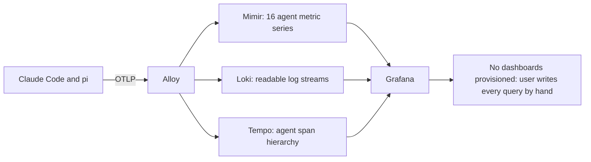
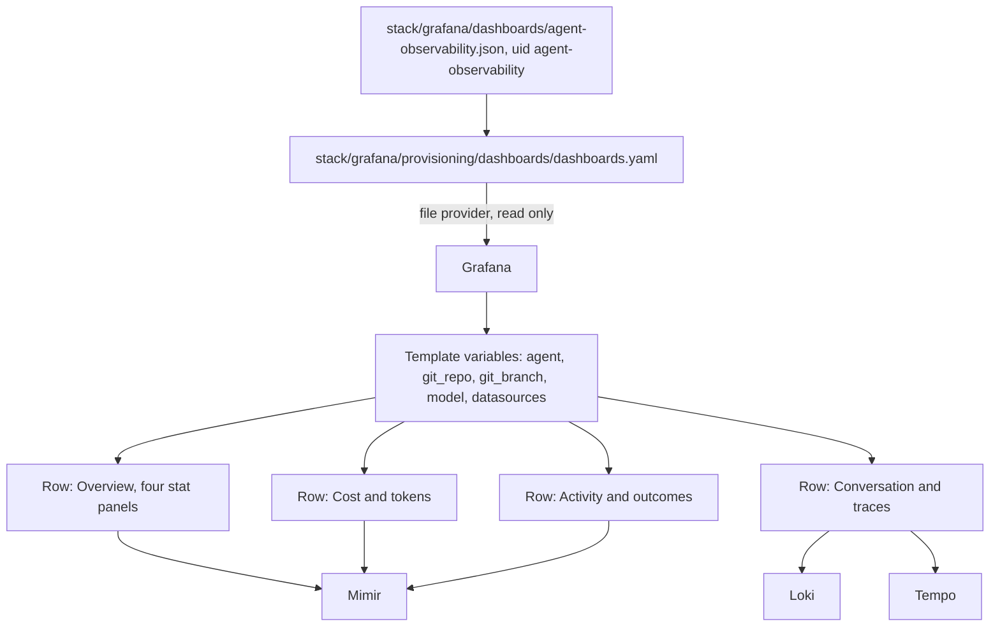
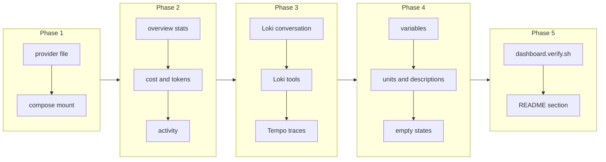

# Baseline Grafana Dashboard for Coding-Agent Telemetry

## Change Summary

The stack delivered by CR-0001 provisions three Grafana datasources and zero dashboards. A user who starts the stack, wires an agent, and opens Grafana sees an empty home page and must write PromQL, LogQL, and TraceQL by hand to see anything. This change adds one committed, provisioned dashboard that shows the core capabilities of agent telemetry the moment data arrives.

The dashboard covers all three signals: cost and token and session metrics from Mimir, the readable conversation and tool log stream from Loki, and the agent span hierarchy from Tempo. It works for Claude Code and for pi through a single agent template variable, and it slices by git repository, branch, and model.

## Motivation and Background

The value of agent telemetry is not that it is stored. It is that a person can answer questions with it: what did this week cost, which model burned the tokens, which repository, which tool failed, what was the agent actually asked to do. An empty Grafana answers none of those and puts the entire burden of query authorship on a user who has just installed the project and does not yet know the metric names.

The metric names are not guessable. The cost series is `claude_code_cost_usage_USD_total`, with an unusual uppercase segment. Token usage is broken down by a `type` label whose values include `cacheCreation`, so a naive sum over tokens double counts against a person's mental model of input and output. Sessions, commits, pull requests, lines of code, and tool decisions each have their own series. A first-time user cannot be expected to discover this. A dashboard encodes it once.

A dashboard is also the artifact that demonstrates the project. The README screenshot required by CR-0007 is a picture of this dashboard. If the dashboard is weak, the project looks weak, regardless of how good the pipeline underneath is.

## Change Drivers

* A new user sees an empty Grafana today and has no path from "the stack is running" to "I can see something".
* The metric names, the `type` label on token usage, and the differing label sets between the two agents are not discoverable without reading source.
* The project needs one visual artifact that shows what agent observability gives you, for the README and for anyone evaluating the project.
* Queries written by hand in Explore are lost when the tab closes; a committed dashboard is durable, reviewable, and improvable.

## Current State

After CR-0001, Grafana starts with Loki, Mimir, and Tempo provisioned and healthy, and with no dashboard provisioning provider at all. The `stack/grafana/provisioning/` tree contains only `datasources/datasources.yaml`.

The data that exists is known, because it was read from a running stack rather than assumed. Mimir holds these agent metric series:

| Claude Code | pi | What it counts |
|---|---|---|
| `claude_code_session_count_total` | `pi_session_count_total` | Sessions started |
| `claude_code_token_usage_tokens_total` | `pi_token_usage_tokens_total` | Tokens, split by a `type` label |
| `claude_code_cost_usage_USD_total` | `pi_cost_usage_USD_total` | Cost in United States dollars |
| `claude_code_active_time_seconds_total` | `pi_active_time_seconds_total` | Active agent time |
| `claude_code_lines_of_code_count_total` | `pi_lines_of_code_count_total` | Lines added and removed |
| `claude_code_code_edit_tool_decision_total` | `pi_code_edit_tool_decision_total` | Edit tool accept and reject decisions |
| `claude_code_commit_count_total` | `pi_commit_count_total` | Commits created |
| `claude_code_pull_request_count_total` | `pi_pull_request_count_total` | Pull requests created |

The label sets differ between the two agents, and that difference is load-bearing for dashboard design. Claude Code series carry `session_id`, `model`, `app_version`, `app_entrypoint`, `terminal_type`, `agent_name`, `query_source`, `effort`, and several user identity labels (`user_email`, `user_id`, `user_account_uuid`, `organization_id`). pi series carry `model` and the four git provenance labels but no `session_id` and no user identity labels. Both carry `job`, which is `claude-code` or `pi-coding-agent`, and both carry `git_org`, `git_repo`, `git_branch`, and `git_path`.

Loki holds log streams under `service_name` values `claude-code`, `pi-coding-agent`, and `haproxy-edge`, with the same four git labels indexed. Log bodies are already rewritten into readable one-line summaries by the Alloy transform, so a stream panel is readable without further processing.

Tempo holds spans under `resource.service.name` of `claude-code`, with span names `claude_code.llm_request`, `claude_code.tool`, `claude_code.tool.execution`, and `claude_code.tool.blocked_on_user`. The pi extension emits the parallel `pi.interaction`, `pi.llm_request`, `pi.tool`, and `pi.tool.execution` hierarchy.

### Current State Diagram



## Proposed Change

Add a dashboard provisioning provider and one committed dashboard covering all three signals.

1. **Provisioning provider.** `stack/grafana/provisioning/dashboards/dashboards.yaml` declares a file provider that loads every dashboard JSON from a read-only mounted directory, with updates from the user interface disabled so the committed file stays the source of truth. The compose file mounts `./stack/grafana/dashboards` into the container.

2. **One dashboard, stable identity.** `stack/grafana/dashboards/agent-observability.json`, titled "Coding Agent Observability", with a fixed `uid` of `agent-observability`. The fixed identifier is not cosmetic: it is what makes the deep links generated by agents under CR-0005 stable, and what makes the README screenshot in CR-0007 reproducible.

3. **Template variables, in this order.**
   * `agent`: a multi-value variable over the `job` label, so one dashboard serves Claude Code, pi, or both together. Default: both selected.
   * `git_repo`, `git_branch`: multi-value, "All" by default, so a user can narrow to one project.
   * `model`: multi-value, "All" by default.
   * `datasource_metrics`, `datasource_logs`, `datasource_traces`: datasource variables defaulting to the provisioned Mimir, Loki, and Tempo, so a user with renamed datasources is not stuck.

   Every variable except the datasource variables includes an "All" option, and every panel query filters on them, so no panel ignores the user's selection.

4. **Panel set.** Grouped into four rows, each row answering one question.

   **Row: Overview.** Four stat panels reading over the selected time range: total cost in dollars, total tokens, sessions started, and active agent time. Each is an increase over the selected range rather than a raw counter value, so the number means what a reader expects.

   **Row: Cost and tokens.** A time series of cost rate by model; a time series of token rate broken out by the `type` label, which is what makes cache creation and cache read visible as separate lines instead of being folded into one misleading total; a bar gauge of cost by git repository, which is the panel that answers "which project is expensive".

   **Row: Activity and outcomes.** A time series of lines of code added and removed; a time series of edit tool decisions split by decision, which surfaces a rejection rate; a stat pair for commits and pull requests created; a time series of session starts.

   **Row: Conversation and traces.** A Loki logs panel showing the readable conversation stream for the selected agents and repository, which is the panel that shows prompts, responses, and tool digests as text; a Loki panel filtered to tool events; and a Tempo panel showing recent agent traces so a reader can click into a span hierarchy.

5. **Correct query semantics.** Every counter panel uses an increase or rate over `$__rate_interval` rather than a bare counter, because a bare counter renders as a monotonic ramp that tells the reader nothing. Stat panels use `increase(...[$__range])` so the displayed number is "in the selected window". Cost panels format as currency in dollars; token panels format as short numbers; time panels format as seconds.

6. **Two agents, one dashboard, honestly.** Because the two agents emit differently named series, each query is written as a sum over both metric families filtered by the `agent` variable, rather than pretending one name covers both. Where a breakdown exists for one agent and not the other, the panel description states it. In particular, `session_id` exists only on Claude Code series, so no panel is allowed to depend on `session_id` for a cross-agent view; a per-session view is a Claude Code panel and says so in its description.

7. **Privacy in the panel layer.** Claude Code metrics carry user identity labels, including an email address. No panel groups by or displays a user identity label, because the dashboard is the artifact that gets screenshotted into a public README. The dashboard description states this rule so a contributor adding a panel knows why it exists.

8. **A dashboard that is honest when empty.** Every panel sets a "no data" text that names the likely cause and the fix, for example that no agent has run yet or that the selected repository has no data in this window. An empty panel that says only "No data" makes a new user think the stack is broken.

### Proposed State Diagram



## Requirements

### Functional Requirements

1. The repository **MUST** contain `stack/grafana/provisioning/dashboards/dashboards.yaml` declaring a file-based dashboard provider.
2. The compose file **MUST** mount the dashboard directory read-only into the Grafana container.
3. The provider **MUST** disable dashboard deletion and user-interface updates, so the committed JSON remains the source of truth.
4. The repository **MUST** contain exactly one dashboard JSON file at `stack/grafana/dashboards/agent-observability.json`.
5. The dashboard **MUST** carry the fixed identifier `agent-observability` and the title "Coding Agent Observability".
6. The dashboard **MUST** appear in Grafana automatically on stack start, with no import step.
7. The dashboard **MUST** provide template variables for agent, git repository, git branch, and model, each supporting multiple selection and an "All" option.
8. The dashboard **MUST** provide datasource template variables for metrics, logs, and traces, defaulting to the provisioned Mimir, Loki, and Tempo.
9. Every panel query **MUST** filter on the applicable template variables.
10. The dashboard **MUST** contain stat panels for total cost, total tokens, session count, and active time over the selected time range.
11. The dashboard **MUST** contain a token time series broken out by the `type` label.
12. The dashboard **MUST** contain a cost breakdown by git repository.
13. The dashboard **MUST** contain panels for lines of code, edit tool decisions, commits, and pull requests.
14. The dashboard **MUST** contain a Loki panel showing the readable agent log stream for the selected agents.
15. The dashboard **MUST** contain a Tempo panel showing recent agent traces.
16. Every counter-derived panel **MUST** use a rate or increase function rather than the raw counter value.
17. Cost panels **MUST** use a currency unit in United States dollars, token panels a short-number unit, and time panels a seconds unit.
18. Every query **MUST** cover both the `claude_code_*` and the `pi_*` metric families where both exist, selected through the agent variable.
19. No panel **MUST** group by, display, or filter on a user identity label, specifically `user_email`, `user_id`, `user_account_uuid`, or `organization_id`.
20. Any panel whose data exists for only one agent **MUST** state that limitation in its panel description.
21. Every panel **MUST** define a "no data" message naming the likely cause and the action that produces data.
22. The dashboard JSON **MUST** be committed in a form that Grafana loads without modification, and the repository **MUST** contain a script that validates it loads and that every panel returns either data or an explicit empty result rather than a query error.
23. The README **MUST** describe the dashboard, name its identifier, and give the direct link to it through the single published port.

### Non-Functional Requirements

1. The dashboard **MUST** load and render every panel within 5 seconds against a stack holding one month of single-user telemetry.
2. The dashboard **MUST** render correctly in both the light and the dark Grafana theme.
3. The dashboard JSON **MUST** be readable and reviewable as a text diff: stable key ordering, no embedded volatile identifiers, and no absolute machine-specific values.
4. The dashboard **MUST NOT** depend on any Grafana plugin that is not bundled with the pinned Grafana image.
5. The dashboard **MUST** function on a stack where only one of the two agents has ever run.

## Affected Components

* `stack/grafana/provisioning/dashboards/dashboards.yaml`, new.
* `stack/grafana/dashboards/agent-observability.json`, new.
* `compose.yaml`, one added read-only mount on the Grafana service.
* `scripts/dashboard.verify.sh`, new.
* `README.md`, a section describing the dashboard and linking to it.

## Scope Boundaries

### In Scope

* One dashboard covering metrics, logs, and traces for both agents.
* Dashboard provisioning as code, with user-interface edits disabled.
* Template variables for agent, repository, branch, model, and datasource.
* A verification script that proves the dashboard loads and that its queries execute.
* README text describing and linking to the dashboard.

### Out of Scope ("Here, But Not Further")

* The README screenshot of this dashboard. That is CR-0007, which owns every image.
* Alert rules, recording rules, and notification policies. A dashboard is not an alerting system, and alerting on a single-user local stack has no recipient.
* Per-user or team roll-ups, which would require the identity labels this change deliberately excludes.
* A second dashboard for MLflow or for the stack's own health. Both are reasonable later additions and neither is needed for a first release.
* Changing any metric, label, or transform in the pipeline. If a panel wants data the pipeline does not emit, that is a change request against the pipeline, not a silent edit here.
* Grafana authentication changes, anonymous access, or public dashboard sharing.

## Alternative Approaches Considered

* **Ship saved Explore queries or a documented query list instead of a dashboard.** Rejected: it leaves assembly work with the user and produces nothing to screenshot.
* **Import a community coding-agent dashboard from the Grafana catalogue.** Rejected: available dashboards assume Grafana Cloud metric naming and do not cover the pi metric family at all, so the maintenance cost of adapting one exceeds the cost of authoring one that fits.
* **Generate the dashboard at start time from a script or a Jsonnet build.** Rejected as premature: one dashboard does not justify a build step, and a generated artifact is harder for a contributor to change.
* **Split into several small dashboards, one per signal.** Rejected for a first release: a single dashboard is what demonstrates that all three signals correlate. Splitting is easy later if the single dashboard grows unwieldy.
* **Allow user-interface edits to persist back into the JSON.** Rejected: Grafana cannot write back to a read-only provisioned file, and allowing writes makes the committed file untrue.

## Impact Assessment

### User Impact

A user who starts the stack and runs one agent session opens Grafana and sees populated panels. The user can narrow to a repository or a model without writing a query. The one restriction is that the dashboard cannot be edited in place and saved, which Grafana communicates directly; a user who wants a variant saves a copy, which Grafana allows.

### Technical Impact

One added mount and one added provisioning file. No change to any storage backend, to Alloy, or to the proxy. The dashboard is coupled to the metric names and label names the agents emit, so a rename upstream breaks panels; the verification script is what catches that, and the panel descriptions record which agent each query family belongs to.

### Business Impact

This is the artifact that makes the project legible to someone evaluating it in thirty seconds. Effort is modest and confined to one file plus provisioning.

## Implementation Approach

### Phase 1: Provisioning wiring

Add the provider file and the compose mount. Confirm Grafana lists an empty provisioned folder on start, proving the wiring before any panel exists.

### Phase 2: Metric panels

Author the Overview, Cost and tokens, and Activity and outcomes rows against the real metric names and labels. Verify each query in Grafana Explore against the running stack before it is committed to the JSON, so no panel ships with a query that has never returned data.

### Phase 3: Log and trace panels

Add the Loki conversation stream, the Loki tool event panel, and the Tempo trace panel. Confirm the log panel renders the readable rewritten line rather than a bare event name, and that a trace opens into its span hierarchy.

### Phase 4: Variables, units, descriptions, and empty states

Add the template variables and wire every panel query to them. Set units. Write every panel description, including the single-agent limitations and the identity-label exclusion rule. Set the "no data" messages.

### Phase 5: Verification and documentation

Write `scripts/dashboard.verify.sh`. Add the README section. Confirm the dashboard renders in both themes and against a stack where only one agent has run.

### Implementation Flow



## Test Strategy

The deliverable is a JSON document plus provisioning, so the tests are executable assertions against the Grafana API and the datasource query APIs, driven by one script.

### Tests to Add

| Test File | Test Name | Description | Inputs | Expected Output |
|-----------|-----------|-------------|--------|-----------------|
| `scripts/dashboard.verify.sh` | `assert_dashboard_provisioned` | Asserts the dashboard is present by identifier after stack start | Grafana search API | Exit 0; one dashboard with uid `agent-observability` |
| `scripts/dashboard.verify.sh` | `assert_dashboard_readonly` | Asserts the dashboard is provisioned and not user-editable | Grafana dashboard API metadata | Exit 0; provisioned flag set |
| `scripts/dashboard.verify.sh` | `assert_panel_queries_execute` | Runs every panel target against its datasource and asserts no query error | Dashboard JSON, datasource query APIs | Exit 0; zero query errors |
| `scripts/dashboard.verify.sh` | `assert_no_identity_labels` | Greps the dashboard JSON for identity label names | Dashboard JSON | Exit 0; zero matches |
| `scripts/dashboard.verify.sh` | `assert_counters_use_rate` | Asserts every metric target uses `rate`, `increase`, or an equivalent function | Dashboard JSON | Exit 0; zero bare counter targets |
| `scripts/dashboard.verify.sh` | `assert_variables_present` | Asserts the agent, repository, branch, model, and datasource variables exist | Dashboard JSON | Exit 0; all present |
| `scripts/dashboard.verify.sh` | `assert_panel_descriptions` | Asserts every panel has a non-empty description and a no-data message | Dashboard JSON | Exit 0; zero panels missing either |

### Tests to Modify

| Test File | Test Name | Current Behavior | New Behavior | Reason for Change |
|-----------|-----------|------------------|--------------|-------------------|
| `scripts/stack.verify.sh` | `assert_datasources_healthy` | Asserts three datasources are healthy | Also asserts the provisioned dashboard is present | The dashboard becomes part of what "the stack is correctly provisioned" means |

### Tests to Remove

Not applicable.

## Acceptance Criteria

### AC-1: The dashboard appears automatically (covers FR1, FR2, FR3, FR4, FR5, FR6)

```gherkin
Given a fresh clone with no prior Grafana volume
When the user runs "docker compose up -d" and opens Grafana
Then a dashboard titled "Coding Agent Observability" with the identifier agent-observability is listed
  And no import step was performed
```

### AC-2: The dashboard is provisioned read-only (covers FR3)

```gherkin
Given the dashboard is open in Grafana
When the user edits a panel and attempts to save
Then Grafana reports the dashboard is provisioned and cannot be saved in place
  And the committed JSON is unchanged
```

### AC-3: Panels populate after a single agent session (covers FR10, FR11, FR13, FR14, FR15)

```gherkin
Given the stack is running and telemetry is wired for one agent
When the user runs one non-interactive agent session and waits 30 seconds
Then the overview stat panels show non-zero cost, tokens, and session count
  And the token panel shows at least one series broken out by type
  And the log panel shows the prompt and the response as readable lines
```

### AC-4: One dashboard serves both agents (covers FR7, FR18, NFR5)

```gherkin
Given telemetry exists for Claude Code and for pi
When the user selects only pi in the agent variable
Then every metric panel shows pi data only
  And when the user selects both agents
  Then panels show both, distinguished by series
  And on a stack where only one agent has ever run, no panel reports a query error
```

### AC-5: Counters are rendered as rates or increases (covers FR16)

```gherkin
Given any panel derived from a counter metric
When its query is inspected
Then it applies a rate or increase function over an interval or the selected range
  And no panel plots a raw monotonic counter
```

### AC-6: Units are correct (covers FR17)

```gherkin
Given the cost, token, and time panels
When they render a value
Then cost is formatted as United States dollars
  And tokens are formatted as a short number
  And time is formatted in seconds
```

### AC-7: No identity data is displayed (covers FR19, and the public screenshot requirement of CR-0007)

```gherkin
Given the dashboard JSON
When it is searched for user_email, user_id, user_account_uuid, and organization_id
Then zero matches are found
  And no rendered panel displays an email address or a user identifier
```

### AC-8: Single-agent limitations are stated (covers FR20)

```gherkin
Given a panel whose underlying data exists for only one agent
When a user reads its description
Then the description names the agent the panel applies to and why
```

### AC-9: Empty states are actionable (covers FR21)

```gherkin
Given a stack that has ingested no agent telemetry
When the user opens the dashboard
Then each panel shows a message naming the likely cause and the action that produces data
  And no panel shows only the word "No data"
```

### AC-10: Template variables drive every query (covers FR9)

```gherkin
Given the dashboard with a specific git repository selected
When any panel is inspected
Then its query filters on the selected repository
  And changing the selection changes the panel result
```

### AC-11: The verification script proves the dashboard (covers FR22)

```gherkin
Given the stack is running
When the user runs scripts/dashboard.verify.sh
Then it exits 0 and reports each assertion as passed
  And when a panel target is given an invalid query and the script is re-run
  Then it exits non-zero and names the failing panel
```

### AC-12: The dashboard is documented (covers FR23)

```gherkin
Given the README
When a user looks for the dashboard
Then the README names it, states its identifier, and gives the direct link through the published port
```

### AC-13: The dashboard renders in both themes and loads promptly (covers NFR1, NFR2)

```gherkin
Given a stack holding one month of single-user telemetry
When the dashboard is opened in the dark theme and then the light theme
Then every panel renders legibly in both
  And the dashboard completes its initial load within 5 seconds
```

### AC-14: No unbundled plugin is required (covers NFR4)

```gherkin
Given the pinned Grafana image with no plugins installed
When the dashboard is loaded
Then every panel renders using a bundled panel type
  And Grafana reports no missing panel plugin
```

## Quality Standards Compliance

### Build & Compilation

- [ ] The dashboard JSON parses as valid JSON
- [ ] `docker compose config` parses the added mount without error
- [ ] Grafana logs contain no provisioning error at start

### Linting & Code Style

- [ ] The dashboard JSON is formatted with stable key ordering and a consistent indent
- [ ] `shellcheck` passes with zero warnings on `scripts/dashboard.verify.sh`
- [ ] The provider YAML parses cleanly and carries a purpose comment and one `@agents-index` line

### Test Execution

- [ ] `scripts/dashboard.verify.sh` exits 0 against a stack with telemetry
- [ ] `scripts/dashboard.verify.sh` exits 0 against a stack where only one agent has run
- [ ] `scripts/stack.verify.sh` still exits 0

### Documentation

- [ ] Every panel has a description
- [ ] The README section describing the dashboard is present
- [ ] The dashboard description records the identity-label exclusion rule for future contributors

### Code Review

- [ ] Changes submitted via pull request
- [ ] PR title follows Conventional Commits format
- [ ] Code review completed and approved
- [ ] Changes squash-merged to maintain linear history

### Verification Commands

```bash
# JSON validity
jq empty stack/grafana/dashboards/agent-observability.json

# Provisioned and present
curl -s -u admin:admin "http://localhost:${EDGE_PORT:-24317}/api/search?query=Coding%20Agent%20Observability" | jq '.[].uid'

# Full dashboard verification
./scripts/dashboard.verify.sh

# No identity labels anywhere in the dashboard
grep -n "user_email\|user_id\|user_account_uuid\|organization_id" stack/grafana/dashboards/agent-observability.json ; test $? -eq 1

# The metric families the panels rely on actually exist
curl -sG "http://localhost:${EDGE_PORT:-24317}/prometheus/api/v1/label/__name__/values" \
  | jq -r '.data[]' | grep -E '^(claude_code|pi)_'

# Script lint
shellcheck scripts/dashboard.verify.sh
```

## Risks and Mitigation

### Risk 1: An agent renames a metric or a label upstream

**Likelihood:** medium over time
**Impact:** medium; affected panels go empty without an error
**Mitigation:** `scripts/dashboard.verify.sh` asserts each panel target returns data or an explicit empty result rather than an error, and the verification commands include a listing of the metric families, so a rename is visible in one command. Panel descriptions name the metric family they depend on.

### Risk 2: The dashboard reveals prompt content in a screenshot

**Likelihood:** medium, because the conversation panel exists precisely to show content
**Impact:** high if a real prompt reaches a public README
**Mitigation:** The identity labels are excluded structurally. For content, CR-0007 owns the screenshot and is required to capture it from a purpose-made session rather than from the author's real history. This change states the constraint in the dashboard description so the rule is visible where the panel is edited.

### Risk 3: Panels perform poorly as data grows

**Likelihood:** low for single-user local data
**Impact:** medium
**Mitigation:** Rate functions use `$__rate_interval` rather than a fixed short interval, stat panels aggregate over the selected range rather than a long fixed window, and the default time range is short. The acceptance criterion fixes a 5-second load budget against a month of data.

### Risk 4: Users expect editable panels

**Likelihood:** medium
**Impact:** low
**Mitigation:** The README states that the dashboard is provisioned from a file, that saving in place is refused by design, and that "Save as" produces an editable copy.

### Risk 5: The two agents diverge further, making a single dashboard dishonest

**Likelihood:** medium over time
**Impact:** medium
**Mitigation:** Panels that apply to one agent say so in their description rather than silently showing half the picture. If divergence grows past what descriptions can carry, splitting into per-agent rows is a small follow-up change.

## Dependencies

* CR-0001 must be implemented first: this change adds a mount to its compose file and a directory under its `stack/` tree.
* Telemetry from at least one agent is needed to verify populated panels, which in practice means either CR-0006's installation path or a manual wiring of one agent.
* No dependency on CR-0003, CR-0004, or CR-0005.

## Estimated Effort

Roughly 10 to 14 person-hours: 1 for provisioning wiring, 6 for authoring and verifying panels against live data, 2 for variables, units, descriptions, and empty states, 3 for the verification script and documentation.

## Decision Outcome

Chosen approach: "one provisioned, read-only, template-variable-driven dashboard covering all three signals for both agents", because a single dashboard is what proves the signals correlate, and because provisioning as code keeps the committed file true. Excluding identity labels at the panel layer is chosen deliberately over redacting later, since the dashboard is the artifact most likely to be screenshotted and shared.

## Related Items

* CR-0001: the stack this dashboard is provisioned into.
* CR-0003: the pi extension that produces the `pi_*` metric family the dashboard reads.
* CR-0005: agent-generated deep links, which depend on the fixed dashboard identifier established here.
* CR-0007: the README screenshot of this dashboard.
