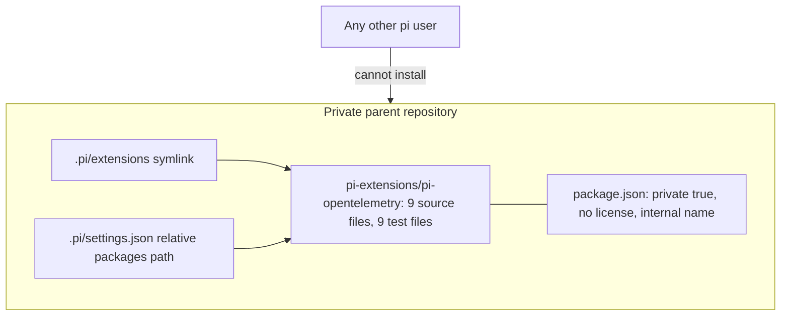
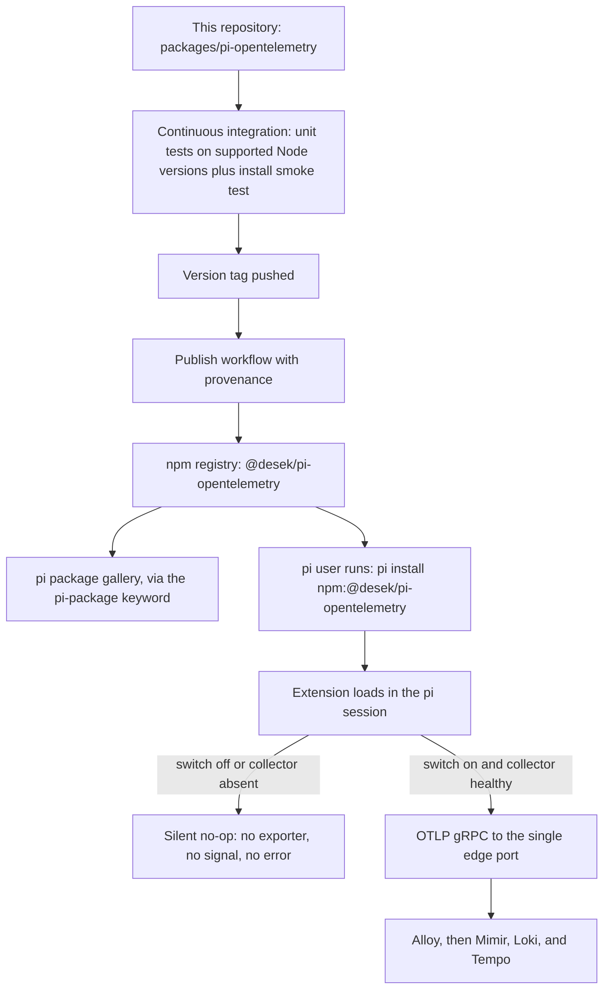
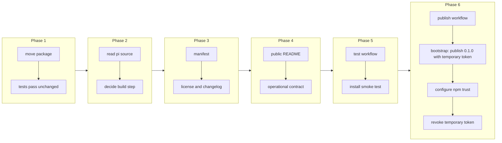

# Production-Ready pi OpenTelemetry Extension Package

## Change Summary

pi has no built-in OpenTelemetry export. An extension that closes that gap already exists, emits all three signals at parity with Claude Code's built-in telemetry, and has unit tests, but it lives as a private, unpublishable directory inside a private repository: it is marked private, carries no license, has no version discipline, has no continuous integration, and its documentation refers to files and governance documents nobody outside can see.

This change moves that extension into this repository as `packages/pi-opentelemetry/`, published to npm as `@desek/pi-opentelemetry` under Apache-2.0, discoverable in the pi package gallery through the `pi-package` keyword, and installable by any pi user with a single `pi install` command.

## Motivation and Background

This project claims to be the observability stack for coding agents, plural. Half of that claim depends on the pi extension. Without it, pi users can start the stack and see nothing, because pi emits no telemetry on its own. The extension belongs in this repository for the same reason the dashboard does: it is part of the product, not a neighbouring experiment.

Publishing it, rather than merely including it, matters because of how pi resolves extensions. A pi user installs packages by npm specifier, git specifier, or local path. A local path means the user must clone this repository and keep the clone at a stable location forever. An npm specifier means `pi install npm:@desek/pi-opentelemetry` and nothing else. The second is the difference between a project people try and a project people adopt.

The extension is also the piece with the most exposure. Configuration files fail loudly; a telemetry extension that misbehaves can slow an agent, crash a session, or, worst of all, quietly export prompt content from a machine whose owner did not intend it. Production readiness here means specific things: the extension does nothing unless it is switched on, it degrades to silence rather than to an error when the collector is absent, it never blocks the agent, and every content-logging field is opt-in.

## Change Drivers

* pi users cannot use this stack at all without the extension, so its absence blocks half the product.
* A private, unlicensed, unpublished package cannot be installed by anyone but its author.
* Installation by local path forces every user to clone and pin a directory; installation by npm specifier is one command.
* The extension runs inside every pi session, so its failure modes need to be designed and tested rather than discovered.
* A published package needs the things a private directory never needed: a license, semantic versioning, a changelog, continuous integration, and documentation written for a stranger.

## Current State

The extension is a directory of roughly 2,650 lines of TypeScript, half of it tests, organised one concern per file: environment configuration, git provenance derivation, collector health probing, standard attribute construction, provider setup, and three emitters for metrics, log events, and traces. Every source file has a sibling test file, and tests run with the Node built-in test runner and type stripping, with no build step and no test framework dependency.

Functionally it is complete. It emits eight metric instruments under the `pi.` namespace, the log event family that mirrors Claude Code's, and a span hierarchy of interaction, model request, tool, and tool execution. It honours the same content-logging and cardinality flags Claude Code uses, stamps git provenance, and exports over OTLP gRPC to the stack's single port by default. It is a hard no-op unless its master switch is truthy, and when neither the switch nor an endpoint is set it probes collector health and stays silent if the collector is absent.

What blocks publication:

* `package.json` sets `private: true`, carries an internal name, declares no license, no repository, no keywords, no files list, and no publish configuration.
* There is no license file, no changelog, and no version history; the version has never moved off its initial value.
* The README is written for a reader who has the private repository open. It references a governance identifier, a parent-repository settings file, a link script, and an environment file by a path that will not exist.
* There is no continuous integration: tests run only when someone remembers to run them.
* The package is loaded by a committed symlink and by a relative path in a private settings file, neither of which survives publication.
* The manifest points at TypeScript source, which works for a local path under pi's type stripping but has not been proven to work for a package installed from npm.

### Current State Diagram



## Proposed Change

Move the extension into this repository and make it a first-class published package.

1. **Location and identity.** The package lives at `packages/pi-opentelemetry/`, keeping its one-concern-per-file layout and its sibling test files unchanged. It is published as `@desek/pi-opentelemetry`. The scope makes ownership explicit and avoids a name collision in the unscoped namespace.

2. **A publishable manifest.** `package.json` drops `private`, sets the scoped name, an initial version of `0.1.0`, `license: "Apache-2.0"`, a description written for a stranger, `repository`, `homepage`, and `bugs` pointing at this repository, an explicit `files` list so only source, manifest, license, and README are published, `publishConfig` with public access because a scoped package defaults to restricted, an `engines` range naming the supported Node versions, and the `keywords` array containing `pi-package` so the package appears in the pi package gallery.

3. **The pi manifest entry, verified rather than assumed.** The `pi` key declares the extension entry point. The current entry is a TypeScript file, which pi loads under type stripping when the package is a local path. Whether that holds for a package installed from npm is a question that **MUST** be answered against pi's own source before publication rather than assumed from local behaviour. Two outcomes are acceptable, and the implementer chooses based on what the source says: either the manifest keeps pointing at TypeScript source, or the package gains a build step that emits JavaScript with type declarations and the manifest points at the built entry. If a build step is introduced, the published `files` list ships the build output and the source map, and the test command continues to run against the source.

4. **Dependency policy for a shared runtime.** The OpenTelemetry API package is moved to a peer dependency with a permissive range, because two copies of the API package in one process silently break instrumentation registration. The software development kit and exporter packages stay as ordinary dependencies with ranges that admit patch updates, so a security fix does not require a release of this package. The lockfile is committed so continuous integration builds against a known set, while consumers resolve within the declared ranges.

5. **Public documentation.** The README is rewritten for a reader who has never seen this repository: what the extension does, what it emits, how to install it with one command, what to set to turn it on, what every configuration variable does and defaults to, what content each logging flag records, the privacy consequence of enabling them, how to verify it works, and what to check when it appears to do nothing. Every reference to a governance identifier, a private path, or a link script is removed. The signal inventory tables are kept, because they are the reference a user needs and cannot obtain elsewhere.

6. **Safe defaults, stated as a contract.** The README and the tests together state the extension's operational contract:
   * It emits nothing unless its master switch is truthy, or unless it is enabled by the health-gated dynamic default.
   * With neither the switch nor an endpoint set, it probes the collector and stays silent when the collector is absent, so installing it on a machine without this stack costs nothing.
   * Every content-logging flag defaults to off, so prompts, responses, tool content, and raw request bodies are never exported unless the user opts in explicitly.
   * An export failure, an unreachable collector, or a malformed configuration **MUST NOT** raise into the agent, block a turn, or change agent behaviour in any way.

7. **Versioning and changelog.** The package follows semantic versioning. A `CHANGELOG.md` records every release under a dated heading. The version in the manifest is the single source of truth, and the publish workflow refuses to publish a version that is already on the registry.

8. **Continuous integration and publication.** A workflow runs the existing unit tests on every supported Node version on every push and pull request, and additionally runs an installation smoke test that packs the package, installs the tarball into a temporary directory, and asserts that the entry point loads and that the manifest resolves. A second workflow publishes to npm when a version tag is pushed. It publishes through trusted publishing with OpenID Connect. The workflow claims a short-lived identity token, so npm attaches provenance automatically and no long-lived token is stored in the repository. Consumers can verify the package was built from this repository.

9. **Gallery presentation.** The package carries the optional gallery metadata the pi package documentation supports, so the entry in the gallery shows a preview rather than a bare name.

10. **Wiring in this repository.** This repository documents both ways to use the extension: `pi install npm:@desek/pi-opentelemetry` for a normal user, and a local-path reference for someone developing the extension itself. The stack's `agents/pi-otel.env` file remains the shared, non-secret flag set a user sources, and the README explains the relationship between that file and the extension's own defaults.

### Proposed State Diagram



## Requirements

### Functional Requirements

1. The extension source **MUST** live at `packages/pi-opentelemetry/` in this repository, preserving one concern per file and a sibling test file per source file.
2. The package **MUST** be named `@desek/pi-opentelemetry`.
3. The package manifest **MUST NOT** set `private`.
4. The package **MUST** declare `license: "Apache-2.0"` and **MUST** ship a license file.
5. The package **MUST** declare `repository`, `homepage`, and `bugs` fields pointing at this repository.
6. The package **MUST** include `pi-package` in its `keywords` array.
7. The package **MUST** declare `publishConfig` with public access.
8. The package **MUST** declare an explicit `files` list so that no test file, no development configuration, and no lockfile is published.
9. The package **MUST** declare an `engines` field naming the supported Node versions, and continuous integration **MUST** test every version named there.
10. The `pi` manifest key **MUST** point at an entry point that is proven to load when the package is installed from a registry tarball, and the proof **MUST** be an automated test rather than a manual check.
11. The OpenTelemetry API package **MUST** be declared as a peer dependency, not as an ordinary dependency.
12. The extension **MUST** emit no signal and initialise no exporter when its master switch is set to a false value.
13. The extension **MUST** stay silent, without raising and without logging an error at any level above debug, when no collector is reachable.
14. Every content-logging flag **MUST** default to off, so that prompt, response, tool content, and raw request body content is exported only after an explicit opt-in.
15. The extension **MUST NOT** propagate any exception into the agent, and **MUST NOT** block or delay a turn on export.
16. The package **MUST** ship a README written without reference to any private repository, private path, or governance identifier.
17. The README **MUST** document every configuration variable with its default, its effect, and, for each content flag, exactly what content it records.
18. The README **MUST** document a verification procedure a user can run to confirm the extension is exporting.
19. The README **MUST** document what to check when the extension appears to emit nothing, naming each cause and its fix.
20. The package **MUST** ship a `CHANGELOG.md` recording each released version under a dated heading.
21. The repository **MUST** contain a continuous integration workflow that runs the unit tests on every supported Node version on every push and pull request.
22. The continuous integration workflow **MUST** include an installation smoke test that packs the package, installs the tarball into a clean directory, and asserts the declared entry point loads.
23. The repository **MUST** contain a publish workflow triggered by a version tag that publishes to npm through trusted publishing with OpenID Connect, so that npm attaches provenance automatically.
24. The publish workflow **MUST** fail rather than publish when the manifest version already exists on the registry.
25. The version in the manifest, the top entry in the changelog, and the version tag **MUST** agree, and the publish workflow **MUST** verify this.
26. This repository's documentation **MUST** state both installation paths: the registry specifier for users, and the local path for contributors developing the extension.
27. The publish workflow **MUST** declare the `id-token: write` permission, because trusted publishing signs the provenance with the workflow identity token.
28. The publish workflow **MUST** run npm at or above version 11.5.1 and Node at or above version 22.14.0, which trusted publishing with provenance needs.
29. The repository **MUST NOT** store a long-lived npm token as a repository secret.
30. The trust relationship **MUST** be created with the `npm trust github` command that names the publish workflow file and the `desek/agent-observability` repository.
31. The repository **MUST** document the four-step bootstrap sequence: implement the package, publish the first version with a temporary granular access token, configure trust with `npm trust github`, then revoke that token.

### Non-Functional Requirements

1. The extension **MUST** add no more than 100 milliseconds to pi startup when telemetry is enabled and the collector is healthy.
2. The extension **MUST** add no measurable latency to a turn when the collector is unreachable.
3. The package **MUST NOT** require a native compilation step at install time.
4. The published tarball **MUST NOT** contain any test file, any lockfile, or any file referencing this repository's stack configuration.
5. Unit tests **MUST** run without a network connection and without a running stack.
6. The package **MUST** function on a machine where this observability stack is not installed, by staying silent.

## Affected Components

* `packages/pi-opentelemetry/`, the whole package: source, tests, manifest, lockfile, README, changelog, license.
* `.github/workflows/`, two new workflows for continuous integration and publication.
* `README.md` at the repository root, a section covering pi installation.
* `agents/pi-otel.env`, whose documentation is updated to describe its relationship with the published package.

## Scope Boundaries

### In Scope

* Moving the extension into this repository and preserving its structure and tests.
* Every manifest, licensing, versioning, and documentation change that publication requires.
* Determining, against pi's own source, whether a build step is required, and adding one if it is.
* Continuous integration, the installation smoke test, and the tagged publish workflow.
* The public README and the changelog.

### Out of Scope ("Here, But Not Further")

* Adding, removing, or renaming any emitted metric, log event, span, or attribute. Publication is not the moment to change the signal contract.
* Achieving parity with any Claude Code telemetry field that the extension does not already cover.
* Creating the npm account and enabling two-factor authentication on it. These are the account owner's prerequisites and are not implementation work. The `@desek` scope already exists, because npm grants a scope that matches every account name at sign-up, so no organisation is created. See Dependencies and Risks.
* Publishing any other package from this repository.
* A pi extension for MLflow conversation tracking. That question belongs with CR-0004.
* Automatically installing the extension into the user's pi configuration. That is CR-0006's installation path.
* Instrumenting any coding agent other than pi.

## Alternative Approaches Considered

* **Publish unscoped as `pi-opentelemetry`.** Rejected: the unscoped namespace is first-come and offers no ownership signal. The scope was chosen deliberately. It needs no organisation, because npm grants the `@desek` scope to the account at sign-up. `npm whoami` returns `desek`, and the registry returns HTTP 404 for `@desek/pi-opentelemetry`, so the scope and the name are both free.
* **Publish with a long-lived npm token held as a repository secret.** Rejected: a stored token is a standing credential that can leak and does not attach provenance. Trusted publishing with OpenID Connect wins, because the workflow claims a short-lived identity token at run time, npm attaches provenance automatically, and no credential is stored in the repository. The one cost is a bootstrap: the trust relationship cannot exist before the package exists, so the first version is published once with a temporary token that is revoked straight after.
* **Distribute by git specifier only.** Rejected as the primary path: it works and needs no registry, but it pins users to a branch or tag of a repository and gives no version resolution, no provenance, and no gallery presence. It remains documented as a fallback.
* **Keep the extension in the private parent and publish from there.** Rejected: the extension is part of this product, and publishing from a private repository makes provenance meaningless and contribution impossible.
* **Bundle the extension into the stack rather than publishing it.** Rejected: pi loads extensions from packages, not from a running container. There is no bundling path that a pi user can consume.
* **Ship compiled JavaScript unconditionally.** Deferred to the source check rather than decided in advance. Adding a build step that pi does not need would cost every contributor a build for no gain; omitting one that pi does need would ship a package that fails on install. The question has an answer in pi's source, and the implementer is required to read it.
* **Vendor the OpenTelemetry software development kit to avoid dependency drift.** Rejected: it multiplies package size, forfeits security updates, and increases the chance of a duplicate API package in the process.

## Impact Assessment

### User Impact

A pi user installs one package and gets full telemetry. A user without this stack installs the same package and experiences nothing: no error, no latency, no export. A user who opts into content logging must be told plainly what that stores and where, which the README does.

### Technical Impact

The package gains a public interface it did not have: its name, its manifest shape, its configuration variable names, and its emitted signal names all become things other people depend on. Changing any of them afterwards is a breaking change under semantic versioning. That is the cost of publication and the reason the signal contract is explicitly out of scope for this change.

Moving the API package to a peer dependency changes installation behaviour for anyone who consumed the package by local path, since the peer must now resolve in the host project. Continuous integration's installation smoke test is what catches a mistake here before a user does.

Publication stores no long-lived credential in the repository after the bootstrap. The publish workflow uses trusted publishing with a short-lived identity token. The single temporary token used for the first publish is revoked straight after the trust relationship is set. From that point, every publish runs from the workflow with provenance attached automatically.

### Business Impact

Publication is what makes the pi half of this project real. The cost is a maintenance obligation: a published package accrues issues, and a package with the `pi-package` keyword is visible in a gallery where a broken package is visible too. The engineering cost of the change itself is moderate; the ongoing cost is small but not zero.

## Implementation Approach

### Phase 1: Move and preserve

Copy the package into `packages/pi-opentelemetry/`, unchanged in structure. Run the existing unit tests and confirm they pass before anything else changes, so any later failure is attributable to a later phase.

### Phase 2: Resolve the entry-point question

Read pi's own source to determine how it resolves and loads a package's declared extension entry when the package is installed from a registry tarball, specifically whether TypeScript source is loaded under type stripping in that path. Record the finding and the pi version it was verified against. Add a build step only if the finding requires one, and if a build step is added, keep the test command pointed at the source.

### Phase 3: Publishable manifest and licensing

Rewrite `package.json` with the scoped name, version, license, description, repository, homepage, bugs, keywords, files, publish configuration, and engines. Move the OpenTelemetry API package to peer dependencies. Add the license file and the changelog with its first entry.

### Phase 4: Public documentation

Rewrite the README for an external reader: purpose, install, enable, configure, signal inventory, verify, troubleshoot, privacy. Remove every private reference. Add the operational contract as an explicit section, because it is what a reader needs to trust the package.

### Phase 5: Continuous integration and the smoke test

Add the test workflow across the supported Node versions. Add the installation smoke test that packs, installs into a clean directory, and loads the declared entry point. This is the test that proves the decision made in Phase 2 was correct.

### Phase 6: Publication and the bootstrap sequence

Add the tag-triggered publish workflow. The workflow publishes through trusted publishing with OpenID Connect, declares `id-token: write`, and runs npm at or above 11.5.1 and Node at or above 22.14.0. Add the version agreement check and the already-published guard.

The trust relationship cannot exist before the package exists. Run the four-step bootstrap in order:

1. Complete the package. This is the work of the earlier phases.
2. The account owner publishes `0.1.0` from a developer machine with a temporary granular access token. The command is `npm publish --access public`. This first publish is unsigned, because provenance needs a continuous integration identity token. The token value is never passed on the command line and never passed as an environment-variable prefix, because a shell error can print the whole argument and leak it. The account owner supplies the token through an `.npmrc` file that holds the literal text `//registry.npmjs.org/:_authToken=${NPM_TOKEN}` and reads the value from the environment. This repository already has such an `.npmrc`, and `.gitignore` lists it.
3. The account owner runs `npm trust github @desek/pi-opentelemetry --file publish.yml --repo desek/agent-observability`. This command is run interactively by the account owner, never by the workflow, because two-factor authentication is required and granular tokens with the bypass-two-factor option are not supported for trust commands. The account has two-factor authentication enabled.
4. The account owner revokes the temporary granular access token. The token exists for exactly one publish and is not stored as a repository secret.

Every later publish then runs from the workflow with provenance attached automatically. Confirm the gallery lists the package and that a clean machine can install and run it.

### Implementation Flow



## Test Strategy

The package already has a unit test per source file. This change preserves those and adds the tests that publication specifically requires: the package must install, load, and stay harmless.

### Tests to Add

| Test File | Test Name | Description | Inputs | Expected Output |
|-----------|-----------|-------------|--------|-----------------|
| `packages/pi-opentelemetry/src/package.manifest.test.ts` | `manifest declares publishable fields` | Asserts name, license, repository, keywords including `pi-package`, files, publishConfig, and engines are present and correct | `package.json` | All assertions pass |
| `packages/pi-opentelemetry/src/package.manifest.test.ts` | `manifest entry point exists on disk` | Asserts the path in the `pi` manifest resolves to a file that is in the published `files` list | `package.json` | Assertion passes |
| `packages/pi-opentelemetry/src/package.manifest.test.ts` | `api package is a peer dependency` | Asserts the OpenTelemetry API package is declared as a peer and not as an ordinary dependency | `package.json` | Assertion passes |
| `packages/pi-opentelemetry/src/package.manifest.test.ts` | `version agrees with changelog` | Asserts the manifest version equals the newest changelog heading | `package.json`, `CHANGELOG.md` | Assertion passes |
| `scripts/pi-package.smoke.sh` | `pack install and load` | Packs the package, installs the tarball into a clean temporary directory, and loads the declared entry point | Repository working tree | Exit 0; entry point loads |
| `scripts/pi-package.smoke.sh` | `tarball excludes tests and lockfile` | Asserts the packed tarball contains no test file and no lockfile | Packed tarball | Exit 0; zero matches |
| `packages/pi-opentelemetry/src/index.test.ts` | `no-op when master switch is false` | Asserts no exporter is constructed and no signal is emitted when the switch is false | Environment with the switch set false | No exporter constructed |
| `packages/pi-opentelemetry/src/index.test.ts` | `silent when collector is unreachable` | Asserts no exception escapes and nothing above debug is logged when export fails | Unreachable endpoint | No throw; no error log |
| `packages/pi-opentelemetry/src/index.test.ts` | `content flags default to off` | Asserts prompt, response, tool content, and raw body content are absent when no content flag is set | Environment with no content flags | No content attributes present |
| `packages/pi-opentelemetry/src/index.test.ts` | `emitter failure never reaches the agent` | Asserts a thrown error inside an emitter is contained | Emitter stubbed to throw | No throw escapes the extension |

### Tests to Modify

| Test File | Test Name | Current Behavior | New Behavior | Reason for Change |
|-----------|-----------|------------------|--------------|-------------------|
| `packages/pi-opentelemetry/src/config.env.test.ts` | endpoint default cases | Asserts the default endpoint against the stack's port as a literal | Asserts against the exported default constant | The port is configurable in this repository, so the test must assert the contract rather than a hard-coded number |
| `packages/pi-opentelemetry/src/health.alloy.test.ts` | health probe path cases | Asserts the probe URL as a literal | Asserts against the exported default constant | Same reason |

### Tests to Remove

| Test File | Test Name | Reason for Removal |
|-----------|-----------|-------------------|
| Any test asserting the private parent's loading mechanism | symlink and relative-path loading assertions | The symlink and the private settings path do not exist in this repository and are replaced by the registry installation path |

## Acceptance Criteria

### AC-1: The package is publishable (covers FR2, FR3, FR4, FR5, FR6, FR7, FR8, FR9)

```gherkin
Given the package manifest
When it is inspected
Then the name is @desek/pi-opentelemetry
  And private is absent
  And the license is Apache-2.0 and a license file is present
  And repository, homepage, and bugs point at this repository
  And keywords contain pi-package
  And publishConfig declares public access
  And files and engines are declared
```

### AC-2: A registry install loads the extension (covers FR10, FR22)

```gherkin
Given the package is packed into a tarball
When the tarball is installed into a clean temporary directory
  And the entry point declared in the pi manifest is loaded
Then the load succeeds with no error
  And the smoke test exits 0
```

### AC-3: The tarball ships only what it should (covers FR8, NFR4)

```gherkin
Given the packed tarball
When its contents are listed
Then no test file is present
  And no lockfile is present
  And the README, the license, the manifest, and the entry point are present
```

### AC-4: The extension is a no-op when switched off (covers FR12)

```gherkin
Given a pi session with the master switch set to a false value
When the session runs a turn
Then no exporter is constructed
  And no OTLP request is made
```

### AC-5: The extension is silent without a collector (covers FR13, NFR2, NFR6)

```gherkin
Given a machine where this stack is not running
  And neither the master switch nor an endpoint is set
When a pi session runs a turn
Then the session completes normally
  And no error is surfaced to the user
  And no measurable latency is added to the turn
```

### AC-6: Content logging is opt-in (covers FR14)

```gherkin
Given a pi session with telemetry enabled and no content flag set
When the session runs a turn
Then no exported signal carries prompt, response, tool content, or raw request body content
  And when a content flag is set explicitly
  Then the corresponding content appears
```

### AC-7: The extension never breaks the agent (covers FR15, NFR1)

```gherkin
Given a pi session with telemetry enabled
When an emitter raises an exception or the collector rejects an export
Then the turn completes normally
  And no exception reaches the agent
  And startup overhead stays under 100 milliseconds
```

### AC-8: The documentation serves a stranger (covers FR16, FR17, FR18, FR19)

```gherkin
Given the package README
When a reader who has never seen this repository reads it
Then it states what the extension emits, how to install it in one command, and how to enable it
  And every configuration variable is listed with its default and effect
  And each content flag states exactly what content it records and where that content is stored
  And a verification procedure and a troubleshooting list are present
  And no private path and no governance identifier appears
```

### AC-9: Continuous integration runs on every supported Node version (covers FR9, FR21, NFR5)

```gherkin
Given a push or a pull request
When the continuous integration workflow runs
Then the unit tests run on every Node version named in engines
  And the tests pass without a network connection and without a running stack
```

### AC-10: Publication is gated and verifiable (covers FR23, FR24, FR25, FR27, FR28, FR29)

```gherkin
Given a version tag is pushed
When the publish workflow runs
Then it publishes through trusted publishing with OpenID Connect
  And it declares the id-token write permission
  And it runs npm at or above 11.5.1 and Node at or above 22.14.0
  And it verifies that the manifest version, the newest changelog entry, and the tag agree
  And it refuses to publish when that version already exists on the registry
  And on success npm attaches provenance automatically
  And no long-lived npm token is stored as a repository secret
```

### AC-11: A pi user can install and use it in one command (covers FR26)

```gherkin
Given a machine with pi installed and this stack running
When the user runs pi install with the registry specifier and enables telemetry
  And then runs one non-interactive pi turn
Then pi metrics, log events, and traces are queryable in the stack within 30 seconds
```

### AC-12: The package appears in the gallery (covers FR6)

```gherkin
Given the package is published with the pi-package keyword
When the pi package gallery is searched
Then the package is listed with its description
```

### AC-13: No native build at install time (covers NFR3)

```gherkin
Given a clean machine with no compiler toolchain
When the package is installed
Then installation succeeds with no compilation step
```

### AC-14: The bootstrap sequence is documented (covers FR30, FR31)

```gherkin
Given the repository documentation
When a reader looks for how the first publish and the trust relationship are set up
Then it states the four-step bootstrap: implement, publish 0.1.0 with a temporary token, run npm trust github, revoke the token
  And it shows the npm trust github command naming the workflow file and the desek/agent-observability repository
  And it states that the temporary token is not stored as a repository secret
```

### AC-15: The personal scope needs no organisation (covers FR2)

```gherkin
Given the account owner is signed in to npm
When npm whoami is run
Then it returns desek
  And the @desek scope is the account's personal scope
  And no npm organisation is created for publication
```

## Quality Standards Compliance

### Build & Compilation

- [ ] The package installs cleanly from a packed tarball
- [ ] If a build step is introduced, it completes without error and its output is what the manifest points at
- [ ] No compiler warning is introduced

### Linting & Code Style

- [ ] Every source file retains its top docstring and one `@agents-index` line
- [ ] Every exported function documents purpose, parameters, return value, side effects, and thrown errors
- [ ] `shellcheck` passes on `scripts/pi-package.smoke.sh`

### Test Execution

- [ ] The full unit test suite passes on every Node version named in engines
- [ ] The installation smoke test passes
- [ ] Tests pass with no network connection and no running stack

### Documentation

- [ ] The package README is complete and free of private references
- [ ] The changelog records the released version
- [ ] The repository README documents both installation paths

### Code Review

- [ ] Changes submitted via pull request
- [ ] PR title follows Conventional Commits format
- [ ] Code review completed and approved
- [ ] Changes squash-merged to maintain linear history

### Verification Commands

```bash
# Unit tests
cd packages/pi-opentelemetry && npm ci && npm test

# Manifest and publishable-field assertions
cd packages/pi-opentelemetry && npm test -- --test-name-pattern manifest

# What would actually be published
cd packages/pi-opentelemetry && npm pack --dry-run

# Confirm the account and its personal scope, no organisation needed
npm whoami   # returns desek

# Dry-run a public publish without sending anything to the registry
cd packages/pi-opentelemetry && npm publish --access public --dry-run

# Inspect the trust relationship once the bootstrap is complete
npm trust list @desek/pi-opentelemetry

# The .npmrc method for the single bootstrap publish.
# The file holds a variable name, never a value. npm expands it at read time.
# .gitignore lists this file.
cat > .npmrc <<'EOF'
//registry.npmjs.org/:_authToken=${NPM_TOKEN}
EOF

# Pack, install into a clean directory, and load the entry point
./scripts/pi-package.smoke.sh

# No private references anywhere in the package
grep -rn "pi-extensions/\|link-pi.sh\|agent-orchestration\|CR-[0-9]\{4\}" packages/pi-opentelemetry ; test $? -eq 1

# End-to-end against the running stack
pi -p "Print the word telemetry and nothing else."
curl -sG "http://localhost:${EDGE_PORT:-24317}/prometheus/api/v1/query" \
  --data-urlencode 'query=pi_session_count_total' | jq '.data.result | length'
```

## Risks and Mitigation

### Risk 1: The bootstrap ordering

**Likelihood:** certain by design
**Impact:** medium; the first publish cannot use trusted publishing
**Mitigation:** A trust relationship cannot be configured until the package exists on the registry, so exactly one publish must happen with a temporary credential. The four-step bootstrap in Phase 6 handles this: publish `0.1.0` with a temporary granular access token, run `npm trust github`, then revoke the token as the closing step. The token exists for one publish and is not stored as a repository secret. Every later publish runs from the workflow with provenance attached. The `@desek` scope and the `pi-opentelemetry` name are both confirmed free, so the scoped name is obtainable.

### Risk 2: pi does not load TypeScript from a registry-installed package

**Likelihood:** medium; the local-path behaviour does not prove the registry behaviour
**Impact:** high; the package would install and silently do nothing
**Mitigation:** Phase 2 requires reading pi's own source rather than inferring from local behaviour, and the installation smoke test in continuous integration is what makes the answer binding. A build step is the prepared remedy if the source says one is needed.

### Risk 3: A duplicate OpenTelemetry API package in the host process

**Likelihood:** medium; other pi extensions may also depend on it
**Impact:** medium; instrumentation registers against one copy and emits from another, producing silence that looks like a configuration error
**Mitigation:** The API package becomes a peer dependency with a permissive range. The troubleshooting section names this symptom and its diagnosis, because it is the failure most likely to be misread as "the stack is broken".

### Risk 4: A published package accrues support obligations

**Likelihood:** high over time
**Impact:** medium
**Mitigation:** The README states the supported configuration explicitly and the operational contract precisely, so the boundary of the promise is written down. Semantic versioning and the changelog make behaviour changes legible rather than surprising.

### Risk 5: Content logging is enabled by a user who has not read the privacy section

**Likelihood:** medium
**Impact:** high; prompts and tool output would be written to local storage the user did not think about
**Mitigation:** Every content flag defaults to off, which is the structural mitigation. The README states for each flag what it records and where it is stored. This change deliberately does not follow the stack's own "all on" posture in the package defaults, because a published package has users whose intent cannot be assumed.

### Risk 6: Moving to a peer dependency breaks existing local-path consumers

**Likelihood:** medium
**Impact:** low; it surfaces at install time as an unmet peer
**Mitigation:** The changelog records it as the notable change in the first release, and the installation smoke test covers the registry path that most users will take.

### Risk 7: The bootstrap token leaks through a shell error message

**Likelihood:** medium if the token is passed on the command line
**Impact:** high; a leaked token grants publish access to the package
**Mitigation:** The temporary token value is never passed as a command-line argument and never passed as an environment-variable assignment prefix, because a shell error can print the whole argument and leak it. The account owner supplies the token through an `.npmrc` file that holds the literal text `//registry.npmjs.org/:_authToken=${NPM_TOKEN}`. npm expands the variable at read time, so the file holds a variable name and never a value. `.gitignore` lists this file. The token is revoked straight after the single bootstrap publish.

## Dependencies

* **Prerequisite, external:** an npm account with two-factor authentication enabled. The account owner confirms two-factor authentication is enabled. No npm organisation is created, because the `@desek` scope is granted to the account at sign-up.
* **Prerequisite, external:** a temporary granular access token for the single bootstrap publish, supplied through the `.npmrc` method and revoked straight after. It is not stored as a repository secret.
* CR-0001, for the repository root, the license, and the stack the extension exports to.
* A reading of pi's own source at a recorded version, to settle the entry-point question in Phase 2.
* Node at or above 22.14.0 and npm at or above 11.5.1 on the continuous integration runner, so trusted publishing attaches provenance. npm at or above 11.10.0 on the account owner's machine for the `npm trust` command.

## Estimated Effort

Roughly 14 to 20 person-hours: 1 for the move, 3 for the entry-point investigation and any build step, 2 for the manifest and licensing, 4 for the public README, 4 for continuous integration and the smoke test, 2 for the publish workflow, and 2 for end-to-end verification from a clean machine.

## Decision Outcome

Chosen approach: "publish the existing extension as a scoped, Apache-2.0, semantically versioned pi package with continuous integration, an installation smoke test, and provenance", because the extension is already functionally complete and the only barrier to adoption is distribution. The signal contract is deliberately frozen for this change, so that the first published version is the behaviour that has been running rather than a new one. The entry-point question is answered by reading pi's source rather than by assumption, because the failure mode of guessing wrong is a package that installs and does nothing.

## Related Items

* CR-0001: the repository and stack this package exports to.
* CR-0002: the dashboard that renders the `pi_*` metric family this package emits.
* CR-0006: the installation path that configures pi to use this package.
* CR-0007: the README section presenting the package to a new user.
