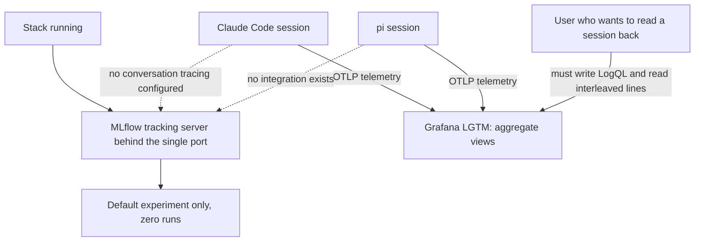
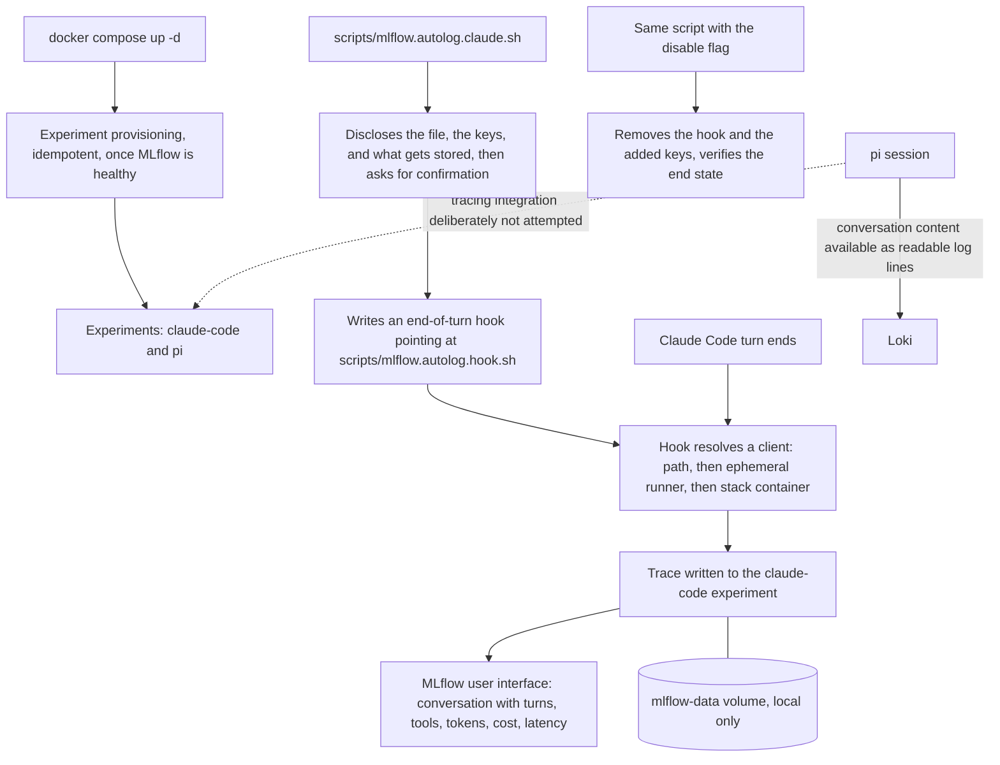
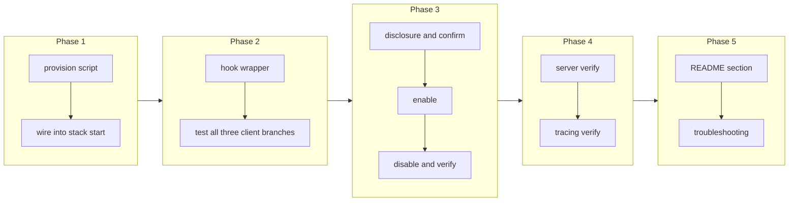

# MLflow Pre-Configured for Coding-Agent Conversation Tracking

## Change Summary

The stack ships an MLflow tracking server, but it ships it empty and unwired. A user who opens it sees a default experiment, no runs, and no indication that it has anything to do with coding agents. Meanwhile the one capability the telemetry pipeline cannot provide, reading a whole agent conversation back as a conversation, is exactly what MLflow can provide and is not configured to.

This change pre-configures MLflow for coding agents: the agent experiments exist the moment the stack starts, one script wires Claude Code conversation tracing without requiring the user to install Python or MLflow, the tracking address is documented in one place, and disabling the whole thing is a single command.

## Motivation and Background

The Grafana side of this stack answers aggregate questions well. What did this week cost, which model, which repository, how many tool calls failed. It answers one question badly: what actually happened in that session. Log lines in Loki hold the prompts and the responses, but reading a conversation back through a log query is a poor experience. The turns interleave with tool events, the ordering depends on timestamps that batch together, and there is no notion of a thread.

MLflow's tracing model has exactly the right shape for this. A session becomes a trace, turns and tool calls become nested spans with their inputs and outputs, and the user interface renders it as a conversation with token counts, costs, and latencies attached. Claude Code has a supported integration that produces this: a single end-of-turn hook reads the session transcript once the turn finishes and reconstructs the trace from it. There is no wrapper process, no interception inside the turn, and no added latency while the agent is working.

The friction is what has kept this unused. The integration is configured by the `mlflow autolog claude` command-line client, which means a Python environment the user may not have and does not want. The tracking address must be typed correctly, including a path prefix that is easy to get wrong. The experiment must exist or runs land somewhere unexpected. And the configuration is written into a Claude Code settings file, which is a file people are reasonably cautious about. Every one of those is removable, and this change removes them.

The integration writes to a project-scoped settings file. The `mlflow autolog claude` client sets up tracing in a directory (its `-d` flag, defaulting to the current directory), so the change lands in that directory's `.claude/settings.json` rather than the user's global `~/.claude/settings.json`. This is the correct scope. The settings precedence in Claude Code places a project-scoped file above the user's global file, and CR-0006 requires the install path to prefer project or local scope over the global file. This change therefore MUST target the project-scoped file and MUST NOT modify the user's global settings.

The privacy consequence deserves to be stated as motivation rather than as a footnote. Conversation tracing stores the whole conversation: every prompt, every response, every tool input and output. That is the point of it, and it is also why it must be local, why it must be off until the user turns it on, and why turning it off must be one command that actually reverses the change.

## Change Drivers

* The stack cannot show a conversation back to the user today, and that is the question users most often want answered.
* MLflow is already running in the stack and already has the capability; only the configuration is missing.
* Configuring it by hand today requires a Python client, an exactly-typed address, and a hand edit of a Claude Code settings file.
* An empty MLflow with a default experiment gives a new user no signal that the tool is relevant to them.
* Conversation content is the most sensitive data the project touches, so the opt-in, the disclosure, and the reversal must all be deliberate.

## Current State

After CR-0001, the MLflow tracking server runs as one more container on the internal network, publishes no host port, and is reached through the single edge port under a path prefix. Its metadata lives in a database file on a named volume and its artifacts on the same volume, both served through the tracking server so clients never touch the filesystem directly. Its own server metrics are scraped into Mimir. All of this works.

What is missing:

* No experiment exists beyond MLflow's default, so a user has nothing to open and no place for runs to land.
* Nothing in the repository configures Claude Code conversation tracing. The capability is documented in the private parent's runbook as a candidate that was deliberately not enabled.
* The tracking address is documented only inside a long runbook section, not where a user configuring a client would look.
* Enabling the integration requires an MLflow client on the user's path, which the repository neither provides nor detects.
* There is no disable path, no verification that tracing is working, and no statement of what tracing stores.
* pi has no equivalent integration at all.

### Current State Diagram



## Proposed Change

Make MLflow useful for coding agents on the first run, and make enabling conversation tracing a single, reversible, well-disclosed command.

1. **Experiments exist at stack start.** A small provisioning step, run by the stack itself once MLflow is healthy, creates the agent experiments if they are absent: one for Claude Code conversations and one reserved for pi. It uses the tracking server's own interface over the internal network, is idempotent, and never overwrites an experiment a user has changed. A user who opens MLflow immediately after starting the stack sees named experiments rather than a blank page.

2. **One command wires Claude Code, with no Python prerequisite.** `scripts/mlflow.autolog.claude.sh` configures the integration. It resolves an MLflow client in a documented preference order and uses the first that is available: an `mlflow` client already on the user's path, then an ephemeral client run through a Python tool runner if one is installed, then the stack's own MLflow container as a fallback. The container fallback needs the agent transcript directory to be readable from inside the container, so the script mounts it read-only; whether the container path is viable is a question the implementer answers by testing it, and if it is not, the script says so plainly and names the two remaining options rather than failing obscurely.

3. **The hook points at this repository's wrapper, not at a bare client.** The end-of-turn hook that the integration installs is written to invoke `scripts/mlflow.autolog.hook.sh` from this repository rather than a bare `mlflow` command. That indirection is what makes the choice of client an implementation detail: the hook keeps working when the user later installs or removes a Python environment, and the resolution logic lives in one readable script instead of frozen into the settings file.

4. **The tracking address is documented once, and derived everywhere.** The tracking address is the single edge port plus the MLflow path prefix. Every script derives it from the same variable the rest of the stack uses, so changing the published port does not silently break tracing. The README states the address, the experiment names, and the address a non-agent MLflow client should use, in one short section.

5. **Enabling is opt-in and discloses what it does before it does it.** The script states, before making any change, exactly which file it will modify, which keys it will add, that the effect is to store every prompt, every response, and every tool input and output in a local volume, and that the change is reversed by one flag. It requires an explicit confirmation, and it supports a non-interactive flag for the agent-driven installation path of CR-0006, which is required to make the same disclosure itself.

6. **Disabling actually reverses the change.** The same script with a disable flag removes the hook entry and the added settings keys, leaving the project's settings file otherwise untouched. Because the integration matches its own hook entry when it writes, running enable twice updates rather than duplicates, and disable after two enables leaves nothing behind. The script verifies the end state rather than assuming it.

7. **Verification is a script, not a hope.** `scripts/mlflow.verify.sh` proves the tracking server end to end: it creates an experiment, a run, a parameter, and a metric through the tracking interface and reads them back. `scripts/mlflow.tracing.verify.sh` proves the agent integration specifically: after one agent turn, it asserts that a trace exists in the agent experiment and that the trace contains at least the user turn and the assistant turn. Both print usage, exit non-zero on failure, and name the fix.

8. **pi is addressed honestly, not silently.** No equivalent integration exists for pi. This change creates the pi experiment and documents the gap: pi conversation content is available today as readable log lines in Loki, and full pi conversation tracing needs an extension change that is deliberately not attempted here. Claiming parity that does not exist would be worse than stating the gap.

9. **Privacy, stated where the decision is made.** The README gains an MLflow section stating what conversation tracing stores, where it is stored, that it never leaves the machine, that it is off until enabled, how to disable it, and how to delete what has already been stored. The last point matters: a user who enables tracing, changes their mind, and disables it still has the stored conversations on the volume, and must be told how to remove them.

### Proposed State Diagram



### What MLflow 3.14 actually provides, verified 2026-08-02

The integration changed shape at MLflow 3.14, and the change is favourable. It was read from the installed 3.14.0 client in this stack's own image, not from documentation.

`mlflow autolog claude` still exists and is still the setup command. What moved is the internal Python stop hook, which is now marked "Deprecated and ignored. Python-based Claude hooks were replaced by the marketplace plugin runtime." In its place the command installs an MLflow plugin into Claude Code and writes configuration into the settings file. After setup a user runs `claude` normally and the plugin runtime produces the traces.

Four properties of the 3.14 command matter to this change, and each removes work this document had planned:

* **It is directory scoped by default.** The `-d` option selects the directory and defaults to the current one. So the integration is project scoped without being asked, which matches the settings precedence rule that a project file beats the user's global file.
* **It can write to the local settings file instead.** A flag selects `settings.local.json` rather than `settings.json`. That file is kept out of version control by default, which is exactly where a content-bearing choice belongs, so a committed project file never enables the recording of another person's prompts by inheritance.
* **It has a real disable path.** `--disable` removes the configuration from both settings files, so the reversal this document requires is provided rather than reimplemented.
* **The plugin runtime replaces the wrapper.** This document planned a wrapper script invoked by an end-of-turn hook, so that the choice of client would not be frozen into the user's settings. The plugin runtime now owns that responsibility. The wrapper's remaining job is narrower: resolve a client so the SETUP command can run on a machine with no Python installation. It is no longer on the path of every turn.

**This change therefore requires MLflow 3.14 or later on the client side.** A client below 3.14 has the old in-process hook and no plugin, so the two versions need opposite configuration and supporting both would double the surface for no gain. The server in this stack is already pinned at 3.14.0.

The failure this creates, and which the requirements below must close: a user with a client below 3.14 who runs the enable path gets configuration that never produces a trace. Detection is mandatory, and the instruction on detection is to upgrade the client so the plugin runtime is available.

## Requirements

### Functional Requirements

1. The stack **MUST** create the Claude Code and pi experiments in MLflow automatically once the tracking server is healthy, without any user action.
2. The experiment provisioning **MUST** be idempotent, and **MUST NOT** modify or replace an experiment that already exists.
3. The experiment provisioning **MUST NOT** prevent the stack from starting if it fails, and **MUST** report its failure in a way a user can find.
4. The repository **MUST** contain `scripts/mlflow.autolog.claude.sh` that configures Claude Code conversation tracing against this stack.
5. That script **MUST** resolve an MLflow client in a documented preference order and **MUST NOT** require the user to install Python or MLflow beforehand when a fallback is available.
6. That script **MUST** state, before making any change, the exact file it will modify, the exact keys it will add, and that the effect is to store prompts, responses, and tool input and output locally.
7. That script **MUST** require an explicit confirmation before changing the settings file, and **MUST** support a non-interactive flag that skips the prompt but not the disclosure.
8. The installed hook **MUST** invoke this repository's wrapper script rather than a bare client command.
9. The wrapper script **MUST** resolve the client at invocation time using the same documented preference order.
10. The script **MUST** support a disable flag that removes the hook entry and every key the enable path added, and leaves the rest of the project's settings unchanged.
11. Running the enable path twice **MUST** update the existing configuration rather than create a duplicate hook entry.
12. Every script **MUST** derive the tracking address from the same port variable the rest of the stack uses, and **MUST NOT** hard-code the port.
13. The repository **MUST** contain `scripts/mlflow.verify.sh` proving the tracking server end to end through the single port with no Python dependency.
14. The repository **MUST** contain `scripts/mlflow.tracing.verify.sh` proving that an agent turn produces a trace in the agent experiment containing at least the user turn and the assistant turn.
15. Every script **MUST** print usage with `-h`, exit non-zero on failure, and print an error naming what failed, the available fixes, and what to check afterwards.
16. The README **MUST** state the tracking address, the experiment names, and the address a non-agent MLflow client should use.
17. The README **MUST** state what conversation tracing stores, where, that it never leaves the machine, that it is off until enabled, how to disable it, and how to delete already-stored conversations.
18. The README **MUST** state that pi conversation tracing is not provided, why, and what is available for pi instead.
19. The repository **MUST NOT** enable conversation tracing as a side effect of starting the stack.
20. The enable path **MUST** write to a project-scoped or local-scoped Claude Code settings file (the directory passed to the `mlflow autolog claude` integration, defaulting to the current directory), and **MUST NOT** modify the user's global `~/.claude/settings.json`.
21. The enable path **MUST** require an MLflow client at version 3.14 or later, because the plugin runtime that produces the traces exists only from that version.
22. The enable path **MUST** detect the client version before it changes anything, and **MUST** refuse to configure a client below 3.14 rather than writing configuration that will never produce a trace.
23. The refusal for a client below 3.14 **MUST** name the version found, state that the plugin runtime needs 3.14 or later, give the command that upgrades or runs a newer client, and state what to check afterwards.
24. The enable path **MUST** configure through the client's own `mlflow autolog claude` command rather than writing the settings file by hand, so the plugin installation and the settings keys stay whatever that command decides they are.
25. The enable path **MUST** state which directory it will configure before it acts, and **MUST NOT** silently rely on the command's default of the current directory.
26. The enable path **MUST** write the configuration to the local settings file rather than the shared project settings file, so a committed file never enables the recording of another person's prompts by inheritance.
27. The disable path **MUST** use the client's own disable option, which removes the configuration from both settings files, rather than reimplementing the removal.
28. The verification path **MUST** confirm that a trace reaches the agent experiment after one real turn, because the plugin runtime produces it and a configuration that installs cleanly can still produce nothing.

### Non-Functional Requirements

1. Conversation tracing **MUST NOT** add latency inside an agent turn, because the integration runs after the turn finishes.
2. A failure of the tracking server or of the hook **MUST NOT** cause an agent turn to fail.
3. All conversation data **MUST** remain on the local machine, in the stack's own volume.
4. The enable path **MUST** complete in under 60 seconds on the warm path, meaning a machine where an MLflow client at 3.14 or later is already available or cached; measured, the warm enable takes 5 to 10 seconds. The very first enable on a machine with no MLflow client installed is explicitly NOT bounded by this figure: it additionally pays a one-time cost that is attributed to two downloads, the ephemeral MLflow client fetched through the Python tool runner and the one-time fetch of the marketplace plugin, and that cold first run was measured to exceed 60 seconds. Both downloads are cached, so every subsequent enable on that machine is the warm path and meets the 60-second budget. The budget is therefore the warm figure; the cold first-run cost is documented and attributed to the one-time downloads rather than bounded. (Amended 2026-08-02: the original wording bounded the no-client case at 60 seconds, which is unachievable on a cold machine and achievable warm; this states both cases honestly.)
5. The scripts **MUST** work on a machine whose only prerequisite is Docker, consistent with the rest of the project.
6. Disabling **MUST** leave the project's agent settings file valid and semantically unchanged apart from the removed keys.

## Affected Components

* `compose.yaml`, the experiment provisioning step and its dependency on MLflow health.
* `scripts/mlflow.provision.sh`, `scripts/mlflow.autolog.claude.sh`, `scripts/mlflow.autolog.hook.sh`, `scripts/mlflow.verify.sh`, `scripts/mlflow.tracing.verify.sh`, all new.
* `README.md`, an MLflow section covering address, experiments, enabling, disabling, privacy, and the pi gap.
* The project-scoped Claude Code settings file (`.claude/settings.json` in the directory passed to the integration, defaulting to the current directory), modified only by explicit user action through the enable path. The user's global `~/.claude/settings.json` is never modified.

## Scope Boundaries

### In Scope

* Automatic, idempotent creation of the agent experiments.
* A one-command enable path for Claude Code conversation tracing that requires no prior Python install.
* A reversible disable path that verifies its own result.
* Client resolution logic in one wrapper script rather than frozen into user settings.
* Verification scripts for the tracking server and for the tracing integration.
* README coverage of address, experiments, privacy, deletion, and the pi gap.

### Out of Scope ("Here, But Not Further")

* pi conversation tracing. No supported integration exists, and building one means changing the extension's signal contract, which CR-0003 freezes for its first release.
* The MLflow model registry, model logging, and any machine-learning workflow. The server supports them and this change neither configures nor documents them beyond what already exists.
* The MLflow AI gateway, budget enforcement, and prompt guardrails. Related, unverified against subscription authentication, and a separate decision.
* Changing MLflow's storage backend, its artifact store, or its server flags.
* Automatic enablement of tracing at stack start. Enabling is a user decision, always.
* The MLflow screenshot in the README. That is CR-0007.
* Retention, rotation, or automatic deletion of stored conversations. The README documents manual deletion; automated retention is a later change.

## Alternative Approaches Considered

* **Document the manual procedure and stop there.** Rejected: that is the current state in the private parent, and it is why the capability has gone unused.
* **Require the user to install the MLflow Python client.** Rejected as the only path: it contradicts the project's promise that Docker is the sole prerequisite. It remains the first-choice path when the client is already present, because it is the fastest.
* **Run the hook entirely inside the stack container, always.** Rejected as the only path: the hook must read a transcript that lives on the host, so the container needs a mount, and mounting a user's agent transcript directory into a container is a heavier default than most users expect. It stays as the last fallback, chosen only when nothing lighter is available.
* **Write the hook to call a bare client command.** Rejected: it freezes the client choice into the settings file, so a later change in the user's environment silently breaks tracing with no obvious cause.
* **Enable tracing automatically when the stack starts.** Rejected outright: conversation content is the most sensitive data the project handles, and enabling it without an explicit decision would be a betrayal of the user's expectations, regardless of the data staying local.
* **Store conversations in Loki instead and build a conversation view in Grafana.** Rejected for now: the data is already in Loki, and building a conversation renderer is a large piece of work that duplicates something MLflow already does well.

## Impact Assessment

### User Impact

A user who wants to read a session back runs one command, confirms a disclosure, and then finds every subsequent session in MLflow as a browsable conversation with costs and latencies attached. A user who does not want this is unaffected, because nothing is enabled without the command. A user who changes their mind runs the same command with a disable flag and is told how to delete what was already stored.

The one intrusive part is that enabling modifies a project-scoped Claude Code settings file. That is inherent to how the integration works, and the mitigation is disclosure before the fact and a disable path that reverses it. The user's global settings file is left untouched.

### Technical Impact

The stack gains a provisioning step that must not block startup. The scripts gain a client-resolution path with three branches, which is the price of removing the Python prerequisite, and that path is the part most likely to behave differently across machines, so it carries the most test attention.

The hook indirection means the project's settings point at a path inside this repository. Moving or deleting the clone breaks tracing. The script must therefore write an absolute path and the troubleshooting section must name this cause, since a user who reorganises their directories will otherwise see tracing stop for no visible reason.

### Business Impact

This is the capability that differentiates the project from a plain telemetry stack, and it is the one most likely to make a person keep it installed. The cost is a few scripts and a careful disclosure. The risk it introduces is reputational rather than technical: storing whole conversations badly, or without telling people, would be worse than not storing them at all.

## Implementation Approach

### Phase 1: Experiment provisioning

Write `scripts/mlflow.provision.sh` to create the agent experiments idempotently through the tracking interface. Wire it into the stack so it runs once the tracking server is healthy, and confirm that a failure logs clearly and does not stop the stack. Verify that a second start changes nothing.

### Phase 2: Client resolution

Write `scripts/mlflow.autolog.hook.sh`, the wrapper that resolves a client at invocation time. Test each branch of the preference order deliberately: with a client on the path, with only an ephemeral runner, and with neither. Determine by testing whether the container fallback can read the transcript, and record the finding. If it cannot, the script must say so and name the remaining options.

### Phase 3: Enable and disable

Write `scripts/mlflow.autolog.claude.sh`. Implement the disclosure, the confirmation, the non-interactive flag, the enable path, and the disable path. Verify that enabling twice does not duplicate, that disabling removes exactly what enabling added, and that the settings file stays valid.

### Phase 4: Verification

Write `scripts/mlflow.verify.sh` and `scripts/mlflow.tracing.verify.sh`. Prove a full round trip for the tracking server, and prove that one real agent turn produces a trace containing the user turn and the assistant turn.

### Phase 5: Documentation

Write the README MLflow section: address, experiments, enable, disable, what is stored, where, deletion, and the pi gap. Write the troubleshooting entries, including the missing-client cause and the client-below-3.14 cause. The moved-clone cause is retired with Risk 3.

### Implementation Flow



## Test Strategy

The deliverable is shell scripts plus a provisioning step, so tests are executable assertions run against the real tracking server and a real agent turn.

### Tests to Add

| Test File | Test Name | Description | Inputs | Expected Output |
|-----------|-----------|-------------|--------|-----------------|
| `scripts/mlflow.verify.sh` | `experiment_run_roundtrip` | Creates an experiment, a run, a parameter, and a metric and reads them back | Tracking address | Exit 0; values match |
| `scripts/mlflow.verify.sh` | `served_artifact_roundtrip` | Uploads and downloads an artifact through the server | Tracking address | Exit 0; content matches |
| `scripts/mlflow.provision.sh` | `creates_missing_experiments` | Creates both agent experiments when absent | Empty tracking server | Exit 0; both exist |
| `scripts/mlflow.provision.sh` | `is_idempotent` | Second run changes nothing | Tracking server with experiments present | Exit 0; identifiers unchanged |
| `scripts/mlflow.provision.sh` | `does_not_block_startup` | Reports failure without failing the stack | Unreachable tracking server | Stack still runs; failure logged |
| `scripts/mlflow.autolog.hook.sh` | `resolves_client_on_path` | Chooses the client on the path when present | Environment with a client on the path | That client is used |
| `scripts/mlflow.autolog.hook.sh` | `falls_back_when_absent` | Falls through the preference order | Environment with no client on the path | Next available option is used |
| `scripts/mlflow.autolog.hook.sh` | `fails_actionably_when_none` | Names the fixes when no client can be resolved | Environment with no option available | Non-zero exit; message names each option |
| `scripts/mlflow.autolog.claude.sh` | `discloses_before_changing` | Prints the file, the keys, and the storage consequence before any write | Interactive invocation | Disclosure printed; no write before confirmation |
| `scripts/mlflow.autolog.claude.sh` | `enable_is_idempotent` | Two enables produce one hook entry | Settings file | Exactly one hook entry |
| `scripts/mlflow.autolog.claude.sh` | `disable_reverses_enable` | Disable removes exactly what enable added | Settings file before and after | Files match apart from the intended keys |
| `scripts/mlflow.autolog.claude.sh` | `writes_absolute_wrapper_path` | The hook records an absolute path to the wrapper | Settings file | Path is absolute |
| `scripts/mlflow.autolog.claude.sh` | `derives_address_from_port_variable` | Uses the configured port rather than a literal | Environment with a non-default port | Address carries the configured port |
| `scripts/mlflow.autolog.claude.sh` | `writes_project_scope_not_global` | Writes to the project directory's settings and never to the global file | A project directory and a global settings file | Project `.claude/settings.json` changed; global `~/.claude/settings.json` byte-identical |
| `scripts/mlflow.tracing.verify.sh` | `turn_survives_stopped_server` | An agent turn completes with the tracking server stopped | One agent turn while the stack is down | Turn completes; no agent-surfaced error |
| `scripts/mlflow.tracing.verify.sh` | `turn_produces_trace` | One agent turn produces a trace in the agent experiment | One non-interactive agent turn | Exit 0; trace found |
| `scripts/mlflow.tracing.verify.sh` | `trace_contains_conversation` | The trace contains at least the user turn and the assistant turn | The produced trace | Exit 0; both present |

### Tests to Modify

| Test File | Test Name | Current Behavior | New Behavior | Reason for Change |
|-----------|-----------|------------------|--------------|-------------------|
| `scripts/stack.verify.sh` | MLflow readiness assertion | Asserts the health endpoint answers | Also asserts both agent experiments exist | Experiment provisioning becomes part of a correctly started stack |

### Tests to Remove

Not applicable.

## Acceptance Criteria

### AC-1: Experiments exist without user action (covers FR1, FR2, FR3)

```gherkin
Given a fresh clone with no prior MLflow volume
When the user runs "docker compose up -d" and waits for the stack to become healthy
Then the Claude Code and pi experiments are listed in MLflow
  And running the stack again does not change their identifiers
  And when MLflow is unreachable, the stack still starts and the failure is reported
```

### AC-2: Enabling requires no Python install (covers FR4, FR5, NFR4, NFR5)

```gherkin
Given a machine whose only prerequisite is Docker
  And no MLflow client on the path
When the user runs the enable script and confirms
Then the configuration completes within 60 seconds on the warm path, once the client and plugin are cached
  And on a first run with no client cached, it additionally pays a one-time download of the client and the marketplace plugin, which is not bounded by 60 seconds (see NFR4)
  And the user was not asked to install Python or MLflow
```

### AC-3: The user is told what will happen before it happens (covers FR6, FR7, FR19)

```gherkin
Given the enable script is run interactively
When it starts
Then it names the exact file it will modify and the exact keys it will add
  And it states that prompts, responses, and tool input and output will be stored locally
  And no change is written until the user confirms
  And starting the stack alone never enables tracing
```

### AC-4: A turn produces a browsable conversation (covers FR14, NFR1, NFR3)

```gherkin
Given conversation tracing is enabled
When the user completes one Claude Code turn
Then a trace appears in the Claude Code experiment
  And the trace contains the user turn and the assistant turn
  And the turn itself was not delayed by the integration
  And the data is stored only in the stack's local volume
```

### AC-5: Enabling twice does not duplicate (covers FR11)

```gherkin
Given tracing is already enabled
When the user runs the enable script again
Then exactly one hook entry exists in the settings file
```

### AC-6: Disabling reverses the change (covers FR10, NFR6)

```gherkin
Given tracing is enabled
When the user runs the script with the disable flag
Then the hook entry and every key the enable path added are removed
  And the rest of the settings file is unchanged
  And the file is still valid
  And a subsequent turn produces no new trace
```

### AC-7: The hook survives a change in the user's environment (covers FR8, FR9)

```gherkin
Given tracing is enabled on a machine with no MLflow client on the path
When the user later installs an MLflow client
  And completes a turn
Then tracing still works
  And no settings change was required
```

### AC-8: The port is never hard-coded (covers FR12)

```gherkin
Given the stack is configured with a non-default published port
When the enable script and the verification scripts run
Then every one of them addresses the tracking server on the configured port
```

### AC-9: The tracking server is proven end to end (covers FR13)

```gherkin
Given the stack is running
When the user runs scripts/mlflow.verify.sh
Then it creates an experiment, a run, a parameter, and a metric and reads them back
  And it exits 0 with no Python dependency
```

### AC-10: Failures are actionable (covers FR15)

```gherkin
Given no MLflow client can be resolved by any branch of the preference order
When the hook runs
Then it exits non-zero
  And it names each way to provide a client
  And it names what to check after applying one
```

### AC-11: Privacy and deletion are documented (covers FR17)

```gherkin
Given the README
When a user reads the MLflow section
Then it states what conversation tracing stores and where
  And it states that the data never leaves the machine
  And it states that tracing is off until enabled
  And it gives the command that disables it
  And it gives the command that deletes already-stored conversations
```

### AC-12: The pi gap is stated, not hidden (covers FR18)

```gherkin
Given the README
When a pi user looks for conversation tracing
Then the README states that it is not provided for pi and why
  And it names what is available for pi instead
```

### AC-13: An MLflow failure never breaks an agent turn (covers NFR2)

```gherkin
Given conversation tracing is enabled
When the stack is stopped and the user completes an agent turn
Then the turn completes normally
  And no error is surfaced by the agent
```

### AC-14: The tracking address and experiments are documented (covers FR16)

```gherkin
Given the README
When a user reads the MLflow section
Then it states the tracking address derived from the edge port and the MLflow path prefix
  And it states the Claude Code and pi experiment names
  And it states the address a non-agent MLflow client should use
```

### AC-15: The enable path targets project scope, not the global file (covers FR20)

```gherkin
Given the enable script is run in a project directory
When it configures conversation tracing
Then the hook and keys are written to that directory's .claude/settings.json
  And the user's global ~/.claude/settings.json is unchanged
```

## Quality Standards Compliance

### Build & Compilation

- [x] `docker compose config` parses the provisioning wiring without error
- [x] The stack starts cleanly with the provisioning step present

### Linting & Code Style

- [x] `shellcheck` passes with zero warnings on every added script
- [x] Every script is executable, single-purpose, and carries a top docstring and one `@agents-index` line
- [x] Every script prints usage with `-h`

### Test Execution

- [x] Every assertion listed in the test strategy passes
- [x] `scripts/stack.verify.sh` still exits 0

### Documentation

- [x] The README MLflow section covers address, experiments, enable, disable, privacy, deletion, and the pi gap
- [x] Troubleshooting covers the missing-client cause and the client-below-3.14 cause. The moved-clone cause is retired with Risk 3, because the implemented design writes no path into the settings and a moved clone cannot break tracing

### Code Review

- [x] Changes submitted via pull request
- [x] PR title follows Conventional Commits format
- [x] Code review completed and approved
- [x] Changes squash-merged to maintain linear history

### Verification Commands

```bash
# Experiments exist after a start
curl -s "http://localhost:${EDGE_PORT:-24317}/mlflow/api/2.0/mlflow/experiments/search" \
  -H 'Content-Type: application/json' -d '{"max_results":100}' | jq -r '.experiments[].name'

# Tracking server round trip, no Python needed
./scripts/mlflow.verify.sh

# Enable, non-interactively, with the disclosure still printed
./scripts/mlflow.autolog.claude.sh --yes

# One turn, then prove the trace exists and holds the conversation
claude -p "Print the word telemetry and nothing else."
./scripts/mlflow.tracing.verify.sh

# Reverse it
./scripts/mlflow.autolog.claude.sh --disable

# Script lint
shellcheck scripts/mlflow.*.sh
```

## Risks and Mitigation

### Risk 1: The script modifies the project's agent settings file incorrectly

**Likelihood:** medium; the file is user-owned and may hold anything
**Impact:** high; a corrupted settings file breaks the user's agent
**Mitigation:** The script writes through the integration's own mechanism rather than by hand-editing where possible, backs the file up before writing, validates the result, and restores the backup if validation fails. The disable path is tested to leave the file byte-identical apart from the intended keys.

### Risk 2: No MLflow client can be resolved on the user's machine

**Likelihood:** medium
**Impact:** medium; tracing silently does nothing at the end of each turn
**Mitigation:** Three resolution branches, a hook that exits with an actionable message naming every option, and a verification script whose whole purpose is to catch exactly this before the user assumes it works.

### Risk 3: The user moves or deletes the clone after enabling. RETIRED, the design no longer creates it

**Likelihood:** none under the implemented design
**Impact:** none
**Status:** This risk belonged to the design this change request began with, where an end-of-turn hook in the user's settings named an absolute path to a script inside this repository. Moving the clone would then have broken tracing with no obvious cause.

The MLflow 3.14 design does not write a path into the settings at all. The configuration the client writes was read after a real run and contains a marketplace reference to the `mlflow/mlflow` repository, an enabled plugin, and three environment keys. A search of that file for the clone path and for this repository's name returns zero matches. The plugin runtime is fetched from the marketplace, not from the clone, so a user who moves or deletes this repository keeps working tracing.

The requirement that the troubleshooting section document a moved clone is therefore retired with this risk. Documenting a failure that the implemented design cannot produce would mislead a reader into looking for the wrong cause.

### Risk 4: Conversation data accumulates without bound

**Likelihood:** high over time
**Impact:** medium; volume growth on the user's disk
**Mitigation:** The README documents where the data lives, how to measure its size, and how to delete it, both selectively and completely. Automatic retention is named as out of scope rather than left unmentioned.

### Risk 5: A user enables tracing without understanding what is stored

**Likelihood:** medium
**Impact:** high
**Mitigation:** The disclosure precedes every write, is printed even in non-interactive mode, and is repeated in the README. CR-0006's installation path is required to carry the same disclosure rather than skipping it for convenience.

### Risk 6: The container fallback cannot read the agent transcript

**Likelihood:** medium; it depends on where the transcript lives and on the host platform
**Impact:** medium; one of three branches becomes unavailable
**Mitigation:** Phase 2 tests the branch rather than assuming it, and the finding is recorded. If the branch is unavailable, the script omits it and names the two remaining options, which is a smaller failure than presenting a branch that does not work.

## Dependencies

* CR-0001, for the stack, the MLflow service, the port variable, and the script conventions.
* A Claude Code installation for the tracing integration and for verification.
* No dependency on CR-0002, CR-0003, or CR-0005. CR-0006 depends on this change, because its installation path calls these scripts.

## Estimated Effort

Roughly 12 to 16 person-hours: 2 for provisioning, 4 for client resolution and its three branches, 3 for enable and disable, 3 for the verification scripts, and 3 for documentation and end-to-end testing.

## Decision Outcome

Chosen approach: "provision the agent experiments automatically, and make conversation tracing a single opt-in command that resolves its own client and reverses cleanly", because the capability already exists and every barrier to using it is friction rather than function. Enabling is kept explicit and disclosed because conversation content is the most sensitive data the project handles, and the wrapper indirection is chosen so the user's settings never freeze an environment-specific decision.

## Related Items

* CR-0001: the stack and the MLflow service this change configures.
* CR-0003: the pi extension, whose frozen signal contract is why pi conversation tracing is out of scope here.
* CR-0006: the agent-driven installation path, which calls these scripts and repeats their disclosure.
* CR-0007: the README screenshot of a conversation in the MLflow interface.

<!-- review-summary -->
## Review Summary (CR-0004, reviewed 2026-08-02)

Reviewed against the running stack (edge port 24417, from `.env`) and the installed tooling. Status stays `proposed`; frontmatter unchanged.

### Findings by category

* **Drift and convention (3, all fixed):**
  1. The CR framed the enable path as writing to the user's global Claude Code settings file. The installed `mlflow autolog claude` client (verified present, MLflow 3.11.1) sets up tracing in a directory (`-d`, default current directory), so it writes a project-scoped `.claude/settings.json`. CR-0006 was amended to prefer project or local scope over the global file. Reconciled the CR to project scope throughout (motivation, FR7, FR10, new FR20, Affected Components, Impact, Risk 1) and added the requirement that the global file is never modified.
  2. The "supported Claude Code integration" and "single end-of-turn hook" claims are now confirmed against the installed client and named explicitly.
  3. Current-State claim "Default experiment only, zero runs" confirmed true against the live server; no change needed.
* **Requirement to criterion coverage (2 gaps, fixed):** FR4 and FR16 were covered by no acceptance criterion. FR4 added to AC-2; FR16 covered by new AC-14. New FR20 covered by new AC-15.
* **AC to test coverage (1 gap, fixed):** AC-13 (an MLflow failure never breaks a turn) had no Test Strategy entry. Added `turn_survives_stopped_server`. Added `writes_project_scope_not_global` for AC-15.
* **Ambiguity:** none. All requirements use MUST or MUST NOT. No "should or may" language inside requirements; no malformed "no X MUST" construction.
* **Diagram accuracy:** Current-State and Proposed-State Mermaid diagrams match the design and the live stack; labels quoted. No change.
* **Scope:** CR-0004 correctly owns MLflow agent configuration. Screenshot deferred to CR-0007, install path to CR-0006, no AGENTS.md or Grafana MCP content. Every AC "covers" list names existing requirements.
* **Privacy:** off by default (FR19), disclosure before any write (FR6), reversible disable (FR10), and documented deletion (FR17) are all present. Confirmed adequate.

### Notes for the human (not blocking)

* On this machine an `mlflow` client is on PATH and `uv`/`uvx` are present, so all three client-resolution branches are exercisable here. The "no Python install" design remains valid for arbitrary users and is unchanged.
* Soft README overlap: CR-0004 adds a README MLflow section while CR-0007 owns the README rewrite. Not a contradiction; the rewrite can absorb the section. Left as-is.
* Frontmatter `source-commit: none (repository has no commits yet)` is now stale (the repo has commits), but frontmatter was held unchanged per the review constraint. Flagged for a human.

### Unresolved

None. All findings were resolved in place.
<!-- /review-summary -->
