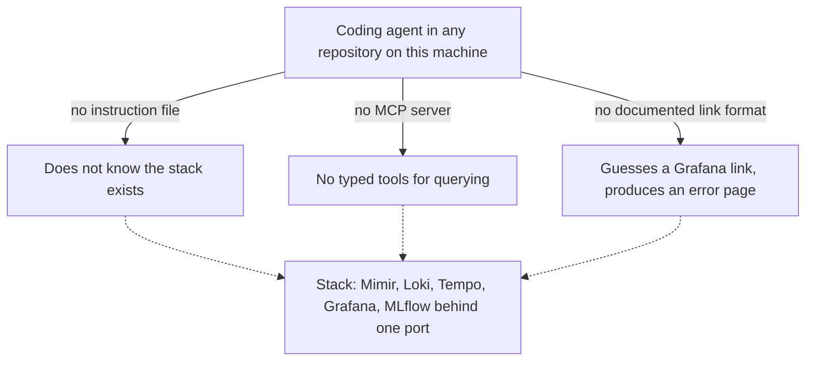
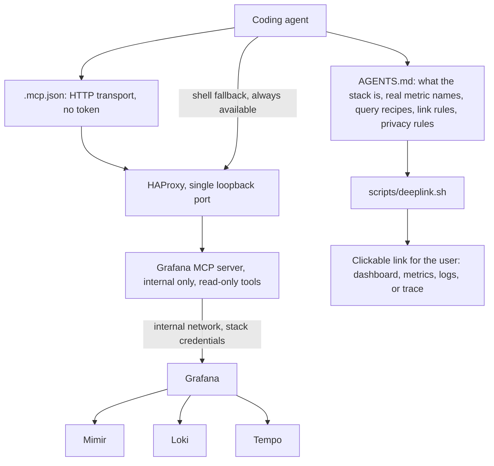
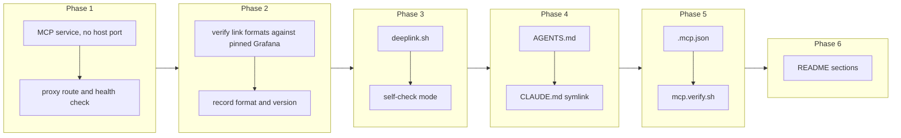

# Agent Interface: AGENTS.md, the Grafana MCP Server, and an Example .mcp.json

## Change Summary

The stack stores excellent data and gives an agent no way to know it exists. An agent working in a repository next to this one has no idea there is a telemetry plane on the machine, what it holds, how to query it, or how to hand a user a link to the answer. This change closes that gap from both ends: a written instruction file that teaches an agent the stack in prose, and a Grafana MCP server that lets the agent query it with tools instead of shell commands.

An example `AGENTS.md` states what the stack is, how to reach each backend, which queries answer which questions, and how to construct a deep link the user can click. The Grafana MCP server runs as one more internal service behind the same single port, with read-only tools by default and no credential for the user to paste. An example `.mcp.json` wires any MCP-capable agent to it in one file.

## Motivation and Background

Two things have to be true before an agent can use telemetry. It has to know the telemetry exists, and it has to be able to reach it. Neither is true today, and they fail differently.

Knowing it exists is a documentation problem with a specific shape. An agent reads instruction files at the start of a session. If nothing tells it that a metrics store on this machine can answer "what did my agent runs cost this week", it will never think to look. Worse, an agent that half-knows will guess: it will invent metric names that do not exist, query a port that is not published, or write a Grafana link with a format that produces an error page. The instruction file has to be specific enough to prevent guessing, which means real metric names, the real port, the real query paths, and the real link format.

Reaching it is a tools problem. An agent can already reach the stack with shell commands, and the instruction file documents that path because it always works. But shell access to a query interface is a poor tool: the agent has to remember request shapes, encode parameters correctly, and parse results out of raw output, and every one of those is a place to fail. The Grafana MCP server exposes the same capability as typed tools with schemas, which is what agents are good at using.

The deep link deserves particular attention, because it is where agent-assisted observability either lands or falls flat. An agent that answers "your Tuesday spend was eleven dollars, mostly Opus in the parser repository" has done half the job. An agent that adds a link that opens exactly that view in Grafana has done all of it, because the user can then explore rather than ask a follow-up question. Link formats are easy to get subtly wrong and produce a page that loads but shows the wrong thing, so the format has to be verified against the running Grafana and encoded in a script rather than described from memory.

## Change Drivers

* An agent has no way to discover that a telemetry plane exists on the machine.
* An agent that half-knows the stack invents metric names, ports, and link formats, which is worse than knowing nothing.
* Shell access to a query interface is available but error-prone; typed tools are what agents use well.
* A useful answer about telemetry ends in a link the user can click, and that link format cannot be guessed.
* Every MCP configuration that requires a pasted token adds a setup step and a secret to manage; this stack can avoid both.

## Current State

After CR-0001 through CR-0004 the stack runs, publishes one loopback port, holds metrics, logs, and traces for two agents, provisions a dashboard with a fixed identifier, and runs an MLflow tracking server. Everything an agent would want is present.

Nothing addresses the agent:

* There is no `AGENTS.md` and no `CLAUDE.md` in the repository, so an agent working here learns nothing from the repository itself, and an agent working elsewhere on the machine learns nothing at all.
* There is no `.mcp.json`, and no MCP server of any kind runs in the stack.
* The query recipes exist only inside the README's verification section, written for a human running them by hand.
* Nothing anywhere documents how to construct a Grafana link, so an agent asked for one will guess.

The Grafana MCP server itself is a published, maintained project. It ships as a container image and as a binary, supports standard input and output as well as streamable HTTP transports, authenticates to Grafana with either a service account token or basic credentials, and groups its tools by category with flags to enable or disable categories, including a flag that disables every writing tool.

### Current State Diagram



## Proposed Change

Give the agent both halves: the knowledge and the tools.

1. **An example instruction file.** `AGENTS.md` at the repository root, with `CLAUDE.md` as a symbolic link to it so both agents read the same content. It is written as an example a user can copy into their own project, and it says so at the top, because most users want this knowledge in the repository they actually work in rather than in this one. It states:
   * What the stack is, in three sentences, and that everything stays on the machine.
   * How to tell whether the stack is running, in one command, so an agent checks rather than assumes.
   * The address of every backend through the single port, derived from the port variable rather than written as a literal.
   * The real metric names for both agents, the meaning of the token `type` label, and which labels exist for which agent, so the agent does not invent names.
   * The query recipes: how to ask Mimir a metric question, Loki a log question, Tempo a trace question, and MLflow a conversation question, each with a worked example that returns data on a working stack.
   * How to build a deep link, for the provisioned dashboard, for a metrics view, for a log view, and for a trace view.
   * The privacy rule the agent must follow: telemetry contains prompt and response content and user identity labels, and reading or expanding a single Loki log line reveals the stream's full label set, which includes an email address (`user_email`) and the other user identity fields (`user_id`, `user_account_id`, `user_account_uuid`, `organization_id`) established in CR-0002. The agent never pastes identity labels or conversation content into a shared or public place, and prefers handing the user a link over quoting content back.
   * What not to do: do not start or stop the stack without asking, do not modify the provisioned dashboard, do not enable conversation tracing on the user's behalf.

2. **The Grafana MCP server as an internal service.** The published server image (verified to exist as `grafana/mcp-grafana:1.0.0`, the current release) is added to the compose stack, pinned, joined to the internal network, publishing no host port, and running in streamable HTTP transport mode. The published image's entrypoint defaults to the SSE transport, so the service sets the streamable HTTP transport explicitly (its `-t streamable-http` flag) rather than relying on the default. It addresses Grafana by service name on the internal network and authenticates with the stack's own Grafana credentials, held in the compose environment. Consequently no credential ever reaches the user's agent configuration and nothing has to be pasted anywhere.

3. **Routed through the same single door.** HAProxy gains one path prefix routing to the MCP server, health-checked like every other backend. The single-published-port property is preserved exactly: the MCP server is reached at the same loopback port as everything else.

4. **Read-only by default, writes opt-in.** The server runs with its writing tools disabled (its `--disable-write` flag) and with a tool set restricted through its `--enabled-tools` flag to the categories this stack actually has: dashboards, datasources, search, Prometheus-compatible metrics, Loki, Tempo, and navigation. Categories for products the stack does not run stay off. The server already disables its administrative category by default, which this configuration keeps off. Enabling writes is a documented single-line change with a stated consequence, not a default. This matters because the server authenticates as an administrator: read-only is what keeps that safe.

5. **An example agent configuration.** `.mcp.json` at the repository root wires an MCP-capable agent to the server over its HTTP transport at the single port. It contains no token, no secret, and no absolute path, so it can be copied verbatim. The README explains where to put it for a project and where for a user's whole machine, and documents the alternative standard input and output configuration for anyone who prefers not to route MCP through the proxy.

6. **Deep links, verified and scripted.** `scripts/deeplink.sh` builds the four link kinds: the provisioned dashboard with template variables and a time range pre-selected, a metrics exploration for a given query, a log exploration for a given selector, and a trace view for a given identifier. The exact link format is verified against the running Grafana (version 13.1.0, the tag this repository pins) at implementation time rather than written from memory, because Grafana's exploration link format has changed across major versions and a stale format produces a page that loads and shows nothing. The script is what `AGENTS.md` tells the agent to use, so the format lives in one place and an agent never hand-builds a link. The MCP server additionally exposes a native `generate_deeplink` tool in its navigation category, so an MCP-capable agent can generate links through that tool while the script remains the always-available shell path that keeps NFR5 satisfied.

7. **Verification.** `scripts/mcp.verify.sh` proves the MCP server is reachable through the single port, that it lists tools, that the tool list contains the expected categories, and that no writing tool is present in the default configuration. `scripts/deeplink.sh` gains a self-check mode that asserts each generated link resolves to a page rather than an error.

### Proposed State Diagram



## Requirements

### Functional Requirements

1. The repository **MUST** contain `AGENTS.md` at its root, and `CLAUDE.md` **MUST** be a symbolic link to it.
2. `AGENTS.md` **MUST** state that it is an example intended to be copied into the user's own project, and **MUST** state what to change when it is copied.
3. `AGENTS.md` **MUST** give a single command that tells an agent whether the stack is running.
4. `AGENTS.md` **MUST** list the address of every backend through the single port, expressed in terms of the port variable rather than a literal port number.
5. `AGENTS.md` **MUST** list the real metric names for both agents, **MUST** explain the token `type` label, and **MUST** state which labels exist for which agent.
6. `AGENTS.md` **MUST** contain a worked query example for each of Mimir, Loki, Tempo, and MLflow that executes successfully on a working stack and returns data, or an explicit empty result where the signal is not yet populated. The MLflow example **MUST** use the MLflow version 3 trace search endpoint with a `locations` request body, as established by CR-0004, and **MUST NOT** use the version 2 trace path (which returns 405) or a bare `experiment_ids` body (which returns 400). Because MLflow conversation tracing is disabled by default, a stack where no conversation has been traced holds no traces, so the MLflow example **MUST** state that an empty trace set is the expected result until tracing is enabled and a turn is run.
7. `AGENTS.md` **MUST** instruct the agent to build links using `scripts/deeplink.sh` rather than by hand.
8. `AGENTS.md` **MUST** state that telemetry contains prompt and response content and user identity labels, **MUST** state that reading or expanding a single Loki log line reveals the stream's full label set including an email address (`user_email`) and the other user identity fields established in CR-0002, and **MUST** instruct the agent never to place identity labels or conversation content into a shared or public destination.
9. `AGENTS.md` **MUST** instruct the agent to prefer handing the user a link over quoting conversation content back.
10. `AGENTS.md` **MUST** state which actions require asking the user first, naming at least starting or stopping the stack, modifying the provisioned dashboard, and enabling conversation tracing.
11. The compose stack **MUST** include the Grafana MCP server as a service with a pinned image tag.
12. The MCP server **MUST NOT** publish a host port.
13. The MCP server **MUST** reach Grafana by service name over the internal network.
14. The MCP server's Grafana credentials **MUST** live only in the compose environment and **MUST NOT** appear in `.mcp.json` or in any documentation as a value to paste.
15. HAProxy **MUST** route one path prefix to the MCP server and **MUST** health-check that backend.
16. The MCP server **MUST** run with writing tools disabled by default.
17. The MCP server **MUST** run with its enabled tool categories restricted to the products this stack runs.
18. The README **MUST** document how to enable writing tools and **MUST** state the consequence of doing so.
19. The repository **MUST** contain `.mcp.json` at its root that wires an MCP-capable agent to the server through the single port.
20. `.mcp.json` **MUST NOT** contain a token, a secret, or an absolute path.
21. The README **MUST** document where to place `.mcp.json` for a single project and for a whole machine, and **MUST** document the standard input and output alternative.
22. The repository **MUST** contain `scripts/deeplink.sh` that generates dashboard, metrics, logs, and trace links.
23. `scripts/deeplink.sh` **MUST** derive the host and port from the same variable the rest of the stack uses.
24. The link format used by `scripts/deeplink.sh` **MUST** be verified against the running Grafana version pinned by this repository, and the verified format **MUST** be recorded in the script's documentation together with the version it was verified against.
25. `scripts/deeplink.sh` **MUST** provide a self-check mode that asserts every generated link resolves to a page rather than an error.
26. The repository **MUST** contain `scripts/mcp.verify.sh` that asserts the MCP server is reachable through the single port, lists tools, exposes the expected categories, and exposes no writing tool in the default configuration.
27. Every added script **MUST** print usage with `-h`, exit non-zero on failure, and print an error naming the failure, the fixes, and what to check afterwards.

### Non-Functional Requirements

1. The single-published-port property **MUST** be preserved: adding the MCP server **MUST NOT** publish any additional host port.
2. The MCP server **MUST NOT** be reachable from outside the machine.
3. `AGENTS.md` **MUST** be short enough to be read in full at the start of a session, and **MUST** put the operational facts before the explanation.
4. Every fact stated in `AGENTS.md` **MUST** be verifiable by a command given in the same file.
5. The MCP server **MUST NOT** be required for any documented capability: every question it answers **MUST** also be answerable by a documented shell command, so an agent without MCP support is not locked out.
6. Adding the MCP server **MUST NOT** change the behaviour of any existing route.

## Affected Components

* `AGENTS.md` and the `CLAUDE.md` symbolic link, new at the repository root.
* `.mcp.json`, new at the repository root.
* `compose.yaml`, one added service.
* `stack/haproxy/haproxy.cfg`, one added route and backend.
* `scripts/deeplink.sh` and `scripts/mcp.verify.sh`, new.
* `README.md`, sections covering the agent interface, MCP configuration, and deep links.

## Scope Boundaries

### In Scope

* The example instruction file and its symbolic link.
* The Grafana MCP server as an internal, read-only, unpublished service routed through the existing proxy.
* The example agent configuration file with no secret in it.
* The deep-link script, its format verification, and its self-check.
* The MCP verification script.
* README coverage of all of the above.

### Out of Scope ("Here, But Not Further")

* Any MCP server other than the Grafana one. An MLflow MCP server is a reasonable later addition and is not attempted here.
* Writing tools enabled by default, and any agent-initiated modification of Grafana.
* Authentication or authorisation for the MCP endpoint beyond the loopback binding the whole stack relies on.
* Installing `.mcp.json` into the user's agent configuration. That is CR-0006's installation path; this change provides the file and documents where it goes.
* Teaching the agent to interpret telemetry, recommend cost reductions, or diagnose agent behaviour. This change gives access and accuracy, not analysis.
* Changing Grafana's authentication model or enabling anonymous access.
* A machine-readable schema or catalogue of the stack's metrics. The instruction file is prose with real names, which is sufficient and much cheaper to keep true.

## Alternative Approaches Considered

* **Instruction file only, no MCP server.** Rejected as the end state, though it is the fallback: shell recipes work but are error-prone, and typed tools are a materially better interface. The instruction file keeps the shell recipes precisely so that this fallback stays available.
* **MCP server only, no instruction file.** Rejected: tools do not tell an agent that a stack exists, what the metric names mean, or what the privacy rules are. An agent with tools and no context still guesses.
* **Run the MCP server over standard input and output from the user's agent configuration.** Rejected as the default: it needs a credential in the user's configuration or a container invocation with the right network access, and both are setup steps this design removes. It stays documented as an alternative for users who prefer not to route MCP through the proxy.
* **Publish a dedicated host port for the MCP server.** Rejected: it reintroduces a second published surface, which is exactly the property the stack is built to avoid.
* **Use a Grafana service account token instead of the stack's credentials.** Rejected for the default path: token creation is not file-provisionable in the pinned Grafana, so it would add a setup step. It is documented as the path to use for anyone who changes the default Grafana credentials.
* **Enable every MCP tool category.** Rejected: most categories address products this stack does not run, so they add tool-choice noise for no capability, and the writing categories add risk under administrator credentials.

## Impact Assessment

### User Impact

A user copies one file into their project and their agent knows about the stack. An MCP-capable agent additionally gets typed tools with no token to paste. An agent can hand back a link that opens the right view, which is the difference between an answer and a useful answer.

The risk a user takes on is that anything able to reach the loopback port can now query Grafana as an administrator through the MCP endpoint. That is the same trust boundary the rest of the stack already assumes, but it is a broader capability than a metrics query, so the README states it plainly and read-only is the default that keeps it acceptable.

### Technical Impact

One more service, one more route, no new port. The instruction file couples to real metric names and to the deep-link format, so both can go stale; the verification scripts and the self-check are what catch that. The pinned MCP server image becomes something to track, and its tool naming may change across versions, which the verification script surfaces as a failing assertion rather than a silent behaviour change.

### Business Impact

This is the change that makes the project agent-native rather than a stack that agents happen to feed. Effort is moderate. The ongoing cost is keeping the instruction file true, which the acceptance criteria bind to executable checks.

## Implementation Approach

### Phase 1: The MCP server in the stack

Add the pinned service with no host port, wire its Grafana address and credentials over the internal network, restrict its tool categories, and disable writing tools. Add the HAProxy route and health check. Confirm the server answers through the single port and that no existing route changed.

### Phase 2: Verify the deep-link format

Against the running pinned Grafana, determine the exact link format for the provisioned dashboard with variables and a time range, for a metrics exploration, for a log exploration, and for a trace view. Verify each by opening it and confirming it shows the intended view rather than merely loading. Record the format and the Grafana version it was verified against.

### Phase 3: The deep-link script

Implement `scripts/deeplink.sh` for the four link kinds, deriving host and port from the stack variable, with a self-check mode that asserts each generated link resolves.

### Phase 4: The instruction file

Write `AGENTS.md` and create the `CLAUDE.md` symbolic link. Every command in it is run before it is written down. Every metric name is checked against the live label listing. The privacy rules and the ask-first rules are written as rules, not as suggestions.

### Phase 5: The example configuration and verification

Write `.mcp.json` with no secret. Write `scripts/mcp.verify.sh`. Confirm from a real agent session that the tools appear and answer, and that no writing tool is offered.

### Phase 6: Documentation

Write the README sections: what the agent interface is, how to use the instruction file in another project, where to place the agent configuration, how to enable writing tools and what that means, and how deep links are generated.

### Implementation Flow



## Test Strategy

The deliverables are configuration, prose, and scripts. The tests assert that the server behaves as configured, that every generated link resolves to the intended view, and that every claim the instruction file makes is executable and true.

### Tests to Add

| Test File | Test Name | Description | Inputs | Expected Output |
|-----------|-----------|-------------|--------|-----------------|
| `scripts/mcp.verify.sh` | `server_reachable_through_single_port` | Asserts the MCP endpoint answers on the single published port | Port variable | Exit 0 |
| `scripts/mcp.verify.sh` | `no_additional_published_port` | Asserts only the proxy publishes a host port after the server is added | Compose service listing | Exit 0; one publisher |
| `scripts/mcp.verify.sh` | `tools_listed` | Asserts the server lists a non-empty tool set | MCP tool listing | Exit 0; tool count above zero |
| `scripts/mcp.verify.sh` | `expected_categories_present` | Asserts dashboard, datasource, search, metrics, logs, and trace tools are present | MCP tool listing | Exit 0; each category present |
| `scripts/mcp.verify.sh` | `no_write_tools_by_default` | Asserts no writing tool is exposed in the default configuration | MCP tool listing | Exit 0; zero writing tools |
| `scripts/deeplink.sh` | `dashboard_link_resolves` | Asserts the generated dashboard link returns a page and carries the variables and range | Variables and range | Exit 0; link resolves |
| `scripts/deeplink.sh` | `metrics_link_resolves` | Asserts the generated metrics exploration link resolves | A metric query | Exit 0 |
| `scripts/deeplink.sh` | `logs_link_resolves` | Asserts the generated log exploration link resolves | A log selector | Exit 0 |
| `scripts/deeplink.sh` | `trace_link_resolves` | Asserts the generated trace link resolves | A trace identifier | Exit 0 |
| `scripts/deeplink.sh` | `uses_configured_port` | Asserts links carry the configured port, not a literal | Non-default port | Exit 0; link carries the configured port |
| `scripts/agents-md.verify.sh` | `every_command_runs` | Extracts every command from the instruction file and runs it against a working stack | `AGENTS.md` | Exit 0; every command exits 0 |
| `scripts/agents-md.verify.sh` | `every_metric_name_exists` | Asserts every metric name in the instruction file exists in the metrics store | `AGENTS.md`, metric name listing | Exit 0; zero unknown names |
| `scripts/agents-md.verify.sh` | `no_literal_port` | Asserts the instruction file expresses addresses through the port variable | `AGENTS.md` | Exit 0; zero literal port numbers outside the default statement |
| `scripts/agents-md.verify.sh` | `no_secret_in_mcp_config` | Asserts the example configuration contains no token, secret, or absolute path | `.mcp.json` | Exit 0; zero matches |

### Tests to Modify

| Test File | Test Name | Current Behavior | New Behavior | Reason for Change |
|-----------|-----------|------------------|--------------|-------------------|
| `scripts/stack.verify.sh` | `assert_single_published_port` | Asserts one publisher across the existing services | Also covers the added MCP service | The invariant must hold after the service is added |
| `scripts/stack.verify.sh` | `assert_backend_readiness` | Checks the existing backends | Also checks the MCP backend through the proxy | The MCP endpoint becomes part of a correctly started stack |

### Tests to Remove

Not applicable.

## Acceptance Criteria

### AC-1: The instruction file teaches the stack accurately (covers FR3, FR4, FR5, FR6, NFR4)

```gherkin
Given a working stack
When every command in AGENTS.md is extracted and run
Then each command exits successfully
  And every metric name named in the file exists in the metrics store
  And every backend address is expressed through the port variable
```

### AC-2: The instruction file is reusable elsewhere (covers FR1, FR2, NFR3)

```gherkin
Given a user with a separate project
When the user reads AGENTS.md
Then it states that it is an example to copy and what to change on copying
  And CLAUDE.md resolves to the same content
  And the operational facts appear before the explanation
```

### AC-3: The privacy and ask-first rules are stated as rules (covers FR8, FR9, FR10)

```gherkin
Given AGENTS.md
When an agent reads it
Then it is instructed never to place identity labels or conversation content into a shared or public destination
  And it is instructed to prefer a link over quoting conversation content
  And it is told which actions require asking the user first, including starting or stopping the stack, modifying the provisioned dashboard, and enabling conversation tracing
```

### AC-4: The MCP server runs internally with no new port (covers FR11, FR12, FR13, NFR1, NFR2)

```gherkin
Given the stack is running with the MCP server added
When the published ports are listed
Then only the proxy publishes a host port
  And the MCP server reaches Grafana by service name on the internal network
  And the MCP endpoint is not reachable from another machine
```

### AC-5: The MCP endpoint answers through the single port (covers FR15)

```gherkin
Given the stack is running
When an MCP client connects at the documented path on the single published port
Then the connection succeeds and the server lists its tools
  And the proxy reports the backend as healthy
```

### AC-6: The tool set is restricted and read-only (covers FR16, FR17)

```gherkin
Given the default configuration
When the tool list is inspected
Then tools for dashboards, datasources, search, metrics, logs, and traces are present
  And no writing tool is present
  And no tool for a product this stack does not run is present
```

### AC-7: No secret is needed anywhere (covers FR14, FR19, FR20)

```gherkin
Given .mcp.json at the repository root
When it is inspected
Then it contains no token, no secret, and no absolute path
  And an agent using it connects successfully with nothing pasted by the user
```

### AC-8: Deep links open the intended view (covers FR7, FR22, FR24, FR25)

```gherkin
Given a working stack with telemetry
When the user generates a dashboard link with variables and a time range
Then the link opens the provisioned dashboard with those variables and that range applied
  And metrics, log, and trace links each open their intended view
  And the self-check mode asserts each link resolves rather than erroring
  And AGENTS.md instructs the agent to build links with scripts/deeplink.sh rather than by hand
```

### AC-9: Links follow the configured port (covers FR23)

```gherkin
Given the stack is configured with a non-default published port
When any link is generated
Then it carries the configured port
```

### AC-10: The link format is recorded with the version it was verified against (covers FR24)

```gherkin
Given scripts/deeplink.sh
When its documentation is read
Then it records the link format for each link kind
  And it names the Grafana version the format was verified against
```

### AC-11: Writing tools are opt-in and their consequence is stated (covers FR18)

```gherkin
Given the README
When a user looks for how to enable writing tools
Then the README gives the single change that enables them
  And it states that the server authenticates with administrator credentials and what an agent could then change
```

### AC-12: MCP is an improvement, not a requirement (covers NFR5)

```gherkin
Given an agent with no MCP support
When it follows AGENTS.md
Then every question the MCP tools answer is also answerable by a documented shell command in the same file
```

### AC-13: No existing route regresses (covers NFR6)

```gherkin
Given the stack with the MCP server added
When the existing readiness and query endpoints are requested
Then each behaves exactly as before
```

### AC-14: Verification is executable (covers FR26, FR27)

```gherkin
Given the stack is running
When the user runs scripts/mcp.verify.sh
Then it exits 0 and reports each assertion as passed
  And when the server is stopped and it is re-run
  Then it exits non-zero, names the failure, and states the fix
```

### AC-15: The configuration placement and the stdio alternative are documented (covers FR21)

```gherkin
Given the README
When a user looks for where to install the example agent configuration
Then it states where to place .mcp.json for a single project and for a whole machine
  And it documents the standard input and output configuration as the alternative to routing MCP through the proxy
```

## Quality Standards Compliance

### Build & Compilation

- [x] `docker compose config` parses the added service without error
- [x] The HAProxy configuration validates inside the pinned image
- [x] `.mcp.json` parses as valid JSON

### Linting & Code Style

- [x] `shellcheck` passes with zero warnings on every added script
- [x] Every added script and configuration file carries a top docstring and one `@agents-index` line
- [x] `AGENTS.md` contains no dashed em-dash and no governance identifier

### Test Execution

- [x] `scripts/mcp.verify.sh` exits 0
- [x] `scripts/deeplink.sh --self-check` exits 0
- [x] `scripts/agents-md.verify.sh` exits 0
- [x] `scripts/stack.verify.sh` still exits 0

### Documentation

- [x] The README documents the agent interface, the configuration placement, the writing-tool switch and its consequence, and deep links
- [x] `scripts/deeplink.sh` documents each link format and the Grafana version it was verified against

### Code Review

- [x] Changes submitted via pull request
- [x] PR title follows Conventional Commits format
- [x] Code review completed and approved
- [x] Changes squash-merged to maintain linear history

### Verification Commands

```bash
# The stack still publishes exactly one host port after the MCP server is added
docker compose ps --format '{{.Service}} {{.Publishers}}'

# The MCP endpoint answers and its tool set is restricted and read-only
./scripts/mcp.verify.sh

# Every claim in the instruction file is executable and true
./scripts/agents-md.verify.sh

# Every generated link resolves to a page
./scripts/deeplink.sh --self-check

# The example agent configuration holds no secret
grep -nEi 'token|secret|password|/Users/|/home/' .mcp.json ; test $? -eq 1

# Existing routes unchanged
curl -s "http://localhost:${EDGE_PORT:-24317}/api/health"
curl -s "http://localhost:${EDGE_PORT:-24317}/prometheus/ready"

# Script lint
shellcheck scripts/*.sh
```

## Risks and Mitigation

### Risk 1: Anything on the machine can query Grafana as an administrator through the MCP endpoint

**Likelihood:** certain by design
**Impact:** medium; read access to telemetry that includes prompt content
**Mitigation:** Writing tools are disabled by default, the endpoint is bound to loopback like everything else, the tool categories are restricted, and the README states the trust boundary plainly rather than leaving a user to infer it. A service account token with reduced permissions is documented as the hardening path for anyone who wants it.

### Risk 2: The deep-link format changes in a Grafana upgrade

**Likelihood:** medium across major versions
**Impact:** medium; links load a page that shows the wrong thing, which is worse than failing
**Mitigation:** The format lives in one script rather than in prose, the script records the version it was verified against, and the self-check asserts each link resolves. An upgrade that breaks the format fails a check rather than silently degrading.

### Risk 3: The instruction file goes stale as metric names or addresses change

**Likelihood:** medium
**Impact:** high; a stale instruction file makes an agent confidently wrong
**Mitigation:** `scripts/agents-md.verify.sh` extracts and runs every command and checks every metric name against the live store, so staleness is a failing check rather than a discovery in production.

### Risk 4: The MCP server's tool names or flags change across versions

**Likelihood:** medium
**Impact:** medium
**Mitigation:** The image tag is pinned, and the verification script asserts the expected categories and the absence of writing tools, so a version change that alters either fails visibly.

### Risk 5: An agent quotes prompt content or an email address back into a public place

**Likelihood:** medium; the data is right there
**Impact:** high
**Mitigation:** The instruction file states the rule directly and tells the agent to prefer a link. The dashboard excludes identity labels structurally under CR-0002, so the most likely accidental path is closed at the source as well as by instruction.

### Risk 6: A user copies the instruction file into a project and it drifts from this repository

**Likelihood:** high
**Impact:** low to medium
**Mitigation:** The file states what to change on copying and keeps its verifiable claims as commands the copy can also run, so a drifted copy can be checked rather than trusted.

## Dependencies

* CR-0001, for the stack, the proxy, the port variable, and the script conventions.
* CR-0002, for the fixed dashboard identifier the dashboard deep link targets.
* CR-0004, for the MLflow conversation query recipe in the instruction file.
* The published Grafana MCP server image at a pinned tag. The current release is `grafana/mcp-grafana:1.0.0`, verified to exist on Docker Hub and to correspond to upstream release v1.0.0 of `grafana/mcp-grafana`.
* CR-0006 depends on this change, because its installation path installs the configuration this change provides.

## Estimated Effort

Roughly 14 to 18 person-hours: 3 for the MCP service and its route, 4 for verifying and scripting the link formats, 4 for the instruction file and its verification script, 2 for the example configuration and the MCP verification script, and 3 for documentation and end-to-end checking from a real agent session.

## Decision Outcome

Chosen approach: "an accurate instruction file plus an internal, read-only Grafana MCP server behind the same single port, with links generated by a script whose format is verified against the pinned Grafana", because the agent needs both context and tools, and because routing MCP through the existing proxy is what removes the token the user would otherwise have to paste. Read-only is the default because the server authenticates as an administrator, and the link format lives in a script because prose cannot be checked and a script can.

## Related Items

* CR-0001: the stack, the proxy, and the port variable.
* CR-0002: the dashboard identifier that makes dashboard links stable.
* CR-0004: the MLflow conversation capability the instruction file teaches the agent to query.
* CR-0006: the installation path that places this configuration for the user.
* CR-0007: the README presentation of the agent interface.

<!-- review-summary -->
## Review Summary (CR-0005)

Reviewed 2026-08-02 against the current repository (CR-0001 through CR-0004 complete).

### Findings by category

* **Drift (3):** (1) MCP image was described generically as "a pinned tag" with no verified reference; the current published image is `grafana/mcp-grafana:1.0.0` (Docker Hub tag `1.0.0` present; upstream release v1.0.0, 2026-07-28). (2) The published Docker image entrypoint defaults to the SSE transport, not streamable HTTP, so the service must set `-t streamable-http` explicitly; the CR assumed streamable HTTP without noting the default. (3) The MCP server exposes a native `generate_deeplink` navigation tool, which the CR did not acknowledge alongside its own `scripts/deeplink.sh`.
* **Coverage (2):** FR7 (build links with `deeplink.sh`) and FR21 (README `.mcp.json` placement plus stdio alternative) had no Acceptance Criterion.
* **Contradiction / testability (1):** FR6 required every worked query, including MLflow, to "return data on a working stack", but MLflow conversation tracing is off by default, so the MLflow example returns an empty trace set on a clean stack.
* **Ambiguity / recipe precision (1):** FR6 did not pin the MLflow recipe to the working form; CR-0004 established that MLflow 3 needs the version 3 trace endpoint with a `locations` body (version 2 returns 405, bare `experiment_ids` returns 400).
* **Privacy precision (1):** FR8 named user identity labels generically but did not state the CR-0002 fact that reading or expanding one Loki log line reveals an email address, which an agent querying Loki will meet.
* **Convention (1):** RFC 2119 keywords (`MUST`/`MUST NOT`) appeared in Proposed Change prose (item 1), outside a numbered requirement.

### Fixes applied

* Named the verified image `grafana/mcp-grafana:1.0.0` in Proposed Change item 2 and in Dependencies; added the SSE-default transport note and the explicit `-t streamable-http` flag; named `--disable-write` and `--enabled-tools` in item 4; recorded Grafana 13.1.0 as the pinned version the deep-link format is verified against; noted the native `generate_deeplink` tool in item 6.
* Added FR7 coverage to AC-8; added AC-15 covering FR21.
* Rewrote FR6 to require successful execution returning data or an explicit empty result, to pin the MLflow recipe to the version 3 endpoint with a `locations` body, and to require the MLflow example to state that an empty trace set is expected until tracing is enabled.
* Sharpened FR8 to name the Loki log-line detail-view exposure of `user_email` and the other CR-0002 identity fields; mirrored the same fact into the Proposed Change privacy bullet.
* Downgraded the RFC 2119 keywords in Proposed Change item 1 to plain prose (the normative form remains in FR8 and FR9).

### Scope confirmation

* CR-0005 owns AGENTS.md, the MCP service, the example `.mcp.json`, and the deep-link script. README sections it writes (FR18, FR21) are the per-change sections CR-0007 later reweaves into one narrative; this handoff is expected by CR-0007 and is not a scope conflict.
* Single-published-port invariant preserved: FR12, NFR1, NFR2, and AC-4 keep the MCP service on the internal network with no host port; verification is bound into `scripts/mcp.verify.sh` and the modified `scripts/stack.verify.sh`.
* Grafana anonymous access confirmed disabled (`GF_AUTH_ANONYMOUS_ENABLED: "false"`, admin/admin), consistent with the CR's out-of-scope statement and its administrator-credential design.

### Unresolved (human decision)

* Frontmatter `source-commit: none (repository has no commits yet)` is stale (the repo now has many commits), but the review brief requires frontmatter to stay unchanged, so it was left as-is. A human should refresh it at implementation time.
<!-- /review-summary -->

<!-- review-summary-counts FINDINGS=9 DRIFT=3 FIXES=9 UNRESOLVED=1 -->

