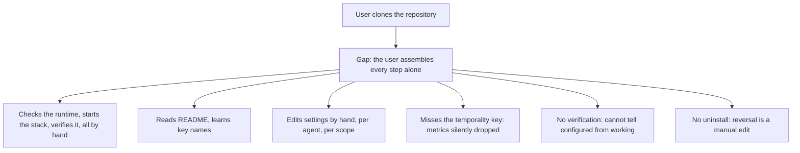
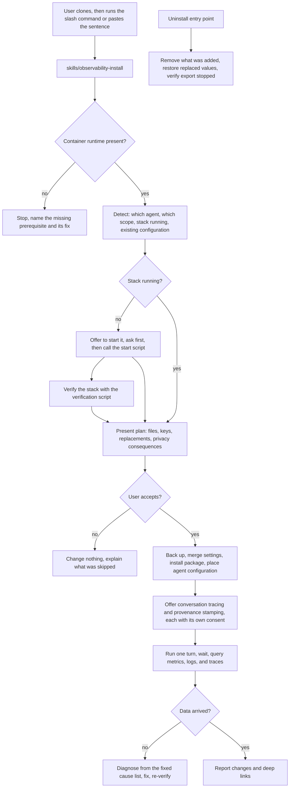
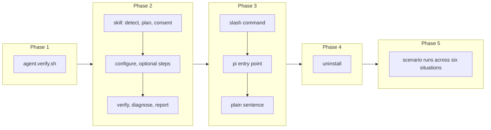

# Software 3.0 Installation Path for Agent Telemetry

## Change Summary

This change adds the project's **primary and recommended installation path**, and it is an instruction rather than a script. After cloning, the user asks their own coding agent to install the stack. The agent checks the prerequisites, starts the stack after asking, verifies it, works out which agent it is configuring, explains exactly what it will change, asks once, changes it, and then proves the result by producing telemetry and querying it back.

The manual path does not disappear. `docker compose up -d` followed by hand-edited settings keeps working, is documented, and stays the fallback for a user with no agent or with a policy against letting one edit their configuration. It is the alternative, not the headline.

The reason for the ordering is what the two paths can each do. Starting the stack is one command and the manual path handles it well. Wiring an agent is not: Claude Code needs a set of environment keys whose names cannot be guessed, one of which must be set to a non-default value or the metrics store rejects every counter, and pi needs a package installed, a flag set, and variables sourced. Both are multi-step, machine-specific, and easy to get subtly wrong, and neither ends with any signal that it worked. That is precisely the shape of work a coding agent does better than a script and better than a person following a list.

## Motivation and Background

The gap between "the stack runs" and "my agent's data is in it" is where adoption is lost. It is not a large gap, but it has the wrong shape for documentation. The steps differ by agent, by whether the user has a project-level or user-level configuration, by whether an existing settings file must be merged rather than written, and by whether the user wants content logging on. A README section covering every branch is long and dull, and a user who reads it still has to perform careful edits to a file they care about.

The right tool for this is the agent itself. This is what a software 3.0 installation path means: rather than shipping a script that must anticipate every machine, ship an instruction that a capable agent reads and executes with judgement, calling deterministic scripts for the parts that must not vary. The agent can read the user's existing settings, notice that a key is already set to something else, ask instead of overwriting, and verify the result by running itself and checking that data arrived. No script can do the middle part, and the verification at the end is the part that turns "configured" into "working".

There is a specific correctness detail that motivates automating this rather than documenting it. Claude Code exports counters with a temporality that the metrics store rejects outright. Unless one particular key is set to a non-default value, every metric is silently dropped while logs and traces arrive normally, which produces the worst possible failure: a stack that looks half-working with no error anywhere. An instruction that always sets it removes an entire class of support question.

The counterweight is that this path edits the user's agent configuration and can turn on the recording of prompts and responses. An automated installer that does either without asking would be indefensible. Consent is therefore not a nicety in this design; it is the design.

## Change Drivers

* The step between a running stack and a wired agent is where users give up.
* The configuration differs by agent, by scope, and by whether an existing file must be merged, which is a poor fit for documentation and a good fit for an agent.
* One key must be set to a non-default value or all metrics are silently dropped, producing a failure with no error message.
* Verification, running a turn and confirming data arrived, is what distinguishes configured from working, and no user does it by hand.
* Anything that edits a user's agent settings or enables content recording must obtain consent, and consent is easier to obtain well in a conversation than in a script.

## Current State

After CR-0001 through CR-0005 every component exists and every deterministic step is scripted: the stack starts and verifies itself, the dashboard is provisioned, the pi package is published, the MLflow tracing enable path is a script with its own disclosure, and the agent interface files exist at the repository root.

What is missing is the connection between them and the user's own agent:

* Nothing configures Claude Code. The user must learn which telemetry keys exist, which values they take, where the settings file lives for the scope they want, and that one key must be changed from its default or metrics vanish.
* Nothing configures pi. The user must install the package, set the master switch, and source the shared flag file.
* Nothing places the example agent configuration file where the user's agent will read it.
* Nothing verifies the result. A user who configures everything correctly and a user who makes one typographical error see the same thing: nothing, for the fifteen to thirty seconds it takes data to appear, and then still nothing for the second user.
* There is no uninstall path, so a user who wants to stop is left editing files by hand.
* There is no single entry point that carries a user from a fresh clone to working telemetry. The steps exist and each is documented, but the user assembles them, and the assembly is where the sequence breaks.

### Current State Diagram



## Proposed Change

Ship the installation as an instruction the user's own agent executes.

1. **One skill, several entry points.** The instruction lives once, as a skill at `skills/observability-install/SKILL.md`, written prompt-first: it describes what to achieve and the rules that govern how, and it calls the repository's scripts for every step that must be deterministic. Thin entry points route to it without duplicating it: a Claude Code slash command at `.claude/commands/observability-install.md`, a pi prompt template shipped in the same package layout pi expects, and a documented plain sentence for any other agent, so a user with a third agent is not excluded.

2. **The agent works out the situation before proposing anything.** The instruction directs the agent to determine whether a container runtime is installed and answering, which agent it is, whether it is being asked to configure the current project or the whole machine, whether the stack is running, whether a settings file already exists, and whether telemetry is already configured, possibly pointing somewhere else. Only then does it propose a plan. This is the part that cannot be a script, and it is the reason this is an instruction rather than an installer.

   Because this is the primary path, the situation it must handle starts earlier than a wiring step would: the stack may never have been started, and the images may never have been pulled. When the stack is not running the agent offers to start it, asks, and then starts it by calling the repository's start script rather than an improvised command. It then verifies the stack with the repository's verification script before it configures anything, so an agent is never wired to a stack that is not working. A missing container runtime stops the path before any plan is proposed, with the fix named rather than a raw runtime error shown.

3. **A plan, then consent, then changes.** Before writing anything the agent presents: the exact files it will change, the exact keys it will add or modify, any existing value it will replace, and the privacy consequence of each choice. Content logging is presented as a separate, explicit decision with its consequence stated, and it defaults to off if the user does not choose it. The agent asks once, with a plan the user can accept whole, rather than asking eleven times.

4. **Configuration, per agent.** For Claude Code the agent writes the telemetry keys into the settings file at the chosen scope, merging with what is there rather than replacing it, including the temporality key without which all metrics are dropped, and pointing the export address at the configured port rather than a literal. For pi the agent installs the published package by its registry specifier, arranges for the master switch and the shared flag file, and confirms the extension loads. In both cases it places the example agent configuration file for the Grafana tools at the chosen scope.

5. **Optional steps, offered rather than assumed.** Conversation tracing is offered, not performed by default, and when accepted the agent calls the existing enable script rather than reimplementing it, so the script's own disclosure is the one the user sees. Git provenance stamping, which makes telemetry sliceable by repository and branch, is likewise offered with its mechanism explained.

6. **Verification is part of installation, not a follow-up.** After configuring, the agent produces one non-interactive turn, waits for the export interval, and queries the stack for the resulting metric, log, and trace. It reports which of the three arrived. If something did not arrive it diagnoses from a fixed list of causes rather than guessing: the stack is not running, the export address is wrong, the temporality key is missing, the package is not installed, the export interval has not elapsed. Installation is not reported as successful until data has been seen.

7. **A report the user can act on.** The agent finishes with what was changed, where, what to run to see the data, and clickable links generated by the repository's link script: the provisioned dashboard, the user's own session in the logs, and, if tracing was enabled, the conversation in MLflow.

8. **Idempotent and reversible.** Running the installation twice changes nothing on the second run and says so. An uninstall path removes exactly what was added, restores any value that was replaced, and verifies that the agent no longer exports. Both are stated in the instruction as requirements the agent must meet, not as aspirations.

9. **Safety rules that bind the agent.** The instruction states rules the agent must not break: never change a file outside the ones named in the accepted plan, never enable content logging without an explicit choice, never overwrite an existing value without showing it first, always back up a settings file before writing, always verify the file is still valid afterwards and restore the backup if it is not, and never claim success without having seen data arrive.

### Proposed State Diagram



## Requirements

### Functional Requirements

1. The repository **MUST** contain a skill at `skills/observability-install/` holding the installation instruction as natural language.
2. The repository **MUST** contain a Claude Code slash command that invokes that skill without duplicating its content.
3. The repository **MUST** contain a pi entry point that invokes the same instruction without duplicating its content.
4. The README **MUST** document a plain sentence a user can paste into any other capable agent to achieve the same result.
5. This path **MUST** take a machine from a fresh clone to verified working telemetry, and **MUST NOT** assume the stack is already running.
6. The instruction **MUST** check the prerequisites before proposing a plan, at least that a container runtime is installed and answering, and **MUST** name the fix when one is absent rather than failing on a raw runtime error.
7. The instruction **MUST** offer to start the stack when it is not running, **MUST** start it by calling the repository's start script rather than an improvised command, and **MUST** ask before starting it.
8. The instruction **MUST** verify the stack by calling the repository's stack verification script before it configures any agent, so that an agent is never configured against a stack that is not working.
9. The README **MUST** present this path as the primary and recommended way to install, and **MUST** place it before the manual command sequence.
10. The README **MUST** retain the manual command sequence as a documented alternative, and **MUST** state who it is for, namely a user with no coding agent or with a policy against letting one change their configuration.
11. The instruction **MUST** name the equivalent manual command whenever it cannot complete a step, so that a user is never left without a way forward.
12. The instruction **MUST** direct the agent to determine which agent it is, the configuration scope, whether the stack is running, and whether telemetry is already configured, before proposing any change.
13. The instruction **MUST** require the agent to present a plan naming every file it will change, every key it will add or modify, and every existing value it will replace, before making any change.
14. The instruction **MUST** require explicit user consent before any change is written.
15. The instruction **MUST** treat content logging as a separate explicit choice, **MUST** state its consequence, and **MUST** default it to off when the user does not choose it.
16. The instruction **MUST** require the agent to back up any settings file before writing to it, to validate the file afterwards, and to restore the backup if validation fails.
17. The instruction **MUST** require the agent to merge into an existing settings file rather than replace it.
18. The instruction **MUST** require that the Claude Code configuration includes the metrics temporality key without which all metrics are rejected.
19. The instruction **MUST** require that the export address is derived from the configured port rather than written as a literal.
20. The instruction **MUST** cover pi by installing the published package by its registry specifier, setting the master switch, and arranging the shared flag file.
21. The instruction **MUST** place the example agent configuration for the Grafana tools at the chosen scope.
22. The instruction **MUST** offer conversation tracing rather than enabling it, and when accepted **MUST** call the repository's existing enable script rather than reimplementing it.
23. The instruction **MUST** offer git provenance stamping and explain its mechanism.
24. The instruction **MUST** require the agent to verify the installation by producing one non-interactive turn and querying the stack for the resulting metric, log, and trace.
25. The instruction **MUST** forbid reporting success before data has been observed in the stack.
26. The instruction **MUST** contain a fixed diagnostic list naming each cause of missing data and its fix, and **MUST** require the agent to work that list rather than guess.
27. The instruction **MUST** require a closing report naming what changed, where, how to see the data, and links generated by the repository's link script.
28. Running the installation a second time **MUST** make no change and **MUST** say so.
29. The repository **MUST** provide an uninstall path that removes exactly what the installation added, restores any replaced value, and verifies that the agent no longer exports.
30. The instruction **MUST** forbid changing any file not named in the accepted plan.
31. The instruction **MUST** require the agent to ask before starting or stopping the stack.
32. Every deterministic step **MUST** be performed by calling a repository script where one exists, rather than by the agent improvising an equivalent.

### Non-Functional Requirements

1. A first-time user **MUST** reach verified, working telemetry through this path without reading any documentation beyond the one command that starts it.
2. The whole path **MUST** complete within 5 minutes on a machine with the stack already running, and within 15 minutes on a machine that has never pulled the images, including the verification wait.
3. This path **MUST** be usable directly from a fresh clone with no prior installation step, because the entry points ship in the repository and are available to an agent opened in the clone.
4. This path **MUST NOT** be the only way to install: every step it performs **MUST** have a documented manual equivalent, so the project stays usable without an agent.
5. The instruction **MUST** be readable and reviewable by a person, because a user is being asked to let it change their settings.
6. The path **MUST** work when no settings file exists and when a settings file already exists with unrelated content.
7. The path **MUST** work for a project scope and for a machine-wide scope.
8. The path **MUST NOT** require any credential, token, or account.
9. The instruction **MUST NOT** depend on any specific agent's private behaviour beyond what its public documentation states.

## Affected Components

* `skills/observability-install/SKILL.md`, new.
* `.claude/commands/observability-install.md`, new.
* The pi entry point in the layout pi expects, new.
* `scripts/agent.verify.sh`, new: the end-to-end check the instruction calls after configuring.
* `README.md`, the installation section.
* The user's Claude Code settings, pi configuration, and agent configuration file, changed only with consent.

## Scope Boundaries

### In Scope

* One skill holding the installation instruction, with thin entry points for Claude Code and pi and a documented sentence for other agents.
* The whole journey from a fresh clone: prerequisite checks, starting the stack after asking, verifying the stack, then configuring the agent.
* The README ordering that makes this the primary path and the manual command sequence the documented alternative.
* Detection, planning, consent, configuration, optional steps, verification, diagnosis, and reporting.
* Idempotence and an uninstall path.
* The end-to-end verification script the instruction calls.
* README coverage of the installation path.

### Out of Scope ("Here, But Not Further")

* Configuring any agent other than Claude Code and pi. The plain-sentence path exists for others, but no agent-specific handling is written for them.
* Installing a container runtime, and cloning the repository. The path checks for the runtime and names the fix; it does not install it. Starting the stack is in scope, but only after asking.
* Removing or deprecating the manual path. It stays documented and supported, and every step of this path keeps a manual equivalent.
* Changing the stack itself. This path configures agents to use the stack, never the other way round.
* Reimplementing anything the deterministic scripts already do.
* A graphical or web-based installer.
* Automatic upgrades or migration of a previous configuration beyond the merge behaviour described.
* Any capability that requires a credential or an account.

## Alternative Approaches Considered

* **A shell installer script.** Rejected as the primary path: the hard parts are situational judgement, merging into a file whose existing content is unknown, and explaining consequences well enough for consent. A script does all three badly. The deterministic parts are already scripts, and the instruction calls them.
* **Documentation only.** Rejected: that is the current state, it is where users are lost, and it cannot verify itself.
* **A slash command containing the whole instruction.** Rejected: it would exist twice, once per agent, and drift. A skill with thin entry points keeps one copy.
* **Configure everything with no prompt, for speed.** Rejected: the path edits the user's agent settings and can enable recording of prompts and responses. Consent is the design.
* **Enable content logging by default, matching the maintainer's own posture.** Rejected: a maintainer's posture on their own machine is not a default for other people's machines.
* **Skip verification and report success after writing configuration.** Rejected: the specific failure this path exists to prevent, silently dropped metrics, is invisible without verification.

## Impact Assessment

### User Impact

A user runs one command and answers one plan. Afterwards their agent's telemetry is in the stack and they have been shown a link that proves it. A user who declines the plan is left exactly as they were. A user who changes their mind runs the uninstall path.

The user is asked to let an agent modify their agent settings, which is a real trust ask. The mitigations are that the plan is shown first, the backup is taken, the file is validated, nothing outside the plan is touched, and the whole instruction is a readable file the user can inspect before running it.

### Technical Impact

The instruction depends on the settings key names and file locations of two agents, both of which can change. That dependency is unavoidable for anything that configures them, and the mitigation is verification: if a key name changes, the verification step fails and reports missing data rather than claiming success.

The instruction is prose executed by a model, so its behaviour varies between runs. That is why the requirements are written as rules the agent must follow and why the acceptance criteria are graded on end state, on what the files and the stack look like afterwards, rather than on the steps taken to get there.

### Business Impact

This is the change that makes the project usable by someone who is not its author. Effort is moderate. The risk is reputational: an installer that damages a settings file would be remembered. Backup, validation, restore, and a plan shown before any write are what keep that risk small.

## Implementation Approach

### Phase 1: The end-to-end verification script

Write `scripts/agent.verify.sh` first, because everything else is judged by it. Given an agent name it produces one non-interactive turn, waits for the export interval, and queries metrics, logs, and traces, reporting which arrived. It exits non-zero when any signal is missing and names the causes to check.

### Phase 2: The skill

Write the instruction: detection, plan, consent, per-agent configuration, optional steps, verification, the fixed diagnostic list, the report, idempotence, and the safety rules. Keep it readable, because the user is being asked to trust it.

### Phase 3: Entry points

Add the Claude Code slash command and the pi entry point, each a thin router to the skill. Add the plain sentence to the README.

### Phase 4: The uninstall path

Add the uninstall behaviour to the same skill with its own entry point, removing exactly what was added, restoring replaced values, and verifying that export has stopped.

### Phase 5: Scenario testing

Run the path as a user would, against the real agents, in the situations that matter: no settings file, an existing settings file with unrelated content, a settings file already pointing telemetry elsewhere, the stack not running, a second run, and the uninstall. Record how many attempts of how many succeeded, because the path is non-deterministic and a single successful run is not evidence.

### Implementation Flow



## Test Strategy

The deliverable is an instruction executed by a model, so the top test layer is the user scenario: drive the real path toward a stated goal and grade the end state. Deterministic parts are tested conventionally.

### Tests to Add

| Test File | Test Name | Description | Inputs | Expected Output |
|-----------|-----------|-------------|--------|-----------------|
| `scripts/agent.verify.sh` | `signals_arrive_for_agent` | Produces one turn and asserts metric, log, and trace arrival | Agent name | Exit 0; three signals reported present |
| `scripts/agent.verify.sh` | `names_cause_when_missing` | Asserts an actionable cause list when a signal is missing | Misconfigured agent | Non-zero exit; causes named |
| `scripts/agent.verify.sh` | `uses_configured_port` | Asserts queries use the configured port | Non-default port | Exit 0 |
| `scenarios/install-fresh-clone` | `fresh clone, stack never started` | The primary path end to end: prerequisite check, start, verify, configure, verify again | Fresh clone, stack never started, images never pulled | Stack started after asking; telemetry configured and observed; success reported only after data |
| `scenarios/install-no-runtime` | `container runtime absent` | The path on a machine with no container runtime | No runtime installed | Stops before any plan; names the prerequisite and its fix |
| `scenarios/install-fresh-claude-code` | `fresh install, no settings file` | Full path on a machine with no existing settings | Clean environment | Telemetry configured and observed; success reported only after data |
| `scenarios/install-existing-settings` | `merge into existing settings` | Full path where a settings file exists with unrelated content | Populated settings file | Unrelated content preserved; telemetry keys added |
| `scenarios/install-conflicting-endpoint` | `existing telemetry pointing elsewhere` | Full path where telemetry is already configured to another address | Conflicting settings | Existing value shown and user asked; nothing replaced without consent |
| `scenarios/install-stack-down` | `stack not running` | Full path when the stack is down | Stopped stack | Agent asks before starting; does not proceed silently |
| `scenarios/install-idempotent` | `second run changes nothing` | The path run twice | Already-configured machine | No change; the agent says so |
| `scenarios/install-declined` | `user declines the plan` | The user says no at the consent step | Any state | Zero files changed |
| `scenarios/install-pi` | `pi install and verify` | Full path for pi including package installation | Clean pi environment | Package installed; pi signals observed |
| `scenarios/uninstall` | `uninstall reverses install` | Uninstall after install | Configured machine | Added keys removed, replaced values restored, export stopped |

### Tests to Modify

| Test File | Test Name | Current Behavior | New Behavior | Reason for Change |
|-----------|-----------|------------------|--------------|-------------------|
| `scripts/stack.verify.sh` | overall stack assertion | Verifies the stack only | Unchanged in scope, but referenced by the skill as the stack precondition check | The instruction must call the existing script rather than improvise a stack check |

### Tests to Remove

Not applicable.

## Acceptance Criteria

### AC-1: One command takes a fresh clone to verified telemetry (covers FR1, FR2, FR5, FR6, FR7, FR8, FR24, NFR1, NFR2, NFR3)

```gherkin
Given a machine with a container runtime installed, a fresh clone, the stack never started, and an unconfigured Claude Code
When the user runs the slash command and accepts the plan
Then the agent checks the prerequisites
  And it asks before starting the stack, then starts it by calling the repository's start script
  And it verifies the stack by calling the repository's verification script before configuring anything
  And telemetry is configured
  And one turn is produced and its metric, log, and trace are observed in the stack
  And the whole path completes within 15 minutes on a machine that has never pulled the images
```

### AC-2: The prerequisite failure is actionable, not raw (covers FR6)

```gherkin
Given a machine with no container runtime installed
When the user runs the slash command
Then the agent stops before proposing any change
  And it names the missing prerequisite and how to install it
  And no raw container runtime error is the only thing the user sees
```

### AC-3: The README leads with this path and keeps the alternative (covers FR9, FR10, FR11, NFR4)

```gherkin
Given the README
When a reader looks for how to install
Then the agent-driven path appears first and is described as the recommended way
  And the manual command sequence appears after it as the documented alternative
  And the README states who the alternative is for
  And every step the agent-driven path performs has a manual equivalent somewhere in the documentation
```

### AC-4: Nothing changes before consent (covers FR13, FR14, FR30)

```gherkin
Given the installation path is running
When the agent presents its plan
Then no file has been changed yet
  And the plan names every file, every key, and every value it would replace
  And when the user declines, zero files are changed
```

### AC-5: Content logging is a separate, defaulted-off choice (covers FR15)

```gherkin
Given the installation path is running
When the user is asked about content logging
Then the consequence of enabling it is stated
  And if the user does not choose it, it is left off
  And no content flag is written without an explicit choice
```

### AC-6: Existing settings survive (covers FR16, FR17, NFR6)

```gherkin
Given a settings file containing unrelated content
When the installation path configures telemetry
Then the unrelated content is unchanged
  And a backup was taken before writing
  And the resulting file is valid
  And if validation had failed, the backup would have been restored
```

### AC-7: A conflicting existing value is surfaced, not overwritten (covers FR13, FR30)

```gherkin
Given telemetry is already configured to a different address
When the installation path runs
Then the existing value is shown to the user
  And the user is asked before it is replaced
```

### AC-8: The metrics temporality key is always set (covers FR18)

```gherkin
Given Claude Code has been configured by this path
When the settings file is inspected
Then the metrics temporality key is present with the value the metrics store accepts
  And metric queries return data after one turn
```

### AC-9: The configured port is honoured (covers FR19)

```gherkin
Given the stack is configured with a non-default published port
When the installation path configures an agent
Then the export address and every verification query use that port
```

### AC-10: pi is installed from the registry and verified (covers FR20)

```gherkin
Given a machine with pi installed and no telemetry extension
When the installation path configures pi and the user accepts
Then the published package is installed by its registry specifier
  And after one turn, pi metrics, log events, and traces are observed in the stack
```

### AC-11: Optional steps are offered, not assumed (covers FR22, FR23, FR31)

```gherkin
Given the installation path is running
When it reaches conversation tracing and provenance stamping
Then each is offered with its consequence stated
  And conversation tracing, if accepted, is performed by the repository's existing enable script
  And the stack is never started or stopped without asking
```

### AC-12: Success is never claimed without data (covers FR25, FR26)

```gherkin
Given a configuration that will not produce data, such as a stopped stack
When the installation path reaches verification
Then it does not report success
  And it names the cause from its diagnostic list and states the fix
```

### AC-13: The report is actionable (covers FR27)

```gherkin
Given a successful installation
When the agent reports
Then it names what changed and where
  And it gives working links to the dashboard and to the user's own session data
  And those links were generated by the repository's link script
```

### AC-14: The path is idempotent (covers FR28)

```gherkin
Given a machine already configured by this path
When the user runs it again
Then no file is changed
  And the agent states that the configuration is already in place
```

### AC-15: Uninstall reverses installation (covers FR29)

```gherkin
Given a machine configured by this path
When the user runs the uninstall entry point
Then every key the installation added is removed
  And every value it replaced is restored
  And a subsequent turn produces no export
```

### AC-16: Deterministic steps use the existing scripts (covers FR32)

```gherkin
Given the installation instruction
When it is read
Then every step that a repository script already performs is delegated to that script
  And no step reimplements one
```

### AC-17: The instruction is reviewable (covers NFR5, NFR9)

```gherkin
Given a user who wants to know what will happen before running the path
When the user opens the skill file
Then the instruction is readable prose stating what it does, what it asks, and what it will not do
  And it relies only on publicly documented behaviour of the agents it configures
```

## Quality Standards Compliance

### Build & Compilation

- [ ] The skill file and every entry point parse as valid documents for their respective agents
- [ ] `scripts/agent.verify.sh` runs without error against a working stack

### Linting & Code Style

- [ ] `shellcheck` passes with zero warnings on `scripts/agent.verify.sh`
- [ ] The skill and entry points contain no dashed em-dash and no governance identifier
- [ ] The skill states its rules as rules, using must and must not

### Test Execution

- [ ] Every scenario in the test strategy has been run against the real path
- [ ] Each scenario records how many attempts of how many reached its success condition
- [ ] `scripts/agent.verify.sh` passes for both agents

### Documentation

- [ ] The README documents the slash command, the pi entry point, and the plain sentence
- [ ] The README states what the path will change and that it asks first
- [ ] The uninstall path is documented next to the installation path

### Code Review

- [ ] Changes submitted via pull request
- [ ] PR title follows Conventional Commits format
- [ ] Code review completed and approved
- [ ] Changes squash-merged to maintain linear history

### Verification Commands

```bash
# The stack precondition the instruction checks
./scripts/stack.verify.sh

# End-to-end signal verification for each agent
./scripts/agent.verify.sh claude-code
./scripts/agent.verify.sh pi

# Idempotence: run the path twice and diff the settings before and after the second run
# (performed inside the scenario runs, recorded under scenarios/)

# The instruction delegates rather than reimplements
grep -n "scripts/" skills/observability-install/SKILL.md

# No governance identifiers in shipped instructions
grep -rn "CR-[0-9]\{4\}" skills .claude ; test $? -eq 1

# Script lint
shellcheck scripts/agent.verify.sh
```

## Risks and Mitigation

### Risk 1: The agent damages the user's settings file

**Likelihood:** low with the stated rules, but the consequence is what matters
**Impact:** high
**Mitigation:** Back up before writing, merge rather than replace, validate after writing, restore the backup on failure, and never touch a file outside the accepted plan. These are stated as rules in the instruction and asserted by the scenarios, including the scenario with pre-existing unrelated content.

### Risk 2: The agent enables content logging without a clear choice

**Likelihood:** medium, because a helpful agent tends to turn things on
**Impact:** high; prompts and responses would be recorded without a decision
**Mitigation:** The instruction makes content logging a separate explicit question with a stated consequence and an off default, and a dedicated acceptance criterion covers it.

### Risk 3: Non-deterministic execution produces an inconsistent result

**Likelihood:** medium; the path is prose executed by a model
**Impact:** medium
**Mitigation:** Requirements are written as rules rather than steps, acceptance is graded on end state, and each scenario is run repeatedly with the success rate recorded rather than a single run treated as proof.

### Risk 4: An agent's settings key names or file locations change

**Likelihood:** medium over time
**Impact:** medium; the path configures something that no longer takes effect
**Mitigation:** Verification is mandatory and gates the success report, so a stale key produces a reported failure with a diagnostic rather than a false success.

### Risk 5: A user runs the path in a repository where it does not belong

**Likelihood:** medium
**Impact:** low
**Mitigation:** The instruction determines the scope and states it in the plan, so the user sees which files in which location will change before agreeing.

### Risk 6: The path reports success while metrics are silently dropped

**Likelihood:** low once the temporality key is always written
**Impact:** high; this is the exact failure the change exists to prevent
**Mitigation:** The key is a requirement with its own acceptance criterion, and verification queries metrics specifically rather than treating any single arriving signal as proof.

## Dependencies

* CR-0001, for the stack, the port variable, and the verification script the instruction calls as its precondition check.
* CR-0002, for the dashboard the report links to.
* CR-0003, for the published pi package the path installs.
* CR-0004, for the conversation tracing enable script the path calls.
* CR-0005, for the agent configuration file the path places and the link script the report uses.
* Working installations of Claude Code and pi for scenario testing.

## Estimated Effort

Roughly 16 to 22 person-hours: 3 for the verification script, 6 for the instruction, 2 for the entry points, 3 for the uninstall path, and 6 for scenario runs across the six situations with repeated attempts.

## Decision Outcome

Chosen approach: "one readable instruction executed by the user's own agent, calling the repository's deterministic scripts, gated by a single plan-and-consent step and closed by mandatory end-to-end verification", because the difficult parts of this installation are situational judgement and informed consent, which a script cannot provide, while the parts that must not vary are already scripts. Verification is mandatory because the failure this path exists to prevent produces no error message, and consent is mandatory because the path edits the user's own configuration and can turn on the recording of their conversations.

## Related Items

* CR-0001: the stack and its verification script.
* CR-0002: the dashboard the closing report links to.
* CR-0003: the published pi package this path installs.
* CR-0004: the conversation tracing script this path calls.
* CR-0005: the agent configuration and the link script this path uses.
* CR-0007: the README presentation of the installation path.
