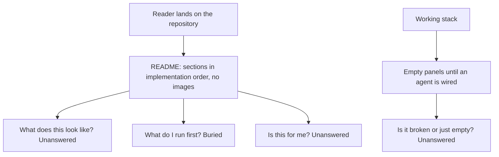
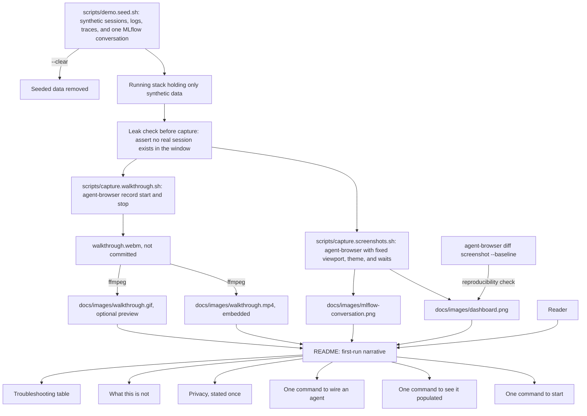
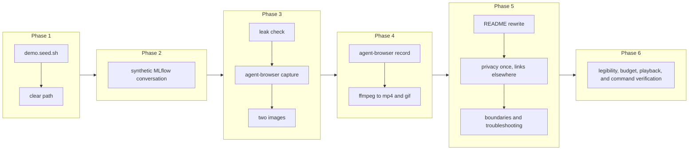

# Project README, Screenshots, and the First-Run Narrative

## Change Summary

By the time the first six change requests are implemented, the project works and its README is a collection of sections written by six different pieces of work. A person landing on the repository needs something else: a page that shows what they get, tells them what to run, and gets out of the way.

This change rewrites the README as one first-run narrative and adds the visual artifacts the project needs to be legible: a screenshot of the baseline dashboard, a screenshot of an agent conversation in the MLflow interface, and a short recorded walkthrough of the solution. All three are produced by a script that drives the `agent-browser` command-line interface against seeded synthetic data, so they are reproducible, they can be regenerated when the interfaces change, and they contain no real prompt content and no real identity.

## Motivation and Background

An observability project is judged on a picture. A reader deciding whether to spend twenty minutes on this repository will scroll, look at the images, and decide. A page that describes panels in prose without showing them asks the reader to imagine the product, which nobody does.

There is a second reason the screenshots matter more here than usual. The two things this project does that a plain telemetry stack does not are the agent-specific dashboard and the readable conversation view. Neither is obvious from a feature list. Both are obvious in an image.

The screenshots also carry a hazard that must be designed around rather than handled carefully. Real telemetry from this stack contains user prompts, assistant responses, tool input and output, and, on the metrics side, an email address and several user identifiers. A screenshot taken from the author's own machine would leak some subset of that into a public repository forever, and a careful hand-crop is not a control, because the next person to regenerate the image will not know which region was sensitive. The only durable answer is to generate the images from data that was never real: a seeded synthetic dataset, produced by a script, captured by a script.

That seeding has a second use that justifies it independently. A user who has started the stack but has not yet wired an agent sees empty panels and has no way to tell a working stack from a broken one. A demo seeding command fills the stack with plausible synthetic telemetry so the user can see every view populated within a minute of cloning, then clear it.

## Change Drivers

* A reader decides whether to try the project from the images, and there are none.
* The coding-agent framing is the headline and carries a cost: a reader concludes the stack is single-purpose and stops. Any local application that exports OpenTelemetry already works, and nothing says so.
* The two capabilities that differentiate this project are visual and are not conveyed by a feature list.
* Real telemetry contains prompt content and user identity, so screenshots cannot be taken from a real machine.
* A hand-captured screenshot cannot be regenerated faithfully when an interface changes, so it rots.
* A user with an empty stack cannot tell working from broken, and a demo dataset answers that in one command.
* The README currently accumulates one section per change request rather than reading as one document.

## Current State

After the first six change requests the repository contains a working stack, a provisioned dashboard, a published pi package, MLflow conversation tracing, an agent interface, and an agent-driven installation path. The README has grown by accretion: each change added the section it owed, in the order the changes were made.

Specifically:

* There are no images anywhere in the repository, and no directory for them.
* There is no way to produce telemetry without running a real agent with real prompts.
* The README's opening does not say what the project is in a form a stranger can absorb in fifteen seconds.
* The order of sections follows the implementation history, not the reader's path.
* The privacy posture is stated correctly in several places and never in one place a reader will certainly see.
* Nothing tells a reader what the project deliberately does not do, which is the fastest way to lose the readers it does not suit and keep the ones it does.
* Nothing tells a reader that the stack accepts telemetry from any local application. The capability exists, because Alloy receives OpenTelemetry from any sender, and no document mentions it, so every reader assumes the stack is for coding agents only.

### Current State Diagram



## Proposed Change

Rewrite the README around the reader, and generate the images from data that was never real.

1. **A synthetic telemetry generator.** `scripts/demo.seed.sh` writes a plausible dataset into the running stack: several days of sessions for both agents across a handful of invented repositories and branches, with costs, token counts split by type, tool decisions, lines of code, commits, and pull requests, plus matching log events and traces. Every value is invented. Prompts and responses are short, obviously synthetic sentences about a fictional task. No email address, no user identifier, and no real repository name appears anywhere. A matching `--clear` flag removes the seeded data so a user can return to a clean stack.

2. **A seeded conversation for the MLflow image.** The same script, or a sibling with the same conventions, writes one synthetic conversation into the MLflow tracking server through its own interface: a short multi-turn exchange with tool calls, token counts, costs, and latencies, shaped exactly like a real traced session but containing invented content. This is what the MLflow screenshot shows.

3. **Scripted, reproducible capture with `agent-browser`.** `scripts/capture.screenshots.sh` drives the `agent-browser` command-line interface to a fixed set of addresses, writes the images to fixed paths, and is run after seeding and before clearing. `agent-browser` is chosen because it is this machine's standard browser driver for agents and because every variable that makes a capture irreproducible is a flag it already has. The script fixes each one explicitly:
   * `agent-browser set viewport <width> <height>` pins the frame, so a regenerated image is the same size as the one it replaces.
   * `agent-browser set media dark reduced-motion` pins the theme and stops animations, so a capture is not taken mid-transition.
   * Grafana runs with anonymous access disabled, so the script authenticates first, through `agent-browser auth login` with a saved profile or by filling the login form. An implementer who omits this captures a login page.
   * `agent-browser wait` settles each view before the frame is taken, rather than a fixed sleep.
   * `agent-browser screenshot <path>` writes the image. Native scrollbars stay hidden, which is the default, so the images do not differ by platform.
   * `agent-browser batch` runs the sequence as one scripted unit.
   * `agent-browser diff screenshot --baseline` compares a regenerated image against the committed one, which is what turns "reproducible" from a claim into a check.

4. **A recorded walkthrough of the solution.** `scripts/capture.walkthrough.sh` records a short video of the working product: the dashboard with its rows, one drill into a log line, and one agent conversation opened in the MLflow interface. It uses `agent-browser record start <path>.webm`, drives the same fixed viewport, theme, and waits, then `agent-browser record stop`.

   The format needs one deliberate step. `agent-browser` records WebM only, and a repository page embeds a video from an `.mp4` or `.mov` file, not from a WebM file. The script therefore converts the recording with `ffmpeg` into an `.mp4` for embedding, and optionally into a `.gif` for a preview that plays without a click. All three artifacts are produced from the one recording, so they never disagree. The WebM original is not committed; only the converted output is, which keeps the repository smaller.

5. **Three visual artifacts, at least.** The baseline dashboard showing populated panels across all four of its rows; an MLflow conversation showing the turn and tool structure with its token and cost detail; and the walkthrough video. All are captured in a single theme chosen for legibility on a repository page, all are stored under `docs/images/` with descriptive names, and each is kept within a stated size budget so the repository does not grow awkward.

6. **A leak check that runs before every capture.** Both capture scripts assert, before a frame or a recording is taken, that the stack held only seeded content in the window being captured, and refuse to run if any real agent session exists there. The check runs before rather than after, because a video that has already recorded a real prompt cannot be made safe by a later assertion. This is a control rather than a habit, because the habit fails exactly once and the failure is permanent.

7. **The README as a first-run narrative,** in the reader's order rather than the implementation's:
   * What this is, in three sentences, with the two screenshots immediately after.
   * What you get, as a short list of capabilities rather than components.
   * Prerequisites, which is Docker and nothing else.
   * Install, the recommended way: point your own coding agent at the repository and let it take the machine from this clone to verified telemetry. This is the first instruction the reader meets, because it is the primary path.
   * Install by hand, the alternative: start the stack, verify it, and wire the agent yourself, for a reader with no coding agent or with a policy against letting one change their configuration. It appears after the recommended path and states who it is for.
   * See it populated without wiring anything, using the demo seed.
   * Read your data: the dashboard, the query recipes, the conversation view, and how an agent uses them.
   * Other things to point at it, so the reader does not conclude the stack serves coding agents only.
   * Privacy, in one place, stated plainly, covering what is stored, where, what is off by default, and how to delete it.
   * What this is not, naming the boundaries honestly.
   * How it fits together, with the data-flow diagram.
   * Troubleshooting, in a table of symptom, cause, and fix.
   * Contributing, licensing, and the components with their versions.

8. **One statement of the privacy posture, in the reader's path.** The privacy section is written once, in full, in the README, and every other document links to it rather than restating it. Restated privacy text drifts, and drifted privacy text is worse than a single link.

9. **A use-cases section, so the stack does not read as single-purpose.** The coding-agent framing is the headline, and it carries a cost: a reader concludes the stack is only for coding agents and stops reading. It is not. What runs here is a general local telemetry plane, and the agents are one workload on it. The section names the others, in the reader's own terms:
   * **Any local application that exports OpenTelemetry.** This is true today and needs no change to the stack. An application points its exporter at the same single port, in any language, and its metrics, log events, and traces land in the same stores as the agent telemetry, queryable side by side. The section gives one worked example of the environment variables an application sets, and states the one convention that makes the data useful, which is a distinct service name.
   * **A single view across an agent and the application it is working on.** This is the combination the project is unusually good at, and the reason to state it. A user debugging a local service while an agent edits it sees both in one place, correlated by time, and an agent that has been taught the query recipes can read the application's own telemetry rather than guessing from source.
   * **Learning observability with a laboratory that costs one command.** Metrics, logs, and traces, with a real collector, real storage, and real query languages, running locally with no account and no bill. A person or an agent can learn what a trace is by producing one, and the demonstration data exists for exactly this reason.

   The section **MUST** state only what the stack does today. In particular, telemetry that reaches the stack arrives because an application sends it. Container standard output is not collected automatically, and the section says so rather than letting a reader assume it, because a promise the stack does not keep is worse than a capability it does not have.

10. **An honest boundaries section.** The README states what the project does not do: it is a single-user local stack, not a multi-tenant deployment; it has no alerting; it has no retention policy; conversation tracing covers one agent and not the other; and it is not a hosted service. A reader who needs those things learns it in ten seconds instead of an hour.

11. **A troubleshooting table.** Every failure the earlier changes anticipated, collected in one place as symptom, cause, and fix: the port is in use, the stack is running but panels are empty, metrics are missing while logs arrive, the agent was configured but nothing appears, conversation tracing stopped after the clone was moved, and no MLflow client can be resolved.

### Proposed State Diagram



## Requirements

### Functional Requirements

1. The repository **MUST** contain `scripts/demo.seed.sh` that writes a synthetic telemetry dataset into the running stack covering metrics, logs, and traces for both agents.
2. The seeded dataset **MUST** contain no real repository name, no real email address, no user identifier, and no real prompt or response content.
3. The seed script **MUST** support a clear flag that removes the seeded data.
4. The repository **MUST** be able to seed one synthetic multi-turn conversation into the MLflow tracking server, containing turns, tool calls, token counts, costs, and latencies.
5. The repository **MUST** contain `scripts/capture.screenshots.sh` that captures the required images at a fixed viewport, theme, time range, and set of addresses.
6. Both capture scripts **MUST** drive the browser through the `agent-browser` command-line interface, and **MUST NOT** drive it by any other mechanism.
7. Both capture scripts **MUST** set the viewport size explicitly, **MUST** set the theme explicitly, and **MUST** disable animation, so that no capture depends on a machine default.
8. Both capture scripts **MUST** authenticate to Grafana before capturing, because the stack runs with anonymous access disabled.
9. Both capture scripts **MUST** wait for each view to settle before capturing, and **MUST NOT** rely on a fixed sleep alone.
10. The capture script **MUST** write the images to fixed paths under `docs/images/`.
11. Both capture scripts **MUST** verify, before capturing, that the stack contains no real agent session within the window being captured, and **MUST** refuse to capture if one is found.
12. The repository **MUST** contain a screenshot of the baseline dashboard showing populated panels from every row.
13. The repository **MUST** contain a screenshot of a coding-agent conversation in the MLflow interface showing its turn and tool structure.
14. The repository **MUST** contain `scripts/capture.walkthrough.sh` that records a walkthrough of the working product covering the dashboard, one drill into a log line, and one agent conversation in the MLflow interface.
15. The walkthrough script **MUST** record with `agent-browser record start` and **MUST** end the recording with `agent-browser record stop`.
16. The walkthrough script **MUST** convert the recording with `ffmpeg` into an `.mp4` file, because a repository page embeds a video from `.mp4` or `.mov` and not from the WebM file `agent-browser` produces.
17. The `.mp4` file **MUST** be committed, and the WebM original **MUST NOT** be committed.
18. Every committed image and video **MUST** appear in the README, each with descriptive alternative text or a caption.
19. Each committed image and video **MUST** stay within a stated size budget, and the README **MUST** state that budget so a contributor regenerating them knows it.
20. The repository **MUST** provide a documented command that compares a regenerated screenshot against the committed one, so reproducibility is a check rather than a claim.
21. The README **MUST** open with a statement of what the project is that a stranger can absorb without prior context.
22. The README **MUST** state the prerequisites for a user, which are Docker and nothing else, and **MUST** state separately that regenerating the visual artifacts additionally needs `agent-browser` and `ffmpeg`.
23. The README **MUST** give the single command that starts the stack and the single command that verifies it.
24. The README **MUST** give the single command that populates the stack with demo data and the command that clears it.
25. The README **MUST** present the agent-driven installation path first, **MUST** describe it as the recommended way to install, and **MUST** state that it carries the machine from a fresh clone to verified telemetry.
26. The README **MUST** present the manual command sequence after the recommended path, as the documented alternative, and **MUST** state who it is for.
27. The README **MUST** contain one privacy section stating what is stored, where, what is off by default, and how to delete stored data, and every other document **MUST** link to it rather than restate it.
28. The README **MUST** contain a use-cases section stating that the stack is a general local telemetry plane and that coding agents are one workload on it, so that a reader does not conclude the stack serves coding agents only.
29. The use-cases section **MUST** name at least these three uses: any local application that exports OpenTelemetry, a single view across an agent and the application it is working on, and learning observability locally at no cost.
30. The use-cases section **MUST** give one worked example of the environment variables a local application sets to export to the stack, and **MUST** state the distinct-service-name convention.
31. Every capability named in the use-cases section **MUST** be one the stack provides today, with no change to the stack and no additional component.
32. The use-cases section **MUST** state that telemetry arrives because an application sends it, and **MUST** state that container standard output is not collected automatically.
33. The README **MUST** contain a section stating what the project deliberately does not do.
34. The README **MUST** contain a troubleshooting table of symptom, cause, and fix covering every failure mode anticipated by the earlier changes.
35. The README **MUST** contain the data-flow diagram and a component table naming each component and its pinned version.
36. The README **MUST** contain contributing and licensing sections.
37. The README **MUST NOT** restate any procedure that a script performs; it **MUST** name the script instead.
38. The README **MUST NOT** contain a governance identifier.
39. Every command in the README **MUST** be executable as written on a machine with the stack running.

### Non-Functional Requirements

1. The demo seeding path **MUST** produce visibly populated dashboard panels within 60 seconds of being run.
2. The screenshots **MUST** be reproducible: running the capture script twice against the same seeded dataset **MUST** produce images showing the same views.
3. The images and the video **MUST** be legible when viewed at the width a repository page renders them.
4. The total size of the committed images and video **MUST** stay within the stated budget.
5. The README **MUST** be readable end to end in under ten minutes.
6. The seeded data **MUST** be distinguishable from real data by an obvious marker, so a user who seeds and forgets can tell.
7. The walkthrough video **MUST** run for no longer than 90 seconds, because a longer recording is not watched and costs repository size.
8. The capture scripts **MUST** run headless, so that regenerating the artifacts needs no attended desktop session.
9. Neither capture script **MUST** be needed by a user of the project; both **MUST** be maintainer tooling only, so the user prerequisites stay at Docker alone.

## Affected Components

* `scripts/demo.seed.sh`, `scripts/capture.screenshots.sh`, and `scripts/capture.walkthrough.sh`, new.
* `docs/images/`, new, holding the committed screenshots and the converted video.
* `README.md`, rewritten.
* Every other document that currently restates the privacy posture, edited to link to the README instead.

## Scope Boundaries

### In Scope

* The synthetic telemetry generator and its clear path.
* The synthetic MLflow conversation.
* The scripted, reproducible capture with `agent-browser`, and its leak check.
* The two required screenshots and the recorded walkthrough, including its conversion to a committed `.mp4`.
* The full README rewrite as a first-run narrative, including use cases, privacy, boundaries, troubleshooting, and components.
* A use-cases section covering only capabilities the stack provides today.
* Removing restated privacy text from other documents in favour of a link.

### Out of Scope ("Here, But Not Further")

* Any change to the dashboard, the stack, the package, or the installation path. This change documents and photographs them; if a screenshot reveals a weak panel, that is a change request against the dashboard.
* A project website, a documentation site, or a hosted demonstration.
* A narrated video, a voice track, or on-screen captions. The walkthrough is a silent screen recording.
* Screenshots of anything beyond the two required views. Others may be added later; two is what the project needs to be legible.
* Publishing the walkthrough to any video hosting service. The file is committed and embedded, and nothing is uploaded anywhere.
* Any new stack capability implied by the use-cases section. The section describes what already works and adds nothing. Automatic collection of container standard output is the obvious candidate and is deliberately not added here; it needs Docker service discovery and a container log source in the collector, which is a change to the pipeline and belongs in its own change request.
* A sample instrumented application, a tutorial, or guided lessons. The use-cases section names learning as a use; it does not build a course.
* Translations.
* A published changelog for the repository as a whole. The pi package has one; the repository does not need one for a first release.

## Alternative Approaches Considered

* **Capture screenshots by hand from the author's machine and redact them.** Rejected: redaction is a habit rather than a control, it fails permanently the one time it is forgotten, and a hand capture cannot be regenerated faithfully later.
* **Capture from a real machine but with content logging disabled.** Rejected: it removes prompt content from logs but not user identity from metric labels, and the conversation screenshot requires conversation content to exist at all.
* **Draw mock-ups instead of capturing real interfaces.** Rejected: a mock-up that flatters the product is dishonest, and one that does not is pointless.
* **Use the Grafana server-side rendering plugin instead of a browser driver.** Rejected as the default: it requires adding a plugin to the pinned image, it cannot capture the MLflow interface, and it cannot record video at all, so a browser driver is needed regardless and one mechanism is better than two.
* **Drive the browser with a general automation library rather than `agent-browser`.** Rejected: `agent-browser` is already this machine's standard browser driver for agents, it is the driver the project's own instructions name, and it provides the viewport, theme, animation, wait, screenshot, recording, and baseline-comparison controls this change needs as first-class commands. A general library would reimplement each one.
* **Commit the WebM recording directly and skip the conversion.** Rejected: a repository page embeds a video from `.mp4` or `.mov`, so a committed WebM file would download rather than play. The conversion is one `ffmpeg` command and it is what makes the video visible where it matters.
* **Ship only an animated GIF and no video.** Rejected as the only artifact: a GIF of a readable dashboard is either illegible or very large. The GIF stays available as an optional preview, with the `.mp4` as the artifact that carries the detail.
* **Skip the demo seeding and screenshot an author's session with invented prompts typed by hand.** Rejected: it produces one unrepeatable image and no reusable capability, whereas seeding gives the user a demonstration mode as well.
* **Keep the accreted README and add images to it.** Rejected: the section order follows the implementation history, which is not the order a reader needs.

## Impact Assessment

### User Impact

A reader sees what the project does within seconds. A user who has started the stack can populate it with one command and see every view working before wiring anything. A user diagnosing a problem finds a troubleshooting table instead of a search through prose. A user whose needs the project does not meet finds that out immediately.

### Technical Impact

Three new scripts, two of which drive a browser, which is the most environment-sensitive thing in the repository. The project gains two maintainer-only prerequisites, `agent-browser` and `ffmpeg`, and neither reaches a user of the project: the user prerequisites stay at Docker alone. Committed images and the video add weight to the repository, bounded by the stated budget. The seeding script writes to the same stores as real telemetry, so its marker and its clear path matter: a user who seeds and forgets must be able to tell and to undo.

Screenshots and video couple to interface appearance, so a Grafana or MLflow upgrade dates them. The capture scripts are what make regeneration cheap enough to actually happen, and the baseline comparison is what shows that a regenerated image differs from the one it replaces.

### Business Impact

This is the change that determines whether anyone tries the project. Effort is moderate and mostly in the seeding generator. The main risk is reputational and one-directional: a leaked prompt or an email address in a committed image or video cannot be recalled once published, which is why the leak check is a requirement rather than a practice, and why it runs before capture rather than after.

## Implementation Approach

### Phase 1: The synthetic dataset

Write `scripts/demo.seed.sh`. Emit metrics, logs, and traces for both agents across several invented repositories and branches over several days, with an obvious marker distinguishing seeded data. Verify every dashboard panel populates. Implement and verify the clear path.

### Phase 2: The synthetic conversation

Seed one multi-turn conversation into the MLflow tracking server with tool calls, tokens, costs, and latencies, and confirm it renders in the interface as a conversation rather than as a bare run.

### Phase 3: Screenshot capture

Write `scripts/capture.screenshots.sh` on `agent-browser`, with the leak check that refuses to capture when real sessions exist in the window, then Grafana authentication, then the fixed viewport, theme, and animation settings, then a settle wait per view, then the capture. Capture both images. Confirm that a second run produces the same views by comparing against the committed baseline.

### Phase 4: Walkthrough recording

Write `scripts/capture.walkthrough.sh`. Plan the route first with `agent-browser snapshot`, so the recording drives known elements rather than guessed selectors. Record with `agent-browser record start`, drive the route, and end with `agent-browser record stop`. Convert the WebM recording to `.mp4` with `ffmpeg`, and optionally to a `.gif` preview. Confirm the video stays inside the duration and size budgets, and confirm it plays when embedded.

### Phase 5: README rewrite

Rewrite the README in the reader's order. Place the images near the top with alternative text. Write the privacy section once and replace every restatement elsewhere with a link. Write the boundaries section and the troubleshooting table. Verify every command in the document by running it.

### Phase 6: Final pass

Confirm the images and the video are legible at rendered width and within budget, that the video plays where it is embedded, that the README reads end to end in under ten minutes, that no governance identifier appears, and that a fresh reader can follow it from clone to populated dashboard without leaving the page.

### Implementation Flow



## Test Strategy

The deliverables are three scripts, two images, one video, and a document. The scripts are tested by assertion, the images and the video by inspection against stated criteria, and the document by executing every command it contains.

### Tests to Add

| Test File | Test Name | Description | Inputs | Expected Output |
|-----------|-----------|-------------|--------|-----------------|
| `scripts/demo.seed.sh` | `populates_every_dashboard_row` | Asserts every dashboard row has a populated panel after seeding | Running stack | Exit 0; no empty row |
| `scripts/demo.seed.sh` | `contains_no_identity_or_real_content` | Asserts the seeded data contains no email address, user identifier, or real repository name | Seeded stores | Exit 0; zero matches |
| `scripts/demo.seed.sh` | `marks_seeded_data` | Asserts every seeded series and stream carries the marker | Seeded stores | Exit 0; marker present |
| `scripts/demo.seed.sh` | `clear_removes_seeded_data` | Asserts the clear path removes what seeding added | Seeded stack | Exit 0; zero seeded series remain |
| `scripts/demo.seed.sh` | `seeds_mlflow_conversation` | Asserts a multi-turn conversation with tool calls exists in MLflow after seeding | Running stack | Exit 0; conversation present |
| `scripts/capture.screenshots.sh` | `refuses_when_real_sessions_present` | Asserts capture is refused when a real session exists in the window | Stack with a real session | Non-zero exit; nothing written |
| `scripts/capture.screenshots.sh` | `writes_expected_images` | Asserts both images are written to their fixed paths | Seeded stack | Exit 0; both files exist |
| `scripts/capture.screenshots.sh` | `images_within_budget` | Asserts each image is within the stated size budget | Captured images | Exit 0 |
| `scripts/capture.screenshots.sh` | `capture_is_reproducible` | Asserts a regenerated image matches the committed baseline | Seeded stack, committed images | Exit 0; baseline comparison reports no difference |
| `scripts/capture.screenshots.sh` | `sets_viewport_theme_and_motion` | Asserts the script sets viewport, theme, and reduced motion before capturing | Script source | Exit 0; all three set |
| `scripts/capture.screenshots.sh` | `authenticates_before_capture` | Asserts the captured image is a dashboard and not a login page | Captured image | Exit 0; login form absent from the page at capture time |
| `scripts/capture.walkthrough.sh` | `refuses_when_real_sessions_present` | Asserts recording is refused when a real session exists in the window | Stack with a real session | Non-zero exit; nothing recorded |
| `scripts/capture.walkthrough.sh` | `produces_mp4_from_recording` | Asserts a WebM recording is produced and converted to an mp4 at the fixed path | Seeded stack | Exit 0; mp4 exists |
| `scripts/capture.walkthrough.sh` | `webm_is_not_committed` | Asserts the WebM original is absent from the working tree or ignored | Repository tree | Exit 0; no committed WebM |
| `scripts/capture.walkthrough.sh` | `video_within_duration_and_size` | Asserts the video runs no longer than 90 seconds and is within the size budget | Produced mp4 | Exit 0 |
| `scripts/capture.walkthrough.sh` | `covers_required_views` | Asserts the route visits the dashboard, one log line drill, and one MLflow conversation | Script source and run log | Exit 0; all three visited |
| `scripts/readme.verify.sh` | `every_command_runs` | Extracts and runs every command in the README | README, running stack | Exit 0; each command exits 0 |
| `scripts/readme.verify.sh` | `no_governance_identifier` | Asserts no governance identifier appears | README | Exit 0; zero matches |
| `scripts/readme.verify.sh` | `privacy_stated_once` | Asserts other documents link to the README privacy section rather than restating it | Repository documents | Exit 0; zero restatements |
| `scripts/readme.verify.sh` | `images_referenced_with_alt_text` | Asserts both images are referenced with non-empty alternative text | README | Exit 0 |

### Tests to Modify

| Test File | Test Name | Current Behavior | New Behavior | Reason for Change |
|-----------|-----------|------------------|--------------|-------------------|
| `scripts/agents-md.verify.sh` | privacy statement assertions | Asserts the instruction file states the privacy rules | Asserts it states the agent-facing rules and links to the README for the posture | Privacy is stated once in the README and linked elsewhere |

### Tests to Remove

Not applicable.

## Acceptance Criteria

### AC-1: One command populates every view (covers FR1, FR3, NFR1)

```gherkin
Given a running stack with no telemetry
When the user runs the demo seed command
Then within 60 seconds every dashboard row shows a populated panel
  And running the clear command afterwards removes the seeded data
```

### AC-2: Seeded data is synthetic and marked (covers FR2, NFR6)

```gherkin
Given the seeded dataset
When it is searched for email addresses, user identifiers, and real repository names
Then zero matches are found
  And every seeded series and stream carries a marker identifying it as demonstration data
```

### AC-3: Neither script photographs nor records real data (covers FR11)

```gherkin
Given a stack containing a real agent session within the capture window
When either capture script is run
Then it exits non-zero before any frame is taken
  And no image file and no recording is written
```

### AC-4: Both required screenshots exist and are shown (covers FR5, FR10, FR12, FR13, FR18)

```gherkin
Given the repository
When the README is rendered
Then a screenshot of the baseline dashboard with populated panels from every row appears near the beginning
  And a screenshot of an agent conversation in the MLflow interface showing turns and tool calls appears near the beginning
  And each has descriptive alternative text
```

### AC-5: Capture is driven by agent-browser with every variable pinned (covers FR6, FR7, FR8, FR9, NFR8)

```gherkin
Given either capture script
When its source is inspected and it is run
Then it drives the browser only through the agent-browser command-line interface
  And it sets the viewport size, the theme, and reduced motion before capturing
  And it authenticates to Grafana before capturing, so no captured view is a login page
  And it waits for each view to settle rather than relying on a fixed sleep alone
  And it runs headless with no attended desktop session
```

### AC-6: The walkthrough is recorded and converted for embedding (covers FR14, FR15, FR16, FR17)

```gherkin
Given a seeded stack
When the walkthrough script is run
Then agent-browser records the route to a WebM file
  And the route covers the dashboard, one drill into a log line, and one agent conversation in the MLflow interface
  And ffmpeg converts the recording to an mp4 at a fixed path under docs/images/
  And the mp4 is committed
  And the WebM original is not committed
```

### AC-7: The video plays where it is embedded and stays short (covers FR18, FR19, NFR3, NFR7)

```gherkin
Given the committed mp4
When the README is rendered on the repository page
Then the video plays inline rather than downloading
  And it runs for no longer than 90 seconds
  And it is within the stated size budget
  And its caption describes what it shows
```

### AC-8: Screenshots are reproducible against a baseline (covers FR20, NFR2)

```gherkin
Given the same seeded dataset
When a screenshot is regenerated and compared against the committed baseline
Then the comparison reports no difference
  And when a panel is deliberately changed and the comparison is repeated
  Then the comparison reports the difference
```

### AC-9: Images are legible and within budget (covers FR19, NFR3, NFR4)

```gherkin
Given the committed images
When they are viewed at the width a repository page renders them
Then panel titles and values are legible
  And each image is within the stated size budget
  And the README states that budget
```

### AC-10: The README answers the reader's first three questions immediately (covers FR21, FR22, FR23)

```gherkin
Given a reader who has never seen this project
When the reader opens the README
Then within the first screen they learn what it is, see what it looks like, and find the command that starts it
  And the user prerequisites state Docker and nothing else
  And the maintainer prerequisites for regenerating the artifacts are stated separately as agent-browser and ffmpeg
```

### AC-11: The recommended path comes first and the manual path remains (covers FR23, FR25, FR26)

```gherkin
Given the README
When a reader looks for how to install
Then the agent-driven path appears first, described as the recommended way
  And it states that it carries the machine from a fresh clone to verified telemetry
  And the manual command sequence appears after it, described as the alternative, with a statement of who it is for
  And a reader who follows either path reaches a running, verified stack
```

### AC-12: Privacy is stated once, completely (covers FR27)

```gherkin
Given the repository documents
When privacy is looked for
Then the README states what is stored, where, what is off by default, and how to delete it
  And every other document links to that section rather than restating it
```

### AC-13: The reader learns the stack is not single-purpose (covers FR28, FR29, FR30, FR31, FR32)

```gherkin
Given a reader who arrives expecting a coding-agent tool
When the reader reads the use-cases section
Then it states that the stack is a general local telemetry plane and that coding agents are one workload on it
  And it names any local application that exports OpenTelemetry, the single view across an agent and its application, and learning observability locally
  And it gives a worked example of the environment variables an application sets, with the distinct-service-name convention
  And every capability it names works with no change to the stack
  And it states that telemetry arrives because an application sends it, and that container standard output is not collected automatically
```

### AC-14: The boundaries are stated (covers FR33)

```gherkin
Given the README
When a reader with different needs reads it
Then a section states that the project is single-user and local, has no alerting, has no retention policy, covers conversation tracing for one agent only, and is not a hosted service
```

### AC-15: Troubleshooting is a table, not a search (covers FR34)

```gherkin
Given the README
When a user meets a failure
Then a table lists the symptom, the cause, and the fix
  And it covers the port conflict, empty panels, missing metrics with arriving logs, a configured agent producing nothing, tracing stopping after the clone moved, and no resolvable MLflow client
```

### AC-16: Every command in the README works (covers FR37, FR39)

```gherkin
Given a machine with the stack running
When every command in the README is extracted and run
Then each exits successfully
  And no procedure is restated that a script already performs
```

### AC-17: Capture tooling is maintainer-only (covers NFR9)

```gherkin
Given a user who only wants to run the stack
When the user follows the README from clone to wired agent
Then neither agent-browser nor ffmpeg is required at any step
```

### AC-18: The document is clean and complete (covers FR35, FR36, FR38, NFR5)

```gherkin
Given the README
When it is reviewed
Then it contains the data-flow diagram and a component table with pinned versions
  And it contains contributing and licensing sections
  And it contains no governance identifier
  And it can be read end to end in under ten minutes
```

## Quality Standards Compliance

### Build & Compilation

- [ ] All three scripts run without error against a working stack
- [ ] Every Mermaid diagram in the README renders
- [ ] `ffmpeg` converts the recording without error and the resulting mp4 plays

### Linting & Code Style

- [ ] `shellcheck` passes with zero warnings on every added script
- [ ] The README contains no dashed em-dash
- [ ] Every added script carries a top docstring and one `@agents-index` line

### Test Execution

- [ ] Every assertion in the test strategy passes
- [ ] `scripts/readme.verify.sh` exits 0
- [ ] Every previously added verification script still exits 0

### Documentation

- [ ] The README follows the reader's order and covers every required section
- [ ] Privacy appears once and is linked from elsewhere
- [ ] The troubleshooting table covers every anticipated failure mode

### Code Review

- [ ] Changes submitted via pull request
- [ ] PR title follows Conventional Commits format
- [ ] Code review completed and approved
- [ ] Changes squash-merged to maintain linear history

### Verification Commands

```bash
# Populate every view with synthetic data
./scripts/demo.seed.sh

# Capture both images, refusing if any real session is in the window
./scripts/capture.screenshots.sh

# Record the walkthrough and convert it for embedding
./scripts/capture.walkthrough.sh

# Clear the synthetic data again
./scripts/demo.seed.sh --clear

# Every command in the README runs, no governance identifiers, privacy stated once
./scripts/readme.verify.sh

# The capture tooling is present, at the versions the scripts were written against
agent-browser --version
ffmpeg -version | head -1

# Reproducibility: a regenerated screenshot matches the committed baseline
agent-browser diff screenshot --baseline docs/images/dashboard.png

# No identity or real content anywhere in the committed images directory metadata
grep -rniE 'user_email|user_id|organization_id' docs/images ; test $? -eq 1

# Image and video size budgets, and no committed WebM original
find docs/images -name '*.png' -size +1M ; test -z "$(find docs/images -name '*.png' -size +1M)"
find docs/images -name '*.mp4' -size +5M ; test -z "$(find docs/images -name '*.mp4' -size +5M)"
git ls-files '*.webm' ; test -z "$(git ls-files '*.webm')"

# Video duration budget
ffprobe -v error -show_entries format=duration -of csv=p=0 docs/images/walkthrough.mp4

# Script lint
shellcheck scripts/demo.seed.sh scripts/capture.screenshots.sh scripts/capture.walkthrough.sh scripts/readme.verify.sh
```

## Risks and Mitigation

### Risk 1: A screenshot or the video leaks real prompt content or a user identity

**Likelihood:** low with the leak check, high without it
**Impact:** high and irreversible once published
**Mitigation:** Images and video are captured only from seeded synthetic data, both capture scripts refuse to run when a real session exists in the window, and the seeded dataset is asserted to contain no identity or real content. Three controls, because the failure cannot be undone. The video carries the greater exposure, because it shows many views in sequence rather than one frame, which is why the check runs before recording starts rather than after it ends.

### Risk 2: The browser behaves differently across machines

**Likelihood:** medium
**Impact:** medium; a contributor cannot regenerate the artifacts
**Mitigation:** The scripts set the viewport, the theme, and reduced motion explicitly through `agent-browser`, so those are part of the script rather than part of the machine. `agent-browser` manages its own browser binary, which removes the local browser installation as a variable. The verification commands record the `agent-browser` and `ffmpeg` versions the artifacts were produced with.

### Risk 3: Screenshots and video date as the interfaces change

**Likelihood:** high over time
**Impact:** low to medium
**Mitigation:** Regeneration is one seed command, one capture command, and one record command, which is cheap enough to actually be done. The baseline comparison shows when a regenerated image differs from the committed one, so a dated artifact is a reported difference rather than something a reader notices first.

### Risk 4: A user seeds demonstration data and forgets

**Likelihood:** medium
**Impact:** medium; synthetic data mixed with real data misleads
**Mitigation:** Every seeded series and stream carries a marker, the clear path removes exactly what was seeded, and the README states both.

### Risk 5: The README grows back into an accreted document

**Likelihood:** medium over time
**Impact:** low
**Mitigation:** The reader-order structure is stated in the document, the no-restatement rule is asserted by a verification script, and procedures live in scripts that the README names rather than repeats.

### Risk 6: The demo dataset flatters the product

**Likelihood:** medium; invented data is easy to make look good
**Impact:** medium; a user's real data then looks disappointing by comparison
**Mitigation:** The seeded dataset includes unflattering realities: rejected tool decisions, an error event, and uneven cost across repositories. The point of the picture is to be representative, not to be a best case.

### Risk 7: The video grows large enough to bloat every clone

**Likelihood:** medium; a screen recording of a dashboard compresses poorly
**Impact:** medium; every clone of the repository carries the file forever, and a replacement adds rather than removes
**Mitigation:** The duration is capped at 90 seconds, the size budget is stated and asserted, the WebM original is never committed, and the optional GIF is a preview rather than a second full copy. If the budget proves impossible to meet at a legible resolution, hosting the video outside the repository is the recorded fallback.

### Risk 8: The route breaks when an interface changes, and the recording captures the failure

**Likelihood:** medium
**Impact:** medium; a video of a broken navigation is worse than no video
**Mitigation:** The route is planned with `agent-browser snapshot` against the live interface rather than from guessed selectors, each step waits for its view to settle, and the final pass confirms the video shows the three required views before it is committed.

## Dependencies

* CR-0001 through CR-0006, all of them. This change photographs and documents the finished product, so it is implemented last.
* The `agent-browser` command-line interface, which drives every capture and the recording. Verified available at version 0.27.1, which provides `set viewport`, `set media`, `wait`, `screenshot`, `record start` and `record stop`, `batch`, `auth`, and `diff screenshot --baseline`.
* `ffmpeg`, which converts the WebM recording into the committed mp4 and the optional gif. Verified available at version 7.1.1.
* A running stack for seeding, capture, and command verification.

Both `agent-browser` and `ffmpeg` are maintainer tooling. Neither is a prerequisite for a user of the project.

## Estimated Effort

Roughly 18 to 26 person-hours: 6 for the synthetic dataset generator including the MLflow conversation, 4 for the screenshot capture script and its leak check, 5 for the walkthrough recording, its route, and the conversion, 6 for the README rewrite and the verification script, and 3 for the final legibility, playback, and budget pass.

## Decision Outcome

Chosen approach: "produce every visual artifact with `agent-browser` against a seeded synthetic dataset, convert the recording with `ffmpeg` for embedding, and rewrite the README in the reader's order", because the images and the video are what determine whether anyone tries the project and because capturing them from real data would risk a permanent leak of prompt content and user identity. `agent-browser` is chosen because it is the project's standard browser driver and because it already provides each control that makes a capture reproducible. Seeding is chosen over redaction because a control that runs every time beats a habit that has to be remembered every time, and because the seeding capability independently answers a real user question: whether an empty stack is broken.

## Related Items

* CR-0001: the stack, its verification, and the privacy posture the README states.
* CR-0002: the dashboard photographed in the first screenshot.
* CR-0003: the published package documented in the components section.
* CR-0004: the conversation capability photographed in the second screenshot.
* CR-0005: the agent interface documented in the reading-your-data section.
* CR-0006: the installation path that is the README's one wiring command.
