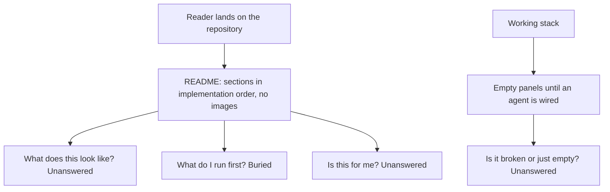
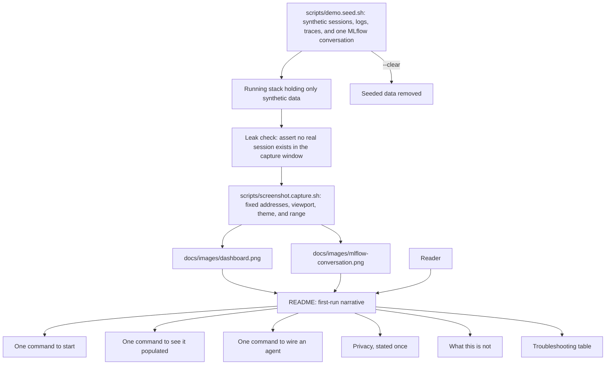
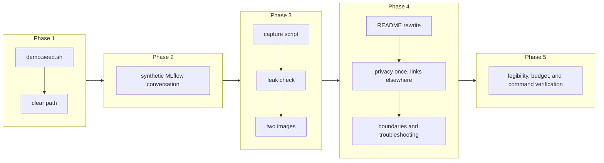

# Project README, Screenshots, and the First-Run Narrative

## Change Summary

By the time the first six change requests are implemented, the project works and its README is a collection of sections written by six different pieces of work. A person landing on the repository needs something else: a page that shows what they get, tells them what to run, and gets out of the way.

This change rewrites the README as one first-run narrative and adds the two screenshots the project needs to be legible: the baseline dashboard, and an agent conversation in the MLflow interface. Both are captured by a script from seeded synthetic data, so they are reproducible, they can be regenerated when the interfaces change, and they contain no real prompt content and no real identity.

## Motivation and Background

An observability project is judged on a picture. A reader deciding whether to spend twenty minutes on this repository will scroll, look at the images, and decide. A page that describes panels in prose without showing them asks the reader to imagine the product, which nobody does.

There is a second reason the screenshots matter more here than usual. The two things this project does that a plain telemetry stack does not are the agent-specific dashboard and the readable conversation view. Neither is obvious from a feature list. Both are obvious in an image.

The screenshots also carry a hazard that must be designed around rather than handled carefully. Real telemetry from this stack contains user prompts, assistant responses, tool input and output, and, on the metrics side, an email address and several user identifiers. A screenshot taken from the author's own machine would leak some subset of that into a public repository forever, and a careful hand-crop is not a control, because the next person to regenerate the image will not know which region was sensitive. The only durable answer is to generate the images from data that was never real: a seeded synthetic dataset, produced by a script, captured by a script.

That seeding has a second use that justifies it independently. A user who has started the stack but has not yet wired an agent sees empty panels and has no way to tell a working stack from a broken one. A demo seeding command fills the stack with plausible synthetic telemetry so the user can see every view populated within a minute of cloning, then clear it.

## Change Drivers

* A reader decides whether to try the project from the images, and there are none.
* The two capabilities that differentiate this project are visual and are not conveyed by a feature list.
* Real telemetry contains prompt content and user identity, so screenshots cannot be taken from a real machine.
* A hand-captured screenshot cannot be regenerated faithfully when an interface changes, so it rots.
* A user with an empty stack cannot tell working from broken, and a demo dataset answers that in one command.
* The README currently accumulates one section per change request rather than reading as one document.

## Current State

After the first six change requests the repository contains a working stack, a provisioned dashboard, a published pi package, MLflow conversation tracing, an agent interface, and an agent-driven installation path. The README has grown by accretion: each change added the section it owed, in the order the changes were made.

Specifically:

* There are no images anywhere in the repository, and no directory for them.
* There is no way to produce telemetry without running a real agent with real prompts.
* The README's opening does not say what the project is in a form a stranger can absorb in fifteen seconds.
* The order of sections follows the implementation history, not the reader's path.
* The privacy posture is stated correctly in several places and never in one place a reader will certainly see.
* Nothing tells a reader what the project deliberately does not do, which is the fastest way to lose the readers it does not suit and keep the ones it does.

### Current State Diagram



## Proposed Change

Rewrite the README around the reader, and generate the images from data that was never real.

1. **A synthetic telemetry generator.** `scripts/demo.seed.sh` writes a plausible dataset into the running stack: several days of sessions for both agents across a handful of invented repositories and branches, with costs, token counts split by type, tool decisions, lines of code, commits, and pull requests, plus matching log events and traces. Every value is invented. Prompts and responses are short, obviously synthetic sentences about a fictional task. No email address, no user identifier, and no real repository name appears anywhere. A matching `--clear` flag removes the seeded data so a user can return to a clean stack.

2. **A seeded conversation for the MLflow image.** The same script, or a sibling with the same conventions, writes one synthetic conversation into the MLflow tracking server through its own interface: a short multi-turn exchange with tool calls, token counts, costs, and latencies, shaped exactly like a real traced session but containing invented content. This is what the MLflow screenshot shows.

3. **Scripted, reproducible capture.** `scripts/screenshot.capture.sh` drives a headless browser to a fixed set of addresses at a fixed viewport size, waits for the views to settle, and writes the images to a fixed set of paths. It is run after seeding and before clearing. Because the addresses, the viewport, the theme, and the time range are all fixed by the script, regenerating the images after an interface change produces comparable pictures rather than differently-cropped ones.

4. **Two images, at least.** The baseline dashboard showing populated panels across all four of its rows, and an MLflow conversation showing the turn and tool structure with its token and cost detail. Both are captured in a single theme chosen for legibility on a repository page, and both are stored under `docs/images/` with descriptive names, kept within a size budget so the repository does not grow awkward.

5. **A leak check that runs on every capture.** After capture, the script asserts that no image was produced from unseeded data: it verifies that the stack held only seeded content at capture time, and it fails if any real agent session exists in the window being captured. This is a control rather than a habit, because the habit fails exactly once and the failure is permanent.

6. **The README as a first-run narrative,** in the reader's order rather than the implementation's:
   * What this is, in three sentences, with the two screenshots immediately after.
   * What you get, as a short list of capabilities rather than components.
   * Prerequisites, which is Docker and nothing else.
   * Start, in one command, and verify, in one command.
   * See it populated without wiring anything, using the demo seed.
   * Wire your agent, which is the one command from the installation path, with the manual alternative linked rather than inlined.
   * Read your data: the dashboard, the query recipes, the conversation view, and how an agent uses them.
   * Privacy, in one place, stated plainly, covering what is stored, where, what is off by default, and how to delete it.
   * What this is not, naming the boundaries honestly.
   * How it fits together, with the data-flow diagram.
   * Troubleshooting, in a table of symptom, cause, and fix.
   * Contributing, licensing, and the components with their versions.

7. **One statement of the privacy posture, in the reader's path.** The privacy section is written once, in full, in the README, and every other document links to it rather than restating it. Restated privacy text drifts, and drifted privacy text is worse than a single link.

8. **An honest boundaries section.** The README states what the project does not do: it is a single-user local stack, not a multi-tenant deployment; it has no alerting; it has no retention policy; conversation tracing covers one agent and not the other; and it is not a hosted service. A reader who needs those things learns it in ten seconds instead of an hour.

9. **A troubleshooting table.** Every failure the earlier changes anticipated, collected in one place as symptom, cause, and fix: the port is in use, the stack is running but panels are empty, metrics are missing while logs arrive, the agent was configured but nothing appears, conversation tracing stopped after the clone was moved, and no MLflow client can be resolved.

### Proposed State Diagram



## Requirements

### Functional Requirements

1. The repository **MUST** contain `scripts/demo.seed.sh` that writes a synthetic telemetry dataset into the running stack covering metrics, logs, and traces for both agents.
2. The seeded dataset **MUST** contain no real repository name, no real email address, no user identifier, and no real prompt or response content.
3. The seed script **MUST** support a clear flag that removes the seeded data.
4. The repository **MUST** be able to seed one synthetic multi-turn conversation into the MLflow tracking server, containing turns, tool calls, token counts, costs, and latencies.
5. The repository **MUST** contain `scripts/screenshot.capture.sh` that captures the required images at a fixed viewport, theme, time range, and set of addresses.
6. The capture script **MUST** write the images to fixed paths under `docs/images/`.
7. The capture script **MUST** verify, before capturing, that the stack contains no real agent session within the window being captured, and **MUST** fail rather than capture if one is found.
8. The repository **MUST** contain a screenshot of the baseline dashboard showing populated panels from every row.
9. The repository **MUST** contain a screenshot of a coding-agent conversation in the MLflow interface showing its turn and tool structure.
10. Both images **MUST** appear in the README near its beginning, each with descriptive alternative text.
11. Each image **MUST** stay within a stated size budget, and the README **MUST** state that budget so a contributor regenerating them knows it.
12. The README **MUST** open with a statement of what the project is that a stranger can absorb without prior context.
13. The README **MUST** state the prerequisites, which are Docker and nothing else.
14. The README **MUST** give the single command that starts the stack and the single command that verifies it.
15. The README **MUST** give the single command that populates the stack with demo data and the command that clears it.
16. The README **MUST** give the single command that wires the user's agent, and **MUST** link to the manual alternative rather than inlining it.
17. The README **MUST** contain one privacy section stating what is stored, where, what is off by default, and how to delete stored data, and every other document **MUST** link to it rather than restate it.
18. The README **MUST** contain a section stating what the project deliberately does not do.
19. The README **MUST** contain a troubleshooting table of symptom, cause, and fix covering every failure mode anticipated by the earlier changes.
20. The README **MUST** contain the data-flow diagram and a component table naming each component and its pinned version.
21. The README **MUST** contain contributing and licensing sections.
22. The README **MUST NOT** restate any procedure that a script performs; it **MUST** name the script instead.
23. The README **MUST NOT** contain a governance identifier.
24. Every command in the README **MUST** be executable as written on a machine with the stack running.

### Non-Functional Requirements

1. The demo seeding path **MUST** produce visibly populated dashboard panels within 60 seconds of being run.
2. The screenshots **MUST** be reproducible: running the capture script twice against the same seeded dataset **MUST** produce images showing the same views.
3. The images **MUST** be legible when viewed at the width a repository page renders them.
4. The total size of the committed images **MUST** stay within the stated budget.
5. The README **MUST** be readable end to end in under ten minutes.
6. The seeded data **MUST** be distinguishable from real data by an obvious marker, so a user who seeds and forgets can tell.

## Affected Components

* `scripts/demo.seed.sh` and `scripts/screenshot.capture.sh`, new.
* `docs/images/`, new, holding the committed screenshots.
* `README.md`, rewritten.
* Every other document that currently restates the privacy posture, edited to link to the README instead.

## Scope Boundaries

### In Scope

* The synthetic telemetry generator and its clear path.
* The synthetic MLflow conversation.
* The scripted, reproducible capture and its leak check.
* The two required screenshots.
* The full README rewrite as a first-run narrative, including privacy, boundaries, troubleshooting, and components.
* Removing restated privacy text from other documents in favour of a link.

### Out of Scope ("Here, But Not Further")

* Any change to the dashboard, the stack, the package, or the installation path. This change documents and photographs them; if a screenshot reveals a weak panel, that is a change request against the dashboard.
* A project website, a documentation site, or a hosted demonstration.
* Animated captures or video.
* Screenshots of anything beyond the two required views. Others may be added later; two is what the project needs to be legible.
* Translations.
* A published changelog for the repository as a whole. The pi package has one; the repository does not need one for a first release.

## Alternative Approaches Considered

* **Capture screenshots by hand from the author's machine and redact them.** Rejected: redaction is a habit rather than a control, it fails permanently the one time it is forgotten, and a hand capture cannot be regenerated faithfully later.
* **Capture from a real machine but with content logging disabled.** Rejected: it removes prompt content from logs but not user identity from metric labels, and the conversation screenshot requires conversation content to exist at all.
* **Draw mock-ups instead of capturing real interfaces.** Rejected: a mock-up that flatters the product is dishonest, and one that does not is pointless.
* **Use the Grafana server-side rendering plugin instead of a headless browser.** Rejected as the default: it requires adding a plugin to the pinned image and it cannot capture the MLflow interface, so a browser is needed regardless and one mechanism is better than two.
* **Skip the demo seeding and screenshot an author's session with invented prompts typed by hand.** Rejected: it produces one unrepeatable image and no reusable capability, whereas seeding gives the user a demonstration mode as well.
* **Keep the accreted README and add images to it.** Rejected: the section order follows the implementation history, which is not the order a reader needs.

## Impact Assessment

### User Impact

A reader sees what the project does within seconds. A user who has started the stack can populate it with one command and see every view working before wiring anything. A user diagnosing a problem finds a troubleshooting table instead of a search through prose. A user whose needs the project does not meet finds that out immediately.

### Technical Impact

Two new scripts, one of which drives a headless browser, which is the most environment-sensitive thing in the repository. Committed images add weight to the repository, bounded by the stated budget. The seeding script writes to the same stores as real telemetry, so its marker and its clear path matter: a user who seeds and forgets must be able to tell and to undo.

Screenshots couple to interface appearance, so a Grafana or MLflow upgrade dates them. The capture script is what makes regeneration cheap enough to actually happen.

### Business Impact

This is the change that determines whether anyone tries the project. Effort is moderate and mostly in the seeding generator. The main risk is reputational and one-directional: a leaked prompt or an email address in a committed image cannot be recalled once published, which is why the leak check is a requirement rather than a practice.

## Implementation Approach

### Phase 1: The synthetic dataset

Write `scripts/demo.seed.sh`. Emit metrics, logs, and traces for both agents across several invented repositories and branches over several days, with an obvious marker distinguishing seeded data. Verify every dashboard panel populates. Implement and verify the clear path.

### Phase 2: The synthetic conversation

Seed one multi-turn conversation into the MLflow tracking server with tool calls, tokens, costs, and latencies, and confirm it renders in the interface as a conversation rather than as a bare run.

### Phase 3: Capture

Write `scripts/screenshot.capture.sh` with fixed viewport, theme, time range, and addresses, and with the leak check that refuses to capture when real sessions exist in the window. Capture both images and confirm that a second run produces the same views.

### Phase 4: README rewrite

Rewrite the README in the reader's order. Place the images near the top with alternative text. Write the privacy section once and replace every restatement elsewhere with a link. Write the boundaries section and the troubleshooting table. Verify every command in the document by running it.

### Phase 5: Final pass

Confirm the images are legible at rendered width and within budget, that the README reads end to end in under ten minutes, that no governance identifier appears, and that a fresh reader can follow it from clone to populated dashboard without leaving the page.

### Implementation Flow



## Test Strategy

The deliverables are two scripts, two images, and a document. The scripts are tested by assertion, the images by inspection against stated criteria, and the document by executing every command it contains.

### Tests to Add

| Test File | Test Name | Description | Inputs | Expected Output |
|-----------|-----------|-------------|--------|-----------------|
| `scripts/demo.seed.sh` | `populates_every_dashboard_row` | Asserts every dashboard row has a populated panel after seeding | Running stack | Exit 0; no empty row |
| `scripts/demo.seed.sh` | `contains_no_identity_or_real_content` | Asserts the seeded data contains no email address, user identifier, or real repository name | Seeded stores | Exit 0; zero matches |
| `scripts/demo.seed.sh` | `marks_seeded_data` | Asserts every seeded series and stream carries the marker | Seeded stores | Exit 0; marker present |
| `scripts/demo.seed.sh` | `clear_removes_seeded_data` | Asserts the clear path removes what seeding added | Seeded stack | Exit 0; zero seeded series remain |
| `scripts/demo.seed.sh` | `seeds_mlflow_conversation` | Asserts a multi-turn conversation with tool calls exists in MLflow after seeding | Running stack | Exit 0; conversation present |
| `scripts/screenshot.capture.sh` | `refuses_when_real_sessions_present` | Asserts capture is refused when a real session exists in the window | Stack with a real session | Non-zero exit; nothing written |
| `scripts/screenshot.capture.sh` | `writes_expected_images` | Asserts both images are written to their fixed paths | Seeded stack | Exit 0; both files exist |
| `scripts/screenshot.capture.sh` | `images_within_budget` | Asserts each image is within the stated size budget | Captured images | Exit 0 |
| `scripts/screenshot.capture.sh` | `capture_is_reproducible` | Asserts a second capture produces images of the same views | Seeded stack | Exit 0; same views |
| `scripts/readme.verify.sh` | `every_command_runs` | Extracts and runs every command in the README | README, running stack | Exit 0; each command exits 0 |
| `scripts/readme.verify.sh` | `no_governance_identifier` | Asserts no governance identifier appears | README | Exit 0; zero matches |
| `scripts/readme.verify.sh` | `privacy_stated_once` | Asserts other documents link to the README privacy section rather than restating it | Repository documents | Exit 0; zero restatements |
| `scripts/readme.verify.sh` | `images_referenced_with_alt_text` | Asserts both images are referenced with non-empty alternative text | README | Exit 0 |

### Tests to Modify

| Test File | Test Name | Current Behavior | New Behavior | Reason for Change |
|-----------|-----------|------------------|--------------|-------------------|
| `scripts/agents-md.verify.sh` | privacy statement assertions | Asserts the instruction file states the privacy rules | Asserts it states the agent-facing rules and links to the README for the posture | Privacy is stated once in the README and linked elsewhere |

### Tests to Remove

Not applicable.

## Acceptance Criteria

### AC-1: One command populates every view (covers FR1, FR3, NFR1)

```gherkin
Given a running stack with no telemetry
When the user runs the demo seed command
Then within 60 seconds every dashboard row shows a populated panel
  And running the clear command afterwards removes the seeded data
```

### AC-2: Seeded data is synthetic and marked (covers FR2, NFR6)

```gherkin
Given the seeded dataset
When it is searched for email addresses, user identifiers, and real repository names
Then zero matches are found
  And every seeded series and stream carries a marker identifying it as demonstration data
```

### AC-3: Capture refuses to photograph real data (covers FR7)

```gherkin
Given a stack containing a real agent session within the capture window
When the capture script is run
Then it exits non-zero
  And no image file is written
```

### AC-4: Both required screenshots exist and are shown (covers FR5, FR6, FR8, FR9, FR10)

```gherkin
Given the repository
When the README is rendered
Then a screenshot of the baseline dashboard with populated panels from every row appears near the beginning
  And a screenshot of an agent conversation in the MLflow interface showing turns and tool calls appears near the beginning
  And each has descriptive alternative text
```

### AC-5: Screenshots are reproducible (covers NFR2)

```gherkin
Given the same seeded dataset
When the capture script is run twice
Then both runs produce images showing the same views at the same viewport and theme
```

### AC-6: Images are legible and within budget (covers FR11, NFR3, NFR4)

```gherkin
Given the committed images
When they are viewed at the width a repository page renders them
Then panel titles and values are legible
  And each image is within the stated size budget
  And the README states that budget
```

### AC-7: The README answers the reader's first three questions immediately (covers FR12, FR13, FR14)

```gherkin
Given a reader who has never seen this project
When the reader opens the README
Then within the first screen they learn what it is, see what it looks like, and find the command that starts it
  And the prerequisites state Docker and nothing else
```

### AC-8: The path from clone to wired agent is three commands (covers FR14, FR15, FR16)

```gherkin
Given the README
When a user follows it
Then one command starts the stack, one verifies it, and one wires their agent
  And the manual alternative is linked rather than inlined
```

### AC-9: Privacy is stated once, completely (covers FR17)

```gherkin
Given the repository documents
When privacy is looked for
Then the README states what is stored, where, what is off by default, and how to delete it
  And every other document links to that section rather than restating it
```

### AC-10: The boundaries are stated (covers FR18)

```gherkin
Given the README
When a reader with different needs reads it
Then a section states that the project is single-user and local, has no alerting, has no retention policy, covers conversation tracing for one agent only, and is not a hosted service
```

### AC-11: Troubleshooting is a table, not a search (covers FR19)

```gherkin
Given the README
When a user meets a failure
Then a table lists the symptom, the cause, and the fix
  And it covers the port conflict, empty panels, missing metrics with arriving logs, a configured agent producing nothing, tracing stopping after the clone moved, and no resolvable MLflow client
```

### AC-12: Every command in the README works (covers FR22, FR24)

```gherkin
Given a machine with the stack running
When every command in the README is extracted and run
Then each exits successfully
  And no procedure is restated that a script already performs
```

### AC-13: The document is clean and complete (covers FR20, FR21, FR23, NFR5)

```gherkin
Given the README
When it is reviewed
Then it contains the data-flow diagram and a component table with pinned versions
  And it contains contributing and licensing sections
  And it contains no governance identifier
  And it can be read end to end in under ten minutes
```

## Quality Standards Compliance

### Build & Compilation

- [ ] Both scripts run without error against a working stack
- [ ] Every Mermaid diagram in the README renders

### Linting & Code Style

- [ ] `shellcheck` passes with zero warnings on both added scripts
- [ ] The README contains no dashed em-dash
- [ ] Both scripts carry a top docstring and one `@agents-index` line

### Test Execution

- [ ] Every assertion in the test strategy passes
- [ ] `scripts/readme.verify.sh` exits 0
- [ ] Every previously added verification script still exits 0

### Documentation

- [ ] The README follows the reader's order and covers every required section
- [ ] Privacy appears once and is linked from elsewhere
- [ ] The troubleshooting table covers every anticipated failure mode

### Code Review

- [ ] Changes submitted via pull request
- [ ] PR title follows Conventional Commits format
- [ ] Code review completed and approved
- [ ] Changes squash-merged to maintain linear history

### Verification Commands

```bash
# Populate every view with synthetic data
./scripts/demo.seed.sh

# Capture both images, refusing if any real session is in the window
./scripts/screenshot.capture.sh

# Clear the synthetic data again
./scripts/demo.seed.sh --clear

# Every command in the README runs, no governance identifiers, privacy stated once
./scripts/readme.verify.sh

# No identity or real content anywhere in the committed images directory metadata
grep -rniE 'user_email|user_id|organization_id' docs/images ; test $? -eq 1

# Image size budget
find docs/images -name '*.png' -size +1M ; test -z "$(find docs/images -name '*.png' -size +1M)"

# Script lint
shellcheck scripts/demo.seed.sh scripts/screenshot.capture.sh scripts/readme.verify.sh
```

## Risks and Mitigation

### Risk 1: A screenshot leaks real prompt content or a user identity

**Likelihood:** low with the leak check, high without it
**Impact:** high and irreversible once published
**Mitigation:** Images are captured only from seeded synthetic data, the capture script refuses to run when a real session exists in the window, and the seeded dataset is asserted to contain no identity or real content. Three controls, because the failure cannot be undone.

### Risk 2: The headless browser behaves differently across machines

**Likelihood:** medium
**Impact:** medium; a contributor cannot regenerate the images
**Mitigation:** The browser runs from a pinned container image at a fixed viewport, so the environment is part of the script rather than part of the machine.

### Risk 3: Screenshots date as the interfaces change

**Likelihood:** high over time
**Impact:** low to medium
**Mitigation:** Regeneration is one seed command and one capture command, which is cheap enough to actually be done. The capture script fixes the addresses, theme, and range so a regenerated image is comparable to the one it replaces.

### Risk 4: A user seeds demonstration data and forgets

**Likelihood:** medium
**Impact:** medium; synthetic data mixed with real data misleads
**Mitigation:** Every seeded series and stream carries a marker, the clear path removes exactly what was seeded, and the README states both.

### Risk 5: The README grows back into an accreted document

**Likelihood:** medium over time
**Impact:** low
**Mitigation:** The reader-order structure is stated in the document, the no-restatement rule is asserted by a verification script, and procedures live in scripts that the README names rather than repeats.

### Risk 6: The demo dataset flatters the product

**Likelihood:** medium; invented data is easy to make look good
**Impact:** medium; a user's real data then looks disappointing by comparison
**Mitigation:** The seeded dataset includes unflattering realities: rejected tool decisions, an error event, and uneven cost across repositories. The point of the picture is to be representative, not to be a best case.

## Dependencies

* CR-0001 through CR-0006, all of them. This change photographs and documents the finished product, so it is implemented last.
* A container image providing a headless browser for capture.
* A running stack for seeding, capture, and command verification.

## Estimated Effort

Roughly 14 to 20 person-hours: 6 for the synthetic dataset generator including the MLflow conversation, 4 for the capture script and its leak check, 6 for the README rewrite and the verification script, and 2 for the final legibility and budget pass.

## Decision Outcome

Chosen approach: "generate the screenshots from a seeded synthetic dataset with a scripted, reproducible capture, and rewrite the README in the reader's order", because the images are what determine whether anyone tries the project and because capturing them from real data would risk a permanent leak of prompt content and user identity. Seeding is chosen over redaction because a control that runs every time beats a habit that has to be remembered every time, and because the seeding capability independently answers a real user question: whether an empty stack is broken.

## Related Items

* CR-0001: the stack, its verification, and the privacy posture the README states.
* CR-0002: the dashboard photographed in the first screenshot.
* CR-0003: the published package documented in the components section.
* CR-0004: the conversation capability photographed in the second screenshot.
* CR-0005: the agent interface documented in the reading-your-data section.
* CR-0006: the installation path that is the README's one wiring command.
