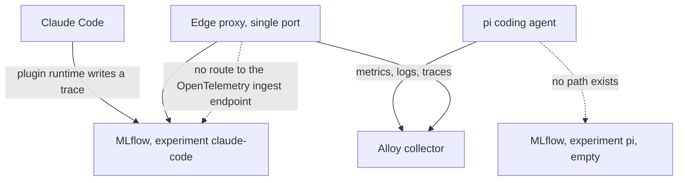
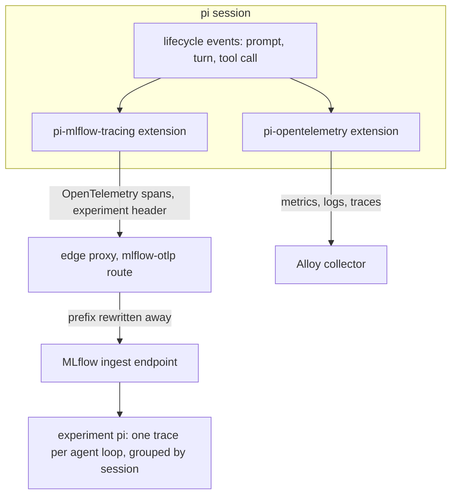
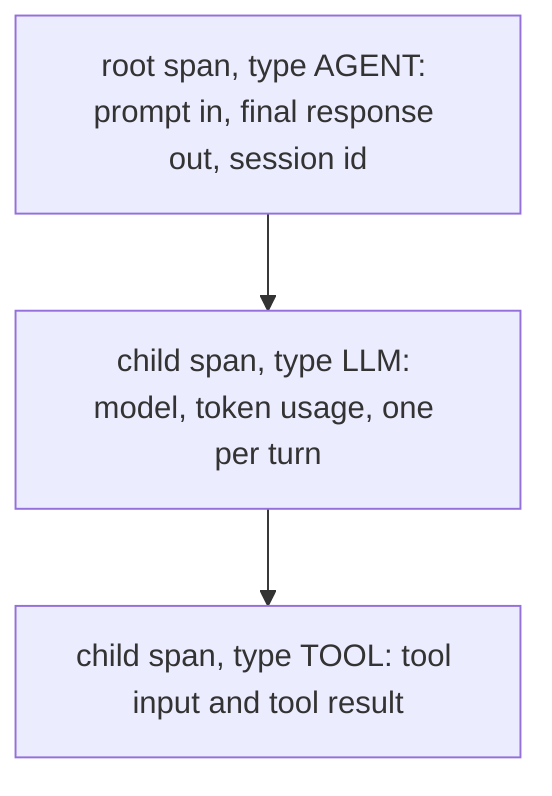
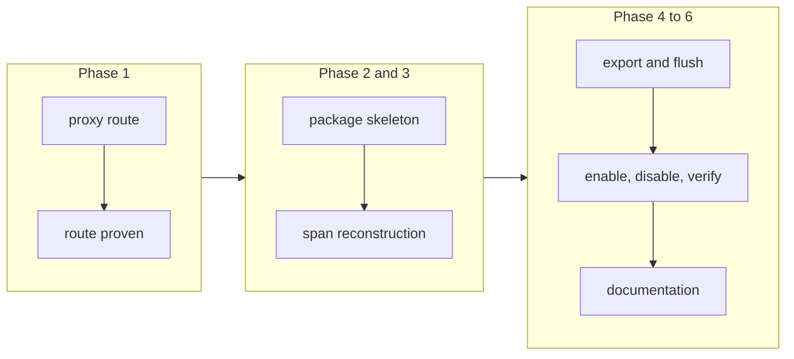

# Conversation Tracing for pi Through a Custom Extension

## Change Summary

The stack can show a Claude Code conversation back to the user and cannot show a pi conversation, because MLflow's conversation tracing reaches Claude Code through a plugin that Claude Code has and pi does not. pi's own extension system can close that gap without any change to pi itself.

This change adds a second pi extension package, `@desek/pi-mlflow-tracing`, that turns pi's lifecycle events into an OpenTelemetry span tree and exports it to an MLflow tracking server whose address is configurable and defaults to this project's local stack. It also adds the edge-proxy route that makes the local ingest endpoint reachable, because that endpoint is served outside the MLflow static prefix and the path it uses is already routed to Alloy. The package is prepared for release but is not published here; publication waits for the repository's release automation.

## Motivation and Background

The project claims to be the observability stack for coding agents, plural. One capability breaks that claim today. A Claude Code user can open MLflow and read a whole conversation back, turn by turn, with the tool calls nested under the turns that made them. A pi user opens the same MLflow, finds the `pi` experiment that the stack provisions for them, and finds it empty. Nothing writes to it and nothing ever will, because the integration on the Claude Code side is a marketplace plugin for Claude Code.

The metrics and the logs do not substitute for this. Mimir answers what a week cost. Loki holds the prompts and the responses but reads them back as interleaved log lines with no notion of a thread. The question users ask most, what actually happened in that session, is the one question only a trace view answers well.

pi does not need to change for this to work. Its extension system already emits every event the reconstruction needs: the user prompt before the agent loop starts, each turn's assistant message with its token usage, each tool call with its input and its result, and the end of the loop. This repository already publishes one pi extension built on those events, so the pattern, the packaging, and the release path are proven rather than speculative.

The delivery detail that decides the design was settled by reading the running MLflow rather than by assuming it. MLflow 3.14 accepts OpenTelemetry spans directly. A client posts an OpenTelemetry trace export request and the server creates the trace, derives its preview text from reserved span attributes, and groups traces by a session identifier read off the root span. This means the extension does not need an MLflow client, a Python environment, or a bespoke wire format. It needs an OpenTelemetry exporter, which the sibling package already depends on.

Conversation content is the most sensitive data this project touches, and this change is the one that writes it. Every design choice below that looks conservative is there for that reason: the extension records nothing until a switch is set, it never invents a destination, and turning it off is one command that stops the export.

## Change Drivers

* The `pi` experiment is provisioned and permanently empty, so the stack advertises a capability to pi users that it does not deliver.
* Claude Code reaches MLflow through a plugin runtime pi does not have, so the existing enable path cannot be pointed at pi.
* pi's extension system already emits the prompt, the turns, the token usage, and the tool calls, so the reconstruction needs no change to pi.
* MLflow 3.14 ingests OpenTelemetry spans directly, so no MLflow client and no Python environment is needed on the user's machine.
* MLflow's ingest endpoint is served outside its static prefix, on a path the edge proxy already gives to Alloy, so the route must be added deliberately rather than discovered by a failing export.
* Conversation content demands an explicit opt-in, a stated disclosure, and a reversal that works.

## Current State

The stack runs MLflow 3.14.0 behind the single edge port under the `/mlflow` prefix. Provisioning creates two agent experiments at stack start: `claude-code` with id `1` and `pi` with id `2`. A script enables Claude Code conversation tracing through the MLflow client's own command, and a verifier asserts that a trace in an agent experiment carries both the user turn and the assistant turn.

This repository also publishes `@desek/pi-mlflow-tracing`'s sibling, `@desek/pi-opentelemetry`, a pi extension that exports metrics, log events, and OpenTelemetry traces over OTLP to the Alloy collector. It reads its configuration from the environment, derives git provenance, probes collector health before enabling itself by default, and wraps every handler so a telemetry fault cannot break the agent loop.

What is missing:

* No component writes a conversation to MLflow for pi. The `pi` experiment holds no traces and no code path produces one.
* The edge proxy has no route to MLflow's OpenTelemetry ingest endpoint. That endpoint is served at the unprefixed path `/v1/traces`, which the proxy routes to Alloy, and the same path under the `/mlflow` prefix returns 404.
* The enable path, the disclosure, and the disable path exist for Claude Code only.
* The tracing verifier can already assert against any experiment by name, but it can only drive a real turn through the `claude` command.

### Current State Diagram



### What MLflow 3.14 actually provides, verified 2026-08-02

Verified by reading the installed server inside the running container, and by one probe request that was deleted afterwards.

* The server exposes an OpenTelemetry trace ingest endpoint at the path `/v1/traces`. It accepts `application/x-protobuf` and `application/json`, and it requires the header `x-mlflow-experiment-id`. A request with no spans is rejected with 400, which makes a wrong payload loud rather than silent.
* That endpoint is **not** served under the `--static-prefix=/mlflow` prefix. A request to `/mlflow/v1/traces` returns 404 and a request to `/v1/traces` inside the container returns the endpoint.
* Reserved span attributes carry the conversation. `mlflow.spanInputs` and `mlflow.spanOutputs` become the trace's request preview and response preview. `mlflow.spanType` classifies the span. `mlflow.chat.tokenUsage` carries token counts and `mlflow.llm.model` the model. Their values are JSON-encoded, so a plain string value is a quoted JSON string.
* A `session.id` attribute on the root span becomes the trace's session metadata, which is what groups the traces of one pi session together in the user interface.
* A probe span posted as OpenTelemetry JSON produced a trace whose request preview, response preview, and session metadata all read back correctly through the version 3 trace search endpoint.

## Proposed Change

Add a second published pi extension package and the one route it needs.

1. **A new package, one purpose.** `packages/pi-mlflow-tracing/`, prepared for publication as `@desek/pi-mlflow-tracing` under Apache-2.0, carrying the `pi-package` keyword so it appears in the pi package gallery. It keeps the sibling package's layout: one concern per file, a sibling test file for every source file, the Node built-in test runner, and no build step beyond what publication proves is needed. The package is publication-ready but is not published by this change; its first release comes through the repository's release automation.

2. **Reconstruct the conversation from pi's own events.** The extension subscribes to `before_agent_start` for the prompt, `turn_end` for each assistant turn and its token usage, `tool_execution_start` and `tool_execution_end` for each tool call, and `agent_end` to close and export. One agent loop produces one MLflow trace: a root span holding the prompt and the final assistant text, a child span per turn, and a child span per tool call under the turn that called it.

3. **Export as OpenTelemetry, not as an MLflow client.** The extension holds its own tracer provider and exporter, pointed at the MLflow ingest endpoint, with the experiment identifier sent as a header. It does not share the sibling package's provider, because the two exports go to different backends with different attribute conventions and a shared provider would send each backend the other's spans.

4. **Route the ingest endpoint through the single port.** The edge proxy gains one route so the endpoint is reachable without publishing a second port. The route uses a distinct prefixed path that the backend rewrites away, following the pattern the Tempo backend already uses, because the unprefixed path belongs to Alloy and must keep belonging to Alloy.

5. **A configurable destination that defaults to this project's stack.** The tracking address, the ingest endpoint, the experiment name, and any extra request headers are all read from the environment. Every default resolves to this project's local stack: the ingest endpoint and the tracking address are built from the edge port, and the experiment defaults to `pi`. A user who runs this stack sets nothing but the master switch. A user who runs a tracking server elsewhere sets the endpoint and reaches it without a code change.

6. **Off until the user turns it on.** A master switch decides. With the switch unset the extension registers no handler, opens no socket, and costs nothing. With the switch set and no reachable tracking server the extension stays silent rather than retrying into a dead endpoint.

7. **A destination outside this machine is stated, never silent.** The default destination is the loopback edge port. Configuring any other host means conversation content leaves the machine, so the extension names the resolved destination once at session start when it is not loopback, and the enable script states it in its disclosure.

8. **The same enable, disclose, disable path pi's neighbour already has.** A script enables and disables tracing for pi, states what will be recorded and where before it records anything, and derives the default address from the edge port rather than hard-coding it.

### Proposed State Diagram



### Span shape



## Requirements

### Functional Requirements

1. The repository **MUST** contain a new package at `packages/pi-mlflow-tracing/` named `@desek/pi-mlflow-tracing`, licensed Apache-2.0, carrying the `pi-package` keyword, with a repository field, a homepage, a bugs URL, an explicit files list, and public publish access.
2. The extension **MUST** register no event handler, create no exporter, and open no network connection when its master switch is unset or false.
3. The extension **MUST** produce exactly one MLflow trace per pi agent loop, opened from `before_agent_start` and exported at `agent_end`.
4. The root span of each trace **MUST** carry the user prompt in `mlflow.spanInputs` and the final assistant text in `mlflow.spanOutputs`, both as JSON-encoded values.
5. The root span **MUST** carry a `session.id` attribute derived from pi's session identity, so the traces of one session group together in MLflow.
6. The extension **MUST** emit one child span per turn, carrying the model identifier in `mlflow.llm.model` and the turn's token counts in `mlflow.chat.tokenUsage`.
7. The extension **MUST** emit one child span per tool call, parented to the turn that issued it, carrying the tool name, the tool input, and the tool result.
8. The extension **MUST** send every export to the MLflow ingest endpoint with the header `x-mlflow-experiment-id` set to the resolved experiment identifier.
9. The extension **MUST** resolve the experiment by name, read from the environment and defaulting to `pi`, and **MUST** refuse to export rather than guess when the name resolves to no experiment.
10. The extension **MUST** read its ingest endpoint, its tracking address, its experiment name, and any extra request headers from the environment, and **MUST** use the configured value in preference to any default.
11. The extension **MUST** default every one of those values to this project's local stack, building the ingest endpoint and the tracking address from the edge port read from the environment, and **MUST NOT** hard-code the port.
12. The extension **MUST** name the resolved destination once at session start when that destination is not a loopback address, so a user who sends conversation content off the machine is told that it happens.
13. The extension **MUST** reject a configured endpoint that is not a valid absolute URL, and **MUST** state the value it rejected and the form it expects.
14. This change **MUST NOT** publish the package to a registry. The package **MUST** reach a registry only through the repository's release automation.
15. The edge proxy **MUST** route a distinct prefixed path to the MLflow ingest endpoint, rewriting the prefix away in the backend, and **MUST NOT** change the existing routing of the unprefixed OpenTelemetry paths to Alloy.
16. The extension **MUST** stay silent, with no repeated connection attempts and no error output, when the tracking server is not reachable.
17. The repository **MUST** provide one script that enables and disables pi conversation tracing, states what will be recorded and to which destination before any change, and reverses the change on disable.
18. The tracing verifier **MUST** gain a mode that drives one real pi turn and then asserts that the `pi` experiment holds a trace carrying both the user turn and the assistant turn.
19. Every failure the extension surfaces to the user **MUST** name what failed, the fixes available, and what to check afterwards.
20. The package **MUST** ship a README written for a reader who has not seen this repository, and a changelog produced by the repository's release automation.
21. The user-facing documentation **MUST** state what conversation tracing records for pi, where it is stored, that it is off by default, how to point it at another tracking server, and how to delete stored traces.
22. The package **MUST** run its tests under the Node built-in test runner with no test framework dependency, matching the sibling package.

### Non-Functional Requirements

1. A telemetry fault **MUST NOT** crash pi, block its agent loop, or change its output; every handler body is wrapped so an error is swallowed.
2. The extension **MUST NOT** add measurable latency to a turn; the export happens after the loop ends and never inside it.
3. The extension **MUST NOT** hold conversation content after an export completes or after the session ends.
4. The extension **MUST** flush pending exports on session shutdown, so the last conversation of a session is not lost.
5. Conversation content **MUST NOT** leave the machine unless the user configures a destination that is not loopback; the default destination is the local tracking server through the loopback edge port, and a configured non-loopback destination is named to the user.
6. The extension **MUST** be a no-op on a machine that does not run this stack, with no crash and no error output.

## Affected Components

* New package `packages/pi-mlflow-tracing/` with its manifest, license, README, changelog, source, and tests.
* The edge proxy configuration in `stack/haproxy/haproxy.cfg`.
* `scripts/`: a new enable and disable script for pi, and a pi drive mode in the tracing verifier.
* The release configuration, which gains a second package to version and release.
* User-facing documentation: the privacy document, the reading-data document, the install document, and the agent guide.
* The continuous integration pipeline, which runs the new package's tests and the proxy validation.

## Scope Boundaries

### In Scope

* A pi extension package that writes pi conversations to an MLflow tracking server, defaulting to this project's local stack.
* The configuration surface for the destination: ingest endpoint, tracking address, experiment name, and extra headers.
* The edge-proxy route that makes MLflow's ingest endpoint reachable through the single port.
* The enable, disclose, and disable path for pi, and the verification that proves a real pi turn lands.
* Documentation of what is recorded, where, and how to remove it.

### Out of Scope ("Here, But Not Further")

* Publishing the package to npm. Publication waits for the repository's release automation, and the release tooling itself is a separate change.
* Authentication against a remote tracking server beyond passing user-supplied request headers. This change carries headers; it does not manage credentials.
* Changing anything about Claude Code conversation tracing, which already works through its own plugin.
* Changing `@desek/pi-opentelemetry`. The two packages stay independent and neither imports the other.
* Any destination that is not an MLflow tracking server. The endpoint is configurable, so the server can be remote, but the extension speaks the MLflow ingest contract and no other.
* Evaluation, scoring, labelling, or any other MLflow capability beyond trace ingestion.
* Backfilling conversations from pi session files that were recorded before this change.
* Any change to pi itself; the extension uses only the public extension interface.

## Alternative Approaches Considered

* **Extend `@desek/pi-opentelemetry` with a second exporter.** Rejected: it would couple an MLflow release to the OpenTelemetry parity package, and give every user of the parity package a dependency they did not ask for.
* **A repository-local extension loaded by path.** Rejected: every user would have to clone this repository and keep the clone at a fixed path forever, which is the friction the sibling package was published to remove.
* **Point the existing Alloy trace export at MLflow as a second destination.** Rejected: the parity spans use OpenTelemetry semantic conventions, not MLflow's reserved attributes, so MLflow would store traces with empty previews and no conversation content.
* **Write traces through the MLflow client rather than OpenTelemetry.** Rejected: it requires a Python environment on the user's machine, which is the friction the Claude Code enable path had to work around.
* **Route by header instead of by path.** The proxy could send an unprefixed ingest request to MLflow when the experiment header is present and to Alloy otherwise. Rejected as the default: a routing rule that depends on a header is invisible in a URL and hard to diagnose from a failing export.

## Impact Assessment

### User Impact

A pi user installs one package and sets one switch, and their conversations become readable in the same interface their Claude Code conversations already use. A user who does nothing sees no change: the extension is not installed, and if installed it is off.

The privacy consequence is real and is the reason for the disclosure. Enabling this stores every prompt, every response, and every tool input and output on the local machine until the user deletes it.

### Technical Impact

No breaking change. The new package is additive, the proxy gains one route without changing existing ones, and the existing verifier gains a mode without changing its current behaviour. The stack gains no new container and no new published port.

The one new coupling is to MLflow's ingest contract: the endpoint path, the experiment header, and the reserved attribute names. All three were read from the pinned server version rather than from documentation, and the pin is what keeps them true.

### Business Impact

The project's central claim, that this stack serves coding agents rather than one coding agent, stops having a hole in it. The cost is one more package to version, test, and release.

## Implementation Approach

### Phase 1: The route

Add the edge-proxy route to the MLflow ingest endpoint and prove it, so later phases export to something that exists. Validate the proxy configuration and confirm that the unprefixed OpenTelemetry paths still reach Alloy.

### Phase 2: Package skeleton

Create the package with its manifest, license, README, changelog, and a load-safe factory that reads configuration, resolves the enabled decision, and returns without registering anything when disabled.

### Phase 3: Conversation reconstruction

Build the span tree from pi's lifecycle events: root span per agent loop, child span per turn, child span per tool call, with the reserved MLflow attributes and the session identifier.

### Phase 4: Configuration and export

Read the endpoint, the tracking address, the experiment name, and the extra headers from the environment, defaulting each to this project's local stack. Wire the exporter to the resolved endpoint with the experiment header, resolve the experiment by name, export at the end of the agent loop, and flush at session shutdown. Name a non-loopback destination to the user and reject a malformed endpoint with an actionable message.

### Phase 5: Enable, disable, verify

Add the enable and disable script with its disclosure, and the pi drive mode in the tracing verifier.

### Phase 6: Documentation

Update the privacy, reading-data, and install documents, and the agent guide, to cover pi conversation tracing alongside the Claude Code path.

### Implementation Flow



## Test Strategy

### Tests to Add

| Test File | Test Name | Description | Inputs | Expected Output |
|-----------|-----------|-------------|--------|-----------------|
| `packages/pi-mlflow-tracing/src/config.env.test.ts` | `reads the switch and the endpoint` | Configuration is read from the environment and the address is derived from the edge port | Environment with and without the switch | Parsed configuration, no hard-coded port |
| `packages/pi-mlflow-tracing/src/config.env.test.ts` | `disabled without the switch` | The enabled decision is false when the switch is unset | Empty environment | Disabled |
| `packages/pi-mlflow-tracing/src/config.env.test.ts` | `defaults resolve to the local stack` | With nothing configured, the endpoint, the tracking address, and the experiment name resolve to this project's stack | Switch only, edge port set | Endpoint and address built from the edge port, experiment `pi` |
| `packages/pi-mlflow-tracing/src/config.env.test.ts` | `configured values override the defaults` | A configured endpoint, address, experiment, and headers win over the defaults | Fully configured environment | Configured values returned |
| `packages/pi-mlflow-tracing/src/config.env.test.ts` | `a malformed endpoint is rejected` | An endpoint that is not an absolute URL disables export and states the expected form | `not-a-url` | Disabled, message names the value and the form |
| `packages/pi-mlflow-tracing/src/config.env.test.ts` | `a non-loopback destination is flagged` | A destination outside this machine is marked so the extension can state it | Endpoint on a remote host | Destination marked as remote |
| `packages/pi-mlflow-tracing/src/index.test.ts` | `registers nothing when disabled` | A disabled extension subscribes to no event | Extension interface double, switch unset | Zero handler registrations |
| `packages/pi-mlflow-tracing/src/index.test.ts` | `a handler error never propagates` | A throwing emitter is swallowed | Emitter that throws on every call | Factory resolves, no error raised |
| `packages/pi-mlflow-tracing/src/trace.builder.test.ts` | `one agent loop makes one trace` | A prompt, two turns, and one tool call produce one root span with the right children | Synthetic event sequence | One root, two turn spans, one tool span |
| `packages/pi-mlflow-tracing/src/trace.builder.test.ts` | `prompt and response land in the reserved attributes` | Root span inputs and outputs are JSON-encoded reserved attributes | Prompt and final assistant text | `mlflow.spanInputs` and `mlflow.spanOutputs` set |
| `packages/pi-mlflow-tracing/src/trace.builder.test.ts` | `token usage lands on the turn span` | Turn token counts map to the reserved usage attribute | Turn message with usage | `mlflow.chat.tokenUsage` populated |
| `packages/pi-mlflow-tracing/src/trace.builder.test.ts` | `a tool call parents to its turn` | Tool spans nest under the turn that issued them | Interleaved tool events | Tool span parent is the turn span |
| `packages/pi-mlflow-tracing/src/trace.builder.test.ts` | `content is released after export` | No conversation content is retained once the trace is exported | Completed loop | Builder state empty |
| `packages/pi-mlflow-tracing/src/mlflow.exporter.test.ts` | `sends the experiment header` | Every export carries the experiment identifier header | Configured experiment id | Header present on the request |
| `packages/pi-mlflow-tracing/src/mlflow.exporter.test.ts` | `sends the configured extra headers` | User-supplied headers accompany the experiment header | One extra header | Both headers present |
| `packages/pi-mlflow-tracing/src/mlflow.experiment.test.ts` | `resolves the experiment by name` | The name resolves to an id through the tracking API | Experiment name `pi` | Resolved id |
| `packages/pi-mlflow-tracing/src/mlflow.experiment.test.ts` | `refuses to export on an unknown name` | An unresolvable name disables export rather than guessing an id | Name that does not exist | Export disabled, no request sent |
| `packages/pi-mlflow-tracing/src/mlflow.exporter.test.ts` | `silent when the server is absent` | An unreachable server produces no error output and no retry storm | Refused connection | No throw, no repeated attempts |
| `packages/pi-mlflow-tracing/src/package.manifest.test.ts` | `manifest is publishable` | License, keyword, files list, and publish access are correct | The manifest | All fields present |

### Tests to Modify

| Test File | Test Name | Current Behavior | New Behavior | Reason for Change |
|-----------|-----------|------------------|--------------|-------------------|
| `scripts/mlflow.tracing.verify.sh` | drive mode | Drives a turn through the `claude` command only | Drives a turn through `claude` or `pi`, selected by argument | The verifier must prove the pi path end to end |
| `scripts/pi-package.verify.sh` | package checks | Checks the one pi package | Checks both pi packages | A second published pi package exists |

### Tests to Remove

| Test File | Test Name | Reason for Removal |
|-----------|-----------|-------------------|
| Not applicable | Not applicable | This change is additive; no existing test covers behaviour that this change removes |

## Acceptance Criteria

### AC-1: The ingest endpoint is reachable through the single port (covers FR15)

```gherkin
Given the stack is running
When a client posts an OpenTelemetry trace export to the routed MLflow ingest path through the edge port
Then the tracking server accepts the request
  And a request to the unprefixed OpenTelemetry trace path still reaches the Alloy collector
```

### AC-2: An unconfigured install costs nothing (covers FR2, NFR6)

```gherkin
Given the extension is installed and the master switch is unset
When a pi session starts and a user runs a turn
Then the extension registers no event handler
  And no network connection is opened
  And pi produces its normal output with no error
```

### AC-3: One agent loop becomes one readable conversation (covers FR3, FR4, FR6, FR7)

```gherkin
Given tracing is enabled and the stack is running
When a user runs one pi turn that calls a tool
Then the pi experiment holds one new trace
  And its request preview shows the user prompt
  And its response preview shows the assistant response
  And the trace contains a turn span with the model and the token counts
  And the tool call appears as a span under that turn
```

### AC-4: The traces of one session group together (covers FR5)

```gherkin
Given tracing is enabled
When a user runs two turns in the same pi session
Then both traces carry the same session identifier in their metadata
```

### AC-5: The experiment is resolved, never guessed (covers FR8, FR9, FR19)

```gherkin
Given the configured experiment name does not exist on the tracking server
When a pi turn ends
Then no export is sent
  And the extension states which name failed to resolve and how to create it
```

### AC-6: The default destination is this project's stack (covers FR11)

```gherkin
Given the edge port is set to a value other than the default
  And no endpoint, tracking address, or experiment name is configured
When tracing is enabled and a turn runs
Then the trace lands on the local tracking server reached through that port
  And it lands in the pi experiment
  And no source file contains the default port as a literal destination
```

### AC-7: A configured endpoint overrides the default (covers FR10)

```gherkin
Given the ingest endpoint, the tracking address, the experiment name, and an extra request header are all configured
When tracing is enabled and a turn runs
Then the export goes to the configured endpoint and not to the default one
  And the export carries the configured header alongside the experiment header
  And the trace lands in the configured experiment
```

### AC-8: A destination off this machine is stated (covers FR12)

```gherkin
Given the configured endpoint names a host that is not a loopback address
When a pi session starts with tracing enabled
Then the extension states once that conversation content will be sent to that host
  And the enable script names the same destination in its disclosure
```

### AC-9: A malformed endpoint fails loudly (covers FR13)

```gherkin
Given the configured endpoint is not a valid absolute URL
When a pi session starts with tracing enabled
Then no export is attempted
  And the extension states the value it rejected and the form it expects
  And the pi session runs normally
```

### AC-10: This change publishes nothing (covers FR14)

```gherkin
Given the change is complete and merged
When the registry is checked for the new package
Then the package is absent from the registry
  And no workflow in this change publishes it
```

### AC-11: An absent server is silent (covers FR16, NFR1, NFR6)

```gherkin
Given tracing is enabled and the stack is not running
When a user runs a pi turn
Then the turn completes normally
  And no error output appears
  And no repeated connection attempt is made
```

### AC-12: The user is told before anything is recorded (covers FR17, FR21)

```gherkin
Given a user runs the enable script
When the script starts
Then it states that every prompt, response, tool input, and tool result will be stored locally
  And it names the directory and the experiment it will configure
  And it makes no change until the user confirms
```

### AC-13: Disabling reverses the change (covers FR17)

```gherkin
Given tracing is enabled
When the user runs the disable command
Then the configuration is removed
  And a following pi turn produces no new trace in the pi experiment
```

### AC-14: The pi path is proven end to end (covers FR18)

```gherkin
Given the stack is running and the pi command is available
When the verifier runs in its pi drive mode
Then it drives one real pi turn
  And it asserts that the resulting trace carries both the user turn and the assistant turn
  And it exits non-zero if either is missing
```

### AC-15: A tracing fault never breaks a turn (covers NFR1, NFR2)

```gherkin
Given tracing is enabled and the exporter throws on every export
When a user runs a pi turn
Then the turn completes with its normal output
  And the failure is not raised into the agent loop
```

### AC-16: The last conversation of a session is not lost (covers NFR4)

```gherkin
Given tracing is enabled and a turn has just ended
When the user quits pi
Then the pending export is flushed before the process exits
  And the trace is present in the pi experiment
```

### AC-17: Content does not outlive the export (covers NFR3)

```gherkin
Given a conversation has been exported
When the extension state is inspected
Then it holds no prompt text, no response text, and no tool content
```

### AC-18: The package is readable by a stranger (covers FR1, FR20, FR22)

```gherkin
Given a user who has never seen this repository
When they install the package by its npm specifier and read its README
Then they learn what it records, how to switch it on, and how to switch it off
  And the package tests run with the Node built-in test runner and no test framework dependency
```

### AC-19: Failures are actionable (covers FR19)

```gherkin
Given any user-visible failure from the extension or its scripts
When the failure is printed
Then it names what failed, the fixes available, and what to check afterwards
```

## Quality Standards Compliance

### Build & Compilation

- [ ] The package loads under pi with no build error
- [ ] No new type errors are introduced

### Linting & Code Style

- [ ] All linter checks pass with zero warnings or errors
- [ ] Every source file carries a top docstring with its one-line index annotation
- [ ] Governance identifiers appear in commit messages only, never in source or user-facing documentation

### Test Execution

- [ ] All existing tests pass after implementation
- [ ] All new tests pass
- [ ] The proxy configuration validates on the compose network

### Documentation

- [ ] The package README and changelog are written for an outside reader
- [ ] The privacy document covers what pi conversation tracing records and how to delete it
- [ ] The agent guide states the enable action as one that requires asking the user first

### Code Review

- [ ] Changes submitted via pull request
- [ ] PR title follows Conventional Commits format
- [ ] Code review completed and approved
- [ ] Changes squash-merged to maintain linear history

### Verification Commands

```bash
# Whole pipeline: compose, proxy, script lint, and every verifier
make ci

# The new package's own tests
npm test --prefix packages/pi-mlflow-tracing

# The pi path proven against a real turn, against the default local destination
scripts/mlflow.tracing.verify.sh --drive-pi
```

## Risks and Mitigation

### Risk 1: The ingest contract changes when MLflow is upgraded

**Likelihood:** medium
**Impact:** high
**Mitigation:** The server version is pinned in the compose file, and the contract was read from that pinned version. The verifier asserts a real trace end to end, so an upgrade that breaks the contract fails the pipeline rather than silently storing empty traces.

### Risk 2: The new route weakens the single-port invariant or steals traffic from Alloy

**Likelihood:** low
**Impact:** high
**Mitigation:** The route uses a distinct prefix that no other backend claims, rewrites the prefix away in the backend as the Tempo route already does, and the acceptance criteria assert that unprefixed OpenTelemetry traffic still reaches Alloy.

### Risk 3: A user enables tracing without understanding what is stored

**Likelihood:** medium
**Impact:** high
**Mitigation:** The switch is off by default, the enable script discloses what is recorded before any change and requires confirmation, and the privacy document states the retention and the deletion path.

### Risk 4: Conversation data accumulates without bound

**Likelihood:** medium
**Impact:** medium
**Mitigation:** The privacy document states where the data lives and gives the command that deletes traces from an experiment, alongside the existing statement that removing the stack volumes deletes everything.

### Risk 5: The two pi extensions interfere with each other

**Likelihood:** low
**Impact:** medium
**Mitigation:** Each package owns its own tracer provider and exporter and neither imports the other, so spans built for one backend cannot reach the other. A test asserts the extension registers nothing when disabled, which is the state of a machine that runs only the sibling package.

### Risk 6: A configured endpoint sends conversation content off the machine

**Likelihood:** low
**Impact:** high
**Mitigation:** The default is loopback, so reaching another host is a deliberate act. The extension names a non-loopback destination once at session start, the enable script names it in its disclosure, and the privacy document states the consequence. The extension carries user-supplied headers but manages no credentials, so it cannot authenticate to a destination the user did not configure.

### Risk 7: pi's event shapes change and the reconstruction drifts

**Likelihood:** medium
**Impact:** medium
**Mitigation:** The extension reads only the fields it needs and reads them defensively, so a changed shape degrades to a thinner trace rather than a crash. The pi package version is pinned as a development dependency, and the drive mode of the verifier catches a reconstruction that stops producing a readable conversation.

## Dependencies

* MLflow 3.14.0 as pinned in the compose file, for the OpenTelemetry ingest endpoint.
* The repository's release automation, specified by CR-0009. Publication of this package is blocked until that automation exists.
* The experiment provisioning that creates the `pi` experiment at stack start.
* pi's public extension interface, at the version pinned as a development dependency.
* The edge proxy, for the single-port invariant.

## Estimated Effort

Roughly 20 to 28 person-hours: two for the route, four for the package skeleton, eight for the reconstruction and its tests, four for export and lifecycle, four for the enable, disable, and verification path, and four for documentation.

## Decision Outcome

Chosen approach: "a new pi extension package that exports OpenTelemetry spans to a configurable MLflow ingest endpoint, defaulting to this project's stack, reached through a new edge-proxy route", because it needs no change to pi, no MLflow client, and no Python on the user's machine; it keeps the existing OpenTelemetry parity package single-purpose; a local default keeps the common case at zero configuration while a configured endpoint serves a user whose tracking server lives elsewhere; and it will reach a pi user with one install command once the release automation publishes it.

## Related Items

* Blocked for publication by CR-0009, which introduces the monorepo release automation that releases both pi packages.
* Builds on CR-0004, which provisions the agent experiments and establishes the Claude Code enable, disclose, and disable pattern.
* Builds on CR-0003, which established the publication path for a pi extension package from this repository.
* Builds on CR-0001, which established the single published port and the edge proxy.

## More Information

The MLflow facts in this document were read on 2026-08-02 from the installed server inside the running container at the pinned version, and confirmed by one probe export that was deleted afterwards. The pi facts were read from a local clone of the pi repository, from the extension interface types and the extension documentation, rather than from any external description of them.
