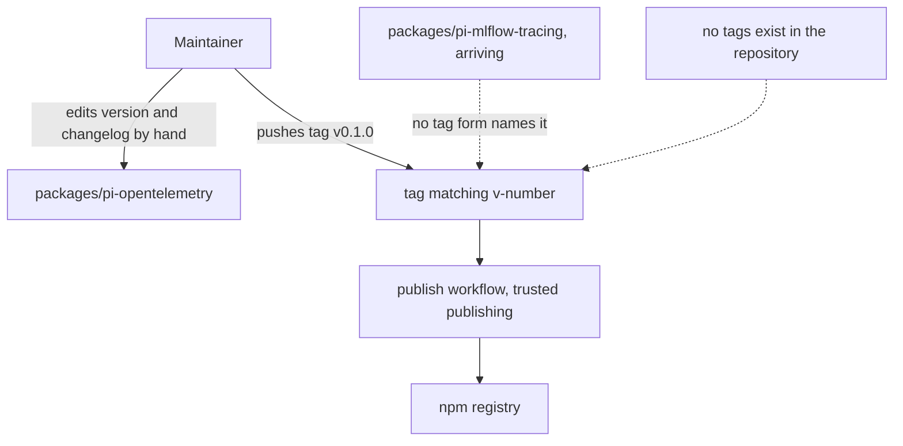
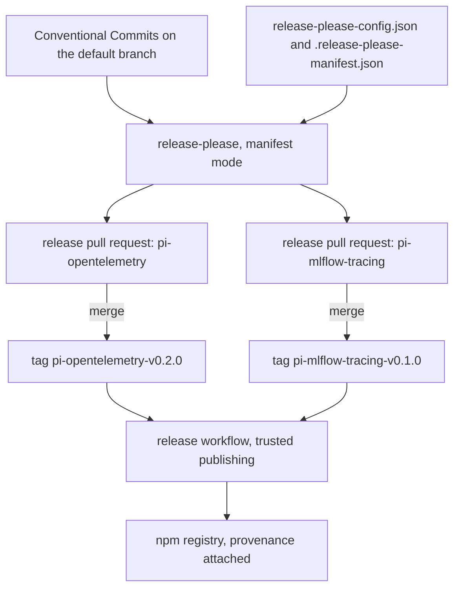
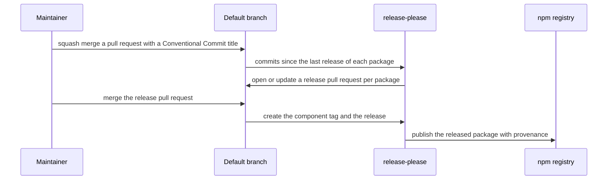
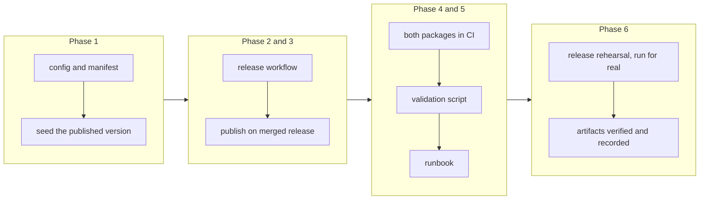

# Manifest-Driven Release Management for Two pi Packages

## Change Summary

This repository releases one package by hand: a person raises the version, writes the changelog entry, and pushes a tag whose form the publish workflow matches. A second package is arriving, and that path does not extend to two packages, because the tag form carries no package name and the changelog is written rather than derived.

This change adopts release-please in its manifest mode. Each package gets its own version, its own changelog, its own component-scoped tag, and its own release pull request, all computed from the commits that touched it. Publication stays where it is, on trusted publishing over OpenID Connect, and is triggered by a merged release rather than by a hand-pushed tag.

## Motivation and Background

The release path that exists today was built for one package and works for one package. It expects a tag of the form `v0.1.0`, it expects the changelog heading to match that tag, and it expects a person to have written both. With two packages the form breaks immediately: `v0.2.0` names no package, and two packages that release at different times cannot share one tag namespace without ambiguity.

The deeper problem is that the version and the changelog are inputs a person supplies rather than outputs the history produces. That is workable while one person releases one package occasionally. It stops being workable when a reader has to answer which change went into which package's release, and it stops being safe when the answer is only in someone's memory.

release-please inverts this. It reads the commits since the last release of each package, computes the next version from them, writes the changelog from them, and opens a pull request that holds exactly those changes. Merging that pull request is the release decision. Nothing is typed twice, and nothing has to agree with anything else by hand.

There is one honest complication, found by reading this repository rather than assuming it. The repository's commits are checkpoint commits, of the form `checkpoint(CR-0007): ...`. Conventional Commits is what release-please reads, and `checkpoint` is not one of its types, so a repository whose history looks like this proposes no releases at all. The resolution is already half in place: the project's own quality standards require a Conventional Commits pull request title and a squash merge, and a squash merge writes exactly that title onto the default branch. This change makes that requirement load-bearing rather than decorative, and leaves the checkpoint convention untouched inside a branch where it belongs.

The second complication is the state of the existing package. `@desek/pi-opentelemetry` version 0.1.0 is on the registry, published on 2026-08-02, and this repository holds no tag at all, locally or on the remote. Release automation that looks for the previous release finds nothing and would propose 0.1.0 again over a version that already exists. The automation must therefore be seeded with the version that is already out, rather than started from an empty slate.

## Change Drivers

* A second pi extension package is arriving, and the current tag form cannot name which package a tag releases.
* The version and the changelog are written by hand today, so they can disagree with the history and with each other.
* Publication is deferred for the new package until this automation exists, so this change blocks that one.
* The published version of the existing package is not recorded by any tag in this repository, so the release history starts from nothing unless it is seeded.
* The repository's commit subjects on the default branch are not Conventional Commits, so release computation would find nothing to release.
* Trusted publishing is already working and is worth keeping; the change needed is what triggers it, not how it authenticates.

## Current State

One package is published from this repository. `@desek/pi-opentelemetry` is at version 0.1.0 on the registry, published on 2026-08-02.

The release path has three parts:

* `packages/pi-opentelemetry/package.json` holds the version, and `CHANGELOG.md` beside it holds a hand-written entry.
* `.github/workflows/publish.yml` triggers on a pushed tag matching `v[0-9]+.[0-9]+.[0-9]+`. It runs the tests, asserts that the tag, the manifest version, and the newest changelog heading all agree, asserts that the version is not already on the registry, and publishes with trusted publishing over OpenID Connect, so no npm token is stored here. The trust relationship on the registry names this repository and this workflow file.
* `.github/workflows/ci.yml` runs the package's unit tests on three Node versions and the install smoke test, with paths written for the one package.

What is missing or in the way:

* The repository has no tags. `git tag` is empty and the remote lists none, so the published 0.1.0 has no corresponding tag or release.
* There is no root manifest and no npm workspace. Each package carries its own lockfile and its own test command.
* The tag pattern carries no package name, so two packages cannot both use it.
* Commit subjects on the default branch are checkpoint commits, not Conventional Commits.
* Nothing derives a version or a changelog; both are typed by a person.

### Current State Diagram



### What release-please provides, verified 2026-08-02

Verified by reading a local clone of `googleapis/release-please` at version 17.11.1, commit `fdaca29`, and a clone of `googleapis/release-please-action`, commit `0b6b3fc`. The repository index tier was skipped because no such index is configured in this environment.

* Manifest mode is driven by two source-controlled files: `release-please-config.json`, which declares each package by path, and `.release-please-manifest.json`, which records each package's current version. Manifest mode exists for exactly this case, a repository with more than one releasable artifact.
* The default tag for a package in manifest mode is `<component>-v<version>`. The component can be dropped with `include-component-in-tag: false`, which produces `v<version>` and is what a single-artifact repository uses.
* `separate-pull-requests` decides whether each package gets its own release pull request. Its absence groups every package into one.
* Plugins exist for workspaces. `node-workspace` links local packages that depend on each other, and `linked-versions` ties several components to one version. Neither applies here: the two packages do not depend on each other and are versioned independently.
* The action accepts `config-file` and `manifest-file` inputs, so both files can live where this repository wants them.
* Resources the action creates with the default `GITHUB_TOKEN`, both the tag and the release, do not start another workflow run. The action's own documentation states that workflows triggered by a release event will not run in that case. A publish workflow that waits for a release event therefore never fires.
* The action reports what it released through its outputs. `releases_created` states whether anything was released, and `paths_released` names the package paths, which is what a repository with more than one package needs in order to publish only what was released.

## Proposed Change

Adopt release-please in manifest mode for both packages, and change what triggers publication.

1. **Two configuration files at the repository root.** `release-please-config.json` declares both package paths with the `node` release type, and `.release-please-manifest.json` records each package's current version. Both are committed, reviewed, and read by the automation on every run.

2. **Component-scoped tags.** Tags carry the package name, so `pi-opentelemetry-v0.2.0` and `pi-mlflow-tracing-v0.1.0` are unambiguous and independent. The bare `v<version>` form is retired, because it cannot say which package it released.

3. **A release pull request per package.** Each package proposes its own release, holding its own version bump and its own changelog entry, computed from the commits that touched its path. A change to one package never drags the other into a release it did not earn.

4. **The history seeded with what is already published.** The manifest records `packages/pi-opentelemetry` at 0.1.0, the version already on the registry, and the missing release is recorded so the automation starts from the real state rather than proposing a version that exists.

5. **Publication in the same workflow run as the release, not by a second trigger.** The release workflow runs on the default branch, runs the automation, and then publishes in the same run, gated on the automation's own report of what it released. This is not a style preference: a tag or a release the automation creates does not start another workflow, so a publish workflow that waits for a release event would never run. Authentication does not change: trusted publishing over OpenID Connect, no stored token, provenance attached by the registry. The registry's trust relationship names the workflow file that publishes, so moving the publish step means re-pointing that relationship at the file that now performs it.

6. **Conventional Commits on the default branch, checkpoints inside the branch.** Every squash-merge subject is a Conventional Commit, which the project's quality standards already require of a pull request title. Checkpoint commits stay as they are inside a branch, where the squash removes them from the default branch's history.

7. **The guards are kept, not discarded.** The existing publish workflow refuses to publish a version that disagrees with its changelog or that is already on the registry. Those guards survive the move, because automation that computes a version is not a reason to stop checking it.

### Proposed State Diagram



### Release Flow



## Requirements

### Functional Requirements

1. The repository **MUST** contain `release-please-config.json` declaring both `packages/pi-opentelemetry` and `packages/pi-mlflow-tracing` with the `node` release type.
2. The repository **MUST** contain `.release-please-manifest.json` recording the current version of every declared package.
3. The manifest **MUST** record `packages/pi-opentelemetry` at the version already published to the registry, so no release proposes a version that exists.
4. The repository **MUST** record the already-published release of `packages/pi-opentelemetry`, as a tag and a release in the component tag form, so the automation computes the next release from a real starting point.
5. Every release tag **MUST** carry the package component, in the form `<component>-v<version>`.
6. Each declared package **MUST** get its own release pull request, holding only its own version bump and its own changelog entry.
7. A commit that touches only one package **MUST NOT** cause a release of the other package.
8. The release automation **MUST** run from a workflow in this repository, reading the configuration and manifest files by path.
9. Publication **MUST** happen in the same workflow run as the release that produced it, gated on the automation's report of what it released, because a tag or a release created by the automation does not start another workflow run.
10. The publish job **MUST** hold the identity permission that trusted publishing needs, and the registry trust relationship **MUST** name the workflow file that performs the publish.
11. Publication **MUST** continue to use trusted publishing over OpenID Connect, with no long-lived registry token stored in this repository.
12. The publish path **MUST** refuse to publish a version that is already on the registry, and **MUST** state the version and the fix when it refuses.
13. The publish path **MUST** publish only the packages that the automation reports as released, read from its released-paths output.
14. The continuous integration workflow **MUST** run the unit tests and the install smoke test for both packages.
15. Every squash-merge subject on the default branch **MUST** be a Conventional Commit, and the contributor documentation **MUST** state this and state what it controls.
16. The repository **MUST** provide one script that validates the release configuration against the packages present on disk, so a package added without a configuration entry fails a check rather than being silently unreleasable.
17. The contributor documentation **MUST** state how a release happens, what a contributor does to cause one, and what they do not have to do.
18. Every failure the release path surfaces **MUST** name what failed, the fixes available, and what to check afterwards.
19. The repository **MUST** carry a release runbook that states the whole loop as numbered steps: write the Conventional Commit subject, squash-merge the pull request, wait for the automation to open the release pull request, review it, merge it, wait for the tag and the release, and confirm the published artifact. Each wait **MUST** state what the person waits for and where they see it.
20. The implementation **MUST** perform one complete release rehearsal on the real repository, driving every step of that loop and producing a real published version, because no dry run exercises the release job, the tag creation, the publish step, or the provenance attachment.
21. The rehearsal **MUST** be recorded, naming the released package, the released version, the tag, the release, and the published artifact, so a later reader sees that the loop ran rather than that it was designed.
22. The repository **MUST** provide one script that verifies a completed release from outside the repository, asserting that the tag exists, the release exists, the version is on the registry, and the published artifact carries provenance.

### Non-Functional Requirements

1. The release configuration **MUST** be readable as the single statement of which packages this repository releases, with no second list to keep in agreement.
2. A release **MUST NOT** require a person to type a version number or write a changelog entry by hand.
3. The automation **MUST NOT** publish anything without a merged release pull request, so no push to the default branch can publish by itself.
4. Adding a third package **MUST** require only a new entry in the configuration and the manifest.
5. The automation **MUST NOT** hold or require any registry credential.

## Affected Components

* New at the repository root: `release-please-config.json` and `.release-please-manifest.json`.
* `.github/workflows/`: a release workflow, and changes to the publish and continuous integration workflows.
* `packages/pi-opentelemetry/CHANGELOG.md`, which becomes a generated file rather than a written one.
* `packages/pi-mlflow-tracing/`, which is released by this automation rather than published by hand.
* `scripts/`: a configuration validation script and a release verification script.
* A release runbook, stating the whole loop and its wait points.
* Contributor documentation, which states the commit convention and the release flow.
* Git tags and releases, which gain the component form.

## Scope Boundaries

### In Scope

* The release configuration, the manifest, and their seeding from the already-published version.
* The release workflow, and the changes to the publish and continuous integration workflows.
* The component tag form and the retirement of the bare version tag.
* The commit convention on the default branch, and the documentation of it.
* A validation script that keeps the configuration and the packages on disk in agreement.
* A release runbook covering the whole loop, and one complete release rehearsal that proves it.
* A verification script that checks a completed release from outside the repository.

### Out of Scope ("Here, But Not Further")

* Any change to what either package does. This change moves versions and tags, not behaviour.
* Converting the repository to an npm workspace with a root manifest. Each package keeps its own lockfile and its own test command.
* Linking the two packages' versions. They are independent and stay independent.
* Publishing anything other than the two pi packages. The stack, the scripts, and the dashboards are not released artifacts.
* Rewriting the existing commit history to be conventional. The convention applies from this change forward.
* Creating the registry trust relationship for the new package, which is an interactive act a person performs once and cannot be automated from here.

## Alternative Approaches Considered

* **Keep the hand-tagged path and add a second tag pattern.** Rejected: it doubles the hand-written state, and the version and the changelog still have to agree with each other by hand.
* **Changesets instead of release-please.** A reasonable alternative that also produces per-package versions and changelogs. Rejected because it asks contributors to write a changeset file per change, which is a second convention to teach, whereas the Conventional Commit title is already required by this project's quality standards.
* **One version for both packages, linked.** Rejected: it publishes a package that did not change, which makes a version number mean nothing to a consumer of the unchanged package.
* **Group both packages into one release pull request.** Viable, and the default. Rejected because two independent packages that release together are harder to reason about than two pull requests that release separately.
* **Configure a versioning strategy that always bumps, so the commit convention does not matter.** Rejected: it produces releases that no change asked for, and it hides the fact that the history says nothing about what changed.

## Impact Assessment

### User Impact

A consumer of either package sees a changelog that matches the commits and a version that moves when the package changes. Nothing about installing or configuring a package changes.

A contributor writes a Conventional Commit pull request title, which the quality standards already ask for, and does nothing else about releases.

### Technical Impact

The tag namespace changes. The bare `v<version>` form is retired, and the publish workflow's trigger changes with it. The registry trust relationship names a workflow file, so a renamed or replaced publish workflow needs that relationship checked and, if it moved, re-established by a person. The new package additionally needs its first release prepared, because trusted publishing requires the package and the trust relationship to exist before a workflow can publish it.

The changelog of the existing package becomes generated. Its existing content is kept as history.

### Business Impact

The cost is one setup change and one convention that contributors already had to follow. The return is that two packages, and any later third, release without a person holding the version numbers in their head.

## Implementation Approach

### Phase 1: Configuration and seeding

Add the configuration and the manifest, record the already-published version, and record the missing release so the automation starts from the real state. Prove that a dry run proposes no release when nothing has changed.

### Phase 2: The release workflow

Add the workflow that runs the automation on the default branch, reading the configuration and manifest by path, and opening release pull requests.

### Phase 3: Publication on merge

Change the publish path so it runs on a merged release, publishes only the released packages, and keeps the already-published guard. Confirm the registry trust relationship still names the workflow that publishes.

### Phase 4: Both packages in continuous integration

Extend the tests and the install smoke test to cover both packages, and add the script that validates the configuration against the packages on disk.

### Phase 5: Convention and documentation

State the commit convention in the contributor documentation, and write the release runbook as numbered steps with every wait point named.

### Phase 6: One complete release, run for real

Drive the whole loop once on this repository: merge a Conventional Commit, wait for the automation to open the release pull request, review and merge it, wait for the tag and the release, and confirm the published artifact and its provenance. Record what was released. Fix the runbook wherever the rehearsal contradicts it, because the rehearsal is the source and the runbook is the copy.

### Implementation Flow



## Test Strategy

### Tests to Add

| Test File | Test Name | Description | Inputs | Expected Output |
|-----------|-----------|-------------|--------|-----------------|
| `scripts/release.config.verify.sh` | `every package is declared` | Each directory under `packages/` with a manifest appears in the release configuration | The repository tree | Pass, or a failure naming the undeclared package |
| `scripts/release.config.verify.sh` | `every declared package exists` | Each configured path exists on disk | The configuration | Pass, or a failure naming the missing path |
| `scripts/release.config.verify.sh` | `the manifest and the package versions agree` | Each manifest entry matches the version in that package's manifest file | Both files | Pass, or a failure naming the disagreement and the fix |
| `scripts/release.config.verify.sh` | `both files parse` | The configuration and the manifest are valid JSON | Both files | Pass, or a failure naming the file and the parse error |
| `scripts/release.config.verify.sh` | `usage without arguments` | Running the script with no arguments prints its usage and exits zero | No arguments | Usage text, exit 0 |
| `scripts/release.verify.sh` | `the tag and the release exist` | A completed release has both a component tag and a release | Package name and version | Pass, or a failure naming which is missing |
| `scripts/release.verify.sh` | `the version is on the registry` | The released version is published | Package name and version | Pass, or a failure naming the version and where to look |
| `scripts/release.verify.sh` | `the artifact carries provenance` | The published artifact was built by the trusted-publishing path | Package name and version | Pass, or a failure naming the missing provenance |
| `scripts/release.verify.sh` | `a missing release fails` | An unreleased version fails rather than passing quietly | A version never released | Non-zero exit naming what was absent |

### Tests to Modify

| Test File | Test Name | Current Behavior | New Behavior | Reason for Change |
|-----------|-----------|------------------|--------------|-------------------|
| `.github/workflows/ci.yml` | unit job | Runs one package's tests with a hard-coded path | Runs both packages' tests from a matrix over the configured packages | A second package exists and must be tested |
| `.github/workflows/ci.yml` | smoke job | Packs and installs one package | Packs and installs both packages | The install smoke test is what proves a publishable files list |
| `.github/workflows/publish.yml` | trigger | Runs on a pushed tag matching the bare version form | Publishes inside the release workflow run, for the paths the automation reports as released | The bare tag form is retired, and a tag or release the automation creates starts no workflow run |
| `.github/workflows/publish.yml` | version agreement guard | Compares the tag, the manifest, and the changelog | Compares the released version against the package manifest | The changelog is generated, so it cannot disagree by hand |
| `scripts/pi-package.verify.sh` | package checks | Verifies one pi package | Verifies each package it is given | Two packages need the same proof |
| `Makefile` | ci target | Runs the existing checks | Also runs the release configuration validation | A misconfigured release must fail a check, not a release |

### Tests to Remove

| Test File | Test Name | Reason for Removal |
|-----------|-----------|-------------------|
| `.github/workflows/publish.yml` | changelog heading assertion | The changelog is generated by the automation from the same commits that set the version, so a hand-agreement check has nothing left to catch |

## Acceptance Criteria

### AC-1: The configuration names both packages (covers FR1, FR2)

```gherkin
Given the repository contains two packages under packages/
When the release configuration and the manifest are read
Then both packages are declared with the node release type
  And both have a recorded version in the manifest
```

### AC-2: The automation starts from what is already published (covers FR3, FR4)

```gherkin
Given @desek/pi-opentelemetry 0.1.0 is on the registry
When the release automation runs with no new releasable commits
Then it proposes no release for that package
  And it does not propose a version that is already published
```

### AC-3: A tag names its package (covers FR5)

```gherkin
Given a release pull request for one package is merged
When the tag is created
Then the tag carries that package's component name and its version
  And no bare version tag is created
```

### AC-4: One package's change does not release the other (covers FR6, FR7)

```gherkin
Given a Conventional Commit that touches only one package's path is merged
When the release automation runs
Then a release pull request is opened for that package only
  And the other package's version and changelog are unchanged
```

### AC-5: The release run publishes, and only what it released (covers FR9, FR13, NFR3)

```gherkin
Given a commit is pushed to the default branch that releases nothing
When the release workflow runs
Then the automation reports no release
  And the publish steps are skipped and nothing reaches the registry
  And when a release pull request is merged, the same run publishes exactly the package paths the automation reports as released
```

### AC-6: Publication needs no stored credential (covers FR10, FR11, NFR5)

```gherkin
Given the release workflow publishes a package
When the workflow's configuration is inspected
Then it authenticates through trusted publishing over OpenID Connect
  And the job holds the identity permission that path needs
  And the registry trust relationship names the workflow file that publishes
  And no registry token is stored in this repository
```

### AC-7: A published version is never republished (covers FR12, FR18)

```gherkin
Given a version is already on the registry
When the publish path runs for that version
Then it refuses to publish
  And it states the package, the version, and the fix
```

### AC-8: Both packages are tested on every change (covers FR14)

```gherkin
Given a pull request that changes either package
When continuous integration runs
Then the unit tests and the install smoke test run for both packages
```

### AC-9: A package without configuration fails a check (covers FR16)

```gherkin
Given a new package directory is added under packages/ with no entry in the release configuration
When the validation script runs
Then it fails
  And it names the undeclared package and the entry to add
```

### AC-10: The manifest cannot drift from the packages (covers FR16, NFR1)

```gherkin
Given a package's manifest version disagrees with the release manifest entry
When the validation script runs
Then it fails
  And it names both values and which one to change
```

### AC-11: A release needs no hand-written version or changelog (covers NFR2)

```gherkin
Given releasable commits exist for a package
When the release automation runs
Then the proposed version and the changelog entry are both derived from those commits
  And no person edits either file to cause the release
```

### AC-12: The convention is stated where a contributor reads it (covers FR15, FR17)

```gherkin
Given a first-time contributor opens the contributor documentation
When they read the release section
Then it states that the squash-merge subject must be a Conventional Commit
  And it states what that subject controls and what happens after a merge
```

### AC-13: The whole loop is written down with its wait points (covers FR19)

```gherkin
Given a maintainer who has never released from this repository
When they open the release runbook
Then it states the loop as numbered steps from the commit subject to the published artifact
  And each wait states what is waited for and where it is seen
  And it states the one-time human act that a first publish of a new package needs
```

### AC-14: The loop is run once, for real (covers FR20, FR21)

```gherkin
Given the release automation and the publish path are in place
When the implementation drives one complete release
Then a Conventional Commit is squash-merged to the default branch
  And the automation opens a release pull request for the package it touched
  And merging that pull request creates the component tag and the release
  And the publish steps run in that same workflow run and publish the version
  And the released package, version, tag, release, and artifact are recorded
```

### AC-15: A completed release is verifiable from outside (covers FR22)

```gherkin
Given a release has completed
When the release verification script runs for that package and version
Then it asserts the tag exists
  And it asserts the release exists
  And it asserts the version is on the registry with provenance
  And it exits non-zero when any of those is missing
```

### AC-16: The runbook matches what happened (covers FR19, FR20)

```gherkin
Given the release rehearsal is complete
When the runbook is compared against the steps that were actually taken
Then every step matches
  And any step the rehearsal contradicted is corrected in the runbook
```

### AC-17: A third package needs only two entries (covers NFR4)

```gherkin
Given a third package is added under packages/
When an entry is added to the release configuration and the manifest
Then the automation releases it with no other change to the workflows
```

## Quality Standards Compliance

### Build & Compilation

- [ ] Both packages' test suites run from the workflows without error
- [ ] The configuration and the manifest parse as valid JSON

### Linting & Code Style

- [ ] All linter checks pass with zero warnings or errors
- [ ] The new script carries the standard top docstring and its one-line index annotation
- [ ] Governance identifiers appear in commit messages only, never in workflows, scripts, or user-facing documentation

### Test Execution

- [ ] All existing tests pass after implementation
- [ ] The release configuration validation passes
- [ ] A dry run of the release automation proposes what the history says it should

### Documentation

- [ ] The contributor documentation states the commit convention and the release flow
- [ ] The release runbook states every step and every wait point, and matches the rehearsal that was run
- [ ] The changelog of the existing package keeps its written history and gains generated entries after it

### Code Review

- [ ] Changes submitted via pull request
- [ ] PR title follows Conventional Commits format
- [ ] Code review completed and approved
- [ ] Changes squash-merged to maintain linear history

### Verification Commands

```bash
# The whole pipeline, including the new release configuration check
make ci

# The release configuration against the packages on disk
scripts/release.config.verify.sh

# A completed release, checked from outside the repository
scripts/release.verify.sh @desek/pi-opentelemetry 0.1.1

# What the automation would propose, without opening anything
npx release-please release-pr --dry-run --repo-url desek/agent-observability \
  --config-file release-please-config.json --manifest-file .release-please-manifest.json
```

## Risks and Mitigation

### Risk 1: The registry trust relationship stops matching the workflow that publishes

**Likelihood:** high
**Impact:** high
**Mitigation:** The relationship names a repository and a workflow file, and the publish step moves into the release workflow, so the file it names changes. The phase that moves the publish step re-points the relationship and confirms it before the first release, and the rehearsal is what proves it. A failure here blocks a publish rather than producing a wrong one.

### Risk 2: The publish is wired to an event that never fires

**Likelihood:** high
**Impact:** high
**Mitigation:** This is the failure mode the design exists to avoid. A tag or release created by the automation with the default token starts no workflow run, so publication happens inside the release run, gated on the automation's released-paths output, rather than in a workflow waiting for a release event. The rehearsal proves a real artifact reached the registry, which a design review alone cannot.

### Risk 3: The seeded state is wrong and a release proposes a published version

**Likelihood:** medium
**Impact:** medium
**Mitigation:** The manifest is seeded from the version on the registry, not from memory, and the already-published guard stays in the publish path, so a wrong proposal fails before it reaches the registry.

### Risk 4: Contributors write commit subjects the automation cannot read

**Likelihood:** high
**Impact:** medium
**Mitigation:** The convention is stated in the contributor documentation and enforced where the project already enforces it, on the pull request title. The failure mode is a release that is not proposed, which is visible and reversible, rather than a wrong release.

### Risk 5: The new package cannot be published on its first release

**Likelihood:** high
**Impact:** medium
**Mitigation:** Trusted publishing requires the package and its trust relationship to exist first, and that act is interactive and cannot be automated from here. The implementation states it as a one-time human step in the contributor documentation and the release runbook, so the first release does not fail for an unexplained reason.

### Risk 6: The rehearsal publishes a version that exists only to prove the loop

**Likelihood:** high
**Impact:** low
**Mitigation:** This is intended, not accidental. A published version cannot be recalled cleanly, so the rehearsal releases a patch of the existing package rather than a first version of the new one, and the release notes say what the release contains. The alternative, proving the loop with a dry run, does not exercise the merge trigger, the tag creation, the publish job, or the provenance, so it proves nothing about the part that fails.

### Risk 7: The automation opens release pull requests nobody expects

**Likelihood:** low
**Impact:** low
**Mitigation:** A release pull request is a proposal, not a release. Nothing publishes until it is merged, and the dry run in the verification commands shows what would be proposed before the workflow is enabled.

## Dependencies

* CR-0008, which adds the second package that this automation releases. This change can land first, with one package configured, and gain the second entry when that package exists.
* The existing trusted-publishing relationship on the registry for `@desek/pi-opentelemetry`.
* A one-time human act to create the registry package and trust relationship for the new package.

## Estimated Effort

Roughly 16 to 24 person-hours: three for the configuration and the seeding, three for the release workflow, three for the publish change and its verification, three for both packages in continuous integration and the validation script, three for the runbook and the documentation, and up to four for the release rehearsal, which is mostly waiting on the automation and the registry rather than working.

## Decision Outcome

Chosen approach: "manifest-driven release-please with component-scoped tags and a release pull request per package, publishing through the existing trusted-publishing path", because it derives the version and the changelog from the history rather than from a person, because manifest mode exists for exactly this multi-package case, because per-package tags and pull requests keep two independent packages independent, and because it changes what triggers publication without changing how publication authenticates.

## Related Items

* Blocks the publication step of CR-0008, which prepares the second package but deliberately publishes nothing.
* Supersedes the hand-tagged release path introduced with CR-0003.

## More Information

The release-please facts in this document were read on 2026-08-02 from a local clone of the upstream repository at version 17.11.1, and from a clone of its action. The state of this repository, no tags locally or on the remote, one package at 0.1.0 on the registry, and checkpoint-style commit subjects on the default branch, was read from the repository and the registry on the same day.
