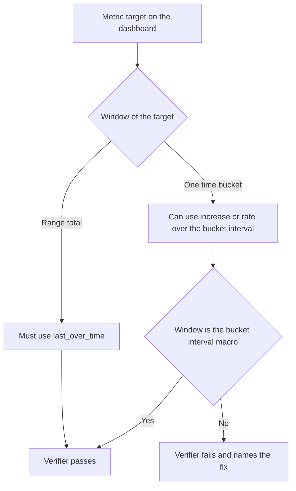

# Growth Queries on the Dashboard: Rule, Verifier, and the Tokens and Cache Panels

## Change Summary

The branch `feat/tokens-per-second-panel` adds a `Tokens and cache` row with four panels. Three of them use `increase()` over each time bucket. The agent guide and `scripts/dashboard.verify.sh` forbid `increase()` on every panel, for a reason that measurement on a running stack does not support. This change corrects the rule, makes the verifier enforce the corrected rule, and corrects two panel queries and three panel descriptions that state things the data does not show.

## Motivation and Background

A verification of the branch on 2026-10-05 against a running stack with real Claude Code telemetry gave these facts.

* The source data and the stored data agree. The token totals of one session in the local transcript were equal to the Mimir totals for all four token types.
* The supported install path sets `OTEL_METRIC_EXPORT_INTERVAL=1000`, so a live session writes one sample each second. `increase()` over a bucket of 30 seconds or more therefore measures growth correctly. The panel sum was 97.2% of the true output token growth at 6 hours and 99.1% at 24 hours.
* `increase()` over the full range is wrong for a total. Over 24 hours it returned 3.15 million output tokens where `last_over_time` returned 9.43 million, because `increase()` cannot see the first sample value of a series.
* The verifier stops at its panel data check on `Time by subagent type`, a panel the branch does not change. The families `subagent_duration_seconds`, `subagent_token_usage_tokens`, and `tool_use_count` have no sample in the last 168 hours on this stack, and the verifier assumes that the demo seeder ran.
* The verifier replaces `$__interval` before `$__interval_ms`, so the query of `Output tokens per second` becomes a query that does not parse.
* `Output tokens per second` fills each empty bucket with zero. From 06:30 to 10:05 the stack was down while agents were active, and the panel showed that period as a zero rate.
* `Input and output tokens` has one input spike of about 400,000 tokens at 24 hours. The linear axis makes the output band almost flat. The description says that output is usually much larger than input.

## Change Drivers

* The verifier that the reading document tells users to run fails on the branch.
* The agent guide states a rule that is false for per-bucket growth and true for totals, without the distinction.
* Two panels show something that the data does not support.

## Current State

* `AGENTS.md` and `CLAUDE.md` say: query these counters with `last_over_time`, never with `rate` or `increase`, because those return zero.
* Check 5 of `scripts/dashboard.verify.sh` fails each metric target that contains `rate(` or `increase(`, and each target that does not contain `last_over_time`.
* Check 3 of the verifier holds a fixed list of populated families and fails a panel of such a family that returns no data.
* `substitute_vars` in the verifier has no entry for `$__interval_ms`.
* `Output tokens per second` ends its query with `or vector(0)`.
* `Input and output tokens` uses a linear axis.
* The descriptions of the three per-bucket panels, and the no-data messages (`fieldConfig.defaults.noValue`) of panels 31 and 33, say that an idle interval is blank because `increase()` needs more than one sample in the bucket.
* `CLAUDE.md` is a symbolic link to `AGENTS.md`, so the agent guide is one file.

## Proposed Change



The rule becomes two rules. A total over a range uses `last_over_time`. Growth per time bucket can use `increase` or `rate`, and only over the bucket interval of the panel.

## Requirements

### Functional Requirements

1. The agent guide (`AGENTS.md`, which `CLAUDE.md` links to, so one edit changes both) **MUST** state that a total over a range uses `last_over_time`, and **MUST** give the reason: `increase` and `rate` cannot see the first sample value of a session series, and return nothing after the series stops.
2. The agent guide **MUST** state that growth per time bucket can use `increase` over the bucket, and **MUST** state the limit: tokens that a session used while the stack received no samples are in the totals but not in the per-bucket growth.
3. Check 5 of the verifier **MUST** pass a metric target that uses `last_over_time`, and **MUST** pass a metric target that uses `increase` or `rate` only when each such call has the window `$__interval` or `$__rate_interval`. A target that has `last_over_time` and also a growth operator over another window **MUST** fail.
4. Check 5 of the verifier **MUST** fail a metric target that uses `increase` or `rate` over any other window, and **MUST** fail a metric target that uses none of `last_over_time`, `increase`, and `rate`.
5. Check 3 of the verifier **MUST** decide from the store whether a populated family has samples, with a probe by metric name over the same 168 hour window that the check substitutes into the panel query. When one or more of the families that a target names has samples, the panel **MUST** return data. When none has a sample, the check **MUST** pass with a message that is different from the message for returned data and from the message for a family in the empty set. The family `token_usage_tokens` is the exception: when it has no sample the check **MUST** fail, because a stack without token telemetry cannot prove any panel.
6. `substitute_vars` **MUST** replace `$__interval_ms` with the millisecond value of its substitute for `$__interval`, before it replaces `$__interval`.
7. The query of `Output tokens per second` **MUST NOT** fill an empty bucket with a constant zero.
8. The `Input and output tokens` panel **MUST** set `fieldConfig.defaults.custom.scaleDistribution.type` to `symlog`, the non-linear scale that accepts the negative input series, so that one large bucket does not flatten the other band.
9. The descriptions of `Input and output tokens`, `Cache hit ratio over time`, and `Output tokens per second` **MUST** state when a bucket is zero and when it is blank, and **MUST** state the limit of requirement 2. The description of `Input and output tokens` **MUST NOT** say that output is usually larger than input. The no-data messages of panels 31 and 33 **MUST NOT** state the claim about more than one sample in the bucket, and **MUST** agree with the descriptions.
10. Each text in the verifier that states the old behaviour **MUST** state the new behaviour: the header comment, the `@agents-index` line, the comment above the family lists, the fix text of the check 3 failure, the name of the check 5 function, and the pass message of check 5.

### Non-Functional Requirements

1. Each failure message of the verifier **MUST** keep the three parts it has now: what failed, the fix, and what to check after the fix.
2. The dashboard JSON **MUST** continue to pass checks 4, 6, 7, and 8 of the verifier.

## Affected Components

* `AGENTS.md` (`CLAUDE.md` is a symbolic link to it)
* `scripts/dashboard.verify.sh`
* `stack/grafana/dashboards/agent-observability.json` (panels 31, 33, 34)

## Scope Boundaries

### In Scope

* The rule text, the verifier, and the three per-bucket panels named above.

### Out of Scope ("Here, But Not Further")

* The `Cache hit ratio` gauge, which uses `last_over_time` and agrees with an independent calculation.
* Panels that the branch does not change, and the Mimir recording rules.
* Recovery of tokens that sessions used while the stack was down. The stores have no backfill path.
* Verification with pi data. The stack holds no pi sample after 2026-08-13.
* The comment in `scripts/agent.verify.sh` about `last_over_time`. It explains the presence check of that script, which is a range total, so it stays true.
* A minimum interval on the three panels. The datasource sets a 10 second minimum, which holds ten samples at the supported export interval.
* A CI job for the verifier. The verifier needs a running stack.
* The uncommitted change to `stack/haproxy/haproxy.cfg`, and CR-0010.

## Alternative Approaches Considered

* Rewrite the three panels with `last_over_time`. Rejected: that plots a running total, not the tokens of each bucket, which is the purpose of the panels.
* Keep the zero fill and bound it by a liveness series. Rejected: the stack has no series that is certain to exist when the stack is up and no agent runs. A live session already writes a sample each second, so an idle live session gives zero without a fill.
* Remove the subagent families from the populated list. Rejected: on a seeded stack those panels must show data, and a store probe keeps that check.

## Impact Assessment

### User Impact

A user who runs the verifier on a stack that was not seeded gets a pass in place of a failure on the Delegation panels. `Output tokens per second` shows a gap where the stack received nothing. `Input and output tokens` shows both bands at a 24 hour range.

### Technical Impact

No change to stored data, to ingestion, or to an interface. The verifier does one more query per populated family.

### Business Impact

None.

## Implementation Approach

1. Change the rule text in `AGENTS.md` and `CLAUDE.md`.
2. Change the verifier, then the dashboard JSON, to satisfy that text.
3. Restart Grafana provisioning if it does not reload the file, then run the verification commands.

## Test Strategy

### Tests to Add

Not applicable as automated tests. The verifier is itself the test of the dashboard, it needs a running stack, and the repository has no test harness for shell scripts. The negative paths are proved by the manual runs in the acceptance criteria.

### Tests to Modify

| Test File | Test Name | Current Behavior | New Behavior | Reason for Change |
|-----------|-----------|------------------|--------------|-------------------|
| `scripts/dashboard.verify.sh` | `check_counters_use_last_over_time` | Fails each `rate` or `increase` | Passes those over the bucket interval, fails others | Requirements 3 and 4 |
| `scripts/dashboard.verify.sh` | `check_panel_queries_execute` | Fixed list decides that data is necessary | The store decides | Requirement 5 |

### Tests to Remove

Not applicable. No check is removed.

## Model-Based Testing

| Scenario | User Goal | User Surface | Success Condition | Criteria Proved | Scenario Record |
|----------|-----------|--------------|-------------------|-----------------|-----------------|
| Verify the dashboard | Confirm that the provisioned dashboard is correct on my stack | command line | `scripts/dashboard.verify.sh` exits 0 and prints `verify: all checks passed` | AC-1, AC-3 | `.agents/scenarios/` |
| Read the token panels | See token throughput and the input and output bands over the last 24 hours | browser | The `Tokens and cache` row shows a gap, not a zero line, for the period without samples, and both bands of `Input and output tokens` are visible | AC-5, AC-6 | `.agents/scenarios/` |

## Acceptance Criteria

### AC-1: The verifier passes on the branch

```gherkin
Given a running stack that holds Claude Code telemetry and no sample of the subagent families or of tool_use_count in the last 168 hours
When scripts/dashboard.verify.sh runs
Then it exits 0
  And it prints "verify: all checks passed"
```

### AC-2: A growth operator over the range fails

```gherkin
Given the committed dashboard file with one target temporarily changed to use increase over $__range
When scripts/dashboard.verify.sh runs, and the temporary change is then reverted
Then the verifier exits 1
  And the failure names the panel, the fix, and what to check after the fix
```

### AC-3: An empty populated family passes with its own message

```gherkin
Given a populated family that has no sample in the query window
When check 3 runs on a panel of that family
Then the check passes
  And the message says that the family has no sample in the window
```

### AC-4: The rule text states both rules

```gherkin
Given AGENTS.md and CLAUDE.md
When a reader looks for how to query the counters
Then both files say that a range total uses last_over_time
  And both files say that growth per bucket can use increase, with its limit
  And scripts/agents-md.verify.sh exits 0
```

### AC-5: Throughput shows a gap for a period without samples

```gherkin
Given a period in the dashboard range in which the stack received no samples
When the Output tokens per second panel renders
Then the panel shows no line for that period
```

### AC-6: Both bands are readable

```gherkin
Given a 24 hour range that contains one input bucket 100 times larger than the median
When the Input and output tokens panel renders
Then jq reads the scale type of panel 31 as "symlog"
  And the screenshot of the panel shows the output band above zero and the input band below zero
```

### AC-7: The no-data messages agree with the descriptions

```gherkin
Given panels 31, 33, and 34 in the dashboard JSON
When a reader searches their description and noValue texts for "more than one sample"
Then the search returns nothing
```

## Quality Standards Compliance

### Verification Commands

```bash
scripts/stack.verify.sh
scripts/dashboard.verify.sh
scripts/agents-md.verify.sh
jq empty stack/grafana/dashboards/agent-observability.json
```

- [ ] All four commands exit 0
- [ ] Changes are in pull request #15, with a Conventional Commits title

## Risks and Mitigation

### Risk 1: A stack with a longer export interval gets empty buckets

**Likelihood:** low
**Impact:** medium
**Mitigation:** the supported install path sets a 1 second interval, and the panel descriptions state when a bucket is blank.

### Risk 2: The store probe hides a broken panel

**Likelihood:** low
**Impact:** medium
**Mitigation:** the probe selects the family by metric name only. A panel that returns nothing while the family has samples still fails.

## Dependencies

* None.

## Decision Outcome

Chosen approach: "two rules, enforced by the verifier", because measurement shows that `last_over_time` is correct for totals and `increase` is correct for per-bucket growth, and a single rule cannot state both.

## Related Items

* Change request for the baseline dashboard: CR-0002
* Pull request: #15
