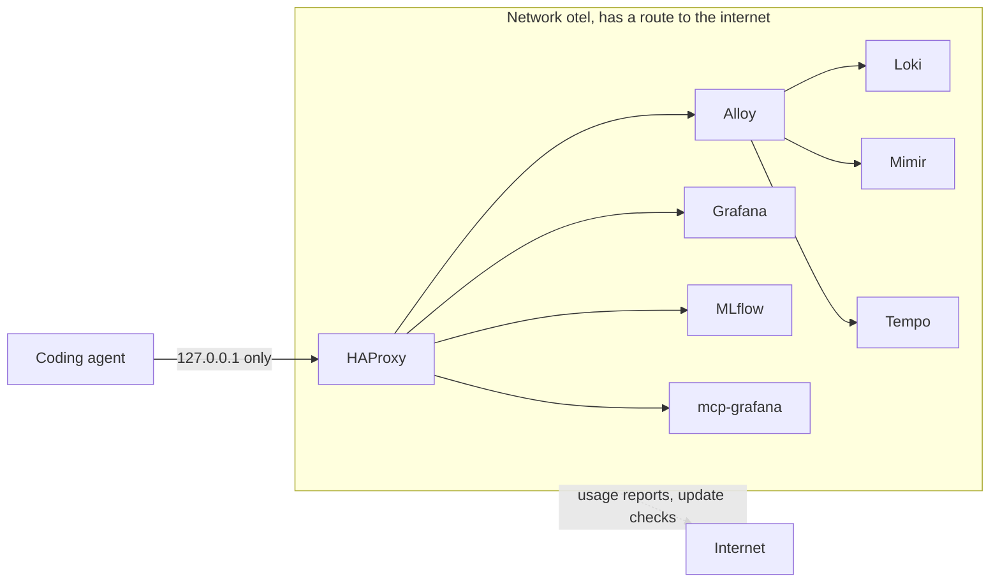
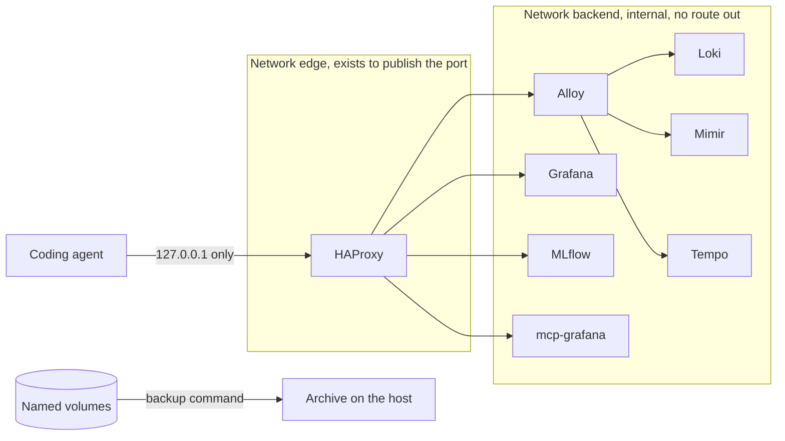
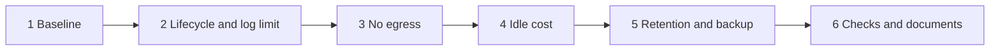

# Laptop Operation Hardening: Restart, Shutdown, Disk Bounds, Backup, Idle Cost, and No Egress

## Change Summary

The stack runs on a developer laptop, but its configuration is the default of each product, and those defaults assume a server. Five of the eight long-running services do not restart, every store is killed 10 seconds after a stop request, nothing bounds the container logs, no backup exists, the stack spends most of its idle work on telemetry about itself, and every backend has a route to the internet that it does not need.

After this change every service restarts and stops in the same safe way, the container logs have a fixed maximum size, the user can set a retention period and can make a backup with one command, the idle work is lower, and no backend can send anything off the machine.

## Motivation and Background

A laptop differs from a server in four ways that matter to this stack. It sleeps and wakes many times each day. Its container runtime starts and stops with the user session, often without a clean shutdown. Its disk is small and shared with all other work. It moves between networks, and it is often offline or behind a VPN.

A measurement of the live stack on 2026-10-05 showed that each of these differences already causes a defect or a risk:

* **Uneven restart.** `haproxy`, `mlflow`, and `mcp-grafana` have `restart: unless-stopped`. `loki`, `mimir`, `tempo`, `alloy`, and `grafana` have no restart policy. After the container runtime restarts, the edge proxy returns and the stores behind it do not, so the stack looks alive and stores nothing.
* **Recorded corruption.** On 2026-10-01 at 14:55:57 UTC the metric store logged `Encountered WAL read error, attempting repair` and then `Deleting all segments newer than corrupted segment`. The collector logged `Expected to have read whole segment, may have dropped data` one second later. An unclean stop came before that start, and data was lost.
* **Unbounded disk use.** The container logs use the `json-file` driver with no size limit and held 736 MB. The metric store and the log store have no retention. The conversation database was 6.57 GB. A full disk in the virtual machine is the most probable cause of future corruption.
* **No backup.** The conversation database holds data that no command can make again. No command copies it, or any other volume, out of the virtual machine.
* **Idle work for itself.** 1,838 of the 2,186 active series (84%) were the edge proxy's own metrics, scraped every 15 seconds. The provisioned dashboard uses none of them. Each request through the edge proxy also made a log line in the log store and in the container log. The conversation server ran 15 processes and used 2.0 GiB of memory for one user.
* **Unneeded egress.** Grafana, Mimir, Loki, Tempo, and Alloy each report usage or check for updates by default in the pinned versions, and no configuration file disables it. The stack states that nothing leaves the machine.

## Change Drivers

* A recorded loss of data after an unclean stop.
* A stack that is half alive after the container runtime restarts.
* Disk growth with no bound on a small, shared disk.
* Irreplaceable conversation data with no backup.
* Battery use from work that gives the user nothing.
* A privacy statement that the network configuration does not enforce.

## Current State

All services join one bridge network, `otel`, which has a route to the internet. Only `haproxy` publishes a host port, bound to `127.0.0.1`.

| Property | Current value |
|----------|---------------|
| Restart policy | `unless-stopped` on 3 services, none on 5 services |
| Stop grace period | Docker default of 10 seconds on every service |
| Container log limit | None |
| Retention | None in the metric store and the log store, product default of 336 hours (14 days) in the trace store |
| Backup | None |
| Scrape interval for `haproxy` and `mlflow` | 15 seconds |
| Access log for OTLP ingestion | One line per request to the log store and to the container log |
| Container health checks | Every 10 seconds, each one starts a `bash` process |
| Edge proxy health checks | Product default interval, 10 backends |
| Conversation server | 4 server workers, a job runner, and 7 job consumers |
| Usage reports and update checks | Product default (on) in 5 products |
| Backend route to the internet | Present |

### Current State Diagram



## Proposed Change

The change has five parts. Each part is independent of the others in effect, and all five change the same small set of files.

1. **Uniform lifecycle.** Every long-running service gets the same restart policy and a stop grace period that is long enough for a clean shutdown. Each store then closes its write-ahead log itself, and the next start replays a complete log.
2. **Bounded disk.** Every service gets a fixed maximum size for its container log. Retention for the three stores becomes one setting in `.env`. The default changes nothing: the metric store and the log store keep data with no limit, and the trace store keeps its product default of 14 days. A retention period deletes data, so the user must choose it.
3. **Backup.** A new command copies all named volumes to an archive on the host, and a documented procedure restores them.
4. **Lower idle cost.** The stack scrapes itself less often, stops the access log for OTLP ingestion, checks health less often in the steady state, and runs the conversation server with the process count that one user needs.
5. **No egress.** Usage reports and update checks are disabled in each product, and the backends move to a network that has no route out of the machine.

### Proposed State Diagram



## Requirements

### Functional Requirements

**Lifecycle**

1. Every long-running service in `compose.yaml` **MUST** have the restart policy `unless-stopped`. The one-shot service `mlflow-provision` **MUST** keep `restart: "no"`.
2. The services `loki`, `mimir`, `tempo`, `alloy`, and `mlflow` **MUST** have a stop grace period of 60 seconds or more.
3. On a clean stop, every service **MUST** exit by itself before its grace period ends, so that no container has the exit code 137.
4. Flush on shutdown **MUST** stay off in the metric store and the log store. Replay of the write-ahead log stays the recovery method, because the pinned metric store does not query flushed blocks for the most recent 12 hours by default.
5. A clean stop followed by a start **MUST** produce no log line about a repair or a corruption of a write-ahead log in any service, and data that was stored before the stop **MUST** be returned by a query within 60 seconds after the ready state.

**Bounded disk**

6. Every service in `compose.yaml` **MUST** have a container log configuration that limits the total log size for that service to 50 MB or less.
7. The stack **MUST** read one retention setting, `RETENTION_PERIOD`, from the environment or from `.env`. Its value is a duration in whole hours of `24h` or more, for example `720h`, which is a format that all three stores accept. `0`, a value below `24h`, and a value in another unit are not valid.
8. When `RETENTION_PERIOD` is unset or empty, the metric store and the log store **MUST** keep data with no limit, and the trace store **MUST** keep its product default of 336 hours. A plain `docker compose up -d` with no `.env` **MUST** start the stack in this state.
9. When `RETENTION_PERIOD` is set to a valid duration greater than zero, the metric store, the log store, and the trace store **MUST** each delete data that is older than that duration. In the log store this includes the retention switch of the compactor and the store for delete requests that it needs. In the trace store this includes both the worker setting and the scheduler setting.
10. The value **MUST** reach each store by variable interpolation in `compose.yaml`, into a command flag or into an environment variable that the store expands with `-config.expand-env=true`. No wrapper script **MUST** be necessary. The interpolation **MUST** give each store a valid default when the value is unset or empty, because the pinned stores reject an empty duration. `scripts/stack.up.sh` **MUST** reject a value that is not valid, which includes `0`, before it starts a service, with an error that names the value, the correct format, and the check to do after the fix. `.env.example` **MUST** document the setting, the valid values, the default for each store, the fact that a value deletes data permanently, and the fact that only `scripts/stack.up.sh` checks the value.
11. The retention setting **MUST NOT** apply to the conversation database.

**Backup**

12. A new script, `scripts/stack.backup.sh`, **MUST** write one compressed `tar` archive for each of the six named volumes of the stack to a directory on the host. It **MUST** read the volumes with `docker run` on an image that `compose.yaml` already pins, and **MUST NOT** add a service or an image.
13. The script **MUST** confirm that it can write to the destination before it stops a service. It **MUST** then stop the six services that mount a volume (`loki`, `mimir`, `tempo`, `alloy`, `grafana`, `mlflow`) before it reads the volumes, and **MUST** start them again when it ends, also when a step fails.
14. The script **MUST** take the destination directory from a flag, **MUST** default to the directory `backups/` in the repository, which `.gitignore` **MUST** exclude, and **MUST** put each run in a subdirectory named with the UTC time of the run.
15. The script **MUST** support `--dry-run`, which prints the volumes, the destination, and the services it would stop, and changes nothing.
16. The script **MUST** verify each archive after it writes it, by a read of the full archive, and **MUST** exit with a documented non-zero code when an archive is absent or unreadable.
17. The script **MUST** follow the conventions for scripts in this repository: the top docstring with purpose, usage, and parameters, the one-line file index annotation, results on stdout, diagnostics on stderr, no prompt, and an error message that names the failure, the fix, and the check to do after the fix.
18. `docs/architecture.md` **MUST** document the restore procedure as numbered steps, with the observable state that confirms a correct restore.
19. `docs/privacy.md` **MUST** state that a backup archive contains conversation content and identity fields in plaintext, and that it must stay on the machine or in storage that the user controls.

**Lower idle cost**

20. The collector **MUST** scrape the `haproxy` and `mlflow` targets at an interval of 60 seconds.
21. The edge proxy **MUST NOT** write an access log line, to the container log or to the log store, for a request that it routes to the backend `alloy_grpc` or `alloy_http` and that ends with a status below 400. Access log lines for a failed request to these two backends, and for every request to all other backends, which include `mlflow_otlp`, **MUST** stay as they are.
22. Each container health check **MUST** run at an interval of 30 seconds or more after the service is healthy, and **MUST** run at an interval of 5 seconds or less during the start period, so that the start of the stack is not slower. This uses the `start_interval` field of the compose health check, which needs Docker Engine 25 or later.
23. Each edge proxy health check **MUST** run at an interval of 15 seconds or more while the backend is up, and at an interval of 2 seconds or less while the backend is down or in transition.
24. The conversation server **MUST** run one server worker, and **MUST NOT** run the job runner or the job consumers.
25. The rule group **MUST** keep its evaluation interval of 30 seconds, because the dashboard reads its series.

**No egress**

26. Usage reports **MUST** be disabled in Mimir, Loki, Tempo, and Alloy, and usage reports, update checks, and plugin update checks **MUST** be disabled in Grafana.
27. `compose.yaml` **MUST** define two networks in place of `otel`: `backend`, an internal network with no route out of the machine, and `edge`, a bridge network. Each comment and each `Makefile` variable that names the network `otel` **MUST** be updated.
28. Every service except `haproxy` **MUST** join `backend` only.
29. `haproxy` **MUST** join both networks, and **MUST** stay the only service that publishes a host port, bound to `127.0.0.1`.
30. A container that joins only `backend` **MUST NOT** be able to open a connection to an address outside the machine. The authority for this is the `Internal` property of the network. A connection attempt is additional evidence, and it counts only when the same attempt from `haproxy` succeeds.

**Verification and documents**

31. `scripts/stack.verify.sh` **MUST** check requirements 1, 6, 28, 29, and 30 against the running stack, and **MUST** report each as one named check.
32. `docs/architecture.md` **MUST** describe the two networks, the lifecycle settings, the log limit, the retention setting, the backup command, and the minimum Docker Engine version.
33. `docs/troubleshooting.md` **MUST** have one row for each of these symptoms: the stack is half alive after the container runtime restarts, a store reports a repair at start, and the disk of the virtual machine is full.
34. The line in `README.md` that states that the stack has no retention policy **MUST** state the default for each store, which includes the 14 days for traces that the line omits today, and **MUST** name the setting.

### Non-Functional Requirements

1. Each setting name that this change adds to a product configuration **MUST** be confirmed against the pinned image of that product before it is written, by the help output or the default configuration of that image.
2. The change **MUST NOT** change an image tag, add a service, add a published port, or add a volume.
3. Every existing route through the edge port **MUST** answer as before, and every existing verification script **MUST** pass.
4. The time from `scripts/stack.up.sh` to the ready state **MUST NOT** be more than 10 seconds longer than before the change, measured on the same machine.
5. The idle CPU use of the stack, measured over 5 minutes with no dashboard open and no agent session, **MUST** be lower after the change than before it, and both figures **MUST** be recorded in the validation report.
6. The resident memory of the conversation server **MUST** be lower after the change than before it, and both figures **MUST** be recorded in the validation report.
7. No source file, script, or user-facing document **MUST** contain a governance identifier.

## Affected Components

* `compose.yaml`: networks, restart policies, stop grace periods, log limits, health check intervals, environment for Grafana, flags for Alloy and the conversation server.
* `stack/mimir/config.yaml`, `stack/loki/config.yaml`, `stack/tempo/config.yaml`: usage reports, retention.
* `stack/alloy/config.alloy`: scrape intervals.
* `stack/haproxy/haproxy.cfg`: access log for the OTLP backends, health check intervals.
* `scripts/stack.backup.sh`: new.
* `scripts/stack.verify.sh`: new checks.
* `scripts/stack.up.sh`: validation of `RETENTION_PERIOD`.
* `.env.example`, `.gitignore`: the retention setting and the backup directory.
* `docs/architecture.md`, `docs/troubleshooting.md`, `docs/privacy.md`, `README.md`.

## Scope Boundaries

### In Scope

* The lifecycle, log limit, retention setting, backup command, idle cost, and egress changes that the requirements state.
* The checks and documents that the requirements state.

### Out of Scope ("Here, But Not Further")

* **A replacement for Mimir.** A single Prometheus can store this volume with less memory, but it changes the rule provisioning, the datasource, and the OTLP path. The decision here is to keep Mimir and tune it.
* **An on-demand stack.** A stack that starts and stops with the agent sessions lets the virtual machine sleep, but it changes how the user operates the stack. The stack stays always on.
* **A changed default retention.** With the setting unset, each store behaves as it does today: no limit for metrics and logs, 14 days for traces. A later change can set a default after the user decides the period.
* **Retention or compaction of the conversation database.** Its size is the largest on the disk, but trace deletion in MLflow is a separate design.
* **A persistent queue in the collector.** Sleep pauses all containers together, so a queue is not necessary for sleep. It is a separate reliability change.
* **The rejected metric requests with an invalid temporality, and the rejected log pushes with structured metadata over the limit.** Both are data loss, and both are client or limit defects that are not specific to a laptop.
* **A pinned subnet for the networks.** On Docker Desktop the subnets are inside the virtual machine and cannot collide with a host network. A pinned subnet can collide with another compose project.
* **An automatic restore command.** A restore overwrites data. It stays a documented manual procedure.
* **Settings of the container runtime or of the operating system**, for example the size of the virtual machine or the sleep settings.

## Alternative Approaches Considered

* **Disable the usage reports only, with one network.** This depends on each product obeying its setting, and on each future service having such a setting. The internal network enforces the result for all services.
* **An internal network only, with the usage reports left on.** The calls then fail on a timer, write errors, and use power for retries.
* **Bind mounts on the host in place of named volumes, so that host backup tools see the data.** File sharing between macOS and the virtual machine is slow for the write pattern of a store and has weaker guarantees for `fsync`.
* **An online backup with no stop.** A copy of a store directory while the store writes can be inconsistent. A short stop gives a consistent archive and uses no product-specific tool.
* **Flush on shutdown in the metric store and the log store.** A flush leaves no write-ahead log to repair, but the pinned metric store reads only the ingester for the most recent 12 hours (`-querier.query-store-after`), so each restart can hide recent metrics. Each flush also makes one small block for the compactor. A stop grace period removes the cause of the recorded corruption with no such effect.
* **Remove the scrape of the edge proxy.** An earlier change added it on purpose. A longer interval keeps the data and removes three quarters of the samples.

## Impact Assessment

### User Impact

The address, the routes, the dashboard, and the queries do not change. After the container runtime restarts, the full stack returns with no command. A stop takes up to 60 seconds in the worst case. The user gets one new command for a backup and one new optional setting for retention. Series from the `haproxy` and `mlflow` jobs have one sample each 60 seconds, so a query on them with a range shorter than 2 minutes can return no data.

### Technical Impact

The network of each service changes, so the first `docker compose up -d` after the change makes each container again. The named volumes stay. Grafana can no longer install a plugin from the internet at run time; the stack installs none. A service that later needs a remote target must also join the bridge network. The conversation server no longer runs background jobs; the stack uses none of the features that need them, and the validation must confirm that trace ingestion and search still work.

### Business Impact

None beyond the lower risk of data loss and the lower battery use for each user.

## Implementation Approach

The work goes in the order below. Each phase leaves a stack that starts and passes `scripts/stack.verify.sh`.

### Phase 1: Baseline

Measure and record the idle CPU use, the memory of the conversation server, and the time to the ready state, before any change.

### Phase 2: Lifecycle and log limit

Add the restart policy, the stop grace period, and the log limit. Stop and start the stack, and confirm that no store reports a repair.

### Phase 3: No egress

Disable the usage reports and update checks, then split the network. Confirm that every route answers and that a backend cannot open an outside connection.

### Phase 4: Idle cost

Change the scrape intervals, the access log, the health check intervals, and the process count of the conversation server. Measure again.

### Phase 5: Retention and backup

Add the retention setting and the backup script. Do one backup and one restore into scratch volumes.

### Phase 6: Checks and documents

Add the checks to the verifier and update the documents.

### Implementation Flow



## Test Strategy

The repository tests the stack from the outside with shell verifiers that `make ci` runs. This change follows that pattern.

### Tests to Add

| Test File | Test Name | Description | Inputs | Expected Output |
|-----------|-----------|-------------|--------|-----------------|
| `scripts/stack.verify.sh` | `check_restart_policies` | Every long-running service has `unless-stopped`, and the one-shot service has `no` | The running stack | One pass line, or a failure that names the service |
| `scripts/stack.verify.sh` | `check_log_limits` | Every service has a log size limit | The running stack | One pass line, or a failure that names the service |
| `scripts/stack.verify.sh` | `check_network_isolation` | Only `haproxy` joins `edge`, and `backend` has the `Internal` property | The running stack | One pass line, or a failure that names the service |
| `scripts/stack.verify.sh` | `check_no_egress` | A backend container cannot open a connection to an outside address | A TCP attempt to `1.1.1.1:443` with a timeout of 3 seconds, from `alloy` and, as the positive control, from `haproxy` | A pass when `alloy` fails and `haproxy` connects, a failure when `alloy` connects, and a skip that is not a pass when `haproxy` also fails |
| `scripts/stack.backup.sh` | `--dry-run` run in `make ci` | The dry run lists six volumes and changes nothing | `--dry-run` | Exit code 0, six volume rows, no archive on disk |

### Tests to Modify

| Test File | Test Name | Current Behavior | New Behavior | Reason for Change |
|-----------|-----------|------------------|--------------|-------------------|
| `scripts/stack.verify.sh` | `check_single_published_port` | Passes when one service publishes one loopback port | The same, with two networks present | The network count changes, the invariant does not |
| `Makefile` | `check-haproxy` | Validates the proxy configuration on the network `otel` | Validates it on the network `backend`, where the backend names and the syslog target resolve | The network name changes |

### Tests to Remove

Not applicable. No test covers behaviour that this change removes.

## Model-Based Testing

| Scenario | User Goal | User Surface | Success Condition | Criteria Proved | Scenario Record |
|----------|-----------|--------------|-------------------|-----------------|-----------------|
| Runtime restart | Get the full stack back after the container runtime restarts, with no command | command line | All six readiness endpoints answer 200 through the edge port after the restart | AC-1 | |
| Clean stop and start | Stop and start the stack and lose nothing | command line | A metric sample and a log line that were sent before the stop are returned by a query after the start, and no service logged a repair | AC-2 | |
| Backup and restore | Copy all stored data to the host and get it back | command line | Scratch volumes restored from the archives hold a conversation database that passes an integrity check and has the same trace count as the source | AC-5, AC-6 | |
| Offline use | Use the stack with no network | command line | With the host network off, telemetry from an agent turn is stored and the dashboard loads | AC-9, AC-10 | |

## Acceptance Criteria

### AC-1: Every service returns after a runtime restart (covers FR1)

```gherkin
Given the stack is running
When the container runtime restarts
Then all eight long-running services are running again with no command from the user
  And all six readiness endpoints answer 200 through the edge port
  And the one-shot provisioning service did not restart in a loop
```

### AC-2: A clean stop loses nothing and needs no repair (covers FR2, FR3, FR4, FR5)

```gherkin
Given the stack is running and stored a metric sample and a log line in the last minute
When the user stops the stack and starts it again
Then no container has the exit code 137
  And the effective configuration of the metric store and the log store has flush on shutdown off
  And a query returns the metric sample and the log line within 60 seconds after the ready state
  And no service log since the start matches "WAL read error", "corruption repair", "corrupted segment", "Deleting all segments newer", or "may have dropped data"
```

### AC-3: The container logs are bounded (covers FR6)

```gherkin
Given the stack is running
When the log configuration of each service is inspected
Then each service has a size limit and a file count limit
  And the product of the two is 50 MB or less
```

### AC-4: Retention is opt-in and the default changes nothing (covers FR7, FR8, FR9, FR10, FR11)

```gherkin
Given RETENTION_PERIOD is unset with no .env file, or is set to an empty value
When the user runs docker compose up -d
Then all three stores start
  And the /config endpoint of the metric store shows a block retention of 0
  And the /config endpoint of the log store shows compactor retention disabled
  And the /config endpoint of the trace store shows a block retention of 336h in the worker and in the scheduler

Given RETENTION_PERIOD is set to 720h
When the stack starts
Then the /config endpoint of the metric store shows a block retention of 720h
  And the /config endpoint of the log store shows compactor retention enabled, a retention period of 720h, and a delete request store
  And the /config endpoint of the trace store shows a block retention of 720h in the worker and in the scheduler
  And the conversation server has no retention setting
  And .env.example states the default for each store and that a value deletes data permanently

Given RETENTION_PERIOD is set to 30, to 0, or to 12h
When the user runs scripts/stack.up.sh
Then the script exits with a non-zero code before it starts a service
  And stderr names the value, the format, and the check to do after the fix
```

### AC-5: One command makes a verified backup (covers FR12, FR13, FR14, FR16, FR17)

```gherkin
Given the stack is running
When the user runs scripts/stack.backup.sh with no argument
Then a directory named with the UTC time of the run holds one archive for each of the six named volumes
  And each archive was read in full with no error
  And the stack is running again and all six readiness endpoints answer 200
  And git status shows no new untracked file

Given the destination directory cannot be written
When the user runs scripts/stack.backup.sh
Then the script exits with its documented non-zero code
  And stderr names the failure, the fix, and the check to do after the fix
  And no service stopped at any time during the run

When the user runs scripts/stack.backup.sh --help with no terminal attached
Then the output states the purpose, the usage, each flag, and each exit code
  And the script did not prompt
  And the file has the top docstring and one file index annotation
```

### AC-6: The dry run changes nothing and the restore is documented (covers FR15, FR18, FR19)

```gherkin
Given the stack is running
When the user runs scripts/stack.backup.sh --dry-run
Then stdout lists the six volumes, the destination, and the services that a real run stops
  And no service stopped and no archive exists

Given a backup exists
When a reader follows the restore procedure in docs/architecture.md into scratch volumes
Then the restored conversation database passes an integrity check
  And docs/privacy.md states that an archive contains conversation content and identity fields
```

### AC-7: The stack does less work for itself (covers FR20, FR21, FR22, FR23, FR25, NFR4, NFR5)

```gherkin
Given the stack is running with no dashboard open and no agent session
When the idle CPU use is measured over 5 minutes
Then it is lower than the baseline that was measured before the change
  And the haproxy and mlflow series have one sample each 60 seconds
  And a successful OTLP request to /v1/metrics through the edge port makes no access log line
  And a request to /v1/metrics that ends with a status of 400 or more makes one access log line
  And a Grafana request and a request to /mlflow-otlp/ through the edge port each make one access log line
  And docker inspect shows an interval of 30 seconds or more and a start interval of 5 seconds or less for each service with a health check
  And each of the 10 server lines of the edge proxy has a check interval of 15 seconds or more and a fast and down interval of 2 seconds or less
  And the ruler API through the edge port shows an interval of 30 seconds for the rule group
  And the time from scripts/stack.up.sh to the ready state is at most 10 seconds longer than the baseline
```

### AC-8: The conversation server runs the minimum processes (covers FR24, NFR6)

```gherkin
Given the stack is running
When the processes in the conversation server container are listed
Then there is one server worker and no job runner and no job consumer
  And the resident memory of the container is lower than the baseline
  And a trace search through the edge port answers 200
```

### AC-9: No backend can reach outside the machine (covers FR26, FR27, FR28, FR29, FR30)

```gherkin
Given the stack is running
When the networks of each service are inspected
Then every service except haproxy joins only the internal network
  And haproxy joins both networks and is the only service with a published port, bound to 127.0.0.1
  And the network backend has the Internal property
  And a connection attempt from a backend container to an outside address fails while the same attempt from haproxy succeeds
  And the effective configuration of each product has usage reports and update checks disabled
```

### AC-10: Nothing that worked before stops working (covers NFR2, NFR3)

```gherkin
Given the change is applied
When make ci runs with the stack up
Then every existing verification script passes
  And the image tags, the service list, the published port, and the volume list are the same as before
```

### AC-11: The verifier and the documents state the new behaviour (covers FR31, FR32, FR33, FR34, NFR1, NFR7)

```gherkin
Given the change is applied
When scripts/stack.verify.sh runs
Then it reports one named check each for restart policies, log limits, network isolation, and no egress

When a reader opens the documents
Then docs/architecture.md describes the two networks, the lifecycle settings, the log limit, the retention setting, and the backup command
  And docs/architecture.md states the minimum Docker Engine version
  And a search for the network name otel in compose.yaml, the Makefile, and the files under stack/ returns no match
  And docs/troubleshooting.md has a row for a half-alive stack, a repair at start, and a full disk
  And README.md names the retention setting and the default for each store
  And the validation report lists each new product setting with the pinned image and the command that confirmed it
  And no source file, script, or user-facing document contains a governance identifier
```

## Quality Standards Compliance

### Build & Compilation

- [ ] `docker compose config` accepts the compose file
- [ ] The edge proxy accepts its configuration

### Linting & Code Style

- [ ] The shell linter passes on every script under `scripts/`
- [ ] The new script has the top docstring and the file index annotation

### Test Execution

- [ ] All existing verification scripts pass
- [ ] The new checks pass
- [ ] The four scenarios pass, with the count of successful attempts recorded

### Documentation

- [ ] Comments in the configuration files state the reason for each new setting
- [ ] The four documents are updated

### Code Review

- [ ] Changes submitted via pull request
- [ ] PR title follows Conventional Commits format
- [ ] Changes squash-merged to maintain linear history

### Verification Commands

```bash
# Configuration validity and every repository check
make ci

# The running stack, including the new checks
scripts/stack.up.sh
scripts/stack.verify.sh

# The backup command, without a change and with one
scripts/stack.backup.sh --dry-run
scripts/stack.backup.sh
```

## Risks and Mitigation

### Risk 1: A product blocks or fails at start with no internet access

**Likelihood:** low
**Impact:** high
**Mitigation:** Phase 3 disables the reports first and splits the network second, and each step ends with the full verifier. The offline scenario proves the end state.

### Risk 2: The conversation server needs its job processes for trace ingestion

**Likelihood:** low
**Impact:** high
**Mitigation:** The acceptance criterion requires a trace search after the change, and the conversation tracing verifier must pass. If ingestion needs the jobs, keep the job runner, reduce only the worker count, and record the finding in the validation report.

### Risk 3: A store does not exit in the stop grace period

**Likelihood:** low
**Impact:** medium
**Mitigation:** The grace period is a minimum of 60 seconds, and the validation measures the real stop time of each service. A kill after the timeout leaves the write-ahead log, which the store repairs as it does today, and the verifier reports the exit code.

### Risk 4: A user sets a retention period and loses data that they wanted to keep

**Likelihood:** medium
**Impact:** high
**Mitigation:** The default deletes nothing. `.env.example` states that a value deletes data permanently. The document recommends a backup before the first use.

### Risk 5: A backup stops the stack while an agent session exports

**Likelihood:** medium
**Impact:** low
**Mitigation:** The exporters do nothing when the stack is down, so the session is not affected. The document states that telemetry sent during a backup is lost, and the dry run shows what stops.

### Risk 6: The longer health check interval delays recovery after wake

**Likelihood:** low
**Impact:** low
**Mitigation:** The edge proxy checks a backend that is down or in transition every 2 seconds or less, so only the steady state is slower.

## Dependencies

* None on another change request. The file `stack/haproxy/haproxy.cfg` has an uncommitted edit on the source branch, which the implementation must keep.

## Estimated Effort

Six phases in one pull request. The configuration changes are small; most of the work is the measurement, the backup script, and the four scenarios.

## Decision Outcome

Chosen approach: "keep the seven products, make their lifecycle uniform, bound and back up their data, reduce the self-telemetry, and enforce no egress with an internal network", because it removes each measured defect with configuration alone, keeps every address and query that users and agents depend on, and deletes no data by default.

## Related Items

* CR-0001: the standalone stack and the single published port that this change keeps.
* CR-0004: the conversation server whose process count this change reduces.
* CR-0005: the internal `mcp-grafana` service that moves to the internal network.

## More Information

The measurements come from the live stack on 2026-10-05 (Docker Desktop 29.6.1, linux/arm64). The defaults for usage reports were read from the pinned images: `-usage-stats.enabled` (Mimir 3.1.4, default true), `-reporting.enabled` (Loki 3.7.4, default true, and Tempo 3.0.2), `--disable-reporting` (Alloy v1.18.0), and `reporting_enabled`, `check_for_updates`, and `check_for_plugin_updates` in the default configuration of Grafana 13.1.1 (all true). The pinned MLflow v3.15.0 has a `--workers` option with a default of 4 and the environment variable `MLFLOW_SERVER_ENABLE_JOB_EXECUTION`. The pinned Tempo has `-backend-worker.compaction.block-retention` and `-backend-scheduler.provider.work.compaction.block-retention`, both with a default of 336h, and all three stores have `-config.expand-env`. One fact is not verified: whether `fsync` in the virtual machine reaches the physical disk on macOS. The backup command exists partly because of that gap.
